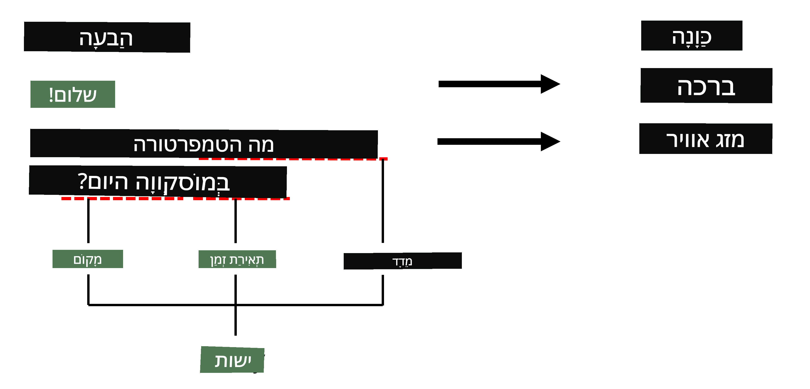
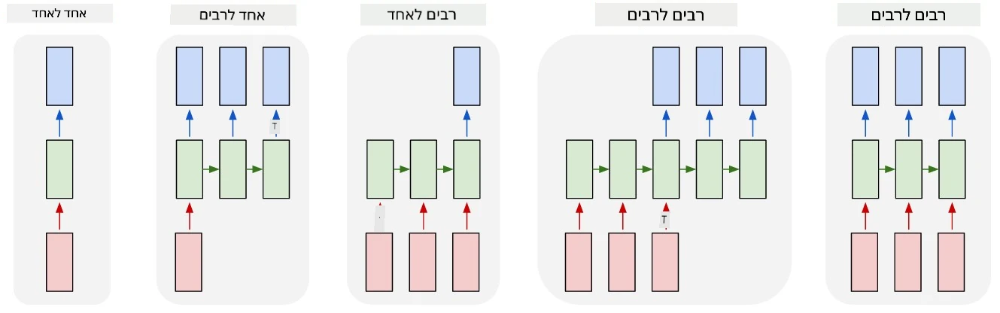

# זיהוי ישויות בשם

עד כה, התמקדנו בעיקר במשימה אחת של עיבוד שפה טבעית (NLP) - סיווג. עם זאת, ישנן משימות נוספות שניתן לבצע באמצעות רשתות עצביות. אחת מהן היא **[זיהוי ישויות בשם](https://wikipedia.org/wiki/Named-entity_recognition)** (NER), שעוסקת בזיהוי ישויות ספציפיות בטקסט, כמו מקומות, שמות אנשים, טווחי זמן, נוסחאות כימיות ועוד.

## [שאלון לפני ההרצאה](https://ff-quizzes.netlify.app/en/ai/quiz/37)

## דוגמה לשימוש ב-NER

נניח שברצונך לפתח צ'אטבוט בשפה טבעית, בדומה ל-Amazon Alexa או Google Assistant. הדרך שבה צ'אטבוטים חכמים עובדים היא *להבין* מה המשתמש רוצה על ידי ביצוע סיווג טקסט על המשפט שהוזן. תוצאת הסיווג היא מה שנקרא **כוונה** (intent), שמגדירה מה הצ'אטבוט צריך לעשות.

> תמונה מאת המחבר

עם זאת, המשתמש עשוי לספק פרמטרים כחלק מהמשפט. לדוגמה, כאשר מבקשים מידע על מזג האוויר, ייתכן שיציינו מיקום או תאריך. הצ'אטבוט צריך להבין את הישויות הללו ולמלא את הפרמטרים בהתאם לפני ביצוע הפעולה. כאן בדיוק נכנס לתמונה NER.

> ✅ דוגמה נוספת תהיה [ניתוח מאמרים מדעיים רפואיים](https://soshnikov.com/science/analyzing-medical-papers-with-azure-and-text-analytics-for-health/). אחד הדברים המרכזיים שצריך לחפש הוא מונחים רפואיים ספציפיים, כמו מחלות וחומרים רפואיים. בעוד שמספר קטן של מחלות ניתן אולי לחלץ באמצעות חיפוש מחרוזות, ישויות מורכבות יותר, כמו תרכובות כימיות ושמות תרופות, דורשות גישה מתוחכמת יותר.

## NER כסיווג טוקנים

מודלים של NER הם למעשה **מודלים לסיווג טוקנים**, מכיוון שעבור כל אחד מהטוקנים בקלט יש להחליט אם הוא שייך לישות או לא, ואם כן - לאיזו קטגוריית ישות.

נתבונן בכותרת המאמר הבאה:

**Tricuspid valve regurgitation** ו-**lithium carbonate** **toxicity** בתינוק שזה עתה נולד.

הישויות כאן הן:

* Tricuspid valve regurgitation היא מחלה (`DIS`)
* Lithium carbonate הוא חומר כימי (`CHEM`)
* Toxicity היא גם מחלה (`DIS`)

שימו לב שישות אחת יכולה להתפרס על פני מספר טוקנים. וכמו במקרה זה, עלינו להבחין בין שתי ישויות עוקבות. לכן, נהוג להשתמש בשתי קטגוריות עבור כל ישות - אחת שמציינת את הטוקן הראשון של הישות (לעיתים משתמשים בקידומת `B-` עבור **b**eginning), ואחרת - להמשך הישות (`I-`, עבור **i**nner token). כמו כן, משתמשים ב-`O` כקטגוריה לייצוג כל הטוקנים ה**o**חרים. תיוג כזה של טוקנים נקרא [תיוג BIO](https://en.wikipedia.org/wiki/Inside%E2%80%93outside%E2%80%93beginning_(tagging)) (או IOB). לאחר התיוג, הכותרת שלנו תיראה כך:

טוקן | תיוג
------|-----
Tricuspid | B-DIS
valve | I-DIS
regurgitation | I-DIS
and | O
lithium | B-CHEM
carbonate | I-CHEM
toxicity | B-DIS
in | O
a | O
newborn | O
infant | O
. | O

מכיוון שעלינו לבנות התאמה של אחד-לאחד בין טוקנים לקטגוריות, נוכל לאמן מודל רשת עצבית **רב-לרב** מהתמונה הבאה:

> *תמונה מתוך [פוסט הבלוג הזה](http://karpathy.github.io/2015/05/21/rnn-effectiveness/) מאת [אנדריי קרפת'י](http://karpathy.github.io/). מודלים של סיווג טוקנים ב-NER תואמים לארכיטקטורת הרשת הימנית ביותר בתמונה זו.*

## אימון מודלים של NER

מכיוון שמודל NER הוא למעשה מודל לסיווג טוקנים, ניתן להשתמש ב-RNNs שכבר הכרנו למשימה זו. במקרה זה, כל בלוק של רשת חוזרת יחזיר את מזהה הטוקן. המחברת הבאה מציגה דוגמה לאימון LSTM עבור סיווג טוקנים.

## ✍️ מחברות לדוגמה: NER

המשיכו ללמוד במחברת הבאה:

* [NER עם TensorFlow](NER-TF.ipynb)

## סיכום

מודל NER הוא **מודל לסיווג טוקנים**, מה שאומר שניתן להשתמש בו לביצוע סיווג טוקנים. זו משימה נפוצה מאוד ב-NLP, המסייעת בזיהוי ישויות ספציפיות בטקסט, כולל מקומות, שמות, תאריכים ועוד.

## 🚀 אתגר

השלימו את המשימה המקושרת למטה כדי לאמן מודל לזיהוי ישויות בשם עבור מונחים רפואיים, ולאחר מכן נסו אותו על מערך נתונים שונה.

## [שאלון לאחר ההרצאה](https://ff-quizzes.netlify.app/en/ai/quiz/38)

## סקירה ולמידה עצמית

קראו את הבלוג [The Unreasonable Effectiveness of Recurrent Neural Networks](http://karpathy.github.io/2015/05/21/rnn-effectiveness/) ועקבו אחר חלק הקריאה הנוספת במאמר זה כדי להעמיק את הידע שלכם.

## [משימה](lab/README.md)

במשימה של שיעור זה, תצטרכו לאמן מודל לזיהוי ישויות רפואיות. תוכלו להתחיל באימון מודל LSTM כפי שמתואר בשיעור זה, ולהמשיך לשימוש במודל BERT. קראו את [ההוראות](lab/README.md) כדי לקבל את כל הפרטים.

---

