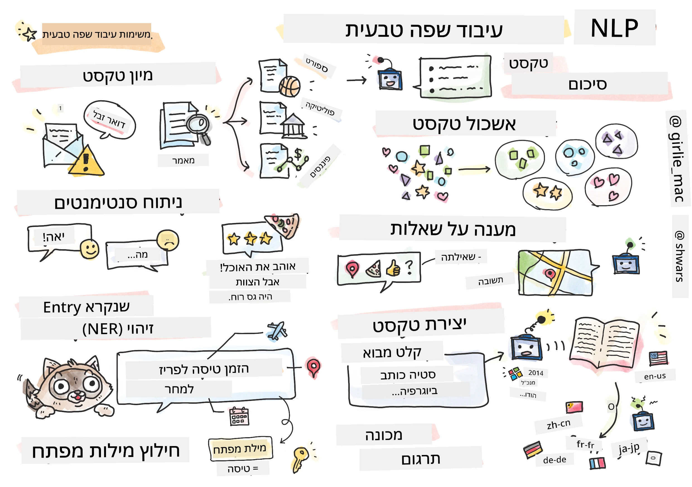

# עיבוד שפה טבעית



בפרק זה נתמקד בשימוש ברשתות נוירונים לטיפול במשימות הקשורות ל**עיבוד שפה טבעית (NLP)**. ישנם הרבה בעיות NLP שאנו רוצים שמחשבים יוכלו לפתור:

* **סיווג טקסט** הוא בעיית סיווג טיפוסית המתייחסת לרצפי טקסט. דוגמאות כוללות סיווג הודעות דוא"ל כספאם או לא-ספאם, או קטלוג מאמרים כתחום ספורט, עסקים, פוליטיקה וכו'. בנוסף, בעת פיתוח צ'אטבוטים, לעיתים קרובות יש צורך להבין מה המשתמש רצה לומר — במקרה זה אנו מתמודדים עם **סיווג כוונה**. לעיתים קרובות, בסיווג כוונה יש להתמודד עם קטגוריות רבות.

* **ניתוח רגשות** הוא בעיית רגרסיה טיפוסית, שבה יש לייחס מספר (רגש) המתאר עד כמה המשמעות של משפט היא חיובית או שלילית. גרסה מתקדמת יותר של ניתוח רגשות היא **ניתוח רגשות מבוסס היבטים** (ABSA), שבו אנו מייחסים רגש לא למשפט כולו, אלא לחלקים שונים בו (היבטים), לדוגמה: *במסעדה הזו אהבתי את האוכל, אבל האווירה הייתה נוראית*.

* **זיהוי ישויות בשם** (NER) מתייחס לבעיה של חילוץ ישויות מסוימות מטקסט. לדוגמה, ייתכן שנצטרך להבין שבביטוי *אני צריך לטוס לפריז מחר* המילה *מחר* מתייחסת לתאריך, ו*פריז* היא מיקום.

* **חילוץ מילות מפתח** דומה ל-NER, אך כאן יש לחלץ מילים החשובות למשמעות המשפט באופן אוטומטי, ללא אימון מוקדם על סוגי ישויות מסוימים.

* **אשכולות טקסט** יכולים להיות שימושיים כאשר אנו רוצים לקבץ יחד משפטים דומים, לדוגמה, בקשות דומות בשיחות תמיכה טכנית.

* **מענה על שאלות** מתייחס ליכולת של מודל לענות על שאלה מסוימת. המודל מקבל קטע טקסט ושאלה כקלט, והוא צריך לספק מקום בטקסט שבו נמצאת התשובה לשאלה (או, לעיתים, לייצר את טקסט התשובה).

* **יצירת טקסט** היא היכולת של מודל לייצר טקסט חדש. ניתן לראות זאת כמשימת סיווג שמנבאת את האות/המילה הבאה בהתבסס על *טקסט פתיחה*. מודלים מתקדמים ליצירת טקסט, כמו GPT-3, מסוגלים לפתור משימות NLP אחרות כמו סיווג באמצעות טכניקה הנקראת [תכנות באמצעות הנחיות](https://towardsdatascience.com/software-3-0-how-prompting-will-change-the-rules-of-the-game-a982fbfe1e0) או [הנדסת הנחיות](https://medium.com/swlh/openai-gpt-3-and-prompt-engineering-dcdc2c5fcd29).

* **סיכום טקסט** הוא טכניקה שבה אנו רוצים שמחשב "יקרא" טקסט ארוך ויסכם אותו בכמה משפטים.

* **תרגום מכונה** ניתן לראות כשילוב של הבנת טקסט בשפה אחת ויצירת טקסט בשפה אחרת.

בהתחלה, רוב משימות ה-NLP נפתרו באמצעות שיטות מסורתיות כמו דקדוקים. לדוגמה, בתרגום מכונה נעשה שימוש במנתחים כדי להפוך משפט ראשוני לעץ תחבירי, ואז הופקו מבנים סמנטיים ברמה גבוהה כדי לייצג את משמעות המשפט, ועל בסיס משמעות זו ודקדוק השפה היעד נוצר התוצאה. כיום, משימות NLP רבות נפתרות בצורה יעילה יותר באמצעות רשתות נוירונים.

> שיטות NLP קלאסיות רבות מיושמות בספריית Python בשם [Natural Language Processing Toolkit (NLTK)](https://www.nltk.org). ישנו [ספר NLTK](https://www.nltk.org/book/) מצוין הזמין אונליין שמסביר כיצד ניתן לפתור משימות NLP שונות באמצעות NLTK.

בקורס שלנו, נתמקד בעיקר בשימוש ברשתות נוירונים ל-NLP, ונשתמש ב-NLTK במידת הצורך.

כבר למדנו על שימוש ברשתות נוירונים לטיפול בנתונים טבלאיים ובתמונות. ההבדל העיקרי בין סוגי הנתונים הללו לטקסט הוא שטקסט הוא רצף באורך משתנה, בעוד שגודל הקלט במקרה של תמונות ידוע מראש. בעוד שרשתות קונבולוציה יכולות לחלץ תבניות מנתוני קלט, התבניות בטקסט מורכבות יותר. לדוגמה, ייתכן שישנה שלילה המופרדת מהנושא על ידי מילים רבות (לדוגמה: *אני לא אוהב תפוזים* לעומת *אני לא אוהב את התפוזים הגדולים הצבעוניים והטעימים האלה*), ועדיין יש לפרש זאת כתבנית אחת. לכן, כדי להתמודד עם שפה, יש להציג סוגי רשתות נוירונים חדשים, כמו *רשתות חוזרות* ו*טרנספורמרים*.

## התקנת ספריות

אם אתם משתמשים בהתקנת Python מקומית להפעלת הקורס, ייתכן שתצטרכו להתקין את כל הספריות הנדרשות ל-NLP באמצעות הפקודות הבאות:

**עבור PyTorch**
```bash
pip install -r requirements-torch.txt
```
**עבור TensorFlow**
```bash
pip install -r requirements-tf.txt
```

> ניתן לנסות NLP עם TensorFlow ב-[Microsoft Learn](https://docs.microsoft.com/learn/modules/intro-natural-language-processing-tensorflow/?WT.mc_id=academic-77998-cacaste)

## אזהרת GPU

בפרק זה, בחלק מהדוגמאות נבצע אימון של מודלים גדולים למדי.
* **שימוש במחשב עם GPU**: מומלץ להפעיל את המחברות שלכם על מחשב עם GPU כדי לקצר את זמני ההמתנה בעת עבודה עם מודלים גדולים.
* **מגבלות זיכרון GPU**: עבודה עם GPU עשויה להוביל למצבים שבהם נגמר זיכרון ה-GPU, במיוחד בעת אימון מודלים גדולים.
* **צריכת זיכרון GPU**: כמות זיכרון ה-GPU הנצרכת במהלך האימון תלויה בגורמים שונים, כולל גודל המיניבאץ'.
* **הקטנת גודל מיניבאץ'**: אם אתם נתקלים בבעיות זיכרון GPU, שקלו להקטין את גודל המיניבאץ' בקוד שלכם כפתרון אפשרי.
* **שחרור זיכרון GPU ב-TensorFlow**: גרסאות ישנות של TensorFlow עשויות לא לשחרר זיכרון GPU כראוי בעת אימון מודלים מרובים בתוך קרנל Python אחד. כדי לנהל את השימוש בזיכרון GPU בצורה יעילה, ניתן להגדיר את TensorFlow להקצות זיכרון GPU רק לפי הצורך.
* **הוספת קוד**: כדי להגדיר את TensorFlow כך שיגדיל את הקצאת זיכרון ה-GPU רק בעת הצורך, הוסיפו את הקוד הבא למחברות שלכם:

```python
physical_devices = tf.config.list_physical_devices('GPU') 
if len(physical_devices)>0:
    tf.config.experimental.set_memory_growth(physical_devices[0], True) 
```

אם אתם מעוניינים ללמוד על NLP מנקודת מבט של למידת מכונה קלאסית, בקרו ב-[סדרת השיעורים הזו](https://github.com/microsoft/ML-For-Beginners/tree/main/6-NLP).

## בפרק זה
בפרק זה נלמד על:

* [ייצוג טקסט כטנסורים](13-TextRep/README.md)
* [הטמעות מילים](14-Emdeddings/README.md)
* [מודלים לשוניים](15-LanguageModeling/README.md)
* [רשתות נוירונים חוזרות](16-RNN/README.md)
* [רשתות גנרטיביות](17-GenerativeNetworks/README.md)
* [טרנספורמרים](18-Transformers/README.md)

---

**כתב ויתור**:  
מסמך זה תורגם באמצעות שירות תרגום מבוסס בינה מלאכותית [Co-op Translator](https://github.com/Azure/co-op-translator). בעוד שאנו שואפים לדיוק, יש להיות מודעים לכך שתרגומים אוטומטיים עשויים להכיל שגיאות או אי דיוקים. המסמך המקורי בשפתו המקורית צריך להיחשב כמקור סמכותי. עבור מידע קריטי, מומלץ להשתמש בתרגום מקצועי על ידי אדם. איננו נושאים באחריות לאי הבנות או לפרשנויות שגויות הנובעות משימוש בתרגום זה.