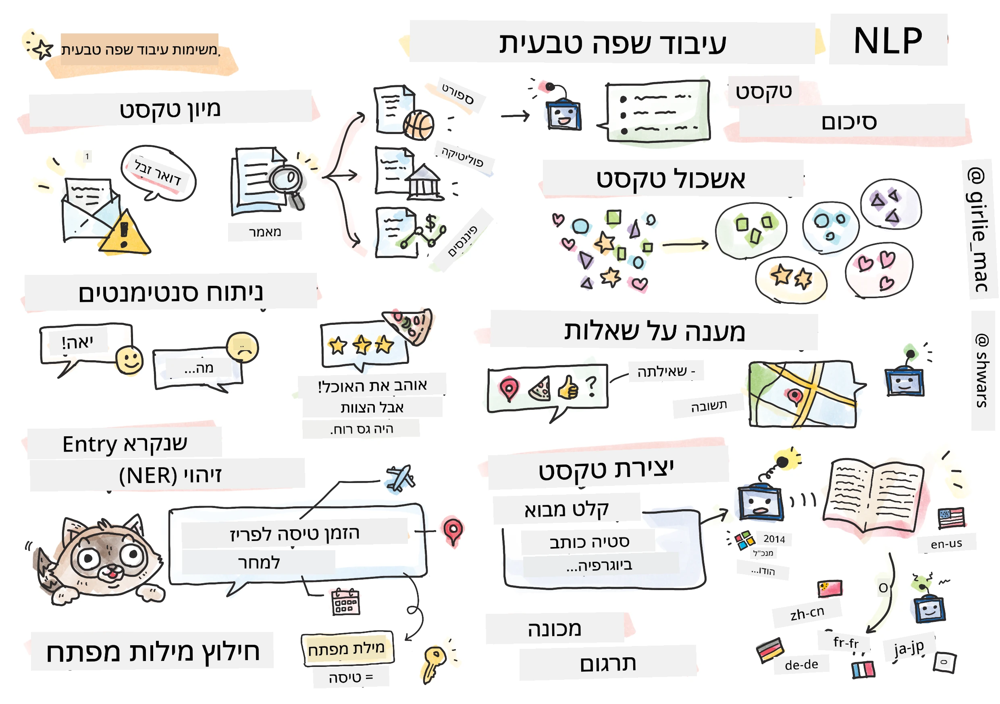

# עיבוד שפה טבעית



בחלק זה, נתרכז בשימוש ברשתות עצביות כדי לטפל במשימות הקשורות ל**עיבוד שפה טבעית (NLP)**. ישנן בעיות רבות ב-NLP שרוצים שהמחשב יוכל לפתור:

* **מיון טקסט** היא בעיית מיון טיפוסית הקשורה ברצפי טקסט. דוגמאות כוללות מיון הודעות דואר אלקטרוני כספאם לעומת לא ספאם, או סיווג מאמרים כספורט, עסקים, פוליטיקה וכו'. בנוסף, בפיתוח בוטים לשיחה, לעיתים קרובות יש צורך להבין מה המשתמש רצה לומר – במקרה זה אנו עוסקים ב**מיון כוונה**. לעיתים קרובות, במיון כוונה יש צורך להתמודד עם קטגוריות רבות.
* **ניתוח סנטימנטים** היא בעיית רגרסיה טיפוסית, שבה יש לייחס מספר (סנטימנט) המייצג עד כמה המשמעות של המשפט היא חיובית או שלילית. גרסה מתקדמת יותר של ניתוח סנטימנטים היא **ניתוח סנטימנטים מבוסס היבטים** (ABSA), שבו מייחסים סנטימנט לא לכל המשפט, אלא לחלקים שונים בו (היבטים), למשל *במסעדה הזו אהבתי את המטבח, אבל האווירה הייתה נוראית*.
* **זיהוי ישויות שמיות** (NER) מתייחס לבעיה של חילוץ ישויות מסוימות מתוך הטקסט. לדוגמה, ייתכן שנצטרך להבין שבביטוי *אני צריך לטוס לפריז מחר* המילה *מחר* מתייחסת לתאריך, ו-*פריז* היא מיקום.  
* **חילוץ מילות מפתח** דומה ל-NER, אך יש לחלץ מילים החשובות למשמעות המשפט באופן אוטומטי, ללא אימון מוקדם לסוגי ישויות ספציפיים.
* **קיבוץ טקסט** יכול להיות שימושי כאשר רוצים לקבץ יחד משפטים דומים, למשל בקשות דומות בשיחות תמיכה טכנית.
* **מענה לשאלות** מתייחס ליכולת של מודל לענות על שאלה ספציפית. המודל מקבל קטע טקסט ושאלה כקלט, והוא צריך לספק מקום בטקסט שבו קיימת התשובה לשאלה (או, לפעמים, לייצר את טקסט התשובה).
* **יצירת טקסט** היא היכולת של מודל לייצר טקסט חדש. ניתן לראות זאת כמשימת מיון החוזה על האות/מילה הבאה בהתבסס על *פרומפט טקסט*. מודלים מתקדמים ליצירת טקסט, כמו GPT-3, מסוגלים לפתור משימות NLP נוספות כמו מיון באמצעות טכניקה שנקראת [תכנות פרומפט](https://towardsdatascience.com/software-3-0-how-prompting-will-change-the-rules-of-the-game-a982fbfe1e0) או [הנדסת פרומפטים](https://medium.com/swlh/openai-gpt-3-and-prompt-engineering-dcdc2c5fcd29)
* **סיכום טקסט** היא טכניקה שבה רוצים שהמחשב "יקרא" טקסט ארוך ויסכם אותו בכמה משפטים.
* **תרגום מכונה** ניתן לראות כשילוב של הבנת טקסט בשפה אחת, ויצירת טקסט בשפה אחרת.

בתחילה, רוב משימות ה-NLP נפתרו באמצעות שיטות מסורתיות כמו דקדוק. לדוגמה, בתרגום מכונה השתמשו ב-parserים כדי להפוך משפט ראשוני לעץ תחבירי, ואז חילצו מבנים סמנטיים ברמה גבוהה כדי לייצג את משמעות המשפט, ועל בסיס משמעות זו ודקדוק שפת היעד נוצר התוצאה. כיום, משימות NLP רבות נפתרות בצורה יעילה יותר באמצעות רשתות עצביות.

> שיטות NLP קלאסיות רבות יושמו בספריית הפייתון [Natural Language Processing Toolkit (NLTK)](https://www.nltk.org). קיימת גם [ספריית NLTK](https://www.nltk.org/book/) מעולה זמינה באינטרנט שמסבירה כיצד לפתור משימות NLP שונות בעזרת NLTK.

בקורס שלנו נתמקד בעיקר בשימוש ברשתות עצביות ל-NLP, ונעשה שימוש ב-NLTK במקומות הנדרשים.

כבר למדתם על שימוש ברשתות עצביות לטיפול בנתונים טבלאיים ותמונות. ההבדל העיקרי בין סוגי הנתונים הללו לטקסט הוא שטקסט הוא רצף באורך משתנה, בעוד שגודל הקלט במקרה של תמונות ידוע מראש. בעוד שרשתות קונבולוציה יכולות לחלץ תבניות מנתוני הקלט, התבניות בטקסט מורכבות יותר. לדוגמה, ניגודיות בין מילים יכולה להיות מופרדת מנושא על ידי מילים רבות (למשל *אני לא אוהב תפוזים* לעומת *אני לא אוהב את התפוזים הגדולים, הצבעוניים והטעימים האלה*), וזה עדיין צריך להתפרש כתבנית אחת. לכן, כדי להתמודד עם שפה יש להציג סוגים חדשים של רשתות עצביות, כמו *רשתות חוזרות* ו*טרנספורמרים*.

## התקנת ספריות

אם אתם משתמשים בהתקנת פייתון מקומית על מנת להריץ את הקורס, ייתכן שתצטרכו להתקין את כל הספריות הדרושות ל-NLP בעזרת הפקודות הבאות:

**ל-PyTorch**
```bash
pip install -r requirements-pytorch.txt
```
**ל-TensorFlow**
```bash
pip install -r requirements-tf.txt
```

> ניתן לנסות NLP עם TensorFlow ב-[Microsoft Learn](https://docs.microsoft.com/learn/modules/intro-natural-language-processing-tensorflow/?WT.mc_id=academic-77998-cacaste)

## אזהרת GPU

בחלק זה, בכמה מהדוגמאות נלמד להדריך מודלים גדולים למדי.
* **השתמשו במחשב עם GPU**: מומלץ להריץ את המחברות שלכם על מחשב עם GPU להפחתת זמני ההמתנה בעת עבודה עם מודלים גדולים.
* **מגבלות זיכרון GPU**: עבודה עם GPU עלולה לגרום לכך שייגמר זיכרון ה-GPU, במיוחד בעת הדרכת מודלים גדולים.
* **צריכת זיכרון GPU**: כמות זיכרון ה-GPU הנצרכת במהלך ההדרכה תלויה בגורמים רבים, כולל גודל המיני-אצווה.
* **הקטנת גודל מיני-אצווה**: אם אתם נתקלים בבעיות זיכרון GPU, שקלו להקטין את גודל המיני-אצווה בקוד שלכם כפתרון אפשרי.
* **שחרור זיכרון GPU ב-TensorFlow**: גרסאות ישנות של TensorFlow עשויות שלא לשחרר את זיכרון ה-GPU כראוי בעת הדרכת מספר מודלים באותה ליבת פייתון. כדי לנהל שימוש בזיכרון GPU בצורה יעילה, ניתן לקבוע ב-TensorFlow להקצות זיכרון GPU רק לפי הצורך.
* **הכללת קוד**: על מנת לגדיר את TensorFlow להגדיל את הקצאת זיכרון ה-GPU רק בעת הצורך, יש לכלול את הקוד הבא במחברות שלכם:

```python
physical_devices = tf.config.list_physical_devices('GPU') 
if len(physical_devices)>0:
    tf.config.experimental.set_memory_growth(physical_devices[0], True) 
```

אם אתם מעוניינים ללמוד על NLP מפרספקטיבה קלאסית של למידת מכונה, בקרו ב[סדרת השיעורים הזו](https://github.com/microsoft/ML-For-Beginners/tree/main/6-NLP)

## בחלק זה
בחלק זה נלמד על:

* [ייצוג טקסט כמטריצות](13-TextRep/README.md)
* [הנחת מילים](14-Embeddings/README.md)
* [מודלינג שפה](15-LanguageModeling/README.md)
* [רשתות עצביות חוזרות](16-RNN/README.md)
* [רשתות גנרטיביות](17-GenerativeNetworks/README.md)
* [טרנספורמרים](18-Transformers/README.md)

---

<!-- CO-OP TRANSLATOR DISCLAIMER START -->
**כתב ויתור**:
מסמך זה תורגם באמצעות שירות תרגום אוטומטי [Co-op Translator](https://github.com/Azure/co-op-translator). למרות שאנו שואפים לדיוק, יש לקחת בחשבון שתרגומים אוטומטיים עלולים להכיל שגיאות או אי-דיוקים. יש להחשיב את המסמך המקורי בשפתו הטבעית כמקור הסמכות. למידע קריטי מומלץ להשתמש בתרגום מקצועי על ידי מתרגם אדם. אנו לא אחראים לכל אי-הבנה או פירוש שגוי הנובע מהשימוש בתרגום זה.
<!-- CO-OP TRANSLATOR DISCLAIMER END -->