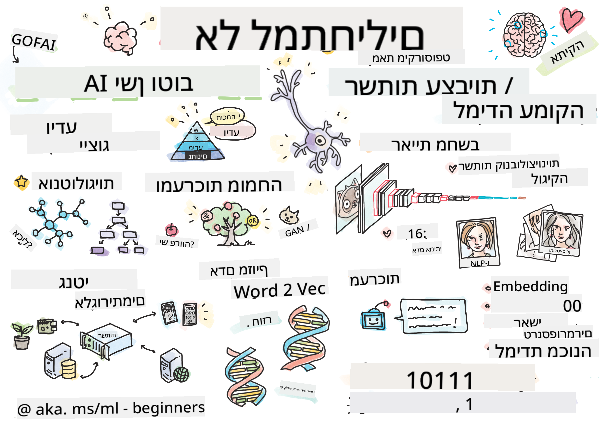

<!--
CO_OP_TRANSLATOR_METADATA:
{
  "original_hash": "5fef1a0b22498d7188959e2a2cb08af7",
  "translation_date": "2025-08-28T19:14:06+00:00",
  "source_file": "lessons/README.md",
  "language_code": "he"
}
-->
# סקירה כללית

> איור מאת [Tomomi Imura](https://twitter.com/girlie_mac)

---

**כתב ויתור**:  
מסמך זה תורגם באמצעות שירות תרגום מבוסס בינה מלאכותית [Co-op Translator](https://github.com/Azure/co-op-translator). למרות שאנו שואפים לדיוק, יש לקחת בחשבון שתרגומים אוטומטיים עשויים להכיל שגיאות או אי דיוקים. המסמך המקורי בשפתו המקורית צריך להיחשב כמקור סמכותי. עבור מידע קריטי, מומלץ להשתמש בתרגום מקצועי על ידי אדם. איננו נושאים באחריות לאי הבנות או לפרשנויות שגויות הנובעות משימוש בתרגום זה.