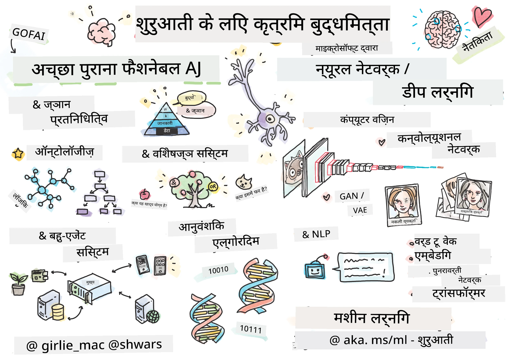

[](https://github.com/microsoft/AI-For-Beginners/blob/main/LICENSE)
[](https://GitHub.com/microsoft/AI-For-Beginners/graphs/contributors/)
[](https://GitHub.com/microsoft/AI-For-Beginners/issues/)
[](https://GitHub.com/microsoft/AI-For-Beginners/pulls/)
[](http://makeapullrequest.com)

[](https://GitHub.com/microsoft/AI-For-Beginners/watchers/)
[](https://GitHub.com/microsoft/AI-For-Beginners/network/)
[](https://GitHub.com/microsoft/AI-For-Beginners/stargazers/)
[](https://mybinder.org/v2/gh/microsoft/ai-for-beginners/HEAD)
[](https://gitter.im/Microsoft/ai-for-beginners?utm_source=badge&utm_medium=badge&utm_campaign=pr-badge)

[](https://discord.gg/nTYy5BXMWG)

# शुरुआती लोगों के लिए कृत्रिम बुद्धिमत्ता - एक पाठ्यक्रम

||
|:---:|
| शुरुआती लोगों के लिए AI - _स्केचनोट द्वारा [@girlie_mac](https://twitter.com/girlie_mac)_ |

हमारे 12 सप्ताह, 24-लेसन पाठ्यक्रम के साथ **कृत्रिम बुद्धिमत्ता** (AI) की दुनिया का पता लगाएं! इसमें व्यावहारिक पाठ, क्विज़ और प्रयोगशालाएं शामिल हैं। यह पाठ्यक्रम शुरुआती लोगों के लिए उपयुक्त है और इसमें TensorFlow और PyTorch जैसे टूल्स के साथ-साथ AI में नैतिकता को भी कवर किया गया है।

### 🌐 बहुभाषी समर्थन

#### GitHub Action के माध्यम से समर्थित (स्वचालित और हमेशा अपडेट)

<!-- CO-OP TRANSLATOR LANGUAGES TABLE START -->
[Arabic](../ar/README.md) | [Bengali](../bn/README.md) | [Bulgarian](../bg/README.md) | [Burmese (Myanmar)](../my/README.md) | [Chinese (Simplified)](../zh-CN/README.md) | [Chinese (Traditional, Hong Kong)](../zh-HK/README.md) | [Chinese (Traditional, Macau)](../zh-MO/README.md) | [Chinese (Traditional, Taiwan)](../zh-TW/README.md) | [Croatian](../hr/README.md) | [Czech](../cs/README.md) | [Danish](../da/README.md) | [Dutch](../nl/README.md) | [Estonian](../et/README.md) | [Finnish](../fi/README.md) | [French](../fr/README.md) | [German](../de/README.md) | [Greek](../el/README.md) | [Hebrew](../he/README.md) | [Hindi](./README.md) | [Hungarian](../hu/README.md) | [Indonesian](../id/README.md) | [Italian](../it/README.md) | [Japanese](../ja/README.md) | [Kannada](../kn/README.md) | [Korean](../ko/README.md) | [Lithuanian](../lt/README.md) | [Malay](../ms/README.md) | [Malayalam](../ml/README.md) | [Marathi](../mr/README.md) | [Nepali](../ne/README.md) | [Nigerian Pidgin](../pcm/README.md) | [Norwegian](../no/README.md) | [Persian (Farsi)](../fa/README.md) | [Polish](../pl/README.md) | [Portuguese (Brazil)](../pt-BR/README.md) | [Portuguese (Portugal)](../pt-PT/README.md) | [Punjabi (Gurmukhi)](../pa/README.md) | [Romanian](../ro/README.md) | [Russian](../ru/README.md) | [Serbian (Cyrillic)](../sr/README.md) | [Slovak](../sk/README.md) | [Slovenian](../sl/README.md) | [Spanish](../es/README.md) | [Swahili](../sw/README.md) | [Swedish](../sv/README.md) | [Tagalog (Filipino)](../tl/README.md) | [Tamil](../ta/README.md) | [Telugu](../te/README.md) | [Thai](../th/README.md) | [Turkish](../tr/README.md) | [Ukrainian](../uk/README.md) | [Urdu](../ur/README.md) | [Vietnamese](../vi/README.md)

> **स्थानीय रूप से क्लोन करना पसंद करते हैं?**

> इस रिपॉजिटरी में 50+ भाषा अनुवाद शामिल हैं जो डाउनलोड साइज़ को काफी बढ़ा देते हैं। अनुवादों के बिना क्लोन करने के लिए sparse checkout का उपयोग करें:
> ```bash
> git clone --filter=blob:none --sparse https://github.com/microsoft/AI-For-Beginners.git
> cd AI-For-Beginners
> git sparse-checkout set --no-cone '/*' '!translations' '!translated_images'
> ```
> यह आपको इस कोर्स को पूरा करने के लिए आवश्यक सभी चीज़ें बहुत तेज़ डाउनलोड के साथ देता है।
<!-- CO-OP TRANSLATOR LANGUAGES TABLE END -->

**यदि आप अतिरिक्त अनुवाद भाषाओं का समर्थन चाहते हैं, तो वे [यहाँ](https://github.com/Azure/co-op-translator/blob/main/getting_started/supported-languages.md) सूचीबद्ध हैं**

## समुदाय में शामिल हों
[](https://discord.gg/nTYy5BXMWG)

## आप क्या सीखेंगे

**[कोर्स का माइंडमैप](http://soshnikov.com/courses/ai-for-beginners/mindmap.html)**

इस पाठ्यक्रम में, आप सीखेंगे:

* कृत्रिम बुद्धिमत्ता के विभिन्न दृष्टिकोण, जिनमें "पुराना" प्रतीकात्मक दृष्टिकोण जैसे **ज्ञान प्रतिनिधित्व** और तर्कशक्ति शामिल हैं ([GOFAI](https://en.wikipedia.org/wiki/Symbolic_artificial_intelligence))।
* **न्यूरल नेटवर्क्स** और **डीप लर्निंग**, जो आधुनिक AI का मूल हैं। हम इन महत्वपूर्ण विषयों के पीछे की अवधारणाओं को दो लोकप्रिय फ्रेमवर्क - [TensorFlow](http://Tensorflow.org) और [PyTorch](http://pytorch.org) - में कोड के माध्यम से चित्रित करेंगे।
* छवियों और टेक्स्ट के साथ काम करने के लिए **न्यूरल आर्किटेक्चर**। हम हाल के मॉडलों को कवर करेंगे लेकिन हो सकता है कि अत्याधुनिक स्तर पर थोड़ी कमी हो।
* कम लोकप्रिय AI दृष्टिकोण, जैसे **जेनेटिक एल्गोरिदम** और **मल्टी-एजेंट सिस्टम्स**।

इस पाठ्यक्रम में हम क्या नहीं कवर करेंगे:

> [इस कोर्स के लिए सभी अतिरिक्त संसाधन Microsoft Learn संग्रह में खोजें](https://learn.microsoft.com/en-us/collections/7w28iy2xrqzdj0?WT.mc_id=academic-77998-bethanycheum)

* **व्यवसाय में AI** के बिजनेस केस। आप Microsoft Learn पर [व्यवसाय उपयोगकर्ताओं के लिए AI का परिचय](https://docs.microsoft.com/learn/paths/introduction-ai-for-business-users/?WT.mc_id=academic-77998-bethanycheum) सीखने के पथ या [AI बिजनेस स्कूल](https://www.microsoft.com/ai/ai-business-school/?WT.mc_id=academic-77998-bethanycheum), जिसे [INSEAD](https://www.insead.edu/) के साथ सहयोग में विकसित किया गया है, लेना consider कर सकते हैं।
* **क्लासिक मशीन लर्निंग**, जो हमारे [डबलब्लू मशीन लर्निंग फॉर बिगिनर्स पाठ्यक्रम](http://github.com/Microsoft/ML-for-Beginners) में अच्छी तरह से वर्णित है।
* व्यावहारिक AI अनुप्रयोग जो **[कॉग्निटिव सर्विसेज](https://azure.microsoft.com/services/cognitive-services/?WT.mc_id=academic-77998-bethanycheum)** का उपयोग करके बनाए गए हैं। इसके लिए, हम Microsoft Learn के [विजन](https://docs.microsoft.com/learn/paths/create-computer-vision-solutions-azure-cognitive-services/?WT.mc_id=academic-77998-bethanycheum), [प्राकृतिक भाषा प्रसंस्करण](https://docs.microsoft.com/learn/paths/explore-natural-language-processing/?WT.mc_id=academic-77998-bethanycheum), **[Azure OpenAI सेवा के साथ जनरेटिव AI](https://learn.microsoft.com/en-us/training/paths/develop-ai-solutions-azure-openai/?WT.mc_id=academic-77998-bethanycheum)** और अन्य मॉड्यूल के साथ शुरू करने की सलाह देते हैं।
* विशिष्ट ML **क्लाउड फ्रेमवर्क**, जैसे [Azure Machine Learning](https://azure.microsoft.com/services/machine-learning/?WT.mc_id=academic-77998-bethanycheum), [Microsoft Fabric](https://learn.microsoft.com/en-us/training/paths/get-started-fabric/?WT.mc_id=academic-77998-bethanycheum), या [Azure Databricks](https://docs.microsoft.com/learn/paths/data-engineer-azure-databricks?WT.mc_id=academic-77998-bethanycheum)। आप [Azure Machine Learning के साथ मशीन लर्निंग समाधान बनाना और चलाना](https://docs.microsoft.com/learn/paths/build-ai-solutions-with-azure-ml-service/?WT.mc_id=academic-77998-bethanycheum) और [Azure Databricks के साथ मशीन लर्निंग समाधान बनाना और चलाना](https://docs.microsoft.com/learn/paths/build-operate-machine-learning-solutions-azure-databricks/?WT.mc_id=academic-77998-bethanycheum) सीखने के पथ का उपयोग भी कर सकते हैं।
* **संवादी AI** और **चैट बॉट्स**। इसके लिए एक अलग [संवादी AI समाधान बनाएं](https://docs.microsoft.com/learn/paths/create-conversational-ai-solutions/?WT.mc_id=academic-77998-bethanycheum) सीखने का पथ है, और आप अधिक विवरण के लिए [इस ब्लॉग पोस्ट](https://soshnikov.com/azure/hello-bot-conversational-ai-on-microsoft-platform/) को भी देख सकते हैं।
* डीप लर्निंग के पीछे की **गहन गणित**। इसके लिए हम Ian Goodfellow, Yoshua Bengio और Aaron Courville की [Deep Learning](https://www.amazon.com/Deep-Learning-Adaptive-Computation-Machine/dp/0262035618) की सिफारिश करते हैं, जो ऑनलाइन [https://www.deeplearningbook.org/](https://www.deeplearningbook.org/) पर भी उपलब्ध है।

_क्लाउड में AI_ विषयों के लिए एक सहज परिचय के लिए आप [Azure पर कृत्रिम बुद्धिमत्ता के साथ शुरुआत करें](https://docs.microsoft.com/learn/paths/get-started-with-artificial-intelligence-on-azure/?WT.mc_id=academic-77998-bethanycheum) सीखने का पथ ले सकते हैं।

# सामग्री

|     |                                                                 पाठ लिंक                                                                  |                                           PyTorch/Keras/TensorFlow                                          | प्रयोगशाला                                                            |
| :-: | :------------------------------------------------------------------------------------------------------------------------------------------: | :---------------------------------------------------------------------------------------------: | ------------------------------------------------------------------------------ |
| 0  |                                 [कोर्स सेटअप](./lessons/0-course-setup/setup.md)                                 |                      [अपने विकास पर्यावरण को सेटअप करें](./lessons/0-course-setup/how-to-run.md)                       |   |
| I  |               [**AI का परिचय**](./lessons/1-Intro/README.md)      | | |
| 01  |       [AI का परिचय और इतिहास](./lessons/1-Intro/README.md)       |           -                            | -  |
| II |              **प्रतीकात्मक AI**              |
| 02  |       [ज्ञान प्रतिनिधित्व और विशेषज्ञ सिस्टम](./lessons/2-Symbolic/README.md)       |            [विशेषज्ञ सिस्टम](./lessons/2-Symbolic/Animals.ipynb) /  [ऑन्टोलॉजी](./lessons/2-Symbolic/FamilyOntology.ipynb) /[संरचना ग्राफ](./lessons/2-Symbolic/MSConceptGraph.ipynb)                             |  |
| III |                        [**न्यूरल नेटवर्क्स का परिचय**](./lessons/3-NeuralNetworks/README.md) |||
| 03  |                [परसेप्ट्रॉन](./lessons/3-NeuralNetworks/03-Perceptron/README.md)                 |                       [नोटबुक](./lessons/3-NeuralNetworks/03-Perceptron/Perceptron.ipynb)                      | [लैब](./lessons/3-NeuralNetworks/03-Perceptron/lab/README.md) |
| 04  |                   [मल्टी-लेयर्ड परसेप्ट्रॉन और अपना खुद का फ्रेमवर्क बनाना](./lessons/3-NeuralNetworks/04-OwnFramework/README.md)                   |        [नोटबुक](./lessons/3-NeuralNetworks/04-OwnFramework/OwnFramework.ipynb)        | [लैब](./lessons/3-NeuralNetworks/04-OwnFramework/lab/README.md) |
| 05  |            [फ्रेमवर्क का परिचय (PyTorch/TensorFlow) और ओवरफिटिंग](./lessons/3-NeuralNetworks/05-Frameworks/README.md)             |           [PyTorch](./lessons/3-NeuralNetworks/05-Frameworks/IntroPyTorch.ipynb) / [Keras](./lessons/3-NeuralNetworks/05-Frameworks/IntroKeras.ipynb) / [TensorFlow](./lessons/3-NeuralNetworks/05-Frameworks/IntroKerasTF.ipynb)             | [लैब](./lessons/3-NeuralNetworks/05-Frameworks/lab/README.md) |
| IV  |            [**कंप्यूटर विज़न**](./lessons/4-ComputerVision/README.md)             | [PyTorch](https://docs.microsoft.com/learn/modules/intro-computer-vision-pytorch/?WT.mc_id=academic-77998-cacaste) / [TensorFlow](https://docs.microsoft.com/learn/modules/intro-computer-vision-TensorFlow/?WT.mc_id=academic-77998-cacaste)| [माइक्रोसॉफ्ट एज्योर पर कंप्यूटर विज़न एक्सप्लोर करें](https://learn.microsoft.com/en-us/collections/7w28iy2xrqzdj0?WT.mc_id=academic-77998-bethanycheum) |
| 06  |            [कंप्यूटर विज़न का परिचय। OpenCV](./lessons/4-ComputerVision/06-IntroCV/README.md)             |           [नोटबुक](./lessons/4-ComputerVision/06-IntroCV/OpenCV.ipynb)         | [लैब](./lessons/4-ComputerVision/06-IntroCV/lab/README.md) |
| 07  |            [कॉनवल्यूशनल न्यूरल नेटवर्क्स](./lessons/4-ComputerVision/07-ConvNets/README.md) &  [CNN आर्किटेक्चर](./lessons/4-ComputerVision/07-ConvNets/CNN_Architectures.md)             |           [PyTorch](./lessons/4-ComputerVision/07-ConvNets/ConvNetsPyTorch.ipynb) /[TensorFlow](./lessons/4-ComputerVision/07-ConvNets/ConvNetsTF.ipynb)             | [लैब](./lessons/4-ComputerVision/07-ConvNets/lab/README.md) |
| 08  |            [प्री-ट्रेंड नेटवर्क्स और ट्रांसफर लर्निंग](./lessons/4-ComputerVision/08-TransferLearning/README.md) और [ट्रेनिंग ट्रिक्स](./lessons/4-ComputerVision/08-TransferLearning/TrainingTricks.md)             |           [PyTorch](./lessons/4-ComputerVision/08-TransferLearning/TransferLearningPyTorch.ipynb) / [TensorFlow](./lessons/3-NeuralNetworks/05-Frameworks/IntroKerasTF.ipynb)             | [लैब](./lessons/4-ComputerVision/08-TransferLearning/lab/README.md) |
| 09  |            [ऑटोएन्कोडर्स और VAE](./lessons/4-ComputerVision/09-Autoencoders/README.md)             |           [PyTorch](./lessons/4-ComputerVision/09-Autoencoders/AutoEncodersPyTorch.ipynb) / [TensorFlow](./lessons/4-ComputerVision/09-Autoencoders/AutoencodersTF.ipynb)             |  |
| 10  |            [जेनरेटिव एडवरसैरियल नेटवर्क्स और आर्टिस्टिक स्टाइल ट्रांसफर](./lessons/4-ComputerVision/10-GANs/README.md)             |           [PyTorch](./lessons/4-ComputerVision/10-GANs/GANPyTorch.ipynb) / [TensorFlow](./lessons/4-ComputerVision/10-GANs/GANTF.ipynb)             |  |
| 11  |            [ऑब्जेक्ट डिटेक्शन](./lessons/4-ComputerVision/11-ObjectDetection/README.md)             |         [TensorFlow](./lessons/4-ComputerVision/11-ObjectDetection/ObjectDetection.ipynb)             | [लैब](./lessons/4-ComputerVision/11-ObjectDetection/lab/README.md) |
| 12  |            [सेमेंटिक सेगमेंटेशन। U-Net](./lessons/4-ComputerVision/12-Segmentation/README.md)             |           [PyTorch](./lessons/4-ComputerVision/12-Segmentation/SemanticSegmentationPytorch.ipynb) / [TensorFlow](./lessons/4-ComputerVision/12-Segmentation/SemanticSegmentationTF.ipynb)             |  |
| V  |            [**प्राकृतिक भाषा संसाधन**](./lessons/5-NLP/README.md)             | [PyTorch](https://docs.microsoft.com/learn/modules/intro-natural-language-processing-pytorch/?WT.mc_id=academic-77998-cacaste) /[TensorFlow](https://docs.microsoft.com/learn/modules/intro-natural-language-processing-TensorFlow/?WT.mc_id=academic-77998-cacaste) | [माइक्रोसॉफ्ट एज्योर पर प्राकृतिक भाषा संसाधन एक्सप्लोर करें](https://learn.microsoft.com/en-us/collections/7w28iy2xrqzdj0?WT.mc_id=academic-77998-bethanycheum)|
| 13  |            [टेक्स्ट प्रतिनिधित्व। Bow/TF-IDF](./lessons/5-NLP/13-TextRep/README.md)             |           [PyTorch](https://github.com/microsoft/AI-For-Beginners/blob/main/lessons/5-NLP/13-TextRep/TextRepresentationPyTorch.ipynb) / [TensorFlow](https://github.com/microsoft/AI-For-Beginners/blob/main/lessons/5-NLP/13-TextRep/TextRepresentationTF.ipynb)             | |
| 14  |            [सेमांटिक वर्ड एम्बेडिंग्स। Word2Vec और GloVe](./lessons/5-NLP/14-Embeddings/README.md)             |           [PyTorch](https://github.com/microsoft/AI-For-Beginners/blob/main/lessons/5-NLP/14-Embeddings/EmbeddingsPyTorch.ipynb) / [TensorFlow](https://github.com/microsoft/AI-For-Beginners/blob/main/lessons/5-NLP/14-Embeddings/EmbeddingsTF.ipynb)             |  |
| 15  |            [भाषा मॉडलिंग। अपनी खुद की एम्बेडिंग्स का प्रशिक्षण](./lessons/5-NLP/15-LanguageModeling/README.md)             |           [PyTorch](https://github.com/microsoft/AI-For-Beginners/blob/main/lessons/5-NLP/15-LanguageModeling/CBoW-PyTorch.ipynb) / [TensorFlow](https://github.com/microsoft/AI-For-Beginners/blob/main/lessons/5-NLP/15-LanguageModeling/CBoW-TF.ipynb)             | [लैब](./lessons/5-NLP/15-LanguageModeling/lab/README.md) |
| 16  |            [रिकर्रेंट न्यूरल नेटवर्क्स](./lessons/5-NLP/16-RNN/README.md)             |           [PyTorch](https://github.com/microsoft/AI-For-Beginners/blob/main/lessons/5-NLP/16-RNN/RNNPyTorch.ipynb) / [TensorFlow](https://github.com/microsoft/AI-For-Beginners/blob/main/lessons/5-NLP/16-RNN/RNNTF.ipynb)             |  |
| 17  |            [जेनरेटिव रिकारेंट नेटवर्क्स](./lessons/5-NLP/17-GenerativeNetworks/README.md)             |           [PyTorch](https://github.com/microsoft/AI-For-Beginners/blob/main/lessons/5-NLP/17-GenerativeNetworks/GenerativePyTorch.ipynb) / [TensorFlow](https://github.com/microsoft/AI-For-Beginners/blob/main/lessons/5-NLP/17-GenerativeNetworks/GenerativeTF.ipynb)             | [लैब](./lessons/5-NLP/17-GenerativeNetworks/lab/README.md) |
| 18  |            [ट्रांसफॉर्मर्स। BERT।](./lessons/5-NLP/18-Transformers/README.md)             |           [PyTorch](https://github.com/microsoft/AI-For-Beginners/blob/main/lessons/5-NLP/18-Transformers/TransformersPyTorch.ipynb) /[TensorFlow](https://github.com/microsoft/AI-For-Beginners/blob/main/lessons/5-NLP/18-Transformers/TransformersTF.ipynb)             |  |
| 19  |            [नामित एंटिटी रिकग्निशन](./lessons/5-NLP/19-NER/README.md)             |           [TensorFlow](https://microsoft.github.io/AI-For-Beginners/lessons/5-NLP/19-NER/NER-TF.ipynb)             | [लैब](./lessons/5-NLP/19-NER/lab/README.md) |
| 20  |            [बड़े भाषा मॉडल, प्रॉम्प्ट प्रोग्रामिंग और कम-शॉट टास्क](./lessons/5-NLP/20-LangModels/README.md)             |           [PyTorch](https://microsoft.github.io/AI-For-Beginners/lessons/5-NLP/20-LangModels/GPT-PyTorch.ipynb) | |
| VI |            **अन्य AI तकनीकें** || |
| 21  |            [जैविक एल्गोरिदम](./lessons/6-Other/21-GeneticAlgorithms/README.md)             |           [नोटबुक](./lessons/6-Other/21-GeneticAlgorithms/Genetic.ipynb) | |
| 22  |            [डीप रिइन्फोर्समेंट लर्निंग](./lessons/6-Other/22-DeepRL/README.md)             |           [PyTorch](./lessons/6-Other/22-DeepRL/CartPole-RL-PyTorch.ipynb) /[TensorFlow](./lessons/6-Other/22-DeepRL/CartPole-RL-TF.ipynb)             | [लैब](./lessons/6-Other/22-DeepRL/lab/README.md) |
| 23  |            [मल्टी-एजेंट सिस्टम्स](./lessons/6-Other/23-MultiagentSystems/README.md)             |  | |
| VII |            **AI नैतिकता** | | |
| 24  |            [AI नैतिकता और जिम्मेदार AI](./lessons/7-Ethics/README.md)             |           [Microsoft Learn: जिम्मेदार AI सिद्धांत](https://docs.microsoft.com/learn/paths/responsible-ai-business-principles/?WT.mc_id=academic-77998-cacaste) | |
| IX  |            **अतिरिक्त** | | |
| 25  |            [मल्टी-मोडल नेटवर्क्स, CLIP और VQGAN](./lessons/X-Extras/X1-MultiModal/README.md)             |           [नोटबुक](./lessons/X-Extras/X1-MultiModal/Clip.ipynb)    | |

## प्रत्येक पाठ में शामिल हैं

* पूर्व-पठन सामग्री
* निष्पादनीय जुपिटर नोटबुक्स, जो अक्सर फ्रेमवर्क (**PyTorch** या **TensorFlow**) के अनुसार विशिष्ट होती हैं। निष्पादनीय नोटबुक में बहुत सारी सैद्धांतिक सामग्री भी होती है, इसलिए विषय को समझने के लिए आपको कम से कम एक संस्करण (PyTorch या TensorFlow) को पढ़ना आवश्यक है।
* कुछ विषयों के लिए **लैब्स** उपलब्ध हैं, जो आपको सीखी गई सामग्री को किसी विशिष्ट समस्या पर लागू करने का मौका देती हैं।
* कुछ अनुभागों में संबंधित विषयों को कवर करने वाले [**MS Learn**](https://learn.microsoft.com/en-us/collections/7w28iy2xrqzdj0?WT.mc_id=academic-77998-bethanycheum) मॉड्यूल के लिंक होते हैं।

## शुरुआत करना

### 🎯 AI में नए हैं? यहाँ से शुरू करें!

यदि आप AI में बिलकुल नए हैं और त्वरित, हाथों-हाथ उदाहरण चाहते हैं, तो हमारे [**शिक्षार्थी-अनुकूल उदाहरण**](./examples/README.md) देखें! इनमें शामिल हैं:

- 🌟 **हैलो AI वर्ल्ड** - आपका पहला AI प्रोग्राम (पैटर्न मान्यता)
- 🧠 **सरल न्यूरल नेटवर्क** - खरोंच से एक न्यूरल नेटवर्क बनाएं  

- 🖼️ **इमेज क्लासिफायर** - विस्तार से टिप्पणियों के साथ छवियों को वर्गीकृत करें
- 💬 **टेक्स्ट सेंटिमेंट** - सकारात्मक/नकारात्मक पाठ का विश्लेषण करें

ये उदाहरण आपको पूरी पाठ्यक्रम में जाने से पहले AI अवधारणाओं को समझने में मदद करने के लिए डिज़ाइन किए गए हैं।

### 📚 पूर्ण पाठ्यक्रम सेटअप

- हमने आपके विकास पर्यावरण की स्थापना में मदद करने के लिए एक [सेटअप पाठ](./lessons/0-course-setup/setup.md) बनाया है। - शिक्षकों के लिए, हमने आपके लिए भी एक [पाठ्यक्रम सेटअप पाठ](./lessons/0-course-setup/for-teachers.md) बनाया है!
- कैसे [VSCode या Codespace में कोड चलाएं](./lessons/0-course-setup/how-to-run.md)

इन चरणों का पालन करें:

रिपॉजिटरी को फोर्क करें: इस पृष्ठ के शीर्ष-दाएँ कोने में "Fork" बटन पर क्लिक करें।

रिपॉजिटरी क्लोन करें: `git clone https://github.com/microsoft/AI-For-Beginners.git`

बाद में इसे आसानी से खोजने के लिए इस रिपॉजिटरी को स्टार (🌟) करना न भूलें।

## अन्य शिक्षार्थियों से मिलें

हमारे [आधिकारिक AI डिस्कॉर्ड सर्वर](https://aka.ms/genai-discord?WT.mc_id=academic-105485-bethanycheum) में जुड़ें ताकि आप इस कोर्स में शामिल अन्य शिक्षार्थियों से मिल सकें और नेटवर्किंग कर सकें और सहायता प्राप्त कर सकें।

यदि आपके पास उत्पाद प्रतिक्रिया या प्रश्न हैं तो हमारे [Azure AI Foundry Developer Forum](https://aka.ms/foundry/forum) पर जाएं।

## क्विज़

> **क्विज़ के बारे में एक नोट**: सभी क्विज़ etc\quiz-app फ़ोल्डर के Quiz-app में संलग्न हैं, या [यहाँ ऑनलाइन](https://ff-quizzes.netlify.app/) उपलब्ध हैं। ये पाठों में लिंक किए गए हैं। क्विज़ ऐप को स्थानीय रूप से चलाया जा सकता है या Azure पर तैनात किया जा सकता है; `quiz-app` फ़ोल्डर में दिए निर्देशों का पालन करें। इन्हें धीरे-धीरे स्थानीयकृत किया जा रहा है।

## सहायता आवश्यक है

क्या आपके पास सुझाव हैं या आपने वर्तनी या कोड त्रुटियां पाई हैं? एक समस्या उठाएं या पुल अनुरोध बनाएं।

## विशेष धन्यवाद

* **✍️ मुख्य लेखक:** [डिमित्रि सोश्निकोव](http://soshnikov.com), PhD
* **🔥 संपादक:** [जेन लूपर](https://twitter.com/jenlooper), PhD
* **🎨 स्केचनोट चित्रकार:** [टोमोमी इमुरा](https://twitter.com/girlie_mac)
* **✅ क्विज़ निर्माता:** [लतीफा बेलो](https://github.com/CinnamonXI), [MLSA](https://studentambassadors.microsoft.com/)
* **🙏 मुख्य योगदानकर्ता:** [एवगेनी पिशचिक](https://github.com/Pe4enIks)

## अन्य पाठ्यक्रम

हमारी टीम अन्य पाठ्यक्रम तैयार करती है! देखें:

<!-- CO-OP TRANSLATOR OTHER COURSES START -->
### LangChain
[](https://aka.ms/langchain4j-for-beginners)
[](https://aka.ms/langchainjs-for-beginners?WT.mc_id=m365-94501-dwahlin)
[](https://github.com/microsoft/langchain-for-beginners?WT.mc_id=m365-94501-dwahlin)
---

### Azure / Edge / MCP / Agents
[](https://github.com/microsoft/AZD-for-beginners?WT.mc_id=academic-105485-koreyst)
[](https://github.com/microsoft/edgeai-for-beginners?WT.mc_id=academic-105485-koreyst)
[](https://github.com/microsoft/mcp-for-beginners?WT.mc_id=academic-105485-koreyst)
[](https://github.com/microsoft/ai-agents-for-beginners?WT.mc_id=academic-105485-koreyst)

---
 
### जनरेटिव AI सीरीज
[](https://github.com/microsoft/generative-ai-for-beginners?WT.mc_id=academic-105485-koreyst)
[-9333EA?style=for-the-badge&labelColor=E5E7EB&color=9333EA)](https://github.com/microsoft/Generative-AI-for-beginners-dotnet?WT.mc_id=academic-105485-koreyst)
[-C084FC?style=for-the-badge&labelColor=E5E7EB&color=C084FC)](https://github.com/microsoft/generative-ai-for-beginners-java?WT.mc_id=academic-105485-koreyst)
[-E879F9?style=for-the-badge&labelColor=E5E7EB&color=E879F9)](https://github.com/microsoft/generative-ai-with-javascript?WT.mc_id=academic-105485-koreyst)

---
 
### मूल सीखना
[](https://aka.ms/ml-beginners?WT.mc_id=academic-105485-koreyst)
[](https://aka.ms/datascience-beginners?WT.mc_id=academic-105485-koreyst)
[](https://aka.ms/ai-beginners?WT.mc_id=academic-105485-koreyst)
[](https://github.com/microsoft/Security-101?WT.mc_id=academic-96948-sayoung)
[](https://aka.ms/webdev-beginners?WT.mc_id=academic-105485-koreyst)
[](https://aka.ms/iot-beginners?WT.mc_id=academic-105485-koreyst)
[](https://github.com/microsoft/xr-development-for-beginners?WT.mc_id=academic-105485-koreyst)

---
 
### Copilot सीरीज
[](https://aka.ms/GitHubCopilotAI?WT.mc_id=academic-105485-koreyst)
[](https://github.com/microsoft/mastering-github-copilot-for-dotnet-csharp-developers?WT.mc_id=academic-105485-koreyst)
[](https://github.com/microsoft/CopilotAdventures?WT.mc_id=academic-105485-koreyst)
<!-- CO-OP TRANSLATOR OTHER COURSES END -->

## मदद लेना

यदि आप अटक गए हैं या AI ऐप बनाने के बारे में कोई प्रश्न हैं। MCP के बारे में चर्चा में साथी शिक्षार्थियों और अनुभवी डेवलपर्स से जुड़ें। यह एक सहायक समुदाय है जहाँ प्रश्न स्वागत योग्य हैं और ज्ञान स्वतंत्र रूप से साझा किया जाता है।

[](https://discord.gg/nTYy5BXMWG)

यदि आपके पास उत्पाद प्रतिक्रिया या निर्माण के दौरान त्रुटियां हैं तो जाएँ:

[](https://aka.ms/foundry/forum)

---

<!-- CO-OP TRANSLATOR DISCLAIMER START -->
**अस्वीकरण**:
यह दस्तावेज़ एआई अनुवाद सेवा [Co-op Translator](https://github.com/Azure/co-op-translator) का उपयोग करके अनुवादित किया गया है। हम सटीकता के लिए प्रयासरत हैं, लेकिन कृपया ध्यान रखें कि स्वचालित अनुवादों में त्रुटियाँ या अशुद्धियां हो सकती हैं। मूल दस्तावेज़ अपनी स्थानीय भाषा में अधिकृत स्रोत माना जाना चाहिए। महत्वपूर्ण जानकारी के लिए, पेशेवर मानवीय अनुवाद की अनुशंसा की जाती है। इस अनुवाद के उपयोग से उत्पन्न किसी भी गलतफहमी या गलत व्याख्या के लिए हम उत्तरदायी नहीं हैं।
<!-- CO-OP TRANSLATOR DISCLAIMER END -->