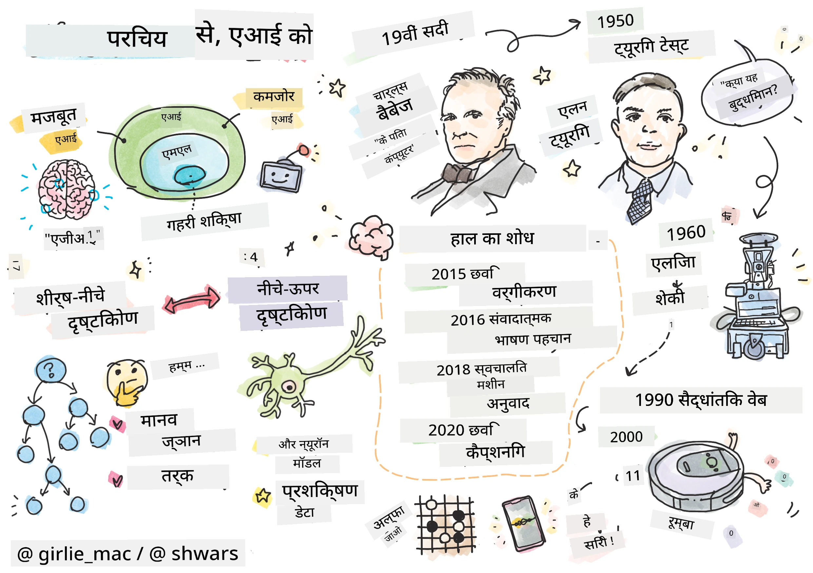
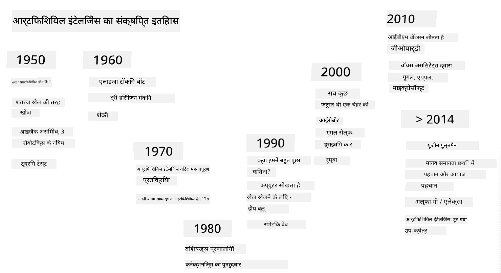
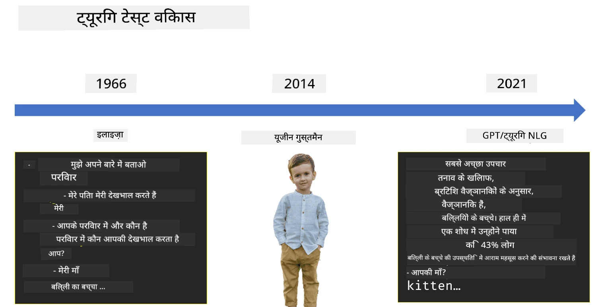

# एआई का परिचय

> स्केच नोट [टोमोमी इमुरा](https://twitter.com/girlie_mac) द्वारा

## [प्री-लेक्चर क्विज़](https://ff-quizzes.netlify.app/en/ai/quiz/1)

**कृत्रिम बुद्धिमत्ता** एक रोमांचक वैज्ञानिक क्षेत्र है जो यह अध्ययन करता है कि हम कंप्यूटर को बुद्धिमान व्यवहार प्रदर्शित करने के लिए कैसे बना सकते हैं, जैसे कि वे काम जो इंसान अच्छे से कर सकते हैं।

मूल रूप से, कंप्यूटर को [चार्ल्स बैबेज](https://en.wikipedia.org/wiki/Charles_Babbage) द्वारा संख्याओं पर एक निश्चित प्रक्रिया - एक एल्गोरिदम - के अनुसार काम करने के लिए आविष्कार किया गया था। आधुनिक कंप्यूटर, हालांकि 19वीं सदी में प्रस्तावित मूल मॉडल की तुलना में काफी उन्नत हैं, फिर भी नियंत्रित गणनाओं के उसी विचार का पालन करते हैं। इसलिए, यदि हमें उस लक्ष्य को प्राप्त करने के लिए आवश्यक चरणों का सटीक क्रम पता है, तो कंप्यूटर को कुछ करने के लिए प्रोग्राम करना संभव है।

> फोटो [विकी सॉश्निकोवा](http://twitter.com/vickievalerie) द्वारा

> ✅ किसी व्यक्ति की तस्वीर से उसकी उम्र का निर्धारण करना ऐसा कार्य है जिसे स्पष्ट रूप से प्रोग्राम नहीं किया जा सकता, क्योंकि जब हम इसे करते हैं तो हमारे दिमाग में एक संख्या कैसे आती है, यह हमें नहीं पता।

---

हालांकि, कुछ कार्य ऐसे होते हैं जिन्हें हम स्पष्ट रूप से हल करने का तरीका नहीं जानते। उदाहरण के लिए, किसी व्यक्ति की तस्वीर से उसकी उम्र का निर्धारण करना। हम इसे किसी तरह से सीखते हैं, क्योंकि हमने विभिन्न उम्र के लोगों के कई उदाहरण देखे हैं, लेकिन हम यह स्पष्ट रूप से नहीं समझा सकते कि हम इसे कैसे करते हैं, और न ही हम कंप्यूटर को इसे करने के लिए प्रोग्राम कर सकते हैं। यही वह प्रकार का कार्य है जो **कृत्रिम बुद्धिमत्ता** (संक्षेप में एआई) के लिए रुचिकर है।

✅ उन कार्यों के बारे में सोचें जिन्हें आप कंप्यूटर को सौंप सकते हैं और जो एआई से लाभान्वित हो सकते हैं। वित्त, चिकित्सा और कला के क्षेत्रों पर विचार करें - आज ये क्षेत्र एआई से कैसे लाभान्वित हो रहे हैं?

## कमजोर एआई बनाम मजबूत एआई

कमजोर एआई | मजबूत एआई
---------------------------------------|-------------------------------------
कमजोर एआई उन एआई प्रणालियों को संदर्भित करता है जिन्हें किसी विशिष्ट कार्य या कार्यों के संकीर्ण सेट के लिए डिज़ाइन और प्रशिक्षित किया गया है।|मजबूत एआई, या कृत्रिम सामान्य बुद्धिमत्ता (AGI), उन एआई प्रणालियों को संदर्भित करता है जिनमें मानव-स्तरीय बुद्धिमत्ता और समझ होती है।
ये एआई प्रणालियाँ सामान्य रूप से बुद्धिमान नहीं होतीं; वे एक पूर्वनिर्धारित कार्य को करने में उत्कृष्ट होती हैं लेकिन उनमें सच्ची समझ या चेतना का अभाव होता है।|ये एआई प्रणालियाँ किसी भी बौद्धिक कार्य को करने की क्षमता रखती हैं जो एक इंसान कर सकता है, विभिन्न क्षेत्रों में अनुकूलन कर सकती हैं, और चेतना या आत्म-जागरूकता का एक रूप रखती हैं।
कमजोर एआई के उदाहरणों में वर्चुअल असिस्टेंट जैसे सिरी या एलेक्सा, स्ट्रीमिंग सेवाओं द्वारा उपयोग किए जाने वाले सिफारिश एल्गोरिदम, और विशिष्ट ग्राहक सेवा कार्यों के लिए डिज़ाइन किए गए चैटबॉट शामिल हैं।|मजबूत एआई एआई अनुसंधान का दीर्घकालिक लक्ष्य है और इसके लिए एआई प्रणालियों के विकास की आवश्यकता होगी जो विभिन्न कार्यों और संदर्भों में तर्क, सीखने, समझने और अनुकूलन कर सकें।
कमजोर एआई अत्यधिक विशिष्ट है और इसमें इसके संकीर्ण डोमेन से परे मानव जैसी संज्ञानात्मक क्षमताएँ या सामान्य समस्या-समाधान क्षमताएँ नहीं होतीं।|मजबूत एआई वर्तमान में एक सैद्धांतिक अवधारणा है, और कोई भी एआई प्रणाली इस स्तर की सामान्य बुद्धिमत्ता तक नहीं पहुँची है।

अधिक जानकारी के लिए **[कृत्रिम सामान्य बुद्धिमत्ता](https://en.wikipedia.org/wiki/Artificial_general_intelligence)** (AGI) देखें।

## बुद्धिमत्ता की परिभाषा और ट्यूरिंग टेस्ट

**[बुद्धिमत्ता](https://en.wikipedia.org/wiki/Intelligence)** शब्द से निपटने में एक समस्या यह है कि इस शब्द की कोई स्पष्ट परिभाषा नहीं है। कोई तर्क कर सकता है कि बुद्धिमत्ता **सार्वभौमिक सोच** या **आत्म-जागरूकता** से जुड़ी है, लेकिन हम इसे ठीक से परिभाषित नहीं कर सकते।

> [फोटो](https://unsplash.com/photos/75715CVEJhI) [एंबर किप्प](https://unsplash.com/@sadmax) द्वारा Unsplash से

*बुद्धिमत्ता* शब्द की अस्पष्टता को देखने के लिए, इस प्रश्न का उत्तर देने का प्रयास करें: "क्या एक बिल्ली बुद्धिमान है?" विभिन्न लोग इस प्रश्न के लिए अलग-अलग उत्तर देने की प्रवृत्ति रखते हैं, क्योंकि इस दावे को सत्य या असत्य साबित करने के लिए कोई सार्वभौमिक रूप से स्वीकृत परीक्षण नहीं है। और यदि आपको लगता है कि ऐसा है - तो अपनी बिल्ली को एक आईक्यू टेस्ट में डालने का प्रयास करें...

✅ एक मिनट के लिए सोचें कि आप बुद्धिमत्ता को कैसे परिभाषित करते हैं। क्या एक कौवा जो एक भूलभुलैया को हल कर सकता है और भोजन तक पहुँच सकता है, बुद्धिमान है? क्या एक बच्चा बुद्धिमान है?

---

जब हम AGI के बारे में बात करते हैं, तो हमें यह बताने का कोई तरीका होना चाहिए कि क्या हमने वास्तव में एक बुद्धिमान प्रणाली बनाई है। [एलन ट्यूरिंग](https://en.wikipedia.org/wiki/Alan_Turing) ने एक तरीका प्रस्तावित किया जिसे **[ट्यूरिंग टेस्ट](https://en.wikipedia.org/wiki/Turing_test)** कहा जाता है, जो बुद्धिमत्ता की परिभाषा के रूप में भी कार्य करता है। परीक्षण किसी दिए गए सिस्टम की तुलना किसी स्वाभाविक रूप से बुद्धिमान चीज़ - एक वास्तविक इंसान से करता है, और क्योंकि किसी भी स्वचालित तुलना को एक कंप्यूटर प्रोग्राम द्वारा बाईपास किया जा सकता है, हम एक मानव पूछताछकर्ता का उपयोग करते हैं। तो, यदि कोई इंसान टेक्स्ट-आधारित संवाद में एक वास्तविक व्यक्ति और एक कंप्यूटर सिस्टम के बीच अंतर करने में असमर्थ है - तो सिस्टम को बुद्धिमान माना जाता है।

> [युजीन गूस्टमैन](https://en.wikipedia.org/wiki/Eugene_Goostman) नामक एक चैट-बॉट, जो सेंट पीटर्सबर्ग में विकसित किया गया था, 2014 में ट्यूरिंग टेस्ट पास करने के करीब आया, एक चतुर व्यक्तित्व चाल का उपयोग करके। इसने पहले ही घोषणा कर दी थी कि यह एक 13 वर्षीय यूक्रेनी लड़का है, जो ज्ञान की कमी और पाठ में कुछ विसंगतियों को समझा सकता है। बॉट ने 30% जजों को यह विश्वास दिलाया कि यह एक इंसान है, 5 मिनट के संवाद के बाद, एक मीट्रिक जिसे ट्यूरिंग ने माना था कि एक मशीन 2000 तक पास कर सकेगी। हालांकि, यह समझना चाहिए कि इसका मतलब यह नहीं है कि हमने एक बुद्धिमान प्रणाली बनाई है, या कि एक कंप्यूटर प्रणाली ने मानव पूछताछकर्ता को मूर्ख बनाया है - सिस्टम ने मनुष्यों को मूर्ख नहीं बनाया, बल्कि बॉट निर्माताओं ने किया!

✅ क्या आपको कभी किसी चैट बॉट ने यह सोचने में मूर्ख बनाया है कि आप किसी इंसान से बात कर रहे हैं? इसने आपको कैसे विश्वास दिलाया?

## एआई के विभिन्न दृष्टिकोण

यदि हम चाहते हैं कि कंप्यूटर इंसान की तरह व्यवहार करे, तो हमें किसी तरह से कंप्यूटर के अंदर हमारी सोचने की प्रक्रिया को मॉडल करना होगा। परिणामस्वरूप, हमें यह समझने की कोशिश करनी होगी कि एक इंसान को बुद्धिमान क्या बनाता है।

> मशीन में बुद्धिमत्ता प्रोग्राम करने में सक्षम होने के लिए, हमें यह समझने की आवश्यकता है कि हमारे अपने निर्णय लेने की प्रक्रियाएँ कैसे काम करती हैं। यदि आप थोड़ा आत्म-निरीक्षण करें, तो आपको एहसास होगा कि कुछ प्रक्रियाएँ अवचेतन रूप से होती हैं – जैसे कि हम बिना सोचे-समझे बिल्ली और कुत्ते में अंतर कर सकते हैं - जबकि कुछ अन्य में तर्क शामिल होता है।

इस समस्या के दो संभावित दृष्टिकोण हैं:

शीर्ष-से-नीचे दृष्टिकोण (प्रतीकात्मक तर्क) | नीचे-से-ऊपर दृष्टिकोण (न्यूरल नेटवर्क)
---------------------------------------|-------------------------------------
एक शीर्ष-से-नीचे दृष्टिकोण उस तरीके को मॉडल करता है जिससे कोई व्यक्ति समस्या को हल करने के लिए तर्क करता है। इसमें किसी इंसान से **ज्ञान** निकालना, और इसे कंप्यूटर-पढ़ने योग्य रूप में प्रस्तुत करना शामिल है। हमें कंप्यूटर के अंदर **तर्क** को मॉडल करने का एक तरीका भी विकसित करने की आवश्यकता है। | एक नीचे-से-ऊपर दृष्टिकोण मानव मस्तिष्क की संरचना को मॉडल करता है, जिसमें **न्यूरॉन्स** नामक सरल इकाइयों की एक बड़ी संख्या होती है। प्रत्येक न्यूरॉन अपने इनपुट का भारित औसत की तरह कार्य करता है, और हम **प्रशिक्षण डेटा** प्रदान करके उपयोगी समस्याओं को हल करने के लिए न्यूरॉन्स के नेटवर्क को प्रशिक्षित कर सकते हैं।

बुद्धिमत्ता के लिए कुछ अन्य संभावित दृष्टिकोण भी हैं:

* एक **उभरता हुआ**, **सिनर्जेटिक** या **मल्टी-एजेंट दृष्टिकोण** इस तथ्य पर आधारित है कि जटिल बुद्धिमान व्यवहार बड़ी संख्या में सरल एजेंटों की बातचीत से प्राप्त किया जा सकता है। [इवोल्यूशनरी साइबरनेटिक्स](https://en.wikipedia.org/wiki/Global_brain#Evolutionary_cybernetics) के अनुसार, बुद्धिमत्ता *मेटासिस्टम ट्रांजिशन* की प्रक्रिया में अधिक सरल, प्रतिक्रियाशील व्यवहार से *उभर* सकती है।

* एक **इवोल्यूशनरी दृष्टिकोण**, या **जेनेटिक एल्गोरिदम** एक अनुकूलन प्रक्रिया है जो विकास के सिद्धांतों पर आधारित है।

हम इन दृष्टिकोणों पर बाद में पाठ्यक्रम में विचार करेंगे, लेकिन अभी हम दो मुख्य दिशाओं पर ध्यान केंद्रित करेंगे: शीर्ष-से-नीचे और नीचे-से-ऊपर।

### शीर्ष-से-नीचे दृष्टिकोण

एक **शीर्ष-से-नीचे दृष्टिकोण** में, हम अपने तर्क को मॉडल करने का प्रयास करते हैं। क्योंकि जब हम तर्क करते हैं तो हम अपने विचारों का अनुसरण कर सकते हैं, हम इस प्रक्रिया को औपचारिक बनाने और इसे कंप्यूटर के अंदर प्रोग्राम करने का प्रयास कर सकते हैं। इसे **प्रतीकात्मक तर्क** कहा जाता है।

लोगों के पास अपने निर्णय लेने की प्रक्रियाओं को मार्गदर्शित करने वाले कुछ नियम होते हैं। उदाहरण के लिए, जब कोई डॉक्टर किसी मरीज का निदान कर रहा होता है, तो वह महसूस कर सकता है कि व्यक्ति को बुखार है, और इस प्रकार शरीर के अंदर कुछ सूजन हो सकती है। एक डॉक्टर एक विशिष्ट समस्या पर नियमों के एक बड़े सेट को लागू करके अंतिम निदान पर पहुँच सकता है।

यह दृष्टिकोण **ज्ञान प्रतिनिधित्व** और **तर्क** पर बहुत अधिक निर्भर करता है। किसी मानव विशेषज्ञ से ज्ञान निकालना सबसे कठिन हिस्सा हो सकता है, क्योंकि कई मामलों में डॉक्टर को यह पता नहीं होता कि वह किसी विशेष निदान पर क्यों पहुँच रहा है। कभी-कभी समाधान उसके दिमाग में बिना स्पष्ट सोच के आ जाता है। कुछ कार्य, जैसे कि किसी व्यक्ति की तस्वीर से उसकी उम्र का निर्धारण करना, बिल्कुल भी ज्ञान में हेरफेर करने तक सीमित नहीं किया जा सकता।

### नीचे-से-ऊपर दृष्टिकोण

वैकल्पिक रूप से, हम अपने मस्तिष्क के सबसे सरल तत्वों – एक न्यूरॉन – को मॉडल करने का प्रयास कर सकते हैं। हम कंप्यूटर के अंदर एक तथाकथित **कृत्रिम न्यूरल नेटवर्क** बना सकते हैं, और फिर इसे उदाहरण देकर समस्याओं को हल करने के लिए सिखाने का प्रयास कर सकते हैं। यह प्रक्रिया इस तरह से मिलती-जुलती है जैसे एक नवजात बच्चा अपने परिवेश के बारे में अवलोकन करके सीखता है।

✅ इस बारे में थोड़ा शोध करें कि बच्चे कैसे सीखते हैं। बच्चे के मस्तिष्क के बुनियादी तत्व क्या हैं?

> | एमएल के बारे में क्या?         |      |
> |--------------|-----------|
> | कृत्रिम बुद्धिमत्ता का वह हिस्सा जो किसी समस्या को कुछ डेटा के आधार पर हल करने के लिए कंप्यूटर सीखने पर आधारित है, उसे **मशीन लर्निंग** कहा जाता है। हम इस पाठ्यक्रम में क्लासिकल मशीन लर्निंग पर विचार नहीं करेंगे - हम आपको एक अलग [मशीन लर्निंग फॉर बिगिनर्स](http://aka.ms/ml-beginners) पाठ्यक्रम की ओर संदर्भित करते हैं। |       |

## एआई का संक्षिप्त इतिहास

कृत्रिम बुद्धिमत्ता को 20वीं सदी के मध्य में एक क्षेत्र के रूप में शुरू किया गया था। प्रारंभ में, प्रतीकात्मक तर्क एक प्रमुख दृष्टिकोण था, और इसने कुछ महत्वपूर्ण सफलताओं को जन्म दिया, जैसे कि विशेषज्ञ प्रणालियाँ – कंप्यूटर प्रोग्राम जो कुछ सीमित समस्या डोमेन में एक विशेषज्ञ के रूप में कार्य करने में सक्षम थे। हालांकि, जल्द ही यह स्पष्ट हो गया कि ऐसा दृष्टिकोण अच्छी तरह से स्केल नहीं करता। किसी विशेषज्ञ से ज्ञान निकालना, उसे कंप्यूटर में प्रस्तुत करना, और उस ज्ञान आधार को सटीक बनाए रखना एक बहुत ही जटिल कार्य और कई मामलों में व्यावहारिक रूप से बहुत महंगा साबित हुआ। इसने 1970 के दशक में तथाकथित [एआई विंटर](https://en.wikipedia.org/wiki/AI_winter) को जन्म दिया।

> छवि [दिमित्री सॉश्निकोव](http://soshnikov.com) द्वारा

जैसे-जैसे समय बीतता गया, कंप्यूटिंग संसाधन सस्ते होते गए, और अधिक डेटा उपलब्ध हो गया, इसलिए न्यूरल नेटवर्क दृष्टिकोण ने कई क्षेत्रों में मानव प्राणियों के साथ प्रतिस्पर्धा में शानदार प्रदर्शन दिखाना शुरू कर दिया, जैसे कि कंप्यूटर विज़न या भाषण समझ। पिछले दशक में, कृत्रिम बुद्धिमत्ता शब्द का उपयोग ज्यादातर न्यूरल नेटवर्क के पर्याय के रूप में किया गया है, क्योंकि एआई की अधिकांश सफलताएँ जिनके बारे में हम सुनते हैं, वे उन्हीं पर आधारित हैं।

हम देख सकते हैं कि दृष्टिकोण कैसे बदले, उदाहरण के लिए, एक शतरंज खेलने वाले कंप्यूटर प्रोग्राम बनाने में:

* प्रारंभिक शतरंज प्रोग्राम खोज पर आधारित थे – एक प्रोग्राम स्पष्ट रूप से अगले कुछ चालों के लिए प्रतिद्वंद्वी की संभावित चालों का अनुमान लगाने का प्रयास करता था, और कुछ चालों में प्राप्त की जा सकने वाली इष्टतम स्थिति के आधार पर एक इष्टतम चाल का चयन करता था। इसने तथाकथित [अल्फा-बेटा प्रूनिंग](https://en.wikipedia.org/wiki/Alpha%E2%80%93beta_pruning) खोज एल्गोरिदम के विकास को जन्म दिया।
* खोज रणनीतियाँ खेल के अंत की ओर अच्छी तरह से काम करती हैं, जहाँ खोज स्थान कुछ संभावित चालों की एक छोटी संख्या द्वारा सीमित होता है। हालांकि, खेल की शुरुआत में, खोज स्थान बहुत बड़ा होता है, और एल्गोरिदम को मानव खिलाड़ियों के बीच मौजूदा मैचों से सीखकर सुधारा जा सकता है। बाद के प्रयोगों ने तथाकथित [केस-आधारित तर्क](https://en.wikipedia.org/wiki/Case-based_reasoning) को नियोजित किया, जहाँ प्रोग्राम ज्ञान आधार में मामलों की तलाश करता था जो खेल में वर्तमान स्थिति के बहुत समान थे।
* आधुनिक प्रोग्राम जो मानव खिलाड़ियों पर जीतते हैं, वे न्यूरल नेटवर्क और [रिइनफोर्समेंट लर्निंग](https://en.wikipedia.org/wiki/Reinforcement_learning) पर आधारित हैं, जहाँ प्रोग्राम केवल अपने आप के खिलाफ लंबे समय तक खेलकर और अपनी गलतियों से सीखकर खेलना सीखते हैं – जैसे इंसान शतरंज खेलना सीखते हैं। हालांकि, एक कंप्यूटर प्रोग्राम बहुत कम समय में कई और खेल खेल सकता है, और इस प्रकार बहुत तेजी से सीख सकता है।

✅ अन्य खेलों पर थोड़ा शोध करें जिन्हें एआई द्वारा खेला गया है।

इसी तरह, हम देख सकते हैं कि "बोलने वाले प्रोग्राम" (जो ट्यूरिंग टेस्ट पास कर सकते हैं) बनाने के दृष्टिकोण कैसे बदले:

* इस प्रकार के प्रारंभिक प्रोग्राम जैसे [एलिज़ा](https://en.wikipedia.org/wiki/ELIZA), बहुत सरल व्याकरणिक नियमों और इनपुट वाक्य को एक प्रश्न में पुनः स्वरूपित करने पर आधारित थे।
* आधुनिक सहायक, जैसे कि कोरटाना, सिरी या गूगल असिस्टेंट सभी हाइब्रिड सिस्टम हैं जो भाषण को टेक्स्ट में बदलने और हमारे इरादे को पहचानने के लिए न्यूरल नेटवर्क का उपयोग करते हैं, और फिर आवश्यक कार्यों को करने के लिए कुछ तर्क या स्पष्ट एल्गोरिदम का उपयोग करते हैं।
* भविष्य में, हम उम्मीद कर सकते हैं कि एक पूर्ण न्यूरल-आधारित मॉडल स्वयं संवाद को संभालेगा। हाल ही में GPT और [ट्यूरिंग-NLG](https://www.microsoft.com/research/blog/turing-nlg-a-17-billion-parameter-language-model-by-microsoft) न्यूरल नेटवर्क परिवार इस क्षेत्र में बड़ी सफलता दिखा रहे हैं।

> चित्र Dmitry Soshnikov द्वारा, [फोटो](https://unsplash.com/photos/r8LmVbUKgns) Marina Abrosimova द्वारा [Marina Abrosimova](https://unsplash.com/@abrosimova_marina_foto), Unsplash

## हालिया AI अनुसंधान

न्यूरल नेटवर्क अनुसंधान में हालिया बड़ी वृद्धि लगभग 2010 में शुरू हुई, जब बड़े सार्वजनिक डेटा सेट उपलब्ध होने लगे। छवियों का एक बड़ा संग्रह जिसे [ImageNet](https://en.wikipedia.org/wiki/ImageNet) कहा जाता है, जिसमें लगभग 14 मिलियन एनोटेटेड छवियां शामिल हैं, ने [ImageNet Large Scale Visual Recognition Challenge](https://image-net.org/challenges/LSVRC/) को जन्म दिया।

> चित्र [Dmitry Soshnikov](http://soshnikov.com) द्वारा

2012 में, [Convolutional Neural Networks](../4-ComputerVision/07-ConvNets/README.md) का पहली बार छवि वर्गीकरण में उपयोग किया गया, जिससे वर्गीकरण त्रुटियों में महत्वपूर्ण कमी आई (लगभग 30% से 16.4% तक)। 2015 में, Microsoft Research की ResNet आर्किटेक्चर ने [मानव-स्तरीय सटीकता प्राप्त की](https://doi.org/10.1109/ICCV.2015.123)।

तब से, न्यूरल नेटवर्क ने कई कार्यों में बहुत सफल व्यवहार प्रदर्शित किया है:

---

वर्ष | मानव समानता प्राप्त की गई
-----|--------
2015 | [छवि वर्गीकरण](https://doi.org/10.1109/ICCV.2015.123)
2016 | [संवादी भाषण मान्यता](https://arxiv.org/abs/1610.05256)
2018 | [स्वचालित मशीन अनुवाद](https://arxiv.org/abs/1803.05567) (चीनी से अंग्रेजी)
2020 | [छवि कैप्शनिंग](https://arxiv.org/abs/2009.13682)

पिछले कुछ वर्षों में हमने बड़े भाषा मॉडलों, जैसे BERT और GPT-3, के साथ बड़ी सफलताओं को देखा है। यह मुख्य रूप से इसलिए हुआ क्योंकि बहुत सारा सामान्य पाठ डेटा उपलब्ध है जो हमें मॉडलों को पाठ की संरचना और अर्थ को समझने के लिए प्रशिक्षित करने की अनुमति देता है, उन्हें सामान्य पाठ संग्रहों पर प्री-ट्रेन करता है, और फिर उन मॉडलों को अधिक विशिष्ट कार्यों के लिए विशेषज्ञ बनाता है। हम इस पाठ्यक्रम में बाद में [Natural Language Processing](../5-NLP/README.md) के बारे में अधिक जानेंगे।

## 🚀 चुनौती

इंटरनेट पर एक दौरा करें और यह निर्धारित करें कि आपके विचार में AI का सबसे प्रभावी उपयोग कहां हो रहा है। क्या यह किसी मैपिंग ऐप में है, या किसी स्पीच-टू-टेक्स्ट सेवा में या किसी वीडियो गेम में? शोध करें कि यह प्रणाली कैसे बनाई गई थी।

## [पोस्ट-लेक्चर क्विज़](https://ff-quizzes.netlify.app/en/ai/quiz/2)

## समीक्षा और स्व-अध्ययन

AI और ML के इतिहास की समीक्षा करें [इस पाठ](https://github.com/microsoft/ML-For-Beginners/tree/main/1-Introduction/2-history-of-ML) को पढ़कर। उस पाठ के शीर्ष पर या इस पाठ के स्केच नोट से एक तत्व लें और इसे अधिक गहराई से शोध करें ताकि इसके विकास को प्रभावित करने वाले सांस्कृतिक संदर्भ को समझा जा सके।

**असाइनमेंट**: [Game Jam](assignment.md)

---

<!-- CO-OP TRANSLATOR DISCLAIMER START -->
**अस्वीकरण**:  
यह दस्तावेज़ AI अनुवाद सेवा [Co-op Translator](https://github.com/Azure/co-op-translator) का उपयोग करके अनुवादित किया गया है। जबकि हम सटीकता के लिए प्रयास करते हैं, कृपया ध्यान दें कि स्वचालित अनुवाद में त्रुटियां या अशुद्धियां हो सकती हैं। मूल भाषा में दस्तावेज़ को आधिकारिक स्रोत माना जाना चाहिए। महत्वपूर्ण जानकारी के लिए, पेशेवर मानव अनुवाद की सिफारिश की जाती है। इस अनुवाद के उपयोग से उत्पन्न किसी भी गलतफहमी या गलत व्याख्या के लिए हम उत्तरदायी नहीं हैं।
<!-- CO-OP TRANSLATOR DISCLAIMER END -->