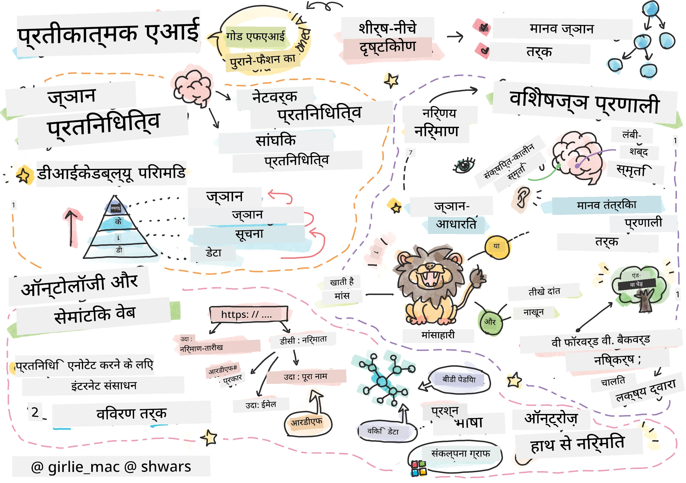
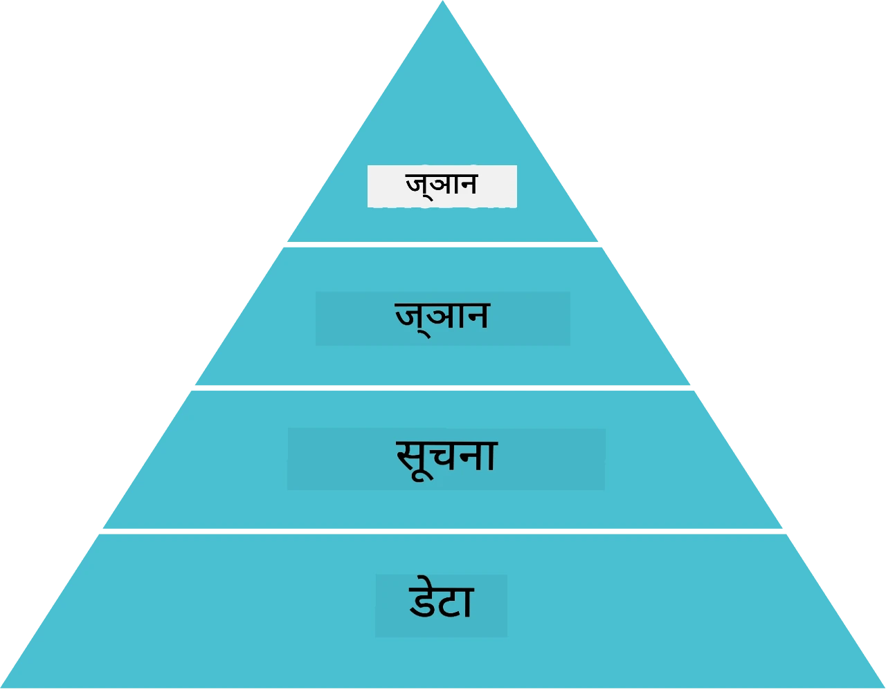
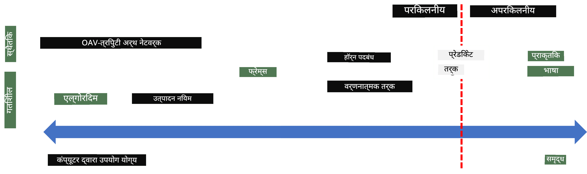
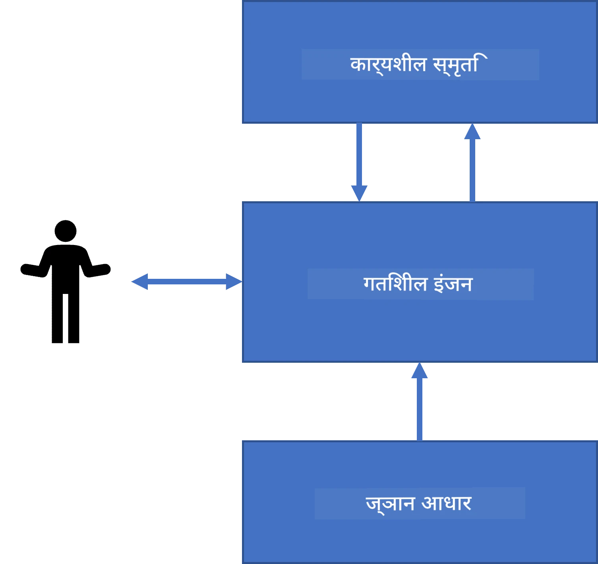
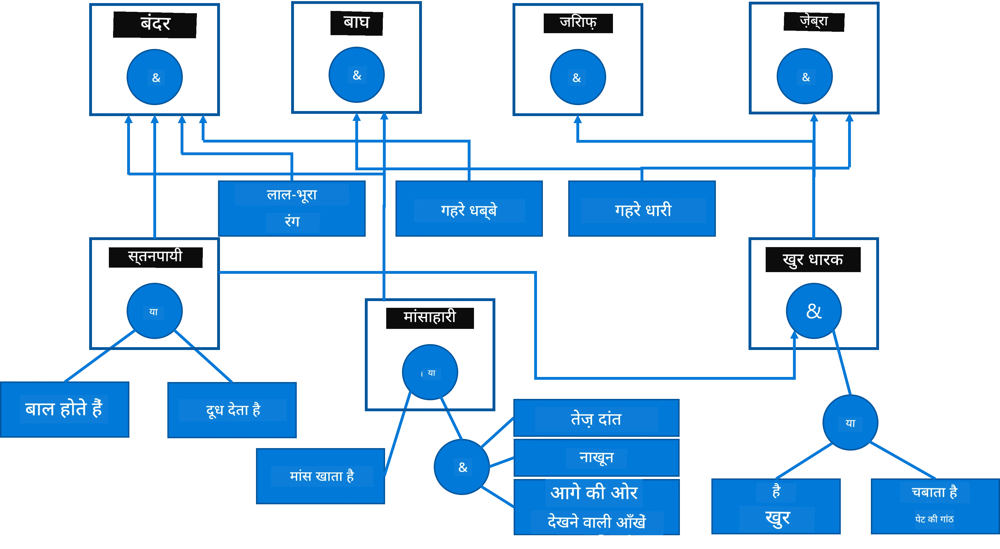
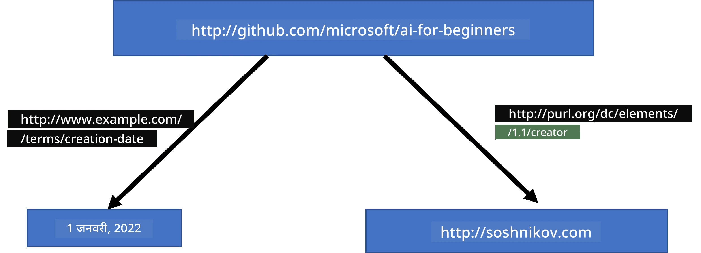
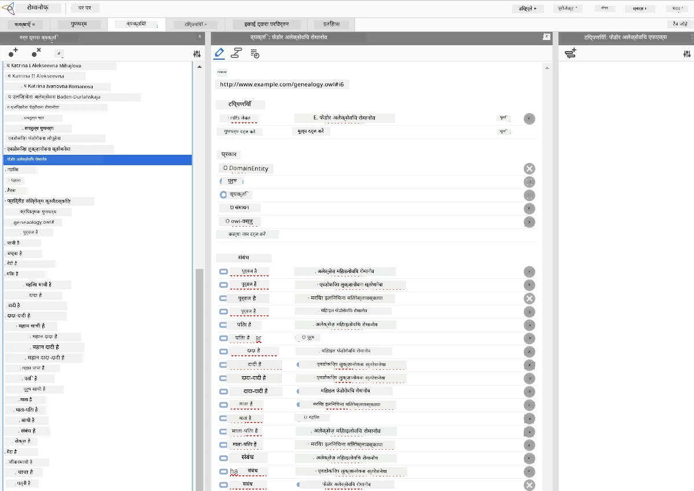

# ज्ञान प्रतिनिधित्व और विशेषज्ञ तंत्र



> स्केचनोट द्वारा [Tomomi Imura](https://twitter.com/girlie_mac)

कृत्रिम बुद्धिमत्ता की खोज ज्ञान की खोज पर आधारित है, ताकि दुनिया को उसी तरह समझा जा सके जैसे मनुष्य करते हैं। लेकिन आप इसे कैसे कर सकते हैं?

## [पूर्व-व्याख्यान परीक्षा](https://ff-quizzes.netlify.app/en/ai/quiz/3)

AI के शुरुआती दिनों में, बुद्धिमान प्रणालियाँ बनाने के लिए शीर्ष-डाउन दृष्टिकोण (पिछले पाठ में चर्चा की गई) लोकप्रिय था। विचार यह था कि लोगों से ज्ञान को मशीन-पठनीय रूप में निकाला जाए, और फिर इसका उपयोग स्वचालित रूप से समस्याओं को हल करने के लिए किया जाए। यह दृष्टिकोण दो बड़े विचारों पर आधारित था:

* ज्ञान प्रतिनिधित्व
* तर्क

## ज्ञान प्रतिनिधित्व

सुंदर AI में एक महत्वपूर्ण अवधारणा है **ज्ञान**। ज्ञान को *सूचना* या *डेटा* से अलग करना महत्वपूर्ण है। उदाहरण के लिए, कोई कह सकता है कि पुस्तकों में ज्ञान होता है, क्योंकि कोई पुस्तक पढ़कर विशेषज्ञ बन सकता है। हालांकि, जो पुस्तकें वास्तव में रखती हैं उसे *डेटा* कहा जाता है, और पुस्तकों को पढ़कर तथा इस डेटा को हमारी विश्व मॉडल में समेकित करके हम इसे ज्ञान में बदलते हैं।

> ✅ **ज्ञान** कुछ ऐसा है जो हमारे सिर में होता है और दुनिया के हमारे समझ का प्रतिनिधित्व करता है। इसे एक सक्रिय **अधिगम** प्रक्रिया के द्वारा प्राप्त किया जाता है, जो हमें जो सूचनाएँ मिलती हैं उन्हें हमारे सक्रिय विश्व मॉडल में समेकित करता है।

अधिकतर, हम सख्ती से ज्ञान को परिभाषित नहीं करते, बल्कि इसे अन्य संबंधित अवधारणाओं के साथ [DIKW पिरामिड](https://en.wikipedia.org/wiki/DIKW_pyramid) का उपयोग करके समायोजित करते हैं। इसमें निम्न अवधारणाएँ शामिल हैं:

* **डेटा** कुछ ऐसा है जो भौतिक माध्यम में प्रदर्शित होता है, जैसे लिखित पाठ या बोले गए शब्द। डेटा मानव से स्वतंत्र रूप से मौजूद होता है और लोगों के बीच पारित किया जा सकता है।
* **जानकारी** वह है जो हम अपने मन में डेटा से व्याख्या करते हैं। उदाहरण के लिए, जब हम शब्द *कंप्यूटर* सुनते हैं, तब हमारे मन में इसकी कुछ समझ होती है।
* **ज्ञान** वह सूचना है जो हमारे विश्व मॉडल में समाहित होती है। उदाहरण के लिए, जब हम सीखते हैं कि कंप्यूटर क्या है, तब हम इसके काम करने के तरीके, इसकी लागत, और इसके उपयोग के बारे में विचार शुरू करते हैं। यह परस्पर जुड़े हुए अवधारणाओं का नेटवर्क हमारे ज्ञान का निर्माण करता है।
* **बुद्धिमत्ता** हमारी दुनिया की समझ का एक और स्तर है, और यह *मेटा-ज्ञान* का प्रतिनिधित्व करता है, यानी यह ज्ञान के उपयोग के बारे में कुछ विचार है कि इसे कब और कैसे प्रयोग करना चाहिए।



*छवि [विकिपीडिया से](https://commons.wikimedia.org/w/index.php?curid=37705247), लांग्लिवथ्यूक्स द्वारा - अपना कार्य, CC BY-SA 4.0*

इसलिए, **ज्ञान प्रतिनिधित्व** की समस्या कुछ प्रभावी तरीके से ज्ञान को कंप्यूटर के अंदर डेटा के रूप में प्रस्तुत करने की है, ताकि इसे स्वचालित रूप से उपयोग किया जा सके। इसे एक स्पेक्ट्रम के रूप में देखा जा सकता है:



> चित्र [Dmitry Soshnikov](http://soshnikov.com) द्वारा

* बाईं ओर, बहुत सरल प्रकार के ज्ञान प्रतिनिधित्व हैं जिन्हें कंप्यूटर प्रभावी रूप से उपयोग कर सकते हैं। सबसे सरल है एल्गोरिदमिक, जहाँ ज्ञान कंप्यूटर प्रोग्राम द्वारा प्रतिनिधित्व किया जाता है। हालांकि, यह ज्ञान को प्रस्तुत करने का सबसे अच्छा तरीका नहीं है क्योंकि यह लचीला नहीं है। हमारे सिर में ज्ञान अक्सर गैर-एल्गोरिदमिक होता है।
* दाईं ओर, प्रतिनिधित्व जैसे प्राकृतिक पाठ हैं। यह सबसे शक्तिशाली है, लेकिन स्वचालित तर्क के लिए उपयोग नहीं किया जा सकता।

> ✅ एक मिनट सोचें कि आप अपने सिर में ज्ञान को कैसे प्रस्तुत करते हैं और इसे नोट्स में कैसे परिवर्तित करते हैं। क्या कोई विशेष प्रारूप है जो आपके लिए स्मरण में सहायता करता है?

## कंप्यूटर ज्ञान प्रतिनिधित्व का वर्गीकरण

हम विभिन्न कंप्यूटर ज्ञान प्रतिनिधित्व विधियों को निम्नलिखित वर्गों में वर्गीकृत कर सकते हैं:

* **नेटवर्क प्रतिनिधित्व** इस तथ्य पर आधारित होते हैं कि हमारे सिर में अवधारणाओं का एक नेटवर्क होता है। हम इसी नेटवर्क को कंप्यूटर के अंदर ग्राफ के रूप में पुन: प्रस्तुत करने की कोशिश कर सकते हैं - इसे कहा जाता है **सामार्थ्य नेटवर्क**।

1. **ऑब्जेक्ट-अट्रिब्यूट-वैल्यू त्रय** या **एट्रिब्यूट-वैल्यू युग्म**। क्योंकि एक ग्राफ को कंप्यूटर में नोड्स और एज की सूची के रूप में प्रस्तुत किया जा सकता है, हम सेमांटिक नेटवर्क को त्रयों की सूची के रूप में प्रदर्शित कर सकते हैं, जिसमें वस्तुएं, गुण और मान होते हैं। उदाहरण के लिए, हम प्रोग्रामिंग भाषाओं के संबंध में निम्नलिखित त्रय बनाते हैं:

वस्तु | गुण | मान
-------|-----------|------
Python | है | अतल-संकलन भाषा
Python | आविष्कार किया | गुइदो वैन रॉसम
Python | ब्लॉक-सिंटैक्स | इंडेंटेशन
अतल-संकलन भाषा | नहीं है | प्रकार परिभाषा

> ✅ सोचें कि त्रयों का उपयोग अन्य प्रकार के ज्ञान को प्रस्तुत करने के लिए कैसे किया जा सकता है।

2. **हायरेरकी प्रतिनिधित्व** इस तथ्य पर जोर देते हैं कि हम अक्सर अपने सिर में वस्तुओं की एक पदानुक्रम बनाते हैं। उदाहरण के लिए, हमें पता है कि कैनरी एक पक्षी है, और सभी पक्षियों के पंख होते हैं। हमारे पास यह भी कुछ विचार होता है कि कैनरी आमतौर पर किस रंग की होती है, और उसकी उड़ान की गति क्या होती है।

   - **फ़्रेम प्रतिनिधित्व** प्रति वस्तु या वस्तु वर्ग को एक **फ़्रेम** के रूप में प्रस्तुत करने पर आधारित है जिसमें **स्लॉट्स** होते हैं। स्लॉट्स में संभावित डिफ़ॉल्ट मान, मान प्रतिबंध, या संग्रहीत प्रक्रियाएं हो सकती हैं जिन्हें कॉल करके स्लॉट का मान प्राप्त किया जा सकता है। सभी फ्रेम एक पदानुक्रम बनाते हैं जो ऑब्जेक्ट-ओरिएंटेड प्रोग्रामिंग भाषाओं में वस्तु पदानुक्रम के समान होता है।
   - **परिदृश्य** विशेष प्रकार के फ्रेम होते हैं जो समय में विकसित होने वाली जटिल परिस्थितियों का प्रतिनिधित्व करते हैं।

**Python**

स्लॉट | मान | डिफ़ॉल्ट मान | अंतराल |
-----|-------|---------------|----------|
नाम | Python | | |
है-एक | अतल-संकलन भाषा | | |
चर केस | | कैमल केस | |
कार्यक्रम लंबाई | | | 5-5000 पंक्तियाँ |
ब्लॉक सिंटैक्स | इंडेंट | | |

3. **प्रक्रियात्मक प्रतिनिधित्व** ज्ञान को क्रियाओं की सूची के रूप में प्रस्तुत करने पर आधारित है, जो तब निष्पादित होती हैं जब कोई विशेष स्थिति उत्पन्न होती है।
   - उत्पादन नियम if-then कथन होते हैं जो निष्कर्ष निकालने की अनुमति देते हैं। उदाहरण के लिए, डॉक्टर के पास एक नियम हो सकता है जिसमें कहा गया है कि **यदि** रोगी को उच्च तेज़ बुखार है **या** रक्त परीक्षण में सी-रिएक्टिव प्रोटीन का स्तर उच्च है, **तो** रोगी को सूजन है। जब हमें इन में से कोई भी शर्त मिलती है, हम सूजन के बारे में निष्कर्ष निकाल सकते हैं, और फिर इसका आगे के तर्क में उपयोग करते हैं।
   - एल्गोरिदम को एक अन्य प्रकार के प्रक्रियात्मक प्रतिनिधित्व माना जा सकता है, हालांकि उन्हें ज्ञान आधारित प्रणालियों में सीधे उपयोग लगभग कभी नहीं किया जाता।

4. **तर्कशास्त्र** मूल रूप से अरस्तू द्वारा सार्वभौमिक मानव ज्ञान प्रस्तुत करने के लिए प्रस्तावित किया गया था।
   - गणितीय सिद्धांत के रूप में प्रेडिकेट लॉजिक बहुत विस्तृत है, इसलिए इसका कुछ उपसमूह आमतौर पर उपयोग किया जाता है, जैसे कि प्रोलॉग में उपयोग किए जाने वाले हॉर्न क्लॉज।
   - डिस्क्रिप्टिव लॉजिक तार्किक प्रणालियों का एक परिवार है जो वस्तुओं की पदानुक्रम और वितरित ज्ञान प्रतिनिधित्व जैसे *सामान्तिक वेब* के विषय में तर्क करने के लिए प्रयोग किया जाता है।

## विशेषज्ञ तंत्र

प्रतीकात्मक AI की प्रारंभिक सफलताओं में से एक थे तथाकथित **विशेषज्ञ तंत्र** - कंप्यूटर प्रणालियाँ जिन्हें किसी सीमित समस्या क्षेत्र में विशेषज्ञ के रूप में कार्य करने के लिए डिज़ाइन किया गया था। वे एक **ज्ञान आधार** पर आधारित थीं जो एक या अधिक मानव विशेषज्ञों से निकाली गई थी, और उनका एक **अनुमान इंजन** था जो उसके ऊपर कुछ तर्क करता था।

 | 
---------------------------------------------|------------------------------------------------
मानव तंत्रिका तंत्र की सरल संरचना | ज्ञान-आधारित प्रणाली की संरचना

विशेषज्ञ तंत्र मानव तर्क प्रणाली की तरह बनाए जाते हैं, जिनमें **लघु-अवधि स्मृति** और **दीर्घ-अवधि स्मृति** होती है। इसी प्रकार, ज्ञान-आधारित प्रणालियों में हम निम्न घटकों को अलग करते हैं:

* **समस्या स्मृति**: इसमे उस समस्या के बारे में ज्ञान होता है जिसे वर्तमान में हल किया जा रहा है, जैसे रोगी का तापमान या रक्तचाप, क्या उसे सूजन है या नहीं, आदि। इस ज्ञान को **स्थैतिक ज्ञान** भी कहा जाता है, क्योंकि इसमें समस्या के बारे में वर्तमान में जो जानकारी है उसका स्नैपशॉट होता है - जिसे *समस्या स्थिति* कहते हैं।
* **ज्ञान आधार**: यह किसी समस्या क्षेत्र के बारे में दीर्घकालिक ज्ञान प्रस्तुत करता है। यह मानव विशेषज्ञों से मैन्युअली निकाला जाता है, और परामर्श से परामर्श बदलता नहीं है। चूंकि यह हमें एक समस्या स्थिति से दूसरी स्थिति में नेविगेट करने देता है, इसे **गतिशील ज्ञान** भी कहा जाता है।
* **अनुमान इंजन**: यह समस्या स्थिति के स्थान में खोज की पूरी प्रक्रिया का संचालन करता है, आवश्यकता पड़ने पर उपयोगकर्ता से प्रश्न पूछता है। यह प्रत्येक स्थिति पर लागू होने वाले सही नियम खोजने के लिए भी जिम्मेदार होता है।

उदाहरण के लिए, जानवर की शारीरिक विशेषताओं के आधार पर पहचान करने वाली निम्न विशेषज्ञ प्रणाली पर विचार करें:



> चित्र [Dmitry Soshnikov](http://soshnikov.com) द्वारा

यह आरेख **AND-OR ट्री** कहलाता है, और यह उत्पादन नियमों के एक सेट का ग्राफिकल प्रतिनिधित्व है। विशेषज्ञ से ज्ञान निकालने के शुरुआत में ट्री बनाना उपयोगी होता है। कंप्यूटर के अंदर ज्ञान प्रस्तुत करने के लिए नियमों का उपयोग करना अधिक सुविधाजनक होता है:

```
IF the animal eats meat
OR (animal has sharp teeth
    AND animal has claws
    AND animal has forward-looking eyes
) 
THEN the animal is a carnivore
```

आप देख सकते हैं कि नियम के बाएँ हाथ की प्रत्येक शर्त और क्रिया मूल रूप से ऑब्जेक्ट-अट्रिब्यूट-वैल्यू (OAV) त्रय हैं। **कार्य स्मृति** में OAV त्रयों का सेट होता है जो वर्तमान में हल की जा रही समस्या के अनुरूप होता है। **नियम इंजन** ऐसे नियम खोजता है जिनकी शर्त पूरी होती है और उन्हें लागू करता है, कार्य स्मृति में एक अन्य त्रय जोड़ता है।

> ✅ अपनी पसंद के विषय पर अपना AND-OR ट्री बनाएं!

### अग्रिम और प्रतिगामी अनुमान

ऊपर वर्णित प्रक्रिया को **अग्रिम अनुमान** कहते हैं। यह समस्या के बारे में कुछ प्रारंभिक डेटा के साथ कार्य स्मृति में शुरू होती है, और फिर निम्नलिखित तर्क चक्र निष्पादित करती है:

1. यदि लक्षित गुण (target attribute) कार्य स्मृति में मौजूद है - रोकें और परिणाम दें
2. उन सभी नियमों को खोजें जिनकी शर्त वर्तमान में पूरी हो चुकी है - **विरोध सेट** प्राप्त करें।
3. **विरोध निर्णय** करें - एक नियम चुनें जिसे इस चरण में निष्पादित किया जाएगा। विरोध निर्णय की विभिन्न रणनीतियाँ हो सकती हैं:
   - ज्ञान आधार में पहला उपयुक्त नियम चुनें
   - एक यादृच्छिक नियम चुनें
   - एक *अधिक विशिष्ट* नियम चुनें, यानी जो "बाएं हाथ" (LHS) में सबसे अधिक शर्तों पर खरा उतरता हो
4. चयनित नियम लागू करें और समस्या स्थिति में नया ज्ञान जोड़ें
5. चरण 1 से दोहराएं।

हालांकि, कुछ मामलों में हम समस्या के बारे में खाली ज्ञान से शुरू करना चाह सकते हैं, और ऐसे प्रश्न पूछना चाहते हैं जो हमें निष्कर्ष तक पहुंचाएं। उदाहरण के लिए, चिकित्सा निदान करते समय, हम आमतौर पर रोगी का निदान शुरू करने से पहले सारी जांच नहीं करते। हम उस समय जांच करते हैं जब निर्णय लेना आवश्यक होता है।

इस प्रक्रिया को **प्रतिगामी अनुमान** का उपयोग करके मॉडल किया जा सकता है। इसे **लक्ष्य** द्वारा संचालित किया जाता है - वह गुण मान जिसे हम ढूँढ़ रहे हैं:

1. सभी ऐसे नियम चुनें जो हमें लक्ष्य का मान दे सकते हैं (अर्थात् लक्ष्य RHS ("दाएँ हाथ") पर हो) - विरोध सेट
1. यदि इस गुण के लिए कोई नियम नहीं है, या कोई नियम कहता है कि इस मान के लिए उपयोगकर्ता से पूछा जाना चाहिए - तो पूछें, अन्यथा:
1. विरोध निर्णय रणनीति का उपयोग करके एक नियम चुनें जिसे हम *परिकल्पना* के रूप में उपयोग करेंगे - हम इसे साबित करने की कोशिश करेंगे
1. नियम के LHS के सभी गुणों के लिए पुनरावृत्त रूप से प्रक्रिया दोहराएं, उन्हें लक्ष्यों के रूप में साबित करने की कोशिश करते हुए
1. यदि कहीं भी प्रक्रिया असफल होती है - तो चरण 3 में कोई दूसरा नियम चुनें।

> ✅ किन परिस्थितियों में अग्रिम अनुमान अधिक उपयुक्त होता है? और प्रतिगामी अनुमान के लिए क्या कहेंगे?

### विशेषज्ञ तंत्र का कार्यान्वयन

विशेषज्ञ तंत्र को विभिन्न उपकरणों का उपयोग करके लागू किया जा सकता है:

* किसी उच्च स्तरीय प्रोग्रामिंग भाषा में सीधे प्रोग्राम करना। यह सबसे अच्छा विचार नहीं है, क्योंकि ज्ञान आधारित प्रणाली का मुख्य लाभ यह है कि ज्ञान और अनुमान अलग होते हैं, और संभावित रूप से समस्या क्षेत्र के विशेषज्ञ को अनुमान प्रक्रिया के विवरण को समझे बिना नियम लिखने में सक्षम होना चाहिए।
* **विशेषज्ञ तंत्र शेल** का उपयोग करना, यानी एक ऐसी प्रणाली जो विशेष रूप से कुछ ज्ञान प्रतिनिधित्व भाषा का उपयोग करके ज्ञान से भरी जा सके।

## ✍️ अभ्यास: पशु अनुमान

आगे की जानकारी के लिए [Animals.ipynb](https://github.com/microsoft/AI-For-Beginners/blob/main/lessons/2-Symbolic/Animals.ipynb) देखें, जिसमें अग्रिम और प्रतिगामी अनुमान विशेषज्ञ तंत्र को लागू करने का उदाहरण है।

> **सूचना**: यह उदाहरण काफी सरल है, और केवल यह विचार देता है कि एक विशेषज्ञ तंत्र कैसा दिखता है। जैसे ही आप ऐसी प्रणाली बनाने लगते हैं, आप केवल लगभग 200+ नियमों की संख्या तक पहुँचने के बाद ही इससे कुछ *बुद्धिमत्तापूर्ण* व्यवहार देखेंगे। एक बिंदु पर, नियम इतने जटिल हो जाते हैं कि उन्हें याद रखना कठिन हो जाता है, और उस समय आप सोचने लगते हैं कि सिस्टम कुछ निर्णय क्यों ले रहा है। हालांकि, ज्ञान आधारित प्रणालियों की महत्वपूर्ण विशेषता यह है कि आप हमेशा ठीक-ठीक समझा सकते हैं कि कोई भी निर्णय कैसे लिया गया।

## ऑंटोलॉजी और सामान्तिक वेब

20वीं सदी के अंत में एक पहल हुई जिसमें ज्ञान प्रतिनिधित्व का उपयोग इंटरनेट संसाधनों को एनोटेट करने के लिए किया गया, ताकि बहुत विशिष्ट प्रश्नों के अनुरूप संसाधन ढूंढना संभव हो सके। इस आंदोलन को **सामान्तिक वेब** कहा गया, और यह कई अवधारणाओं पर आधारित था:

- **[डिस्क्रिप्शन लॉजिक](https://en.wikipedia.org/wiki/Description_logic)** (DL) पर आधारित एक विशेष ज्ञान प्रतिनिधित्व। यह फ्रेम ज्ञान प्रतिनिधित्व के समान है, क्योंकि यह गुणों वाले वस्तुओं की पदानुक्रम बनाता है, लेकिन इसका औपचारिक तार्किक अर्थ है और अनुमान लागू करता है। DL का एक पूरा परिवार है जो अभिव्यक्तिशीलता और अनुमान की एल्गोरिदमिक जटिलता के बीच संतुलन करता है।
- वितरित ज्ञान प्रतिनिधित्व, जहाँ सभी अवधारणाओं को एक वैश्विक URI पहचानकर्ता द्वारा प्रदर्शित किया जाता है, जिससे इंटरनेट पर फैली ज्ञान पदानुक्रम बनाना संभव होता है।
- ज्ञान वर्णन के लिए XML-आधारित भाषाओं का एक परिवार: RDF (Resource Description Framework), RDFS (RDF Schema), OWL (Ontology Web Language)।

सेमांटिक वेब में एक मुख्य अवधारणा है **ऑन्टोलॉजी**। इसका मतलब है किसी समस्या क्षेत्र का कुछ औपचारिक ज्ञान प्रतिनिधित्व का उपयोग करके स्पष्ट विनिर्देशन। सबसे सरल ऑन्टोलॉजी सिर्फ समस्या क्षेत्र में वस्तुओं की एक पदानुक्रम हो सकती है, लेकिन अधिक जटिल ऑन्टोलॉजी में नियम शामिल होंगे जिन्हें अनुमान के लिए उपयोग किया जा सकता है।

सेमांटिक वेब में, सभी प्रतिनिधित्व ट्रिपलेट्स पर आधारित हैं। प्रत्येक वस्तु और प्रत्येक संबंध को यूनिक रूप से URI द्वारा पहचाना जाता है। उदाहरण के लिए, यदि हम यह तथ्य व्यक्त करना चाहते हैं कि इस AI करिकुलम को Dmitry Soshnikov ने 1 जनवरी, 2022 को विकसित किया है - तो हम उपयोग कर सकते हैं निम्न ट्रिपलेट्स:



```
http://github.com/microsoft/ai-for-beginners http://www.example.com/terms/creation-date “Jan 1, 2022”
http://github.com/microsoft/ai-for-beginners http://purl.org/dc/elements/1.1/creator http://soshnikov.com
```

> ✅ यहां `http://www.example.com/terms/creation-date` और `http://purl.org/dc/elements/1.1/creator` कुछ प्रसिद्ध और सार्वभौमिक रूप से स्वीकार किए गए URI हैं जो *creator* और *creation date* की अवधारणाओं को व्यक्त करते हैं।

एक अधिक जटिल मामले में, यदि हम स्रष्टाओं की सूची परिभाषित करना चाहते हैं, तो हम RDF में परिभाषित कुछ डेटा संरचनाओं का उपयोग कर सकते हैं।


> उपरोक्त आरेख [Dmitry Soshnikov](http://soshnikov.com) द्वारा

सेमांटिक वेब के विकास की गति खोज इंजन और प्राकृतिक भाषा प्रसंस्करण तकनीकों की सफलता से कुछ हद तक धीमी हुई, जो टेक्स्ट से संरचित डेटा निकालने की अनुमति देती हैं। हालांकि, कुछ क्षेत्रों में अभी भी ऑन्टोलॉजी और ज्ञान आधार बनाए रखने के लिए महत्वपूर्ण प्रयास हो रहे हैं। कुछ उल्लेखनीय प्रोजेक्ट्स:

* [WikiData](https://wikidata.org/) विकिपीडिया से जुड़े मशीन-पठनीय ज्ञान आधारित का संग्रह है। अधिकांश डेटा विकिपीडिया *InfoBoxes* से निकाला जाता है, जो विकिपीडिया पृष्ठों के अंदर संरचित सामग्री के टुकड़े होते हैं। आप SPARQL में विकिडाटा [query](https://query.wikidata.org/) कर सकते हैं, जो सेमांटिक वेब के लिए एक विशेष क्वेरी भाषा है। यहाँ एक नमूना क्वेरी है जो मानवों में सबसे सामान्य आंखों के रंग दर्शाती है:

```sparql
#defaultView:BubbleChart
SELECT ?eyeColorLabel (COUNT(?human) AS ?count)
WHERE
{
  ?human wdt:P31 wd:Q5.       # human instance-of homo sapiens
  ?human wdt:P1340 ?eyeColor. # human eye-color ?eyeColor
  SERVICE wikibase:label { bd:serviceParam wikibase:language "en". }
}
GROUP BY ?eyeColorLabel
```

* [DBpedia](https://www.dbpedia.org/) भी WikiData के समान एक प्रयास है।

> ✅ यदि आप अपनी खुद की ऑन्टोलॉजी बनाने या मौजूदा ऑन्टोलॉजियों को खोलने का प्रयोग करना चाहते हैं, तो एक शानदार दृश्य ऑन्टोलॉजी संपादक है जिसे [Protégé](https://protege.stanford.edu/) कहा जाता है। इसे डाउनलोड करें, या ऑनलाइन उपयोग करें।



*Web Protégé संपादक रोमानोव परिवार ऑन्टोलॉजी के साथ खुला है। स्क्रीनशॉट Dmitry Soshnikov द्वारा*

## ✍️ अभ्यास: एक परिवार ऑन्टोलॉजी

सेमांटिक वेब तकनीकों का उपयोग कर परिवार के रिश्तों को तर्कसंगत बनाने का उदाहरण देखने के लिए [FamilyOntology.ipynb](https://github.com/Ezana135/AI-For-Beginners/blob/main/lessons/2-Symbolic/FamilyOntology.ipynb) देखें। हम सामान्य GEDCOM फॉर्मेट में प्रस्तुत परिवार वृक्ष और परिवारिक संबंधों का एक ऑन्टोलॉजी लेंगे और दिए गए व्यक्तियों के लिए सभी पारिवारिक संबंधों का ग्राफ बनाएंगे।

## माइक्रोसॉफ्ट कॉन्सेप्ट ग्राफ

अधिकांश मामलों में, ऑन्टोलॉजी हाथ से सावधानीपूर्वक बनाई जाती हैं। हालांकि, यह भी संभव है कि **खनन** किया जाए ऑन्टोलॉजी को असंरचित डेटा से, जैसे प्राकृतिक भाषा के पाठ से।

ऐसा एक प्रयास माइक्रोसॉफ्ट रिसर्च द्वारा किया गया था, जिससे [Microsoft Concept Graph](https://blogs.microsoft.com/ai/microsoft-researchers-release-graph-that-helps-machines-conceptualize/?WT.mc_id=academic-77998-cacaste) बना।

यह इकाइयों का बड़ा संग्रह है जो `is-a` उत्तराधिकार सम्बन्ध का उपयोग करके समूहबद्ध की गई हैं। यह प्रकार के प्रश्नों का उत्तर देने में सक्षम है "Microsoft क्या है?" - उत्तर कुछ ऐसा होगा "एक कंपनी संभावना 0.87 के साथ, और एक ब्रांड संभावना 0.75 के साथ"।

ग्राफ REST API के रूप में उपलब्ध है, या एक बड़ा डाउनलोड करने योग्य टेक्स्ट फ़ाइल के रूप में जो सभी इकाई जोड़ियों को सूचीबद्ध करता है।

## ✍️ अभ्यास: एक कॉन्सेप्ट ग्राफ

देखें [MSConceptGraph.ipynb](https://github.com/microsoft/AI-For-Beginners/blob/main/lessons/2-Symbolic/MSConceptGraph.ipynb) नोटबुक यह देखने के लिए कि कैसे हम Microsoft Concept Graph का उपयोग समाचार artikle को कई वर्गों में समूहबद्ध करने के लिए कर सकते हैं।

## निष्कर्ष

आजकल, AI को अक्सर *मशीन लर्निंग* या *न्यूरल नेटवर्क* के पर्याय के रूप में माना जाता है। हालांकि, एक मानव भी स्पष्ट तर्कशीलता प्रदर्शित करता है, जो कुछ ऐसा है जिसे वर्तमान में न्यूरल नेटवर्क संभाल नहीं पा रहे हैं। असली दुनिया की परियोजनाओं में, स्पष्ट तर्कशीलता का अभी भी उपयोग किया जाता है उन कार्यों को करने के लिए जिनके लिए स्पष्टीकरण आवश्यक होते हैं, या सिस्टम के व्यवहार को नियंत्रित तरीके से संशोधित करने की क्षमता हो।

## 🚀 चुनौती

इस पाठ से जुड़े परिवार ऑन्टोलॉजी नोटबुक में, अन्य पारिवारिक संबंधों के साथทดลอง करने का अवसर है। परिवार वृक्ष में लोगों के बीच नए संबंध खोजने की कोशिश करें।

## [पाठ के बाद प्रश्नोत्तरी](https://ff-quizzes.netlify.app/en/ai/quiz/4)

## समीक्षा और आत्म-अध्ययन

इंटरनेट पर कुछ खोज करें कि ऐसे कौन से क्षेत्र हैं जहां मनुष्यों ने ज्ञान को मापने और संहिताबद्ध करने का प्रयास किया है। Bloom's Taxonomy देखें, और इतिहास में जाएं यह सीखने के लिए कि मनुष्यों ने अपने संसार को समझने की कोशिश कैसे की। Linnaeus के कार्य को देखें जो जीवों की टैक्सोनॉमी बनाने के लिए था, और देखें कि Dmitri Mendeleev ने रासायनिक तत्वों का वर्णन और वर्गीकरण करने का तरीका कैसे बनाया। आप और कौन से रोचक उदाहरण पा सकते हैं?

**आसाइन्मेंट**: [ऑन्टोलॉजी बनाएं](assignment.md)

---

<!-- CO-OP TRANSLATOR DISCLAIMER START -->
**अस्वीकरण**:  
इस दस्तावेज़ का अनुवाद AI अनुवाद सेवा [Co-op Translator](https://github.com/Azure/co-op-translator) का उपयोग करके किया गया है। जबकि हम सटीकता के लिए प्रयासरत हैं, कृपया ध्यान दें कि स्वचालित अनुवादों में त्रुटियाँ या असत्यमयताएँ हो सकती हैं। मूल दस्तावेज़ को उसकी मूल भाषा में प्राधिकृत स्रोत माना जाना चाहिए। महत्वपूर्ण जानकारी के लिए, पेशेवर मानव अनुवाद की सिफारिश की जाती है। इस अनुवाद के उपयोग से उत्पन्न किसी भी गलतफहमी या मिथ्या व्याख्या के लिए हम जिम्मेदार नहीं हैं।
<!-- CO-OP TRANSLATOR DISCLAIMER END -->