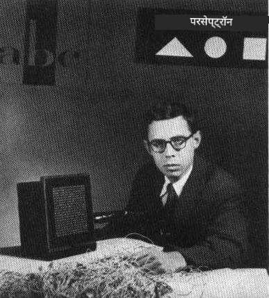

# न्यूरल नेटवर्क का परिचय: परसेप्ट्रॉन

## [प्री-लेक्चर क्विज़](https://ff-quizzes.netlify.app/en/ai/quiz/5)

आधुनिक न्यूरल नेटवर्क जैसा कुछ बनाने का पहला प्रयास 1957 में कॉर्नेल एरोनॉटिकल लैबोरेटरी के फ्रैंक रोसेनब्लाट द्वारा किया गया था। यह एक हार्डवेयर इम्प्लीमेंटेशन था जिसे "मार्क-1" कहा गया, और इसे त्रिभुज, वर्ग और वृत्त जैसे आदिम ज्यामितीय आकृतियों को पहचानने के लिए डिज़ाइन किया गया था।

|      |      |
|--------------|-----------|
| | |

> चित्र [विकिपीडिया से](https://en.wikipedia.org/wiki/Perceptron)

इनपुट इमेज को 20x20 फोटोसेल ऐरे द्वारा दर्शाया गया था, इसलिए न्यूरल नेटवर्क में 400 इनपुट और एक बाइनरी आउटपुट था। एक साधारण नेटवर्क में एक न्यूरॉन होता था, जिसे **थ्रेशोल्ड लॉजिक यूनिट** भी कहा जाता है। न्यूरल नेटवर्क के वेट्स पोटेंशियोमीटर की तरह काम करते थे, जिन्हें प्रशिक्षण चरण के दौरान मैन्युअल रूप से समायोजित करना पड़ता था।

> ✅ पोटेंशियोमीटर एक उपकरण है जो उपयोगकर्ता को सर्किट की प्रतिरोध को समायोजित करने की अनुमति देता है।

> उस समय न्यूयॉर्क टाइम्स ने परसेप्ट्रॉन के बारे में लिखा: *एक इलेक्ट्रॉनिक कंप्यूटर का भ्रूण जिसे [नौसेना] उम्मीद करती है कि वह चल सकेगा, बात कर सकेगा, देख सकेगा, लिख सकेगा, खुद को पुन: उत्पन्न कर सकेगा और अपने अस्तित्व के प्रति जागरूक हो सकेगा।*

## परसेप्ट्रॉन मॉडल

मान लीजिए हमारे मॉडल में N फीचर्स हैं, इस स्थिति में इनपुट वेक्टर N आकार का एक वेक्टर होगा। परसेप्ट्रॉन एक **बाइनरी क्लासिफिकेशन** मॉडल है, यानी यह इनपुट डेटा के दो वर्गों के बीच अंतर कर सकता है। हम मानते हैं कि प्रत्येक इनपुट वेक्टर x के लिए हमारे परसेप्ट्रॉन का आउटपुट या तो +1 या -1 होगा, वर्ग के आधार पर। आउटपुट निम्नलिखित सूत्र का उपयोग करके गणना किया जाएगा:

y(x) = f(w<sup>T</sup>x)

जहां f एक स्टेप एक्टिवेशन फंक्शन है

<!-- img src="http://www.sciweavers.org/tex2img.php?eq=f%28x%29%20%3D%20%5Cbegin%7Bcases%7D%0A%20%20%20%20%20%20%20%20%20%2B1%20%26%20x%20%5Cgeq%200%20%5C%5C%0A%20%20%20%20%20%20%20%20%20-1%20%26%20x%20%3C%200%0A%20%20%20%20%20%20%20%5Cend%7Bcases%7D%20%5C%5C%0A&bc=White&fc=Black&im=jpg&fs=12&ff=arev&edit=0" align="center" border="0" alt="f(x) = \begin{cases} +1 & x \geq 0 \\ -1 & x < 0 \end{cases} \\" width="154" height="50" / -->


## परसेप्ट्रॉन को प्रशिक्षित करना

परसेप्ट्रॉन को प्रशिक्षित करने के लिए हमें एक वेट्स वेक्टर w ढूंढना होगा जो अधिकांश मानों को सही तरीके से वर्गीकृत करे, यानी सबसे कम **त्रुटि** उत्पन्न करे। यह त्रुटि E को **परसेप्ट्रॉन क्राइटेरिया** द्वारा निम्नलिखित तरीके से परिभाषित किया गया है:

E(w) = -&sum;w<sup>T</sup>x<sub>i</sub>t<sub>i</sub>

जहां:

* योग उन प्रशिक्षण डेटा पॉइंट्स i पर लिया जाता है जो गलत वर्गीकरण का परिणाम देते हैं
* x<sub>i</sub> इनपुट डेटा है, और t<sub>i</sub> नकारात्मक और सकारात्मक उदाहरणों के लिए क्रमशः -1 या +1 है।

इस मानदंड को वेट्स w के एक फंक्शन के रूप में माना जाता है, और हमें इसे न्यूनतम करना होता है। अक्सर, एक विधि जिसे **ग्रेडिएंट डिसेंट** कहा जाता है, का उपयोग किया जाता है, जिसमें हम कुछ प्रारंभिक वेट्स w<sup>(0)</sup> से शुरू करते हैं, और फिर प्रत्येक चरण में वेट्स को निम्नलिखित सूत्र के अनुसार अपडेट करते हैं:

w<sup>(t+1)</sup> = w<sup>(t)</sup> - &eta;&nabla;E(w)

यहां &eta; को **लर्निंग रेट** कहा जाता है, और &nabla;E(w) E का **ग्रेडिएंट** दर्शाता है। ग्रेडिएंट की गणना करने के बाद, हमें मिलता है:

w<sup>(t+1)</sup> = w<sup>(t)</sup> + &sum;&eta;x<sub>i</sub>t<sub>i</sub>

Python में एल्गोरिदम इस प्रकार दिखता है:

```python
def train(positive_examples, negative_examples, num_iterations = 100, eta = 1):

    weights = [0,0,0] # Initialize weights (almost randomly :)
        
    for i in range(num_iterations):
        pos = random.choice(positive_examples)
        neg = random.choice(negative_examples)

        z = np.dot(pos, weights) # compute perceptron output
        if z < 0: # positive example classified as negative
            weights = weights + eta*weights.shape

        z  = np.dot(neg, weights)
        if z >= 0: # negative example classified as positive
            weights = weights - eta*weights.shape

    return weights
```


## निष्कर्ष

इस पाठ में, आपने परसेप्ट्रॉन के बारे में सीखा, जो एक बाइनरी क्लासिफिकेशन मॉडल है, और इसे वेट्स वेक्टर का उपयोग करके कैसे प्रशिक्षित किया जाता है।

## 🚀 चुनौती

यदि आप अपना खुद का परसेप्ट्रॉन बनाना चाहते हैं, तो [Microsoft Learn पर इस लैब](https://docs.microsoft.com/en-us/azure/machine-learning/component-reference/two-class-averaged-perceptron?WT.mc_id=academic-77998-cacaste) को आज़माएं, जो [Azure ML डिज़ाइनर](https://docs.microsoft.com/en-us/azure/machine-learning/concept-designer?WT.mc_id=academic-77998-cacaste) का उपयोग करता है।

## [पोस्ट-लेक्चर क्विज़](https://ff-quizzes.netlify.app/en/ai/quiz/6)

## समीक्षा और स्व-अध्ययन

यह देखने के लिए कि हम परसेप्ट्रॉन का उपयोग खिलौना समस्या और वास्तविक जीवन की समस्याओं को हल करने के लिए कैसे कर सकते हैं, और सीखना जारी रखने के लिए - [Perceptron](Perceptron.ipynb) नोटबुक पर जाएं।

यहां परसेप्ट्रॉन के बारे में एक दिलचस्प [लेख](https://towardsdatascience.com/what-is-a-perceptron-basics-of-neural-networks-c4cfea20c590) भी है।

## [असाइनमेंट](lab/README.md)

इस पाठ में, हमने बाइनरी क्लासिफिकेशन कार्य के लिए एक परसेप्ट्रॉन को लागू किया है, और इसका उपयोग दो हस्तलिखित अंकों के बीच वर्गीकरण करने के लिए किया है। इस लैब में, आपसे पूरी तरह से अंकों के वर्गीकरण की समस्या को हल करने के लिए कहा गया है, यानी यह निर्धारित करना कि दिए गए चित्र के लिए कौन सा अंक सबसे अधिक संभावना है।

* [निर्देश](lab/README.md)
* [नोटबुक](lab/PerceptronMultiClass.ipynb)

---

