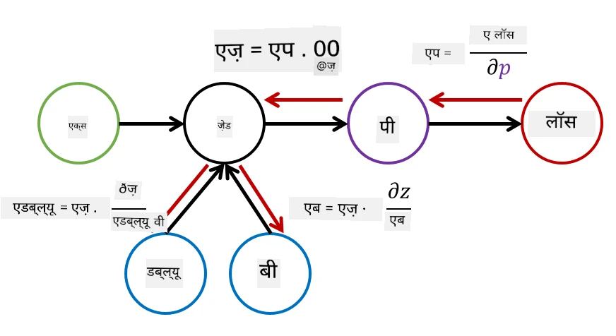

# न्यूरल नेटवर्क का परिचय: मल्टी-लेयर्ड परसेप्ट्रॉन

पिछले भाग में, आपने सबसे सरल न्यूरल नेटवर्क मॉडल - एक-लेयर परसेप्ट्रॉन, एक रेखीय दो-वर्ग वर्गीकरण मॉडल के बारे में सीखा।

इस भाग में हम इस मॉडल को एक अधिक लचीले ढांचे में विस्तारित करेंगे, जिससे हम:

* **मल्टी-क्लास वर्गीकरण** के साथ-साथ दो-वर्ग वर्गीकरण कर सकें  
* **रिग्रेशन समस्याओं** को हल कर सकें, वर्गीकरण के अलावा  
* उन वर्गों को अलग कर सकें जो रेखीय रूप से अलग नहीं हैं  

हम Python में अपना खुद का मॉड्यूलर फ्रेमवर्क भी विकसित करेंगे, जो हमें विभिन्न न्यूरल नेटवर्क आर्किटेक्चर बनाने की अनुमति देगा।

## [प्री-लेक्चर क्विज़](https://ff-quizzes.netlify.app/en/ai/quiz/7)

## मशीन लर्निंग का औपचारिककरण

आइए मशीन लर्निंग समस्या को औपचारिक रूप से समझते हैं। मान लीजिए हमारे पास एक प्रशिक्षण डेटा सेट **X** है, जिसमें लेबल **Y** हैं, और हमें एक मॉडल *f* बनाना है जो सबसे सटीक भविष्यवाणियां करेगा। भविष्यवाणियों की गुणवत्ता को **लॉस फंक्शन** &lagran; द्वारा मापा जाता है। निम्नलिखित लॉस फंक्शन अक्सर उपयोग किए जाते हैं:

* रिग्रेशन समस्या के लिए, जब हमें एक संख्या की भविष्यवाणी करनी होती है, हम **एब्सोल्यूट एरर** &sum;i|f(x(i))-y(i)|, या **स्क्वेयर्ड एरर** &sum;i(f(x(i))-y(i))2 का उपयोग कर सकते हैं।  
* वर्गीकरण के लिए, हम **0-1 लॉस** (जो मूल रूप से मॉडल की **सटीकता** के समान है), या **लॉजिस्टिक लॉस** का उपयोग करते हैं।  

एक-स्तरीय परसेप्ट्रॉन के लिए, फंक्शन *f* को एक रेखीय फंक्शन *f(x)=wx+b* के रूप में परिभाषित किया गया था (यहां *w* वेट मैट्रिक्स है, *x* इनपुट फीचर्स का वेक्टर है, और *b* बायस वेक्टर है)। विभिन्न न्यूरल नेटवर्क आर्किटेक्चर के लिए, यह फंक्शन अधिक जटिल रूप ले सकता है।

> वर्गीकरण के मामले में, अक्सर यह वांछनीय होता है कि नेटवर्क आउटपुट के रूप में संबंधित वर्गों की संभावनाएं प्राप्त हों। किसी भी संख्या को संभावनाओं में बदलने के लिए (जैसे आउटपुट को सामान्यीकृत करने के लिए), हम अक्सर **सॉफ्टमैक्स** फंक्शन &sigma; का उपयोग करते हैं, और फंक्शन *f* बन जाता है *f(x)=&sigma;(wx+b)*।

ऊपर *f* की परिभाषा में, *w* और *b* को **पैरामीटर** &theta;=⟨*w,b*⟩ कहा जाता है। दिए गए डेटा सेट ⟨**X**,**Y**⟩ के आधार पर, हम पूरे डेटा सेट पर समग्र त्रुटि को पैरामीटर &theta; के एक फंक्शन के रूप में गणना कर सकते हैं।

> ✅ **न्यूरल नेटवर्क प्रशिक्षण का लक्ष्य त्रुटि को कम करना है, जो पैरामीटर &theta; को बदलकर किया जाता है।**

## ग्रेडिएंट डिसेंट ऑप्टिमाइजेशन

फंक्शन ऑप्टिमाइजेशन का एक प्रसिद्ध तरीका **ग्रेडिएंट डिसेंट** है। इसका विचार यह है कि हम लॉस फंक्शन का डेरिवेटिव (बहु-आयामी मामले में इसे **ग्रेडिएंट** कहा जाता है) पैरामीटर के संबंध में गणना कर सकते हैं, और पैरामीटर को इस तरह से बदल सकते हैं कि त्रुटि कम हो जाए। इसे निम्नलिखित रूप में औपचारिक किया जा सकता है:

* पैरामीटर को कुछ रैंडम मानों w(0), b(0) से प्रारंभ करें।  
* निम्नलिखित चरण को कई बार दोहराएं:  
    - w(i+1) = w(i)-&eta;&part;&lagran;/&part;w  
    - b(i+1) = b(i)-&eta;&part;&lagran;/&part;b  

प्रशिक्षण के दौरान, ऑप्टिमाइजेशन चरण पूरे डेटा सेट को ध्यान में रखते हुए गणना किए जाने चाहिए (याद रखें कि लॉस सभी प्रशिक्षण नमूनों के माध्यम से योग के रूप में गणना की जाती है)। हालांकि, वास्तविक जीवन में हम डेटा सेट के छोटे हिस्सों को लेते हैं जिन्हें **मिनीबैचेस** कहा जाता है, और डेटा के एक उपसमुच्चय के आधार पर ग्रेडिएंट्स की गणना करते हैं। क्योंकि उपसमुच्चय हर बार रैंडम रूप से लिया जाता है, इस विधि को **स्टोकेस्टिक ग्रेडिएंट डिसेंट** (SGD) कहा जाता है।

## मल्टी-लेयर्ड परसेप्ट्रॉन और बैकप्रोपेगेशन

जैसा कि हमने ऊपर देखा, एक-लेयर नेटवर्क रेखीय रूप से अलग वर्गों को वर्गीकृत करने में सक्षम है। एक अधिक समृद्ध मॉडल बनाने के लिए, हम नेटवर्क की कई लेयर्स को जोड़ सकते हैं। गणितीय रूप से इसका मतलब होगा कि फंक्शन *f* का रूप अधिक जटिल होगा, और इसे कई चरणों में गणना किया जाएगा:
* z1=w1x+b1  
* z2=w2&alpha;(z1)+b2  
* f = &sigma;(z2)  

यहां, &alpha; एक **नॉन-लाइनियर एक्टिवेशन फंक्शन** है, &sigma; एक सॉफ्टमैक्स फंक्शन है, और पैरामीटर &theta;=<*w1,b1,w2,b2*> हैं।

ग्रेडिएंट डिसेंट एल्गोरिदम वही रहेगा, लेकिन ग्रेडिएंट्स की गणना करना अधिक कठिन होगा। चेन डिफरेंशिएशन नियम को ध्यान में रखते हुए, हम डेरिवेटिव्स को निम्नलिखित रूप में गणना कर सकते हैं:

* &part;&lagran;/&part;w2 = (&part;&lagran;/&part;&sigma;)(&part;&sigma;/&part;z2)(&part;z2/&part;w2)  
* &part;&lagran;/&part;w1 = (&part;&lagran;/&part;&sigma;)(&part;&sigma;/&part;z2)(&part;z2/&part;&alpha;)(&part;&alpha;/&part;z1)(&part;z1/&part;w1)  

> ✅ लॉस फंक्शन के संबंध में पैरामीटर के डेरिवेटिव्स की गणना करने के लिए चेन डिफरेंशिएशन नियम का उपयोग किया जाता है।

ध्यान दें कि इन सभी अभिव्यक्तियों का बायां भाग समान है, और इसलिए हम प्रभावी रूप से लॉस फंक्शन से शुरू करके और "पीछे की ओर" कम्प्यूटेशनल ग्राफ के माध्यम से डेरिवेटिव्स की गणना कर सकते हैं। इस प्रकार मल्टी-लेयर्ड परसेप्ट्रॉन को प्रशिक्षित करने की विधि को **बैकप्रोपेगेशन**, या 'बैकप्रॉप' कहा जाता है।

> TODO: इमेज का संदर्भ

> ✅ हम अपने नोटबुक उदाहरण में बैकप्रॉप को और अधिक विस्तार से कवर करेंगे।  

## निष्कर्ष

इस पाठ में, हमने अपना खुद का न्यूरल नेटवर्क लाइब्रेरी बनाया है, और इसे एक सरल दो-आयामी वर्गीकरण कार्य के लिए उपयोग किया है।

## 🚀 चुनौती

साथ वाले नोटबुक में, आप मल्टी-लेयर्ड परसेप्ट्रॉन बनाने और प्रशिक्षित करने के लिए अपना खुद का फ्रेमवर्क लागू करेंगे। आप विस्तार से देख पाएंगे कि आधुनिक न्यूरल नेटवर्क कैसे काम करते हैं।

[OwnFramework](OwnFramework.ipynb) नोटबुक पर जाएं और इसे पूरा करें।

## [पोस्ट-लेक्चर क्विज़](https://ff-quizzes.netlify.app/en/ai/quiz/8)

## समीक्षा और स्व-अध्ययन

बैकप्रोपेगेशन AI और ML में उपयोग किया जाने वाला एक सामान्य एल्गोरिदम है, जिसे [अधिक विस्तार से](https://wikipedia.org/wiki/Backpropagation) अध्ययन करना चाहिए।

## [असाइनमेंट](lab/README.md)

इस लैब में, आपसे इस पाठ में बनाए गए फ्रेमवर्क का उपयोग करके MNIST हस्तलिखित अंकों के वर्गीकरण को हल करने के लिए कहा गया है।

* [निर्देश](lab/README.md)  
* [नोटबुक](lab/MyFW_MNIST.ipynb)  

---

