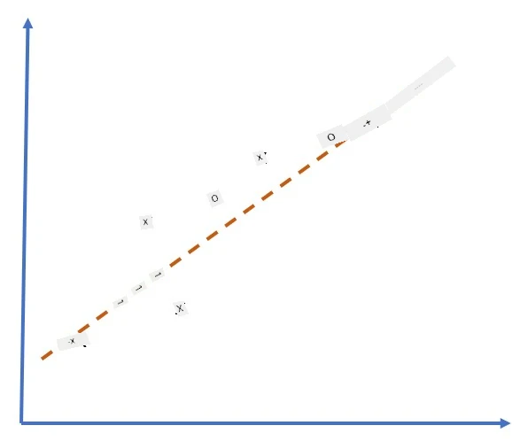
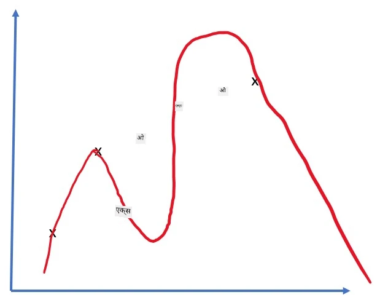
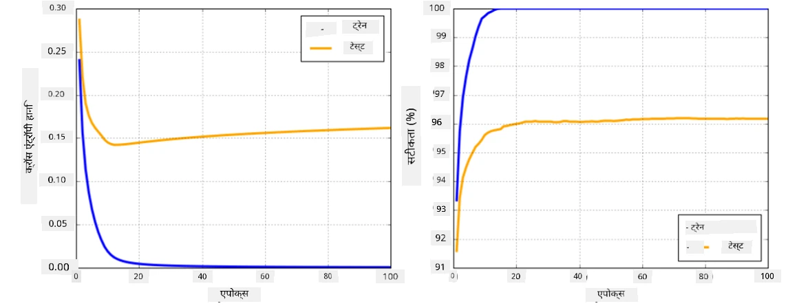

# न्यूरल नेटवर्क फ्रेमवर्क्स

जैसा कि हमने पहले सीखा है, न्यूरल नेटवर्क को प्रभावी ढंग से प्रशिक्षित करने के लिए हमें दो चीजें करनी होती हैं:

* टेन्सर्स पर ऑपरेट करना, जैसे कि उन्हें गुणा करना, जोड़ना, और कुछ फंक्शन्स जैसे सिग्मॉइड या सॉफ्टमैक्स को गणना करना।
* सभी एक्सप्रेशन्स के ग्रेडिएंट्स की गणना करना, ताकि ग्रेडिएंट डिसेंट ऑप्टिमाइजेशन किया जा सके।

## [प्री-लेक्चर क्विज़](https://ff-quizzes.netlify.app/en/ai/quiz/9)

हालांकि `numpy` लाइब्रेरी पहला काम कर सकती है, हमें ग्रेडिएंट्स की गणना के लिए एक मैकेनिज्म की आवश्यकता होती है। [हमारे फ्रेमवर्क](../04-OwnFramework/OwnFramework.ipynb) में, जिसे हमने पिछले सेक्शन में विकसित किया था, हमें `backward` मेथड के अंदर सभी डेरिवेटिव फंक्शन्स को मैन्युअली प्रोग्राम करना पड़ा था, जो बैकप्रोपेगेशन करता है। आदर्श रूप से, एक फ्रेमवर्क हमें *किसी भी एक्सप्रेशन* के ग्रेडिएंट्स की गणना करने का अवसर देना चाहिए जिसे हम परिभाषित कर सकते हैं।

एक और महत्वपूर्ण बात यह है कि GPU या किसी अन्य विशेष कंप्यूट यूनिट्स, जैसे [TPU](https://en.wikipedia.org/wiki/Tensor_Processing_Unit), पर गणनाएँ करने में सक्षम होना। डीप न्यूरल नेटवर्क प्रशिक्षण में *बहुत सारी* गणनाएँ होती हैं, और GPU पर इन गणनाओं को समानांतर रूप से करने में सक्षम होना बहुत महत्वपूर्ण है।

> ✅ 'समानांतर' का मतलब है कि गणनाओं को कई डिवाइसों पर वितरित करना।

वर्तमान में, दो सबसे लोकप्रिय न्यूरल फ्रेमवर्क हैं: [TensorFlow](http://TensorFlow.org) और [PyTorch](https://pytorch.org/)। दोनों CPU और GPU पर टेन्सर्स के साथ काम करने के लिए लो-लेवल API प्रदान करते हैं। लो-लेवल API के ऊपर, एक हाई-लेवल API भी है, जिसे [Keras](https://keras.io/) और [PyTorch Lightning](https://pytorchlightning.ai/) कहा जाता है।

लो-लेवल API | [TensorFlow](http://TensorFlow.org) | [PyTorch](https://pytorch.org/)
--------------|-------------------------------------|--------------------------------
हाई-लेवल API | [Keras](https://keras.io/) | [PyTorch Lightning](https://pytorchlightning.ai/)

**लो-लेवल APIs** दोनों फ्रेमवर्क्स में आपको **कंप्यूटेशनल ग्राफ्स** बनाने की अनुमति देते हैं। यह ग्राफ परिभाषित करता है कि दिए गए इनपुट पैरामीटर्स के साथ आउटपुट (आमतौर पर लॉस फंक्शन) कैसे गणना की जाए, और इसे GPU पर गणना के लिए पुश किया जा सकता है, यदि यह उपलब्ध है। इस कंप्यूटेशनल ग्राफ को डिफरेंशिएट करने और ग्रेडिएंट्स की गणना करने के लिए फंक्शन्स होते हैं, जिन्हें फिर मॉडल पैरामीटर्स को ऑप्टिमाइज़ करने के लिए उपयोग किया जा सकता है।

**हाई-लेवल APIs** न्यूरल नेटवर्क्स को **लेयर्स के अनुक्रम** के रूप में मानते हैं और अधिकांश न्यूरल नेटवर्क्स को बनाना बहुत आसान बनाते हैं। मॉडल को प्रशिक्षित करना आमतौर पर डेटा तैयार करने और फिर `fit` फंक्शन को कॉल करने की आवश्यकता होती है।

हाई-लेवल API आपको सामान्य न्यूरल नेटवर्क्स को बहुत जल्दी बनाने की अनुमति देता है, बिना बहुत सारे विवरणों की चिंता किए। वहीं, लो-लेवल API प्रशिक्षण प्रक्रिया पर अधिक नियंत्रण प्रदान करता है, और इसलिए इसे शोध में बहुत उपयोग किया जाता है, जब आप नए न्यूरल नेटवर्क आर्किटेक्चर के साथ काम कर रहे होते हैं।

यह समझना भी महत्वपूर्ण है कि आप दोनों APIs को एक साथ उपयोग कर सकते हैं, जैसे कि आप लो-लेवल API का उपयोग करके अपना खुद का नेटवर्क लेयर आर्किटेक्चर विकसित कर सकते हैं, और फिर इसे बड़े नेटवर्क के अंदर उपयोग कर सकते हैं जिसे हाई-लेवल API के साथ बनाया और प्रशिक्षित किया गया हो। या आप हाई-लेवल API का उपयोग करके लेयर्स के अनुक्रम के रूप में नेटवर्क को परिभाषित कर सकते हैं, और फिर अपने खुद के लो-लेवल प्रशिक्षण लूप का उपयोग करके ऑप्टिमाइजेशन कर सकते हैं। दोनों APIs समान बुनियादी अवधारणाओं का उपयोग करते हैं, और उन्हें एक साथ काम करने के लिए डिज़ाइन किया गया है।

## सीखना

इस कोर्स में, हम अधिकांश सामग्री PyTorch और TensorFlow दोनों के लिए प्रदान करते हैं। आप अपनी पसंदीदा फ्रेमवर्क चुन सकते हैं और केवल संबंधित नोटबुक्स के माध्यम से जा सकते हैं। यदि आप सुनिश्चित नहीं हैं कि कौन सा फ्रेमवर्क चुनना है, तो **PyTorch बनाम TensorFlow** पर इंटरनेट पर कुछ चर्चाएँ पढ़ें। आप दोनों फ्रेमवर्क्स को देखकर बेहतर समझ भी प्राप्त कर सकते हैं।

जहाँ संभव हो, हम सादगी के लिए हाई-लेवल APIs का उपयोग करेंगे। हालांकि, हमारा मानना है कि यह समझना महत्वपूर्ण है कि न्यूरल नेटवर्क्स जमीनी स्तर से कैसे काम करते हैं, इसलिए शुरुआत में हम लो-लेवल API और टेन्सर्स के साथ काम करना शुरू करते हैं। हालांकि, यदि आप जल्दी से आगे बढ़ना चाहते हैं और इन विवरणों को सीखने में अधिक समय नहीं बिताना चाहते हैं, तो आप उन्हें छोड़ सकते हैं और सीधे हाई-लेवल API नोटबुक्स में जा सकते हैं।

## ✍️ अभ्यास: फ्रेमवर्क्स

अगले नोटबुक्स में अपना सीखना जारी रखें:

लो-लेवल API | [TensorFlow+Keras Notebook](IntroKerasTF.ipynb) | [PyTorch](IntroPyTorch.ipynb)
--------------|-------------------------------------|--------------------------------
हाई-लेवल API | [Keras](IntroKeras.ipynb) | *PyTorch Lightning*

फ्रेमवर्क्स में महारत हासिल करने के बाद, आइए ओवरफिटिंग की अवधारणा को दोहराएँ।

# ओवरफिटिंग

ओवरफिटिंग मशीन लर्निंग में एक अत्यंत महत्वपूर्ण अवधारणा है, और इसे सही तरीके से समझना बहुत जरूरी है!

5 बिंदुओं को (ग्राफ में `x` द्वारा दर्शाए गए) अनुमानित करने की निम्नलिखित समस्या पर विचार करें:

 | 
-------------------------|--------------------------
**लिनियर मॉडल, 2 पैरामीटर्स** | **नॉन-लिनियर मॉडल, 7 पैरामीटर्स**
ट्रेनिंग एरर = 5.3 | ट्रेनिंग एरर = 0
वैलिडेशन एरर = 5.1 | वैलिडेशन एरर = 20

* बाईं ओर, हम एक अच्छी सीधी रेखा का अनुमान देखते हैं। क्योंकि पैरामीटर्स की संख्या उपयुक्त है, मॉडल बिंदु वितरण के पीछे का विचार सही तरीके से समझता है।
* दाईं ओर, मॉडल बहुत शक्तिशाली है। क्योंकि हमारे पास केवल 5 बिंदु हैं और मॉडल में 7 पैरामीटर्स हैं, यह इस तरह से समायोजित हो सकता है कि सभी बिंदुओं से गुजर सके, जिससे ट्रेनिंग एरर 0 हो जाए। हालांकि, यह मॉडल को डेटा के पीछे सही पैटर्न को समझने से रोकता है, जिससे वैलिडेशन एरर बहुत अधिक हो जाता है।

मॉडल की समृद्धि (पैरामीटर्स की संख्या) और ट्रेनिंग सैंपल्स की संख्या के बीच सही संतुलन बनाना बहुत महत्वपूर्ण है।

## ओवरफिटिंग क्यों होता है

  * पर्याप्त ट्रेनिंग डेटा नहीं होना
  * बहुत शक्तिशाली मॉडल
  * इनपुट डेटा में बहुत अधिक शोर

## ओवरफिटिंग का पता कैसे लगाएँ

जैसा कि आप ऊपर दिए गए ग्राफ से देख सकते हैं, ओवरफिटिंग का पता बहुत कम ट्रेनिंग एरर और उच्च वैलिडेशन एरर से लगाया जा सकता है। आमतौर पर ट्रेनिंग के दौरान हम देखेंगे कि ट्रेनिंग और वैलिडेशन एरर दोनों कम होने लगते हैं, और फिर किसी बिंदु पर वैलिडेशन एरर कम होना बंद कर सकता है और बढ़ने लग सकता है। यह ओवरफिटिंग का संकेत होगा, और यह संकेत होगा कि हमें शायद इस बिंदु पर ट्रेनिंग रोक देनी चाहिए (या कम से कम मॉडल का स्नैपशॉट लेना चाहिए)।

## ओवरफिटिंग को कैसे रोकें

यदि आप देख सकते हैं कि ओवरफिटिंग हो रही है, तो आप निम्नलिखित में से कुछ कर सकते हैं:

 * ट्रेनिंग डेटा की मात्रा बढ़ाएँ
 * मॉडल की जटिलता कम करें
 * कुछ [रेग्युलराइज़ेशन तकनीक](../../4-ComputerVision/08-TransferLearning/TrainingTricks.md) का उपयोग करें, जैसे [ड्रॉपआउट](../../4-ComputerVision/08-TransferLearning/TrainingTricks.md#Dropout), जिसे हम बाद में देखेंगे।

## ओवरफिटिंग और बायस-वेरिएंस ट्रेडऑफ

ओवरफिटिंग वास्तव में सांख्यिकी में एक अधिक सामान्य समस्या का मामला है जिसे [बायस-वेरिएंस ट्रेडऑफ](https://en.wikipedia.org/wiki/Bias%E2%80%93variance_tradeoff) कहा जाता है। यदि हम अपने मॉडल में त्रुटि के संभावित स्रोतों पर विचार करें, तो हम दो प्रकार की त्रुटियाँ देख सकते हैं:

* **बायस त्रुटियाँ** हमारे एल्गोरिदम द्वारा ट्रेनिंग डेटा के बीच संबंध को सही तरीके से कैप्चर करने में असमर्थता के कारण होती हैं। यह इस तथ्य से उत्पन्न हो सकता है कि हमारा मॉडल पर्याप्त शक्तिशाली नहीं है (**अंडरफिटिंग**)।  
* **वेरिएंस त्रुटियाँ**, जो इनपुट डेटा में शोर को सार्थक संबंध के बजाय मॉडल द्वारा अनुमानित करने के कारण होती हैं (**ओवरफिटिंग**)।  

ट्रेनिंग के दौरान, बायस त्रुटि कम होती है (जैसे हमारा मॉडल डेटा को अनुमानित करना सीखता है), और वेरिएंस त्रुटि बढ़ती है। ओवरफिटिंग को रोकने के लिए ट्रेनिंग को रोकना महत्वपूर्ण है - या तो मैन्युअल रूप से (जब हम ओवरफिटिंग का पता लगाते हैं) या स्वचालित रूप से (रेग्युलराइज़ेशन को पेश करके)।

## निष्कर्ष

इस पाठ में, आपने दो सबसे लोकप्रिय AI फ्रेमवर्क्स, TensorFlow और PyTorch के विभिन्न APIs के बीच के अंतर के बारे में सीखा। इसके अलावा, आपने एक बहुत महत्वपूर्ण विषय, ओवरफिटिंग के बारे में सीखा।

## 🚀 चुनौती

संबंधित नोटबुक्स में, आपको 'टास्क्स' नीचे दिए गए मिलेंगे; नोटबुक्स के माध्यम से काम करें और टास्क्स को पूरा करें।

## [पोस्ट-लेक्चर क्विज़](https://ff-quizzes.netlify.app/en/ai/quiz/10)

## समीक्षा और स्व-अध्ययन

निम्नलिखित विषयों पर कुछ शोध करें:

- TensorFlow
- PyTorch
- ओवरफिटिंग

अपने आप से निम्नलिखित प्रश्न पूछें:

- TensorFlow और PyTorch में क्या अंतर है?
- ओवरफिटिंग और अंडरफिटिंग में क्या अंतर है?

## [असाइनमेंट](lab/README.md)

इस लैब में, आपसे PyTorch या TensorFlow का उपयोग करके सिंगल- और मल्टी-लेयर्ड फुली-कनेक्टेड नेटवर्क्स के साथ दो वर्गीकरण समस्याओं को हल करने के लिए कहा गया है।

* [निर्देश](lab/README.md)
* [नोटबुक](lab/LabFrameworks.ipynb)

---

