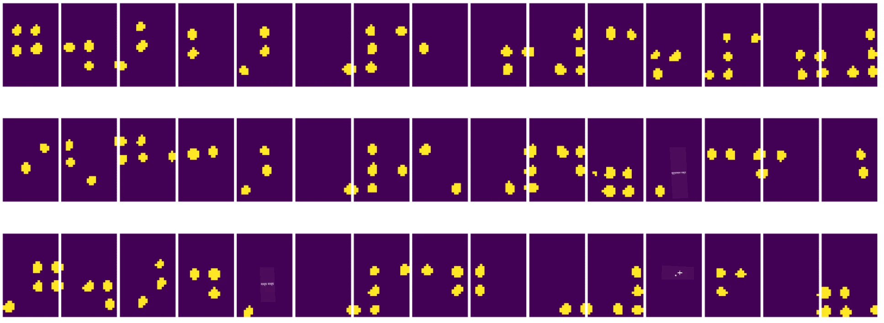

# कंप्यूटर विज़न का परिचय

[कंप्यूटर विज़न](https://wikipedia.org/wiki/Computer_vision) एक ऐसा क्षेत्र है जिसका उद्देश्य कंप्यूटर को डिजिटल छवियों की उच्च-स्तरीय समझ प्रदान करना है। यह परिभाषा काफी व्यापक है क्योंकि *समझना* कई अलग-अलग चीजों का मतलब हो सकता है, जैसे कि किसी तस्वीर में वस्तु ढूंढना (**वस्तु पहचान**), यह समझना कि क्या हो रहा है (**घटना पहचान**), तस्वीर का पाठ में वर्णन करना, या दृश्य को 3D में पुनर्निर्मित करना। मानव छवियों से संबंधित कुछ विशेष कार्य भी होते हैं: उम्र और भावनाओं का अनुमान लगाना, चेहरे की पहचान और पहचान, और 3D पोज़ का अनुमान लगाना, आदि।

## [प्री-लेक्चर क्विज़](https://ff-quizzes.netlify.app/en/ai/quiz/11)

कंप्यूटर विज़न का एक सबसे सरल कार्य **छवि वर्गीकरण** है।

कंप्यूटर विज़न को अक्सर AI की एक शाखा माना जाता है। आजकल, कंप्यूटर विज़न के अधिकांश कार्य न्यूरल नेटवर्क का उपयोग करके हल किए जाते हैं। हम इस खंड में कंप्यूटर विज़न के लिए उपयोग किए जाने वाले विशेष प्रकार के न्यूरल नेटवर्क, [कन्वोल्यूशनल न्यूरल नेटवर्क](../07-ConvNets/README.md), के बारे में अधिक जानेंगे।

हालांकि, छवि को न्यूरल नेटवर्क में पास करने से पहले, कई मामलों में छवि को बेहतर बनाने के लिए कुछ एल्गोरिदमिक तकनीकों का उपयोग करना समझदारी हो सकता है।

छवि प्रसंस्करण के लिए कई पायथन लाइब्रेरी उपलब्ध हैं:

* **[imageio](https://imageio.readthedocs.io/en/stable/)** विभिन्न छवि प्रारूपों को पढ़ने/लिखने के लिए उपयोग किया जा सकता है। यह ffmpeg का भी समर्थन करता है, जो वीडियो फ्रेम को छवियों में बदलने के लिए एक उपयोगी उपकरण है।
* **[Pillow](https://pillow.readthedocs.io/en/stable/index.html)** (जिसे PIL भी कहा जाता है) थोड़ा अधिक शक्तिशाली है और कुछ छवि हेरफेर जैसे कि मोर्फिंग, पैलेट समायोजन, और अधिक का समर्थन करता है।
* **[OpenCV](https://opencv.org/)** एक शक्तिशाली छवि प्रसंस्करण लाइब्रेरी है जो C++ में लिखी गई है और छवि प्रसंस्करण के लिए *डिफ़ॉल्ट मानक* बन गई है। इसका एक सुविधाजनक पायथन इंटरफ़ेस है।
* **[dlib](http://dlib.net/)** एक C++ लाइब्रेरी है जो कई मशीन लर्निंग एल्गोरिदम को लागू करती है, जिसमें कुछ कंप्यूटर विज़न एल्गोरिदम भी शामिल हैं। इसका एक पायथन इंटरफ़ेस भी है और इसे चेहरे और चेहरे के लैंडमार्क पहचान जैसे चुनौतीपूर्ण कार्यों के लिए उपयोग किया जा सकता है।

## OpenCV

[OpenCV](https://opencv.org/) को छवि प्रसंस्करण के लिए *डिफ़ॉल्ट मानक* माना जाता है। इसमें कई उपयोगी एल्गोरिदम शामिल हैं, जो C++ में लागू किए गए हैं। आप OpenCV को पायथन से भी कॉल कर सकते हैं।

OpenCV सीखने के लिए एक अच्छा स्थान [यह Learn OpenCV कोर्स](https://learnopencv.com/getting-started-with-opencv/) है। हमारे पाठ्यक्रम में, हमारा लक्ष्य OpenCV सीखना नहीं है, बल्कि आपको कुछ उदाहरण दिखाना है कि इसे कब और कैसे उपयोग किया जा सकता है।

### छवियों को लोड करना

पायथन में छवियों को NumPy arrays के रूप में आसानी से दर्शाया जा सकता है। उदाहरण के लिए, 320x200 पिक्सल आकार की ग्रेस्केल छवियां 200x320 array में संग्रहीत की जाएंगी, और समान आयाम की रंगीन छवियों का आकार 200x320x3 होगा (3 रंग चैनलों के लिए)। छवि को लोड करने के लिए, आप निम्न कोड का उपयोग कर सकते हैं:

```python
import cv2
import matplotlib.pyplot as plt

im = cv2.imread('image.jpeg')
plt.imshow(im)
```

पारंपरिक रूप से, OpenCV रंगीन छवियों के लिए BGR (ब्लू-ग्रीन-रेड) एन्कोडिंग का उपयोग करता है, जबकि पायथन के अन्य उपकरण अधिक पारंपरिक RGB (रेड-ग्रीन-ब्लू) का उपयोग करते हैं। छवि को सही दिखने के लिए, आपको इसे RGB रंग स्थान में बदलने की आवश्यकता होती है, या तो NumPy array में आयामों को स्वैप करके, या OpenCV फ़ंक्शन को कॉल करके:

```python
im = cv2.cvtColor(im,cv2.COLOR_BGR2RGB)
```

वही `cvtColor` फ़ंक्शन अन्य रंग स्थान रूपांतरण करने के लिए उपयोग किया जा सकता है जैसे कि छवि को ग्रेस्केल या HSV (ह्यू-सैचुरेशन-वैल्यू) रंग स्थान में बदलना।

आप OpenCV का उपयोग करके वीडियो को फ्रेम-दर-फ्रेम भी लोड कर सकते हैं - इसका एक उदाहरण [OpenCV Notebook](OpenCV.ipynb) में दिया गया है।

### छवि प्रसंस्करण

छवि को न्यूरल नेटवर्क में भेजने से पहले, आप कई पूर्व-प्रसंस्करण चरण लागू करना चाह सकते हैं। OpenCV कई चीजें कर सकता है, जिनमें शामिल हैं:

* `im = cv2.resize(im, (320,200),interpolation=cv2.INTER_LANCZOS)` का उपयोग करके छवि को **पुनः आकार देना**।
* `im = cv2.medianBlur(im,3)` या `im = cv2.GaussianBlur(im, (3,3), 0)` का उपयोग करके छवि को **ब्लर करना**।
* छवि की **चमक और कंट्रास्ट** को बदलना NumPy array हेरफेर द्वारा किया जा सकता है, जैसा कि [इस Stackoverflow नोट](https://stackoverflow.com/questions/39308030/how-do-i-increase-the-contrast-of-an-image-in-python-opencv) में वर्णित है।
* [थ्रेशोल्डिंग](https://docs.opencv.org/4.x/d7/d4d/tutorial_py_thresholding.html) का उपयोग करके `cv2.threshold`/`cv2.adaptiveThreshold` फ़ंक्शन को कॉल करना, जो अक्सर चमक या कंट्रास्ट को समायोजित करने से बेहतर होता है।
* छवि पर विभिन्न [रूपांतरण](https://docs.opencv.org/4.5.5/da/d6e/tutorial_py_geometric_transformations.html) लागू करना:
    - **[एफाइन रूपांतरण](https://docs.opencv.org/4.5.5/d4/d61/tutorial_warp_affine.html)** उपयोगी हो सकते हैं यदि आपको छवि में तीन बिंदुओं के स्रोत और गंतव्य स्थान पता हो और आप रोटेशन, पुनः आकार देना और तिरछापन जोड़ना चाहते हैं। एफाइन रूपांतरण समानांतर रेखाओं को समानांतर रखते हैं।
    - **[परिप्रेक्ष्य रूपांतरण](https://medium.com/analytics-vidhya/opencv-perspective-transformation-9edffefb2143)** उपयोगी हो सकते हैं जब आपको छवि में 4 बिंदुओं के स्रोत और गंतव्य स्थान पता हो। उदाहरण के लिए, यदि आप स्मार्टफोन कैमरे से किसी कोण से एक आयताकार दस्तावेज़ की तस्वीर लेते हैं और आप दस्तावेज़ की आयताकार छवि बनाना चाहते हैं।
* **[ऑप्टिकल फ्लो](https://docs.opencv.org/4.5.5/d4/dee/tutorial_optical_flow.html)** का उपयोग करके छवि के अंदर की गति को समझना।

## कंप्यूटर विज़न का उपयोग करने के उदाहरण

हमारे [OpenCV Notebook](OpenCV.ipynb) में, हम कुछ उदाहरण देते हैं कि कंप्यूटर विज़न का उपयोग विशिष्ट कार्यों को करने के लिए कैसे किया जा सकता है:

* **ब्रेल पुस्तक की तस्वीर का पूर्व-प्रसंस्करण**। हम इस पर ध्यान केंद्रित करते हैं कि थ्रेशोल्डिंग, फीचर डिटेक्शन, परिप्रेक्ष्य रूपांतरण और NumPy हेरफेर का उपयोग करके ब्रेल प्रतीकों को अलग कैसे किया जा सकता है ताकि उन्हें न्यूरल नेटवर्क द्वारा आगे वर्गीकृत किया जा सके।

 |  | 
----|-----|-----

> छवि [OpenCV.ipynb](OpenCV.ipynb) से

* **फ्रेम अंतर का उपयोग करके वीडियो में गति का पता लगाना**। यदि कैमरा स्थिर है, तो कैमरा फीड से फ्रेम एक-दूसरे के समान होने चाहिए। चूंकि फ्रेम arrays के रूप में दर्शाए जाते हैं, केवल दो लगातार फ्रेम के लिए उन arrays को घटाकर हमें पिक्सल अंतर मिलेगा, जो स्थिर फ्रेम के लिए कम होना चाहिए और छवि में महत्वपूर्ण गति होने पर अधिक हो जाएगा।


> छवि [OpenCV.ipynb](OpenCV.ipynb) से

* **ऑप्टिकल फ्लो का उपयोग करके गति का पता लगाना**। [ऑप्टिकल फ्लो](https://docs.opencv.org/3.4/d4/dee/tutorial_optical_flow.html) हमें यह समझने की अनुमति देता है कि वीडियो फ्रेम पर व्यक्तिगत पिक्सल कैसे चलते हैं। ऑप्टिकल फ्लो के दो प्रकार हैं:

   - **डेंस ऑप्टिकल फ्लो** वह वेक्टर फील्ड गणना करता है जो दिखाता है कि प्रत्येक पिक्सल कहां जा रहा है।
   - **स्पार्स ऑप्टिकल फ्लो** छवि में कुछ विशिष्ट विशेषताओं (जैसे किनारों) को लेता है और फ्रेम से फ्रेम तक उनकी प्रक्षेपवक्र बनाता है।


> छवि [OpenCV.ipynb](OpenCV.ipynb) से

## ✍️ उदाहरण नोटबुक्स: OpenCV [OpenCV को क्रियान्वित होते हुए आज़माएं](OpenCV.ipynb)

आइए [OpenCV Notebook](OpenCV.ipynb) का अन्वेषण करके OpenCV के साथ कुछ प्रयोग करें।

## निष्कर्ष

कभी-कभी, गति का पता लगाने या उंगलियों के सिरे का पता लगाने जैसे अपेक्षाकृत जटिल कार्य केवल कंप्यूटर विज़न द्वारा हल किए जा सकते हैं। इसलिए, कंप्यूटर विज़न की बुनियादी तकनीकों को जानना और OpenCV जैसी लाइब्रेरी क्या कर सकती हैं, बहुत उपयोगी है।

## 🚀 चुनौती

AI शो से [इस वीडियो](https://docs.microsoft.com/shows/ai-show/ai-show--2021-opencv-ai-competition--grand-prize-winners--cortic-tigers--episode-32?WT.mc_id=academic-77998-cacaste) को देखें ताकि Cortic Tigers प्रोजेक्ट और उन्होंने कैसे एक रोबोट के माध्यम से कंप्यूटर विज़न कार्यों को लोकतांत्रिक बनाने के लिए ब्लॉक-आधारित समाधान बनाया, इसके बारे में जान सकें। इस क्षेत्र में नए शिक्षार्थियों को शामिल करने में मदद करने वाले अन्य प्रोजेक्ट्स पर शोध करें।

## [पोस्ट-लेक्चर क्विज़](https://ff-quizzes.netlify.app/en/ai/quiz/12)

## समीक्षा और स्व-अध्ययन

ऑप्टिकल फ्लो पर [इस शानदार ट्यूटोरियल](https://learnopencv.com/optical-flow-in-opencv/) में अधिक पढ़ें।

## [असाइनमेंट](lab/README.md)

इस लैब में, आप सरल इशारों के साथ एक वीडियो लेंगे, और आपका लक्ष्य ऑप्टिकल फ्लो का उपयोग करके ऊपर/नीचे/बाएं/दाएं गति निकालना होगा।


---

