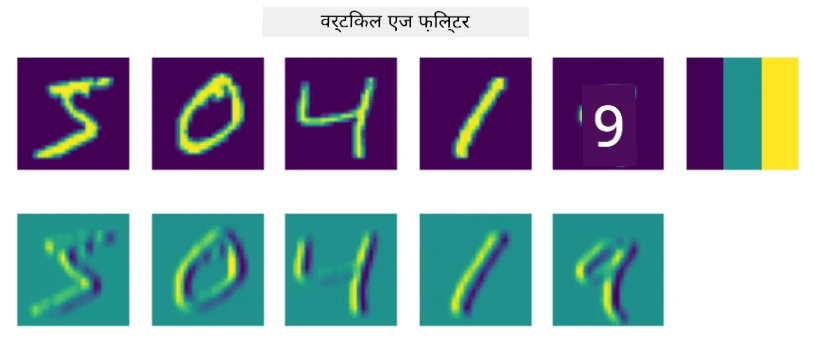
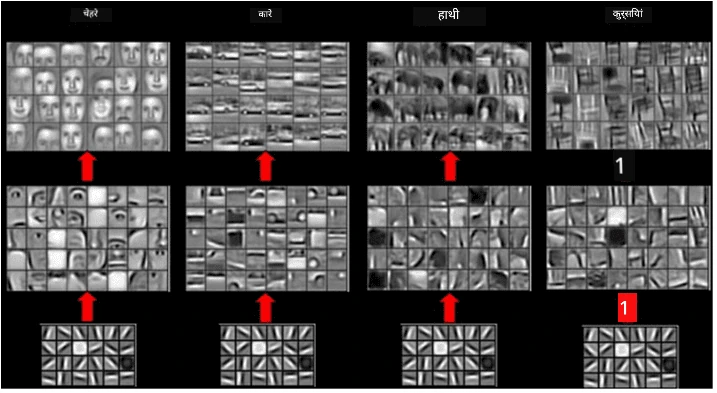
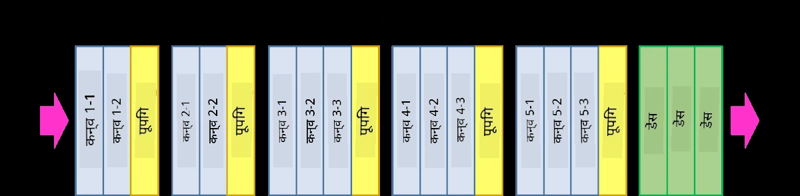

# कॉन्वोल्यूशनल न्यूरल नेटवर्क्स

हमने पहले देखा है कि न्यूरल नेटवर्क्स इमेजेस के साथ काम करने में काफी अच्छे होते हैं, और एक-लेयर परसेप्ट्रॉन भी MNIST डेटासेट से हस्तलिखित अंकों को पहचानने में उचित सटीकता प्राप्त कर सकता है। हालांकि, MNIST डेटासेट बहुत खास है, और सभी अंक इमेज के अंदर केंद्रित होते हैं, जिससे यह कार्य सरल हो जाता है।

## [प्री-लेक्चर क्विज़](https://ff-quizzes.netlify.app/en/ai/quiz/13)

वास्तविक जीवन में, हम चाहते हैं कि इमेज में किसी ऑब्जेक्ट को उसकी सटीक लोकेशन की परवाह किए बिना पहचान सकें। कंप्यूटर विज़न सामान्य वर्गीकरण से अलग है, क्योंकि जब हम इमेज में किसी विशेष ऑब्जेक्ट को ढूंढने की कोशिश कर रहे होते हैं, तो हम इमेज को स्कैन करते हैं और कुछ विशेष **पैटर्न्स** और उनके संयोजनों की तलाश करते हैं। उदाहरण के लिए, जब हम बिल्ली की तलाश कर रहे होते हैं, तो हम पहले क्षैतिज रेखाओं की तलाश कर सकते हैं, जो मूंछें बना सकती हैं, और फिर मूंछों का एक निश्चित संयोजन हमें बता सकता है कि यह वास्तव में बिल्ली की तस्वीर है। पैटर्न्स की सापेक्ष स्थिति और उपस्थिति महत्वपूर्ण है, न कि उनकी सटीक स्थिति।

पैटर्न्स निकालने के लिए, हम **कॉन्वोल्यूशनल फिल्टर्स** की अवधारणा का उपयोग करेंगे। जैसा कि आप जानते हैं, एक इमेज को 2D-मैट्रिक्स या रंग गहराई के साथ 3D-टेंसर के रूप में दर्शाया जाता है। फिल्टर लागू करने का मतलब है कि हम एक अपेक्षाकृत छोटा **फिल्टर कर्नल** मैट्रिक्स लेते हैं, और मूल इमेज के प्रत्येक पिक्सल के लिए पड़ोसी बिंदुओं के साथ भारित औसत की गणना करते हैं। इसे हम ऐसे देख सकते हैं जैसे एक छोटी विंडो पूरी इमेज पर स्लाइड कर रही हो और फिल्टर कर्नल मैट्रिक्स में वज़न के अनुसार सभी पिक्सल्स को औसत कर रही हो।

 | 
----|----

> छवि: दिमित्री सोश्निकोव द्वारा

उदाहरण के लिए, यदि हम MNIST अंकों पर 3x3 वर्टिकल एज और हॉरिज़ॉन्टल एज फिल्टर्स लागू करते हैं, तो हमें हाइलाइट्स (जैसे उच्च मान) मिल सकते हैं जहां हमारी मूल इमेज में वर्टिकल और हॉरिज़ॉन्टल एजेस हैं। इस प्रकार, ये दो फिल्टर्स एजेस "ढूंढने" के लिए उपयोग किए जा सकते हैं। इसी तरह, हम अन्य लो-लेवल पैटर्न्स की तलाश के लिए अलग-अलग फिल्टर्स डिज़ाइन कर सकते हैं:

> छवि: [Leung-Malik Filter Bank](https://www.robots.ox.ac.uk/~vgg/research/texclass/filters.html)

हालांकि, जबकि हम कुछ पैटर्न्स निकालने के लिए फिल्टर्स को मैन्युअली डिज़ाइन कर सकते हैं, हम नेटवर्क को इस तरह डिज़ाइन भी कर सकते हैं कि यह पैटर्न्स को स्वचालित रूप से सीख सके। यह CNN के पीछे मुख्य विचारों में से एक है।

## CNN के पीछे मुख्य विचार

CNNs जिस तरह से काम करते हैं, वह निम्नलिखित महत्वपूर्ण विचारों पर आधारित है:

* कॉन्वोल्यूशनल फिल्टर्स पैटर्न्स निकाल सकते हैं
* हम नेटवर्क को इस तरह डिज़ाइन कर सकते हैं कि फिल्टर्स स्वचालित रूप से प्रशिक्षित हों
* हम केवल मूल इमेज में ही नहीं, बल्कि उच्च-स्तरीय फीचर्स में भी पैटर्न्स ढूंढने के लिए इसी दृष्टिकोण का उपयोग कर सकते हैं। इस प्रकार, CNN फीचर एक्सट्रैक्शन फीचर्स की एक पदानुक्रम पर काम करता है, जो लो-लेवल पिक्सल संयोजनों से शुरू होकर, इमेज के हिस्सों के उच्च-स्तरीय संयोजनों तक जाता है।

> छवि: [Hislop-Lynch के पेपर](https://www.semanticscholar.org/paper/Computer-vision-based-pedestrian-trajectory-Hislop-Lynch/26e6f74853fc9bbb7487b06dc2cf095d36c9021d) से, उनके [अनुसंधान](https://dl.acm.org/doi/abs/10.1145/1553374.1553453) पर आधारित

## ✍️ अभ्यास: कॉन्वोल्यूशनल न्यूरल नेटवर्क्स

आइए कॉन्वोल्यूशनल न्यूरल नेटवर्क्स कैसे काम करते हैं और हम ट्रेन करने योग्य फिल्टर्स कैसे प्राप्त कर सकते हैं, इसे संबंधित नोटबुक्स के माध्यम से समझते हैं:

* [कॉन्वोल्यूशनल न्यूरल नेटवर्क्स - PyTorch](ConvNetsPyTorch.ipynb)
* [कॉन्वोल्यूशनल न्यूरल नेटवर्क्स - TensorFlow](ConvNetsTF.ipynb)

## पिरामिड आर्किटेक्चर

इमेज प्रोसेसिंग के लिए उपयोग किए जाने वाले अधिकांश CNNs तथाकथित पिरामिड आर्किटेक्चर का पालन करते हैं। मूल इमेज पर लागू पहला कॉन्वोल्यूशनल लेयर आमतौर पर अपेक्षाकृत कम संख्या में फिल्टर्स (8-16) रखता है, जो विभिन्न पिक्सल संयोजनों, जैसे क्षैतिज/वर्टिकल रेखाओं या स्ट्रोक्स, से मेल खाते हैं। अगले स्तर पर, हम नेटवर्क के स्थानिक आयाम को कम करते हैं और फिल्टर्स की संख्या बढ़ाते हैं, जो सरल फीचर्स के अधिक संभावित संयोजनों से मेल खाते हैं। प्रत्येक लेयर के साथ, जैसे-जैसे हम अंतिम क्लासिफायर की ओर बढ़ते हैं, इमेज के स्थानिक आयाम घटते हैं और फिल्टर्स की संख्या बढ़ती है।

उदाहरण के लिए, आइए VGG-16 की आर्किटेक्चर पर नज़र डालें, एक नेटवर्क जिसने 2014 में ImageNet के टॉप-5 वर्गीकरण में 92.7% सटीकता प्राप्त की:

> छवि: [Researchgate](https://www.researchgate.net/figure/Vgg16-model-structure-To-get-the-VGG-NIN-model-we-replace-the-2-nd-4-th-6-th-7-th_fig2_335194493) से

## सबसे प्रसिद्ध CNN आर्किटेक्चर

[सबसे प्रसिद्ध CNN आर्किटेक्चर के बारे में अपनी पढ़ाई जारी रखें](CNN_Architectures.md)

---

