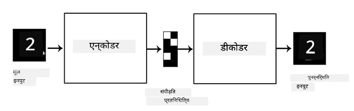
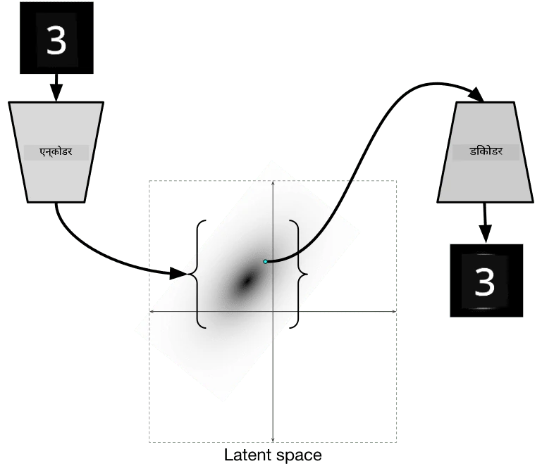

# ऑटोएन्कोडर्स

जब CNNs को ट्रेन किया जाता है, तो एक समस्या यह होती है कि हमें बहुत सारे लेबल वाले डेटा की आवश्यकता होती है। इमेज क्लासिफिकेशन के मामले में, हमें इमेज को अलग-अलग क्लास में विभाजित करना होता है, जो एक मैनुअल प्रक्रिया है।

## [प्री-लेक्चर क्विज़](https://ff-quizzes.netlify.app/en/ai/quiz/17)

हालांकि, हम CNN फीचर एक्सट्रैक्टर्स को ट्रेन करने के लिए कच्चे (अनलेबल्ड) डेटा का उपयोग करना चाह सकते हैं, जिसे **सेल्फ-सुपरवाइज्ड लर्निंग** कहा जाता है। लेबल्स की बजाय, हम ट्रेनिंग इमेज को नेटवर्क इनपुट और आउटपुट दोनों के रूप में उपयोग करेंगे। **ऑटोएन्कोडर** का मुख्य विचार यह है कि हमारे पास एक **एन्कोडर नेटवर्क** होगा जो इनपुट इमेज को किसी **लेटेंट स्पेस** में बदलता है (आमतौर पर यह कुछ छोटे आकार का वेक्टर होता है), और फिर **डिकोडर नेटवर्क**, जिसका लक्ष्य मूल इमेज को पुनर्निर्मित करना होगा।

> ✅ एक [ऑटोएन्कोडर](https://wikipedia.org/wiki/Autoencoder) "एक प्रकार का कृत्रिम न्यूरल नेटवर्क है जो अनलेबल्ड डेटा के कुशल कोडिंग को सीखने के लिए उपयोग किया जाता है।"

चूंकि हम ऑटोएन्कोडर को मूल इमेज से अधिकतम जानकारी को कैप्चर करने के लिए ट्रेन कर रहे हैं ताकि सटीक पुनर्निर्माण हो सके, नेटवर्क इनपुट इमेज का सबसे अच्छा **एम्बेडिंग** खोजने की कोशिश करता है।

> इमेज [Keras ब्लॉग](https://blog.keras.io/building-autoencoders-in-keras.html) से

## ऑटोएन्कोडर्स का उपयोग करने के परिदृश्य

हालांकि मूल इमेज को पुनर्निर्मित करना अपने आप में उपयोगी नहीं लगता, लेकिन कुछ परिदृश्य हैं जहां ऑटोएन्कोडर्स विशेष रूप से उपयोगी होते हैं:

* **इमेज के आयाम को कम करना** या **इमेज एम्बेडिंग को ट्रेन करना**। आमतौर पर ऑटोएन्कोडर्स PCA से बेहतर परिणाम देते हैं, क्योंकि यह इमेज की स्थानिक प्रकृति और पदानुक्रमित फीचर्स को ध्यान में रखता है।
* **डिनॉइज़िंग**, यानी इमेज से शोर को हटाना। क्योंकि शोर में बहुत सारी बेकार जानकारी होती है, ऑटोएन्कोडर इसे छोटे लेटेंट स्पेस में फिट नहीं कर सकता, और इसलिए यह केवल इमेज के महत्वपूर्ण हिस्से को कैप्चर करता है। जब डिनॉइज़र को ट्रेन किया जाता है, तो हम मूल इमेज से शुरू करते हैं और ऑटोएन्कोडर के इनपुट के रूप में कृत्रिम रूप से जोड़े गए शोर वाली इमेज का उपयोग करते हैं।
* **सुपर-रेज़ोल्यूशन**, इमेज रेज़ोल्यूशन को बढ़ाना। हम उच्च-रेज़ोल्यूशन वाली इमेज से शुरू करते हैं और ऑटोएन्कोडर इनपुट के रूप में कम रेज़ोल्यूशन वाली इमेज का उपयोग करते हैं।
* **जनरेटिव मॉडल्स**। एक बार जब हम ऑटोएन्कोडर को ट्रेन कर लेते हैं, तो डिकोडर भाग का उपयोग रैंडम लेटेंट वेक्टर से नए ऑब्जेक्ट बनाने के लिए किया जा सकता है।

## वेरिएशनल ऑटोएन्कोडर्स (VAE)

पारंपरिक ऑटोएन्कोडर्स इनपुट डेटा के आयाम को किसी तरह कम करते हैं, इनपुट इमेज के महत्वपूर्ण फीचर्स को समझते हैं। हालांकि, लेटेंट वेक्टर अक्सर बहुत समझ में नहीं आते। दूसरे शब्दों में, MNIST डेटासेट को उदाहरण के रूप में लेते हुए, यह समझना कि कौन से अंक विभिन्न लेटेंट वेक्टर से मेल खाते हैं, आसान नहीं है, क्योंकि पास के लेटेंट वेक्टर जरूरी नहीं कि समान अंकों से मेल खाते हों।

दूसरी ओर, *जनरेटिव* मॉडल्स को ट्रेन करने के लिए लेटेंट स्पेस की कुछ समझ होना बेहतर होता है। यह विचार हमें **वेरिएशनल ऑटोएन्कोडर** (VAE) की ओर ले जाता है।

VAE वह ऑटोएन्कोडर है जो लेटेंट पैरामीटर्स के *सांख्यिकीय वितरण* को प्रेडिक्ट करना सीखता है, जिसे **लेटेंट डिस्ट्रीब्यूशन** कहा जाता है। उदाहरण के लिए, हम चाहते हैं कि लेटेंट वेक्टर सामान्य रूप से वितरित हों, जिसमें कुछ मीन zmean और स्टैंडर्ड डिविएशन zsigma हो (मीन और स्टैंडर्ड डिविएशन दोनों कुछ आयाम d के वेक्टर होते हैं)। VAE में एन्कोडर इन पैरामीटर्स को प्रेडिक्ट करना सीखता है, और फिर डिकोडर इस वितरण से एक रैंडम वेक्टर लेता है ताकि ऑब्जेक्ट को पुनर्निर्मित किया जा सके।

सारांश:

* इनपुट वेक्टर से, हम `z_mean` और `z_log_sigma` को प्रेडिक्ट करते हैं (स्टैंडर्ड डिविएशन को सीधे प्रेडिक्ट करने के बजाय, हम इसका लॉगरिदम प्रेडिक्ट करते हैं)
* हम वितरण N(zmean,exp(zlog\_sigma)) से एक वेक्टर `sample` लेते हैं
* डिकोडर `sample` को इनपुट वेक्टर के रूप में उपयोग करके मूल इमेज को डिकोड करने की कोशिश करता है

> इमेज [इस ब्लॉग पोस्ट](https://ijdykeman.github.io/ml/2016/12/21/cvae.html) से, लेखक: इसाक डाइकमैन

वेरिएशनल ऑटोएन्कोडर्स एक जटिल लॉस फंक्शन का उपयोग करते हैं, जिसमें दो भाग होते हैं:

* **रिकंस्ट्रक्शन लॉस** वह लॉस फंक्शन है जो दिखाता है कि पुनर्निर्मित इमेज लक्ष्य के कितनी करीब है (यह Mean Squared Error, या MSE हो सकता है)। यह सामान्य ऑटोएन्कोडर्स में उपयोग किए जाने वाले लॉस फंक्शन के समान है।
* **KL लॉस**, जो सुनिश्चित करता है कि लेटेंट वेरिएबल डिस्ट्रीब्यूशन सामान्य वितरण के करीब रहे। यह [कुलबैक-लिबलर डाइवर्जेंस](https://www.countbayesie.com/blog/2017/5/9/kullback-leibler-divergence-explained) की धारणा पर आधारित है - दो सांख्यिकीय वितरणों की समानता का अनुमान लगाने के लिए एक मीट्रिक।

VAEs का एक महत्वपूर्ण लाभ यह है कि वे हमें नए इमेज को अपेक्षाकृत आसानी से जनरेट करने की अनुमति देते हैं, क्योंकि हमें पता होता है कि लेटेंट वेक्टर को किस वितरण से सैंपल करना है। उदाहरण के लिए, यदि हम MNIST पर 2D लेटेंट वेक्टर के साथ VAE को ट्रेन करते हैं, तो हम लेटेंट वेक्टर के घटकों को बदलकर विभिन्न अंकों को प्राप्त कर सकते हैं:

> इमेज [दिमित्री सोश्निकोव](http://soshnikov.com) द्वारा

ध्यान दें कि कैसे इमेज एक-दूसरे में मिल जाती हैं, जैसे ही हम लेटेंट पैरामीटर स्पेस के विभिन्न हिस्सों से लेटेंट वेक्टर प्राप्त करना शुरू करते हैं। हम इस स्पेस को 2D में भी विज़ुअलाइज़ कर सकते हैं:

 

> इमेज [दिमित्री सोश्निकोव](http://soshnikov.com) द्वारा

## ✍️ अभ्यास: ऑटोएन्कोडर्स

इन संबंधित नोटबुक्स में ऑटोएन्कोडर्स के बारे में अधिक जानें:

* [TensorFlow में ऑटोएन्कोडर्स](AutoencodersTF.ipynb)
* [PyTorch में ऑटोएन्कोडर्स](AutoEncodersPyTorch.ipynb)

## ऑटोएन्कोडर्स की विशेषताएं

* **डेटा विशिष्ट** - वे केवल उस प्रकार की इमेज के साथ अच्छा काम करते हैं जिन पर उन्हें ट्रेन किया गया है। उदाहरण के लिए, यदि हम फूलों पर सुपर-रेज़ोल्यूशन नेटवर्क को ट्रेन करते हैं, तो यह पोर्ट्रेट्स पर अच्छा काम नहीं करेगा। ऐसा इसलिए है क्योंकि नेटवर्क उच्च रेज़ोल्यूशन वाली इमेज को ट्रेनिंग डेटासेट से सीखे गए फीचर्स से बारीक विवरण लेकर उत्पन्न कर सकता है।
* **लॉसी** - पुनर्निर्मित इमेज मूल इमेज के समान नहीं होती। लॉस की प्रकृति ट्रेनिंग के दौरान उपयोग किए गए *लॉस फंक्शन* द्वारा परिभाषित होती है।
* **अनलेबल्ड डेटा** पर काम करता है

## [पोस्ट-लेक्चर क्विज़](https://ff-quizzes.netlify.app/en/ai/quiz/18)

## निष्कर्ष

इस पाठ में, आपने ऑटोएन्कोडर्स के विभिन्न प्रकारों के बारे में सीखा जो AI वैज्ञानिकों के लिए उपलब्ध हैं। आपने उन्हें बनाने और इमेज को पुनर्निर्मित करने के लिए उपयोग करने का तरीका सीखा। आपने VAE के बारे में भी सीखा और इसे नए इमेज जनरेट करने के लिए उपयोग करने का तरीका समझा।

## 🚀 चुनौती

इस पाठ में, आपने इमेज के लिए ऑटोएन्कोडर्स का उपयोग करना सीखा। लेकिन इन्हें संगीत के लिए भी उपयोग किया जा सकता है! Magenta प्रोजेक्ट के [MusicVAE](https://magenta.tensorflow.org/music-vae) प्रोजेक्ट को देखें, जो संगीत को पुनर्निर्मित करना सीखने के लिए ऑटोएन्कोडर्स का उपयोग करता है। इस लाइब्रेरी के साथ कुछ [प्रयोग](https://colab.research.google.com/github/magenta/magenta-demos/blob/master/colab-notebooks/Multitrack_MusicVAE.ipynb) करें और देखें कि आप क्या बना सकते हैं।

## [पोस्ट-लेक्चर क्विज़](https://ff-quizzes.netlify.app/en/ai/quiz/16)

## समीक्षा और स्व-अध्ययन

संदर्भ के लिए, इन संसाधनों में ऑटोएन्कोडर्स के बारे में अधिक पढ़ें:

* [Keras में ऑटोएन्कोडर्स बनाना](https://blog.keras.io/building-autoencoders-in-keras.html)
* [NeuroHive पर ब्लॉग पोस्ट](https://neurohive.io/ru/osnovy-data-science/variacionnyj-avtojenkoder-vae/)
* [वेरिएशनल ऑटोएन्कोडर्स समझाया गया](https://kvfrans.com/variational-autoencoders-explained/)
* [कंडीशनल वेरिएशनल ऑटोएन्कोडर्स](https://ijdykeman.github.io/ml/2016/12/21/cvae.html)

## असाइनमेंट

[TensorFlow का उपयोग करते हुए इस नोटबुक](AutoencodersTF.ipynb) के अंत में एक 'टास्क' मिलेगा - इसे अपना असाइनमेंट मानें।

---

