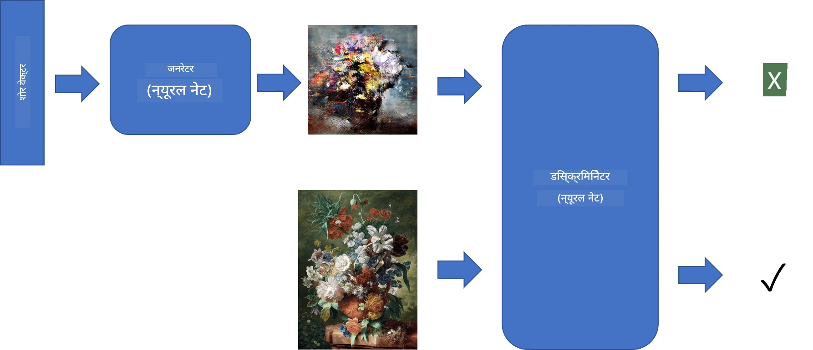
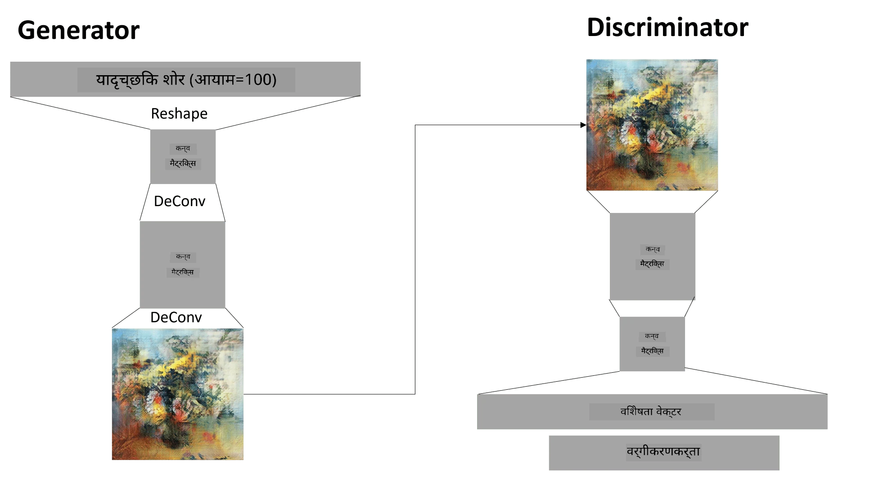

# जनरेटिव एडवर्सेरियल नेटवर्क्स

पिछले सेक्शन में, हमने **जनरेटिव मॉडल्स** के बारे में सीखा: ऐसे मॉडल्स जो ट्रेनिंग डेटा सेट में मौजूद इमेजेज़ के समान नई इमेजेज़ जनरेट कर सकते हैं। VAE इसका एक अच्छा उदाहरण था।

## [प्री-लेक्चर क्विज़](https://ff-quizzes.netlify.app/en/ai/quiz/19)

हालांकि, अगर हम कुछ वास्तव में अर्थपूर्ण जनरेट करने की कोशिश करें, जैसे कि एक पेंटिंग को उचित रिज़ॉल्यूशन पर, तो VAE के साथ ट्रेनिंग अच्छी तरह से कन्वर्ज नहीं होती। इस उपयोग के लिए, हमें एक अन्य आर्किटेक्चर के बारे में सीखना चाहिए जो विशेष रूप से जनरेटिव मॉडल्स के लिए डिज़ाइन किया गया है - **जनरेटिव एडवर्सेरियल नेटवर्क्स**, या GANs।

GAN का मुख्य विचार दो न्यूरल नेटवर्क्स को एक-दूसरे के खिलाफ ट्रेन करना है:

> चित्र: [दिमित्री सोश्निकोव](http://soshnikov.com)

> ✅ कुछ शब्दावली:
> * **जनरेटर**: एक नेटवर्क जो एक रैंडम वेक्टर लेता है और परिणामस्वरूप एक इमेज जनरेट करता है।
> * **डिस्क्रिमिनेटर**: एक नेटवर्क जो एक इमेज लेता है और यह तय करता है कि वह एक असली इमेज है (ट्रेनिंग डेटा सेट से) या जनरेटर द्वारा जनरेट की गई है। यह मूल रूप से एक इमेज क्लासिफायर है।

### डिस्क्रिमिनेटर

डिस्क्रिमिनेटर की आर्किटेक्चर एक सामान्य इमेज क्लासिफिकेशन नेटवर्क से अलग नहीं होती। सबसे सरल मामले में, यह एक फुली-कनेक्टेड क्लासिफायर हो सकता है, लेकिन अधिक संभावना है कि यह एक [कन्वोल्यूशनल नेटवर्क](../07-ConvNets/README.md) होगा।

> ✅ कन्वोल्यूशनल नेटवर्क्स पर आधारित GAN को [DCGAN](https://arxiv.org/pdf/1511.06434.pdf) कहा जाता है।

एक CNN डिस्क्रिमिनेटर में निम्नलिखित लेयर्स होती हैं: कई कन्वोल्यूशन्स+पूलिंग्स (स्पेशियल साइज को घटाते हुए) और एक या अधिक फुली-कनेक्टेड लेयर्स जो "फीचर वेक्टर" प्राप्त करती हैं, और अंत में एक बाइनरी क्लासिफायर।

> ✅ 'पूलिंग' एक तकनीक है जो इमेज का साइज घटाती है। "पूलिंग लेयर्स डेटा के आयामों को घटाकर एक लेयर में न्यूरॉन क्लस्टर्स के आउटपुट को अगले लेयर में एक न्यूरॉन में जोड़ती हैं।" - [स्रोत](https://wikipedia.org/wiki/Convolutional_neural_network#Pooling_layers)

### जनरेटर

जनरेटर थोड़ा अधिक जटिल होता है। इसे आप एक उल्टा डिस्क्रिमिनेटर मान सकते हैं। एक लेटेंट वेक्टर (फीचर वेक्टर की जगह) से शुरू करते हुए, इसमें एक फुली-कनेक्टेड लेयर होती है जो इसे आवश्यक साइज/शेप में बदलती है, इसके बाद डी-कन्वोल्यूशन्स+अपस्केलिंग होती है। यह [ऑटोएन्कोडर](../09-Autoencoders/README.md) के *डिकोडर* भाग के समान है।

> ✅ क्योंकि कन्वोल्यूशन लेयर को एक लीनियर फिल्टर के रूप में इमेज पर लागू किया जाता है, डी-कन्वोल्यूशन मूल रूप से कन्वोल्यूशन के समान है और इसे उसी लेयर लॉजिक का उपयोग करके लागू किया जा सकता है।

> चित्र: [दिमित्री सोश्निकोव](http://soshnikov.com)

### GAN की ट्रेनिंग

GANs को **एडवर्सेरियल** कहा जाता है क्योंकि जनरेटर और डिस्क्रिमिनेटर के बीच लगातार प्रतिस्पर्धा होती है। इस प्रतिस्पर्धा के दौरान, दोनों जनरेटर और डिस्क्रिमिनेटर में सुधार होता है, जिससे नेटवर्क बेहतर और बेहतर इमेजेज़ जनरेट करना सीखता है।

ट्रेनिंग दो चरणों में होती है:

* **डिस्क्रिमिनेटर की ट्रेनिंग**। यह कार्य काफी सरल है: हम जनरेटर द्वारा इमेजेज़ का एक बैच जनरेट करते हैं, उन्हें 0 लेबल करते हैं, जो नकली इमेज के लिए होता है, और इनपुट डेटा सेट से इमेजेज़ का एक बैच लेते हैं (लेबल 1, असली इमेज)। हम कुछ *डिस्क्रिमिनेटर लॉस* प्राप्त करते हैं और बैकप्रॉप करते हैं।
* **जनरेटर की ट्रेनिंग**। यह थोड़ा अधिक जटिल है क्योंकि हमें जनरेटर के लिए अपेक्षित आउटपुट सीधे तौर पर नहीं पता होता। हम पूरे GAN नेटवर्क को जनरेटर और डिस्क्रिमिनेटर के साथ लेते हैं, इसे कुछ रैंडम वेक्टर के साथ फीड करते हैं, और परिणाम को 1 (असली इमेज के लिए) मानते हैं। फिर हम डिस्क्रिमिनेटर के पैरामीटर्स को फ्रीज़ कर देते हैं (हम इसे इस चरण में ट्रेन नहीं करना चाहते), और बैकप्रॉप करते हैं।

इस प्रक्रिया के दौरान, जनरेटर और डिस्क्रिमिनेटर दोनों के लॉस काफी हद तक नीचे नहीं जाते। आदर्श स्थिति में, उन्हें ऑस्सिलेट करना चाहिए, जो दोनों नेटवर्क्स के प्रदर्शन में सुधार को दर्शाता है।

## ✍️ अभ्यास: GANs

* [GAN नोटबुक TensorFlow/Keras में](GANTF.ipynb)
* [GAN नोटबुक PyTorch में](GANPyTorch.ipynb)

### GAN ट्रेनिंग की समस्याएं

GANs को ट्रेन करना विशेष रूप से कठिन माना जाता है। यहां कुछ समस्याएं हैं:

* **मोड कोलैप्स**। इसका मतलब है कि जनरेटर एक सफल इमेज जनरेट करना सीखता है जो डिस्क्रिमिनेटर को धोखा देती है, लेकिन विभिन्न प्रकार की इमेजेज़ जनरेट नहीं करता।
* **हाइपरपैरामीटर्स के प्रति संवेदनशीलता**। अक्सर आप देख सकते हैं कि GAN बिल्कुल भी कन्वर्ज नहीं करता, और फिर अचानक लर्निंग रेट में कमी से कन्वर्जेंस होता है।
* जनरेटर और डिस्क्रिमिनेटर के बीच **संतुलन बनाए रखना**। कई मामलों में डिस्क्रिमिनेटर लॉस जल्दी से शून्य तक गिर सकता है, जिससे जनरेटर आगे ट्रेन नहीं कर पाता। इसे दूर करने के लिए, हम जनरेटर और डिस्क्रिमिनेटर के लिए अलग-अलग लर्निंग रेट सेट कर सकते हैं, या अगर लॉस पहले से ही बहुत कम है तो डिस्क्रिमिनेटर ट्रेनिंग को स्किप कर सकते हैं।
* **हाई रिज़ॉल्यूशन** के लिए ट्रेनिंग। ऑटोएन्कोडर्स के साथ समान समस्या को दर्शाते हुए, यह समस्या तब उत्पन्न होती है जब कन्वोल्यूशनल नेटवर्क की बहुत सारी लेयर्स को पुनर्निर्मित करने से आर्टिफैक्ट्स उत्पन्न होते हैं। इस समस्या को आमतौर पर **प्रोग्रेसिव ग्रोइंग** के साथ हल किया जाता है, जहां पहले कुछ लेयर्स को लो-रेस इमेजेज़ पर ट्रेन किया जाता है, और फिर लेयर्स को "अनब्लॉक" या जोड़ा जाता है। एक अन्य समाधान लेयर्स के बीच अतिरिक्त कनेक्शन्स जोड़ना और एक साथ कई रिज़ॉल्यूशन्स पर ट्रेनिंग करना हो सकता है - अधिक जानकारी के लिए इस [मल्टी-स्केल ग्रेडिएंट GANs पेपर](https://arxiv.org/abs/1903.06048) को देखें।

## स्टाइल ट्रांसफर

GANs कलात्मक इमेजेज़ जनरेट करने का एक शानदार तरीका है। एक अन्य दिलचस्प तकनीक **स्टाइल ट्रांसफर** है, जो एक **कंटेंट इमेज** लेती है और इसे एक अलग स्टाइल में फिर से ड्रॉ करती है, **स्टाइल इमेज** से फिल्टर्स लागू करती है।

यह इस प्रकार काम करता है:
* हम एक रैंडम नॉइज़ इमेज (या कंटेंट इमेज के साथ, लेकिन समझने के लिए रैंडम नॉइज़ से शुरू करना आसान है) से शुरू करते हैं।
* हमारा लक्ष्य ऐसी इमेज बनाना होगा, जो कंटेंट इमेज और स्टाइल इमेज दोनों के करीब हो। इसे दो लॉस फंक्शन्स द्वारा निर्धारित किया जाएगा:
   - **कंटेंट लॉस** वर्तमान इमेज और कंटेंट इमेज से कुछ लेयर्स पर CNN द्वारा निकाले गए फीचर्स के आधार पर गणना की जाती है।
   - **स्टाइल लॉस** वर्तमान इमेज और स्टाइल इमेज के बीच एक चतुर तरीके से ग्राम मैट्रिसेस का उपयोग करके गणना की जाती है (अधिक विवरण [उदाहरण नोटबुक](StyleTransfer.ipynb) में)।
* इमेज को स्मूथ बनाने और नॉइज़ हटाने के लिए, हम **वेरिएशन लॉस** भी जोड़ते हैं, जो पड़ोसी पिक्सल्स के बीच औसत दूरी की गणना करता है।
* मुख्य ऑप्टिमाइजेशन लूप वर्तमान इमेज को एडजस्ट करता है, ग्रेडिएंट डिसेंट (या किसी अन्य ऑप्टिमाइजेशन एल्गोरिदम) का उपयोग करके कुल लॉस को कम करने के लिए, जो सभी तीन लॉस का वेटेड सम है।

## ✍️ उदाहरण: [स्टाइल ट्रांसफर](StyleTransfer.ipynb)

## [पोस्ट-लेक्चर क्विज़](https://ff-quizzes.netlify.app/en/ai/quiz/20)

## निष्कर्ष

इस पाठ में, आपने GANs और उन्हें कैसे ट्रेन करना है, इसके बारे में सीखा। आपने यह भी सीखा कि इस प्रकार के न्यूरल नेटवर्क्स को किन विशेष चुनौतियों का सामना करना पड़ सकता है, और उन्हें पार करने के लिए कुछ रणनीतियां।

## 🚀 चुनौती

[स्टाइल ट्रांसफर नोटबुक](StyleTransfer.ipynb) को अपनी खुद की इमेजेज़ का उपयोग करके चलाएं।

## समीक्षा और स्व-अध्ययन

GANs के बारे में अधिक जानकारी के लिए इन संसाधनों को पढ़ें:

* मार्को पासिनी, [10 सबक जो मैंने GANs को एक साल तक ट्रेन करते हुए सीखे](https://towardsdatascience.com/10-lessons-i-learned-training-generative-adversarial-networks-gans-for-a-year-c9071159628)
* [स्टाइलGAN](https://en.wikipedia.org/wiki/StyleGAN), एक *डि फैक्टो* GAN आर्किटेक्चर जिसे विचार करना चाहिए।
* [Azure ML पर GANs का उपयोग करके जनरेटिव आर्ट बनाना](https://soshnikov.com/scienceart/creating-generative-art-using-gan-on-azureml/)

## असाइनमेंट

इस पाठ से जुड़े दो नोटबुक्स में से एक को फिर से देखें और GAN को अपनी खुद की इमेजेज़ पर फिर से ट्रेन करें। आप क्या बना सकते हैं?

---

