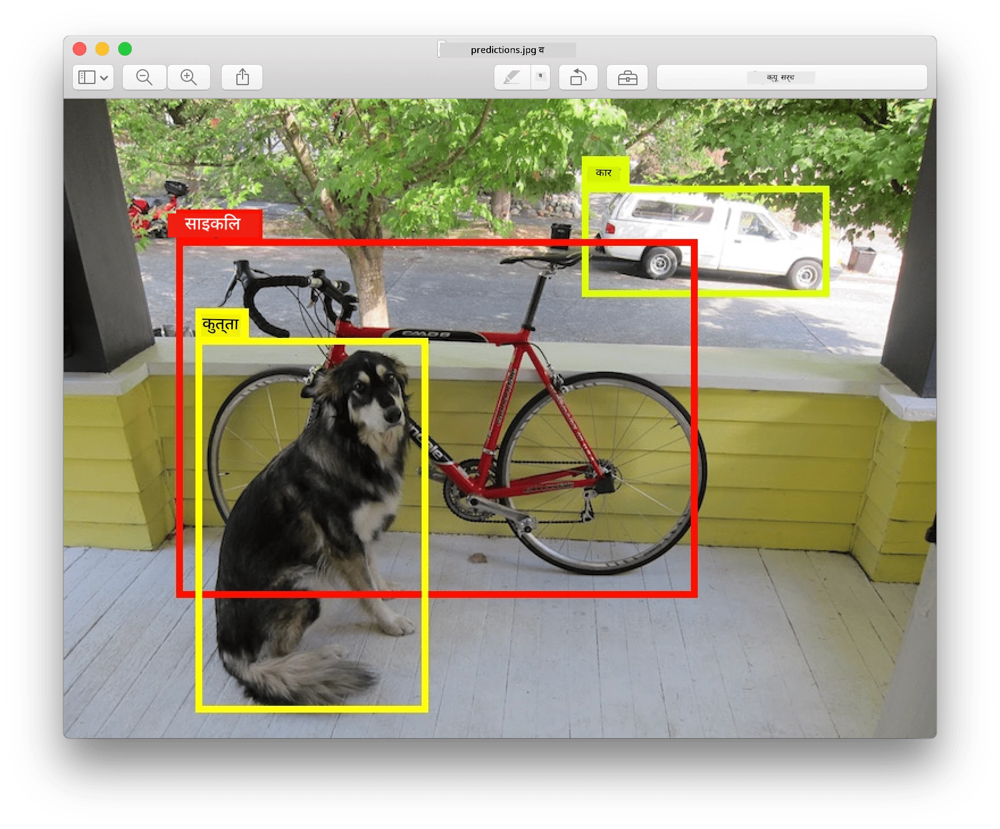
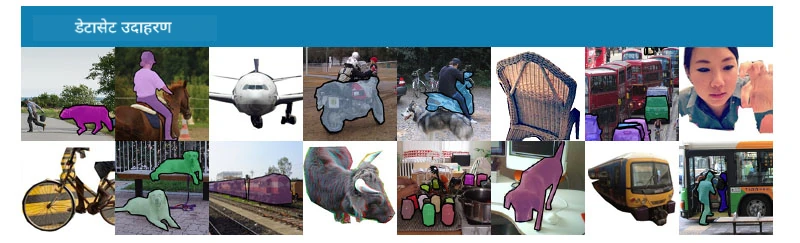
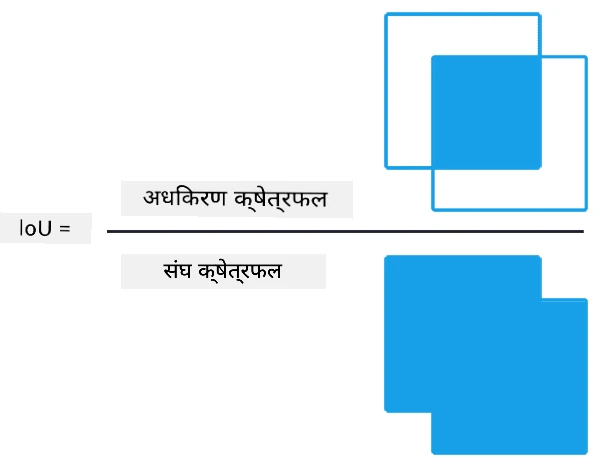
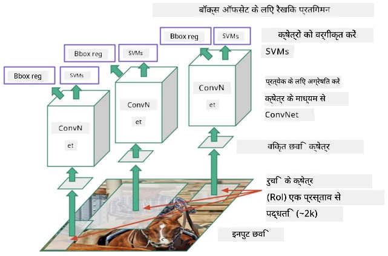
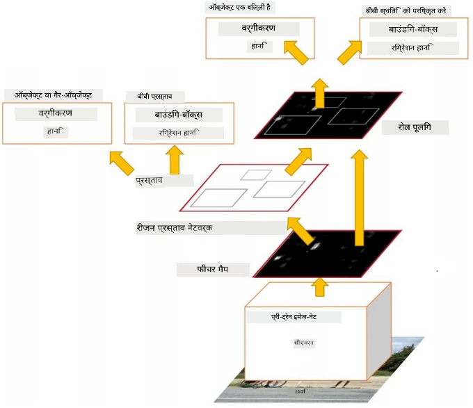
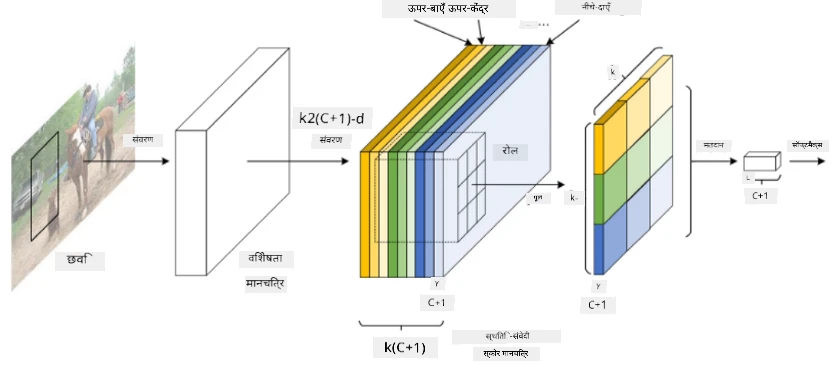
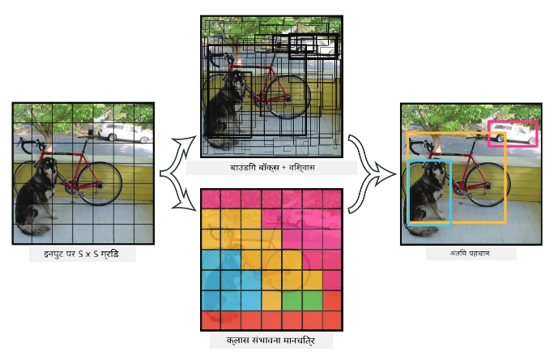

# ऑब्जेक्ट डिटेक्शन

अब तक हमने जिन इमेज क्लासिफिकेशन मॉडल्स का उपयोग किया है, वे एक इमेज लेते हैं और एक श्रेणीबद्ध परिणाम देते हैं, जैसे कि MNIST समस्या में 'नंबर' क्लास। हालांकि, कई मामलों में हम केवल यह जानना नहीं चाहते कि तस्वीर में वस्तुएं हैं - हम उनकी सटीक लोकेशन भी जानना चाहते हैं। यही **ऑब्जेक्ट डिटेक्शन** का उद्देश्य है।

## [प्री-लेक्चर क्विज़](https://ff-quizzes.netlify.app/en/ai/quiz/21)

> इमेज [YOLO v2 वेबसाइट](https://pjreddie.com/darknet/yolov2/) से

## ऑब्जेक्ट डिटेक्शन के लिए एक साधारण दृष्टिकोण

मान लीजिए कि हम एक तस्वीर में बिल्ली को ढूंढना चाहते हैं, तो ऑब्जेक्ट डिटेक्शन के लिए एक बहुत ही साधारण दृष्टिकोण निम्नलिखित होगा:

1. तस्वीर को कई टाइल्स में विभाजित करें।
2. प्रत्येक टाइल पर इमेज क्लासिफिकेशन चलाएं।
3. जिन टाइल्स में पर्याप्त उच्च सक्रियता होती है, उन्हें उस वस्तु को शामिल करने वाला माना जा सकता है।

> *इमेज [एक्सरसाइज नोटबुक](ObjectDetection-TF.ipynb) से*

हालांकि, यह दृष्टिकोण आदर्श नहीं है, क्योंकि यह एल्गोरिदम को वस्तु के बॉक्स की लोकेशन को बहुत ही अनिश्चित रूप से निर्धारित करने की अनुमति देता है। अधिक सटीक लोकेशन के लिए, हमें **रेग्रेशन** का उपयोग करके बॉक्स के निर्देशांक की भविष्यवाणी करनी होगी - और इसके लिए हमें विशिष्ट डेटासेट्स की आवश्यकता होती है।

## ऑब्जेक्ट डिटेक्शन के लिए रिग्रेशन

[यह ब्लॉग पोस्ट](https://towardsdatascience.com/object-detection-with-neural-networks-a4e2c46b4491) आकृतियों का पता लगाने के लिए एक शानदार परिचय प्रदान करता है।

## ऑब्जेक्ट डिटेक्शन के लिए डेटासेट्स

आप इस कार्य के लिए निम्नलिखित डेटासेट्स का सामना कर सकते हैं:

* [PASCAL VOC](http://host.robots.ox.ac.uk/pascal/VOC/) - 20 क्लासेस
* [COCO](http://cocodataset.org/#home) - कॉमन ऑब्जेक्ट्स इन कॉन्टेक्स्ट। 80 क्लासेस, बॉक्स और सेगमेंटेशन मास्क्स

## ऑब्जेक्ट डिटेक्शन मेट्रिक्स

### इंटरसेक्शन ओवर यूनियन

जहां इमेज क्लासिफिकेशन के लिए एल्गोरिदम के प्रदर्शन को मापना आसान है, वहीं ऑब्जेक्ट डिटेक्शन के लिए हमें क्लास की सही पहचान और बॉक्स की लोकेशन की सटीकता दोनों को मापना होता है। लोकेशन की सटीकता के लिए, हम **इंटरसेक्शन ओवर यूनियन** (IoU) का उपयोग करते हैं, जो मापता है कि दो बॉक्स (या दो क्षेत्र) कितने अच्छे से ओवरलैप करते हैं।

> *फिगर 2 [इस उत्कृष्ट ब्लॉग पोस्ट](https://pyimagesearch.com/2016/11/07/intersection-over-union-iou-for-object-detection/) से*

आइडिया सरल है - हम दो आकृतियों के बीच इंटरसेक्शन के क्षेत्र को उनके यूनियन के क्षेत्र से विभाजित करते हैं। दो समान क्षेत्रों के लिए, IoU 1 होगा, जबकि पूरी तरह से अलग क्षेत्रों के लिए यह 0 होगा। अन्यथा यह 0 से 1 के बीच होगा। हम आमतौर पर केवल उन बॉक्स को मानते हैं जिनका IoU एक निश्चित मान से ऊपर होता है।

### एवरेज प्रिसिजन

मान लीजिए कि हम किसी दिए गए क्लास $C$ की पहचान को मापना चाहते हैं। इसे मापने के लिए हम **एवरेज प्रिसिजन** मेट्रिक्स का उपयोग करते हैं, जो निम्नलिखित तरीके से गणना की जाती है:

1. प्रिसिजन-रिकॉल कर्व दिखाता है कि डिटेक्शन थ्रेशोल्ड मान (0 से 1 तक) के आधार पर सटीकता कैसे बदलती है।
2. थ्रेशोल्ड के आधार पर, हमें इमेज में अधिक या कम वस्तुएं मिलेंगी, और प्रिसिजन और रिकॉल के अलग-अलग मान मिलेंगे।
3. कर्व इस प्रकार दिखेगा:

> *इमेज [NeuroWorkshop](http://github.com/shwars/NeuroWorkshop) से*

किसी दिए गए क्लास $C$ के लिए एवरेज प्रिसिजन इस कर्व के नीचे का क्षेत्र है। अधिक सटीक रूप से, रिकॉल एक्सिस को आमतौर पर 10 भागों में विभाजित किया जाता है, और प्रिसिजन को इन सभी बिंदुओं पर औसत किया जाता है:

$$
AP = {1\over11}\sum_{i=0}^{10}\mbox{Precision}(\mbox{Recall}={i\over10})
$$

### AP और IoU

हम केवल उन डिटेक्शन को मानेंगे जिनका IoU एक निश्चित मान से ऊपर है। उदाहरण के लिए, PASCAL VOC डेटासेट में आमतौर पर $\mbox{IoU Threshold} = 0.5$ माना जाता है, जबकि COCO में AP विभिन्न $\mbox{IoU Threshold}$ मानों के लिए मापा जाता है।

> *इमेज [NeuroWorkshop](http://github.com/shwars/NeuroWorkshop) से*

### मीन एवरेज प्रिसिजन - mAP

ऑब्जेक्ट डिटेक्शन के लिए मुख्य मेट्रिक **मीन एवरेज प्रिसिजन** या **mAP** कहलाती है। यह एवरेज प्रिसिजन का मान है, जो सभी ऑब्जेक्ट क्लासेस और कभी-कभी $\mbox{IoU Threshold}$ पर औसत होता है। अधिक विस्तार से, **mAP** की गणना की प्रक्रिया
[इस ब्लॉग पोस्ट](https://medium.com/@timothycarlen/understanding-the-map-evaluation-metric-for-object-detection-a07fe6962cf3) में वर्णित है, और [यहां कोड नमूनों के साथ](https://gist.github.com/tarlen5/008809c3decf19313de216b9208f3734) भी।

## ऑब्जेक्ट डिटेक्शन के विभिन्न दृष्टिकोण

ऑब्जेक्ट डिटेक्शन एल्गोरिदम की दो व्यापक श्रेणियां हैं:

* **रीजन प्रपोजल नेटवर्क्स** (R-CNN, Fast R-CNN, Faster R-CNN)। मुख्य विचार है **रीजन ऑफ इंटरेस्ट्स** (ROI) उत्पन्न करना और उनके ऊपर CNN चलाना, अधिकतम सक्रियता की तलाश करना। यह साधारण दृष्टिकोण के समान है, सिवाय इसके कि ROI अधिक चतुर तरीके से उत्पन्न किए जाते हैं। इस प्रकार के तरीकों की एक बड़ी कमी यह है कि वे धीमे होते हैं, क्योंकि हमें इमेज पर CNN क्लासिफायर के कई पास चलाने की आवश्यकता होती है।
* **वन-पास** (YOLO, SSD, RetinaNet) विधियां। इन आर्किटेक्चर में हम नेटवर्क को एक ही पास में क्लासेस और ROI की भविष्यवाणी करने के लिए डिज़ाइन करते हैं।

### R-CNN: रीजन-बेस्ड CNN

[R-CNN](http://islab.ulsan.ac.kr/files/announcement/513/rcnn_pami.pdf) [Selective Search](http://www.huppelen.nl/publications/selectiveSearchDraft.pdf) का उपयोग करता है ताकि ROI क्षेत्रों की एक पदानुक्रमित संरचना उत्पन्न की जा सके, जिन्हें फिर CNN फीचर एक्सट्रैक्टर्स और SVM-क्लासिफायर के माध्यम से पास किया जाता है ताकि ऑब्जेक्ट क्लास निर्धारित किया जा सके, और *बॉक्स* निर्देशांक निर्धारित करने के लिए लीनियर रिग्रेशन का उपयोग किया जाता है। [आधिकारिक पेपर](https://arxiv.org/pdf/1506.01497v1.pdf)

> *इमेज van de Sande et al. ICCV’11 से*

> *इमेज [इस ब्लॉग](https://towardsdatascience.com/r-cnn-fast-r-cnn-faster-r-cnn-yolo-object-detection-algorithms-36d53571365e) से*

### F-RCNN - फास्ट R-CNN

यह दृष्टिकोण R-CNN के समान है, लेकिन रीजन को परिभाषित किया जाता है जब कॉन्वोल्यूशन लेयर्स लागू हो चुकी होती हैं।

> इमेज [आधिकारिक पेपर](https://www.cv-foundation.org/openaccess/content_iccv_2015/papers/Girshick_Fast_R-CNN_ICCV_2015_paper.pdf), [arXiv](https://arxiv.org/pdf/1504.08083.pdf), 2015 से

### Faster R-CNN

इस दृष्टिकोण का मुख्य विचार है कि रीजन की भविष्यवाणी करने के लिए न्यूरल नेटवर्क का उपयोग किया जाए - जिसे *रीजन प्रपोजल नेटवर्क* कहा जाता है। [पेपर](https://arxiv.org/pdf/1506.01497.pdf), 2016

> इमेज [आधिकारिक पेपर](https://arxiv.org/pdf/1506.01497.pdf) से

### R-FCN: रीजन-बेस्ड फुली कॉन्वोल्यूशनल नेटवर्क

यह एल्गोरिदम Faster R-CNN से भी तेज है। मुख्य विचार निम्नलिखित है:

1. हम ResNet-101 का उपयोग करके फीचर्स निकालते हैं।
2. फीचर्स को **पोजिशन-सेंसिटिव स्कोर मैप** द्वारा प्रोसेस किया जाता है। $C$ क्लासेस के प्रत्येक ऑब्जेक्ट को $k\times k$ क्षेत्रों में विभाजित किया जाता है, और हम ऑब्जेक्ट्स के भागों की भविष्यवाणी करने के लिए प्रशिक्षण देते हैं।
3. $k\times k$ क्षेत्रों के प्रत्येक भाग के लिए सभी नेटवर्क ऑब्जेक्ट क्लासेस के लिए वोट करते हैं, और अधिकतम वोट वाले ऑब्जेक्ट क्लास को चुना जाता है।

> इमेज [आधिकारिक पेपर](https://arxiv.org/abs/1605.06409) से

### YOLO - यू ओनली लुक वन्स

YOLO एक रियलटाइम वन-पास एल्गोरिदम है। मुख्य विचार निम्नलिखित है:

 * इमेज को $S\times S$ क्षेत्रों में विभाजित किया जाता है।
 * प्रत्येक क्षेत्र के लिए, **CNN** $n$ संभावित ऑब्जेक्ट्स, *बॉक्स* निर्देशांक और *कॉन्फिडेंस*=*प्रोबेबिलिटी* * IoU की भविष्यवाणी करता है।

 

> इमेज [आधिकारिक पेपर](https://arxiv.org/abs/1506.02640) से

### अन्य एल्गोरिदम

* RetinaNet: [आधिकारिक पेपर](https://arxiv.org/abs/1708.02002)
   - [Torchvision में PyTorch इम्प्लीमेंटेशन](https://pytorch.org/vision/stable/_modules/torchvision/models/detection/retinanet.html)
   - [Keras इम्प्लीमेंटेशन](https://github.com/fizyr/keras-retinanet)
   - [RetinaNet के साथ ऑब्जेक्ट डिटेक्शन](https://keras.io/examples/vision/retinanet/) Keras सैंपल्स में
* SSD (सिंगल शॉट डिटेक्टर): [आधिकारिक पेपर](https://arxiv.org/abs/1512.02325)

## ✍️ एक्सरसाइज: ऑब्जेक्ट डिटेक्शन

अपनी सीख को निम्नलिखित नोटबुक में जारी रखें:

[ObjectDetection.ipynb](ObjectDetection.ipynb)

## निष्कर्ष

इस पाठ में आपने ऑब्जेक्ट डिटेक्शन को पूरा करने के विभिन्न तरीकों का एक संक्षिप्त दौरा किया!

## 🚀 चुनौती

इन लेखों और नोटबुक्स को पढ़ें और YOLO को स्वयं आजमाएं:

* [YOLO का वर्णन करने वाला अच्छा ब्लॉग पोस्ट](https://www.analyticsvidhya.com/blog/2018/12/practical-guide-object-detection-yolo-framewor-python/)
 * [आधिकारिक साइट](https://pjreddie.com/darknet/yolo/)
 * YOLO: [Keras इम्प्लीमेंटेशन](https://github.com/experiencor/keras-yolo2), [स्टेप-बाय-स्टेप नोटबुक](https://github.com/experiencor/basic-yolo-keras/blob/master/Yolo%20Step-by-Step.ipynb)
 * YOLO v2: [Keras इम्प्लीमेंटेशन](https://github.com/experiencor/keras-yolo2), [स्टेप-बाय-स्टेप नोटबुक](https://github.com/experiencor/keras-yolo2/blob/master/Yolo%20Step-by-Step.ipynb)

## [पोस्ट-लेक्चर क्विज़](https://ff-quizzes.netlify.app/en/ai/quiz/22)

## समीक्षा और स्व-अध्ययन

* [ऑब्जेक्ट डिटेक्शन](https://tjmachinelearning.com/lectures/1718/obj/) निखिल सरदाना द्वारा
* [ऑब्जेक्ट डिटेक्शन एल्गोरिदम्स की अच्छी तुलना](https://lilianweng.github.io/lil-log/2018/12/27/object-detection-part-4.html)
* [ऑब्जेक्ट डिटेक्शन के लिए डीप लर्निंग एल्गोरिदम्स की समीक्षा](https://medium.com/comet-app/review-of-deep-learning-algorithms-for-object-detection-c1f3d437b852)
* [ऑब्जेक्ट डिटेक्शन एल्गोरिदम्स का चरण-दर-चरण परिचय](https://www.analyticsvidhya.com/blog/2018/10/a-step-by-step-introduction-to-the-basic-object-detection-algorithms-part-1/)
* [Python में Faster R-CNN का इम्प्लीमेंटेशन ऑब्जेक्ट डिटेक्शन के लिए](https://www.analyticsvidhya.com/blog/2018/11/implementation-faster-r-cnn-python-object-detection/)

## [असाइनमेंट: ऑब्जेक्ट डिटेक्शन](lab/README.md)

---

