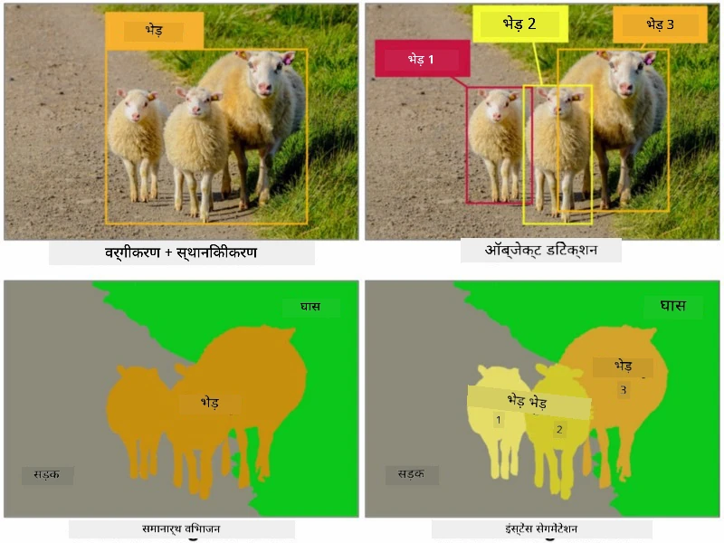
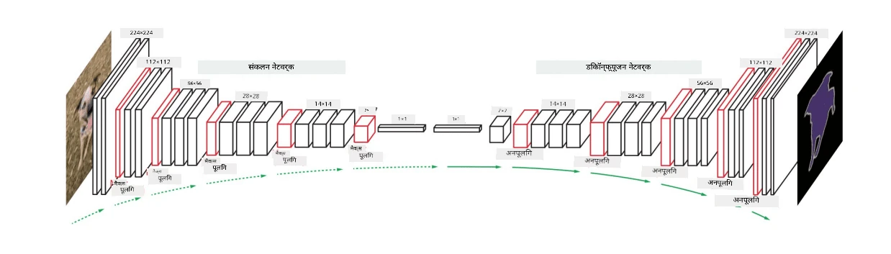
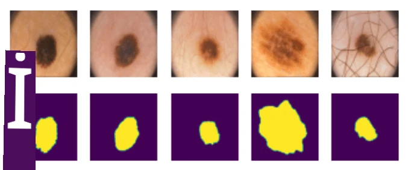

# विभाजन

हमने पहले ऑब्जेक्ट डिटेक्शन के बारे में सीखा था, जो हमें *बाउंडिंग बॉक्सेस* की भविष्यवाणी करके इमेज में ऑब्जेक्ट्स को लोकेट करने की अनुमति देता है। हालांकि, कुछ कार्यों के लिए हमें केवल बाउंडिंग बॉक्सेस की आवश्यकता नहीं होती, बल्कि ऑब्जेक्ट्स का अधिक सटीक स्थानीयकरण चाहिए। इस कार्य को **विभाजन (Segmentation)** कहा जाता है।

## [प्री-लेक्चर क्विज़](https://ff-quizzes.netlify.app/en/ai/quiz/23)

विभाजन को **पिक्सल वर्गीकरण** के रूप में देखा जा सकता है, जिसमें इमेज के **प्रत्येक** पिक्सल के लिए हमें उसकी क्लास की भविष्यवाणी करनी होती है (*बैकग्राउंड* भी एक क्लास होती है)। विभाजन के दो मुख्य एल्गोरिदम हैं:

* **सामान्य विभाजन (Semantic Segmentation)** केवल पिक्सल की क्लास बताता है और एक ही क्लास के अलग-अलग ऑब्जेक्ट्स के बीच अंतर नहीं करता।
* **इंस्टेंस विभाजन (Instance Segmentation)** क्लासेस को अलग-अलग इंस्टेंस में विभाजित करता है।

उदाहरण के लिए, इंस्टेंस विभाजन में ये भेड़ें अलग-अलग ऑब्जेक्ट्स हैं, लेकिन सामान्य विभाजन में सभी भेड़ों को एक ही क्लास के रूप में दिखाया जाता है।

> इमेज [इस ब्लॉग पोस्ट](https://nirmalamurali.medium.com/image-classification-vs-semantic-segmentation-vs-instance-segmentation-625c33a08d50) से ली गई है

विभाजन के लिए विभिन्न न्यूरल आर्किटेक्चर हैं, लेकिन उनकी संरचना समान होती है। एक तरह से, यह उस ऑटोएन्कोडर के समान है जिसके बारे में आपने पहले सीखा था, लेकिन यहां हमारा लक्ष्य मूल इमेज को डीकंस्ट्रक्ट करने के बजाय एक **मास्क** को डीकंस्ट्रक्ट करना है। इस प्रकार, विभाजन नेटवर्क में निम्नलिखित भाग होते हैं:

* **एन्कोडर (Encoder)** इनपुट इमेज से फीचर्स निकालता है।
* **डीकोडर (Decoder)** उन फीचर्स को **मास्क इमेज** में बदलता है, जिसका आकार और चैनल्स की संख्या क्लासेस की संख्या के अनुरूप होती है।

> इमेज [इस प्रकाशन](https://arxiv.org/pdf/2001.05566.pdf) से ली गई है

हमें विशेष रूप से उस लॉस फंक्शन का उल्लेख करना चाहिए जो विभाजन के लिए उपयोग किया जाता है। जब क्लासिकल ऑटोएन्कोडर्स का उपयोग करते हैं, तो हमें दो इमेजेस के बीच समानता को मापने की आवश्यकता होती है, और इसके लिए हम मीन स्क्वायर एरर (MSE) का उपयोग कर सकते हैं। विभाजन में, टारगेट मास्क इमेज का प्रत्येक पिक्सल क्लास नंबर को दर्शाता है (तीसरे आयाम के साथ वन-हॉट-एन्कोडेड), इसलिए हमें वर्गीकरण के लिए विशिष्ट लॉस फंक्शन का उपयोग करना होता है - क्रॉस-एंट्रॉपी लॉस, जिसे सभी पिक्सल्स पर औसत किया जाता है। यदि मास्क बाइनरी है, तो **बाइनरी क्रॉस-एंट्रॉपी लॉस** (BCE) का उपयोग किया जाता है।

> ✅ वन-हॉट एन्कोडिंग एक तकनीक है जिसमें क्लास लेबल को क्लासेस की संख्या के बराबर लंबाई वाले वेक्टर में एन्कोड किया जाता है। [इस लेख](https://datagy.io/sklearn-one-hot-encode/) में इस तकनीक के बारे में अधिक जानें।

## मेडिकल इमेजिंग के लिए विभाजन

इस पाठ में, हम विभाजन को क्रियान्वित होते हुए देखेंगे, जहां नेटवर्क को मेडिकल इमेजेस में मानव नेवी (जिसे मोल्स भी कहा जाता है) को पहचानने के लिए प्रशिक्षित किया जाएगा। हम <a href="https://www.fc.up.pt/addi/ph2%20database.html">PH2 डेटाबेस</a> का उपयोग करेंगे, जो डर्मोस्कोपी इमेजेस का स्रोत है। इस डेटासेट में तीन क्लासेस के 200 इमेजेस हैं: सामान्य नेवस, असामान्य नेवस, और मेलानोमा। सभी इमेजेस में एक संबंधित **मास्क** भी होता है जो नेवस को दर्शाता है।

> ✅ यह तकनीक इस प्रकार की मेडिकल इमेजिंग के लिए विशेष रूप से उपयुक्त है, लेकिन आप अन्य वास्तविक दुनिया के अनुप्रयोगों की कल्पना कैसे कर सकते हैं?

> इमेज PH2 डेटाबेस से ली गई है

हम एक मॉडल को प्रशिक्षित करेंगे जो किसी भी नेवस को उसके बैकग्राउंड से अलग कर सके।

## ✍️ अभ्यास: सामान्य विभाजन

नीचे दिए गए नोटबुक्स खोलें ताकि आप विभिन्न सामान्य विभाजन आर्किटेक्चर के बारे में अधिक जान सकें, उनके साथ अभ्यास कर सकें, और उन्हें क्रियान्वित होते हुए देख सकें।

* [सामान्य विभाजन PyTorch](SemanticSegmentationPytorch.ipynb)
* [सामान्य विभाजन TensorFlow](SemanticSegmentationTF.ipynb)

## [पोस्ट-लेक्चर क्विज़](https://ff-quizzes.netlify.app/en/ai/quiz/24)

## निष्कर्ष

विभाजन इमेज वर्गीकरण के लिए एक बहुत ही शक्तिशाली तकनीक है, जो बाउंडिंग बॉक्सेस से आगे बढ़कर पिक्सल-स्तरीय वर्गीकरण तक जाती है। यह तकनीक मेडिकल इमेजिंग सहित अन्य अनुप्रयोगों में उपयोग की जाती है।

## 🚀 चुनौती

शरीर विभाजन इमेजेस में लोगों के साथ किए जाने वाले सामान्य कार्यों में से एक है। अन्य महत्वपूर्ण कार्यों में **कंकाल पहचान** और **पोज़ पहचान** शामिल हैं। [OpenPose](https://github.com/CMU-Perceptual-Computing-Lab/openpose) लाइब्रेरी को आज़माएं और देखें कि पोज़ पहचान का उपयोग कैसे किया जा सकता है।

## समीक्षा और स्व-अध्ययन

यह [विकिपीडिया लेख](https://wikipedia.org/wiki/Image_segmentation) इस तकनीक के विभिन्न अनुप्रयोगों का अच्छा अवलोकन प्रदान करता है। इस क्षेत्र में इंस्टेंस विभाजन और पैनॉप्टिक विभाजन के उप-डोमेन के बारे में स्वयं अधिक जानें।

## [असाइनमेंट](lab/README.md)

इस लैब में, [Segmentation Full Body MADS Dataset](https://www.kaggle.com/datasets/tapakah68/segmentation-full-body-mads-dataset) का उपयोग करके **मानव शरीर विभाजन** करने का प्रयास करें।

---

