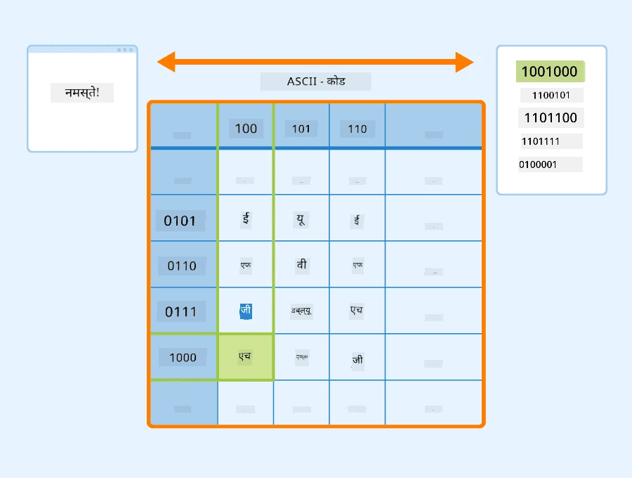
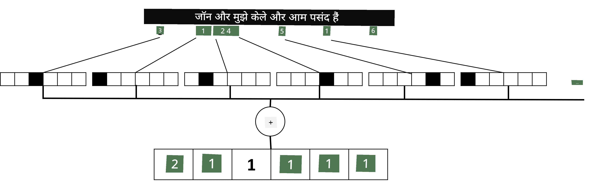

# टेक्स्ट को टेंसर के रूप में प्रस्तुत करना

## [प्री-लेक्चर क्विज़](https://ff-quizzes.netlify.app/en/ai/quiz/25)

## टेक्स्ट वर्गीकरण

इस सेक्शन के पहले भाग में, हम **टेक्स्ट वर्गीकरण** कार्य पर ध्यान केंद्रित करेंगे। हम [AG News](https://www.kaggle.com/amananandrai/ag-news-classification-dataset) डेटासेट का उपयोग करेंगे, जिसमें निम्नलिखित जैसे समाचार लेख शामिल हैं:

* श्रेणी: विज्ञान/तकनीक  
* शीर्षक: Ky. कंपनी को पेप्टाइड्स पर अध्ययन के लिए अनुदान मिला (AP)  
* बॉडी: AP - लुइसविले विश्वविद्यालय के एक रसायन शोधकर्ता द्वारा स्थापित एक कंपनी को विकास के लिए अनुदान मिला...  

हमारा लक्ष्य टेक्स्ट के आधार पर समाचार आइटम को श्रेणियों में वर्गीकृत करना होगा।

## टेक्स्ट को प्रस्तुत करना

यदि हम न्यूरल नेटवर्क के साथ प्राकृतिक भाषा प्रसंस्करण (NLP) कार्यों को हल करना चाहते हैं, तो हमें टेक्स्ट को टेंसर के रूप में प्रस्तुत करने का कोई तरीका चाहिए। कंप्यूटर पहले से ही ASCII या UTF-8 जैसे एन्कोडिंग का उपयोग करके आपके स्क्रीन पर फोंट को मैप करने वाले संख्याओं के रूप में टेक्स्ट वर्णों को प्रस्तुत करते हैं।

> [छवि स्रोत](https://www.seobility.net/en/wiki/ASCII)

मनुष्य के रूप में, हम समझते हैं कि प्रत्येक अक्षर **क्या दर्शाता है**, और सभी वर्ण एक साथ मिलकर वाक्य के शब्द कैसे बनाते हैं। हालांकि, कंप्यूटर स्वयं ऐसा समझ नहीं पाते हैं, और न्यूरल नेटवर्क को प्रशिक्षण के दौरान अर्थ सीखना पड़ता है।

इसलिए, टेक्स्ट को प्रस्तुत करने के लिए हम विभिन्न दृष्टिकोणों का उपयोग कर सकते हैं:

* **वर्ण-स्तरीय प्रतिनिधित्व**, जिसमें हम टेक्स्ट को प्रत्येक वर्ण को एक संख्या के रूप में मानते हुए प्रस्तुत करते हैं। मान लें कि हमारे टेक्स्ट कॉर्पस में *C* अलग-अलग वर्ण हैं, तो शब्द *Hello* को 5x*C* टेंसर के रूप में प्रस्तुत किया जाएगा। प्रत्येक अक्षर को वन-हॉट एन्कोडिंग में एक टेंसर कॉलम के रूप में दर्शाया जाएगा।  
* **शब्द-स्तरीय प्रतिनिधित्व**, जिसमें हम अपने टेक्स्ट के सभी शब्दों का एक **शब्दकोश** बनाते हैं और फिर शब्दों को वन-हॉट एन्कोडिंग का उपयोग करके प्रस्तुत करते हैं। यह दृष्टिकोण कुछ हद तक बेहतर है, क्योंकि प्रत्येक अक्षर अपने आप में बहुत अधिक अर्थ नहीं रखता है, और इसलिए उच्च-स्तरीय अर्थपूर्ण अवधारणाओं - शब्दों - का उपयोग करके हम न्यूरल नेटवर्क के लिए कार्य को सरल बनाते हैं। हालांकि, बड़े शब्दकोश आकार के कारण, हमें उच्च-आयामी विरल टेंसर से निपटना पड़ता है।  

प्रतिनिधित्व चाहे जो भी हो, हमें पहले टेक्स्ट को **टोकन** की एक अनुक्रम में बदलना होगा, जिसमें एक टोकन एक वर्ण, एक शब्द, या कभी-कभी एक शब्द का हिस्सा हो सकता है। फिर, हम टोकन को एक संख्या में बदलते हैं, आमतौर पर **शब्दकोश** का उपयोग करके, और इस संख्या को वन-हॉट एन्कोडिंग के माध्यम से न्यूरल नेटवर्क में फीड किया जा सकता है।

## एन-ग्राम्स

प्राकृतिक भाषा में, शब्दों का सटीक अर्थ केवल संदर्भ में ही निर्धारित किया जा सकता है। उदाहरण के लिए, *न्यूरल नेटवर्क* और *फिशिंग नेटवर्क* के अर्थ पूरी तरह से अलग हैं। इसे ध्यान में रखने के तरीकों में से एक है कि हम अपने मॉडल को शब्दों के जोड़ों पर बनाएं और शब्द जोड़ों को अलग-अलग शब्दकोश टोकन के रूप में मानें। इस तरह, वाक्य *I like to go fishing* को निम्नलिखित टोकन अनुक्रम द्वारा प्रस्तुत किया जाएगा: *I like*, *like to*, *to go*, *go fishing*। इस दृष्टिकोण की समस्या यह है कि शब्दकोश का आकार काफी बढ़ जाता है, और *go fishing* और *go shopping* जैसे संयोजन अलग-अलग टोकन द्वारा प्रस्तुत किए जाते हैं, जो समान क्रिया के बावजूद कोई अर्थपूर्ण समानता साझा नहीं करते हैं।  

कुछ मामलों में, हम त्रि-ग्राम्स -- तीन शब्दों के संयोजन -- का उपयोग करने पर विचार कर सकते हैं। इस प्रकार इस दृष्टिकोण को अक्सर **एन-ग्राम्स** कहा जाता है। साथ ही, वर्ण-स्तरीय प्रतिनिधित्व के साथ एन-ग्राम्स का उपयोग करना समझ में आता है, जिसमें एन-ग्राम्स मोटे तौर पर विभिन्न शब्दांशों के अनुरूप होंगे।

## बैग-ऑफ-वर्ड्स और TF/IDF

जब हम टेक्स्ट वर्गीकरण जैसे कार्यों को हल कर रहे होते हैं, तो हमें टेक्स्ट को एक निश्चित आकार के वेक्टर द्वारा प्रस्तुत करने में सक्षम होना चाहिए, जिसे हम अंतिम घने वर्गीकरणकर्ता के इनपुट के रूप में उपयोग करेंगे। इसे करने के सबसे सरल तरीकों में से एक है सभी व्यक्तिगत शब्द प्रतिनिधित्वों को जोड़ना, जैसे कि उन्हें जोड़कर। यदि हम प्रत्येक शब्द की वन-हॉट एन्कोडिंग को जोड़ते हैं, तो हमें आवृत्तियों का एक वेक्टर मिलेगा, जो दिखाएगा कि टेक्स्ट के अंदर प्रत्येक शब्द कितनी बार दिखाई देता है। टेक्स्ट का ऐसा प्रतिनिधित्व **बैग ऑफ वर्ड्स** (BoW) कहलाता है।

> लेखक द्वारा बनाई गई छवि

BoW मूल रूप से यह दर्शाता है कि टेक्स्ट में कौन से शब्द और किस मात्रा में दिखाई देते हैं, जो वास्तव में यह संकेत देने के लिए अच्छा हो सकता है कि टेक्स्ट किस बारे में है। उदाहरण के लिए, राजनीति पर समाचार लेख में *president* और *country* जैसे शब्द होने की संभावना है, जबकि वैज्ञानिक प्रकाशन में *collider*, *discovered* जैसे शब्द हो सकते हैं। इस प्रकार, शब्द आवृत्तियां कई मामलों में टेक्स्ट सामग्री का अच्छा संकेतक हो सकती हैं।

BoW की समस्या यह है कि कुछ सामान्य शब्द, जैसे *and*, *is*, आदि अधिकांश टेक्स्ट में दिखाई देते हैं, और उनकी उच्चतम आवृत्तियां होती हैं, जो वास्तव में महत्वपूर्ण शब्दों को छिपा देती हैं। हम इन शब्दों के महत्व को कम कर सकते हैं यदि हम पूरे दस्तावेज़ संग्रह में शब्दों के होने की आवृत्ति को ध्यान में रखें। यही मुख्य विचार है TF/IDF दृष्टिकोण के पीछे, जिसे इस पाठ से जुड़े नोटबुक्स में अधिक विस्तार से कवर किया गया है।

हालांकि, इनमें से कोई भी दृष्टिकोण टेक्स्ट के **अर्थ** को पूरी तरह से ध्यान में नहीं रख सकता। हमें इसे करने के लिए अधिक शक्तिशाली न्यूरल नेटवर्क मॉडल की आवश्यकता है, जिसे हम इस सेक्शन में बाद में चर्चा करेंगे।

## ✍️ अभ्यास: टेक्स्ट प्रतिनिधित्व

अगले नोटबुक्स में अपना सीखना जारी रखें:

* [PyTorch के साथ टेक्स्ट प्रतिनिधित्व](TextRepresentationPyTorch.ipynb)  
* [TensorFlow के साथ टेक्स्ट प्रतिनिधित्व](TextRepresentationTF.ipynb)  

## निष्कर्ष

अब तक, हमने ऐसी तकनीकों का अध्ययन किया है जो विभिन्न शब्दों को आवृत्ति भार दे सकती हैं। हालांकि, वे अर्थ या क्रम को प्रस्तुत करने में असमर्थ हैं। प्रसिद्ध भाषाविद् जे. आर. फर्थ ने 1935 में कहा था, "शब्द का पूरा अर्थ हमेशा संदर्भात्मक होता है, और संदर्भ से अलग अर्थ का कोई भी अध्ययन गंभीरता से नहीं लिया जा सकता।" हम इस पाठ्यक्रम में बाद में सीखेंगे कि भाषा मॉडलिंग का उपयोग करके टेक्स्ट से संदर्भात्मक जानकारी कैसे प्राप्त करें।

## 🚀 चुनौती

बैग-ऑफ-वर्ड्स और विभिन्न डेटा मॉडल का उपयोग करके कुछ अन्य अभ्यास आज़माएं। आप इस [Kaggle प्रतियोगिता](https://www.kaggle.com/competitions/word2vec-nlp-tutorial/overview/part-1-for-beginners-bag-of-words) से प्रेरित हो सकते हैं।

## [पोस्ट-लेक्चर क्विज़](https://ff-quizzes.netlify.app/en/ai/quiz/26)

## समीक्षा और स्व-अध्ययन

[Microsoft Learn](https://docs.microsoft.com/learn/modules/intro-natural-language-processing-pytorch/?WT.mc_id=academic-77998-cacaste) पर टेक्स्ट एम्बेडिंग और बैग-ऑफ-वर्ड्स तकनीकों के साथ अपने कौशल का अभ्यास करें।

## [असाइनमेंट: नोटबुक्स](assignment.md)

---

