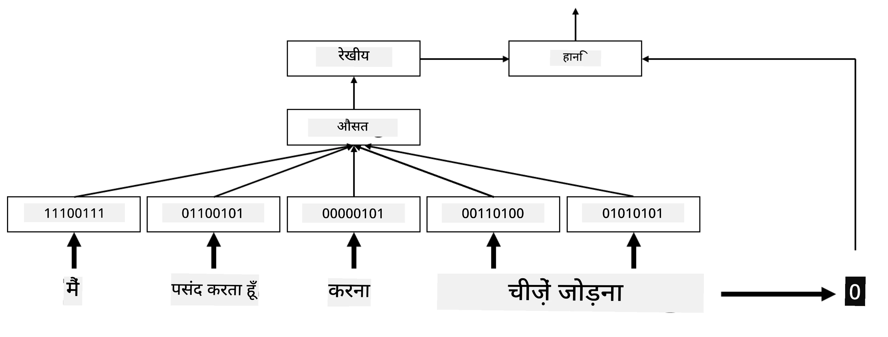
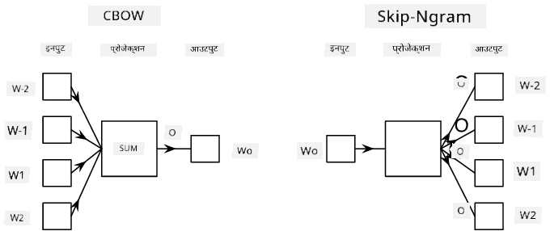

# एम्बेडिंग्स

## [प्री-लेक्चर क्विज़](https://ff-quizzes.netlify.app/en/ai/quiz/27)

जब हमने BoW या TF/IDF आधारित क्लासिफायर को ट्रेन किया, तो हम उच्च-आयामी बैग-ऑफ-वर्ड्स वेक्टर पर काम कर रहे थे, जिनकी लंबाई `vocab_size` थी। हम स्पष्ट रूप से निम्न-आयामी पोजिशनल रिप्रेजेंटेशन वेक्टर को स्पार्स वन-हॉट रिप्रेजेंटेशन में बदल रहे थे। हालांकि, यह वन-हॉट रिप्रेजेंटेशन मेमोरी-इफिशिएंट नहीं है। इसके अलावा, प्रत्येक शब्द को एक-दूसरे से स्वतंत्र रूप से माना जाता है, यानी वन-हॉट एनकोडेड वेक्टर शब्दों के बीच किसी भी सेमांटिक समानता को व्यक्त नहीं करते हैं।

**एम्बेडिंग** का विचार यह है कि शब्दों को निम्न-आयामी डेंस वेक्टर द्वारा दर्शाया जाए, जो किसी तरह शब्द के सेमांटिक अर्थ को प्रतिबिंबित करता है। हम बाद में चर्चा करेंगे कि सार्थक वर्ड एम्बेडिंग्स कैसे बनाई जाएं, लेकिन अभी के लिए, एम्बेडिंग्स को शब्द वेक्टर की आयामीयता को कम करने के तरीके के रूप में सोचें।

तो, एम्बेडिंग लेयर एक शब्द को इनपुट के रूप में लेगी और निर्दिष्ट `embedding_size` का आउटपुट वेक्टर उत्पन्न करेगी। एक तरह से, यह `Linear` लेयर के समान है, लेकिन वन-हॉट एनकोडेड वेक्टर लेने के बजाय, यह शब्द संख्या को इनपुट के रूप में ले सकेगी, जिससे बड़े वन-हॉट-एनकोडेड वेक्टर बनाने से बचा जा सके।

हमारे क्लासिफायर नेटवर्क में एम्बेडिंग लेयर को पहली लेयर के रूप में उपयोग करके, हम बैग-ऑफ-वर्ड्स से **एम्बेडिंग बैग** मॉडल में स्विच कर सकते हैं, जहां हम पहले अपने टेक्स्ट में प्रत्येक शब्द को संबंधित एम्बेडिंग में बदलते हैं और फिर उन सभी एम्बेडिंग्स पर कुछ समग्र फ़ंक्शन की गणना करते हैं, जैसे `sum`, `average` या `max`।  

> लेखक द्वारा बनाई गई छवि

## ✍️ अभ्यास: एम्बेडिंग्स

निम्नलिखित नोटबुक्स में अपना अध्ययन जारी रखें:
* [PyTorch के साथ एम्बेडिंग्स](EmbeddingsPyTorch.ipynb)
* [TensorFlow के साथ एम्बेडिंग्स](EmbeddingsTF.ipynb)

## सेमांटिक एम्बेडिंग्स: Word2Vec

हालांकि एम्बेडिंग लेयर ने शब्दों को वेक्टर रिप्रेजेंटेशन में मैप करना सीखा, लेकिन इस रिप्रेजेंटेशन में जरूरी नहीं कि बहुत अधिक सेमांटिक अर्थ हो। यह अच्छा होगा कि हम एक वेक्टर रिप्रेजेंटेशन सीखें, जिसमें समान शब्द या पर्यायवाची शब्द ऐसे वेक्टर के रूप में हों जो किसी वेक्टर दूरी (जैसे, Euclidean दूरी) के संदर्भ में एक-दूसरे के करीब हों।

इसके लिए, हमें अपने एम्बेडिंग मॉडल को एक बड़े टेक्स्ट संग्रह पर एक विशिष्ट तरीके से प्री-ट्रेन करना होगा। सेमांटिक एम्बेडिंग्स को ट्रेन करने का एक तरीका [Word2Vec](https://en.wikipedia.org/wiki/Word2vec) कहलाता है। यह दो मुख्य आर्किटेक्चर पर आधारित है, जो शब्दों का वितरित रिप्रेजेंटेशन उत्पन्न करने के लिए उपयोग किए जाते हैं:

 - **कंटीन्युअस बैग-ऑफ-वर्ड्स** (CBoW) — इस आर्किटेक्चर में, हम मॉडल को आस-पास के संदर्भ से एक शब्द की भविष्यवाणी करने के लिए ट्रेन करते हैं। दिए गए ngram $(W_{-2},W_{-1},W_0,W_1,W_2)$ में, मॉडल का लक्ष्य $(W_{-2},W_{-1},W_1,W_2)$ से $W_0$ की भविष्यवाणी करना है।
 - **कंटीन्युअस स्किप-ग्राम** CBoW के विपरीत है। मॉडल संदर्भ शब्दों की विंडो का उपयोग करके वर्तमान शब्द की भविष्यवाणी करता है।

CBoW तेज है, जबकि स्किप-ग्राम धीमा है, लेकिन यह दुर्लभ शब्दों को बेहतर तरीके से रिप्रेजेंट करता है।

> [इस पेपर](https://arxiv.org/pdf/1301.3781.pdf) से ली गई छवि

Word2Vec प्री-ट्रेंड एम्बेडिंग्स (और अन्य समान मॉडल, जैसे GloVe) को भी न्यूरल नेटवर्क्स में एम्बेडिंग लेयर के स्थान पर उपयोग किया जा सकता है। हालांकि, हमें शब्दावली के साथ काम करना होगा, क्योंकि Word2Vec/GloVe को प्री-ट्रेन करने के लिए उपयोग की गई शब्दावली हमारे टेक्स्ट कॉर्पस की शब्दावली से अलग हो सकती है। ऊपर दिए गए नोटबुक्स में देखें कि इस समस्या को कैसे हल किया जा सकता है।

## संदर्भात्मक एम्बेडिंग्स

पारंपरिक प्री-ट्रेंड एम्बेडिंग रिप्रेजेंटेशन जैसे Word2Vec की एक प्रमुख सीमा शब्द अर्थ अस्पष्टता की समस्या है। जबकि प्री-ट्रेंड एम्बेडिंग्स संदर्भ में शब्दों के कुछ अर्थ को कैप्चर कर सकती हैं, शब्द के हर संभावित अर्थ को एक ही एम्बेडिंग में एनकोड किया जाता है। यह डाउनस्ट्रीम मॉडल्स में समस्याएं पैदा कर सकता है, क्योंकि कई शब्द जैसे 'play' का अर्थ उनके उपयोग के संदर्भ पर निर्भर करता है।

उदाहरण के लिए, 'play' शब्द इन दो अलग-अलग वाक्यों में काफी अलग अर्थ रखता है:

- मैं थिएटर में एक **play** देखने गया।
- जॉन अपने दोस्तों के साथ **play** करना चाहता है।

ऊपर दिए गए प्री-ट्रेंड एम्बेडिंग्स 'play' शब्द के इन दोनों अर्थों को एक ही एम्बेडिंग में रिप्रेजेंट करते हैं। इस सीमा को दूर करने के लिए, हमें **भाषा मॉडल** पर आधारित एम्बेडिंग्स बनानी होंगी, जो बड़े टेक्स्ट कॉर्पस पर ट्रेन की गई हो और *जानती हो* कि शब्दों को विभिन्न संदर्भों में कैसे रखा जा सकता है। संदर्भात्मक एम्बेडिंग्स पर चर्चा करना इस ट्यूटोरियल के दायरे से बाहर है, लेकिन हम बाद में कोर्स में भाषा मॉडल्स पर चर्चा करते समय इन पर वापस आएंगे।

## निष्कर्ष

इस पाठ में, आपने सीखा कि TensorFlow और PyTorch में एम्बेडिंग लेयर कैसे बनाई और उपयोग की जाए ताकि शब्दों के सेमांटिक अर्थ को बेहतर तरीके से प्रतिबिंबित किया जा सके।

## 🚀 चुनौती

Word2Vec का उपयोग कुछ दिलचस्प अनुप्रयोगों के लिए किया गया है, जैसे गाने के बोल और कविता उत्पन्न करना। [इस लेख](https://www.politetype.com/blog/word2vec-color-poems) को देखें, जिसमें लेखक ने Word2Vec का उपयोग करके कविता उत्पन्न करने की प्रक्रिया को समझाया है। [Dan Shiffmann का यह वीडियो](https://www.youtube.com/watch?v=LSS_bos_TPI&ab_channel=TheCodingTrain) भी देखें, जिसमें इस तकनीक का एक अलग व्याख्यान दिया गया है। फिर इन तकनीकों को अपने टेक्स्ट कॉर्पस पर लागू करने का प्रयास करें, जिसे आप Kaggle से प्राप्त कर सकते हैं।

## [पोस्ट-लेक्चर क्विज़](https://ff-quizzes.netlify.app/en/ai/quiz/28)

## समीक्षा और स्व-अध्ययन

Word2Vec पर इस पेपर को पढ़ें: [Efficient Estimation of Word Representations in Vector Space](https://arxiv.org/pdf/1301.3781.pdf)

## [असाइनमेंट: नोटबुक्स](assignment.md)

---

