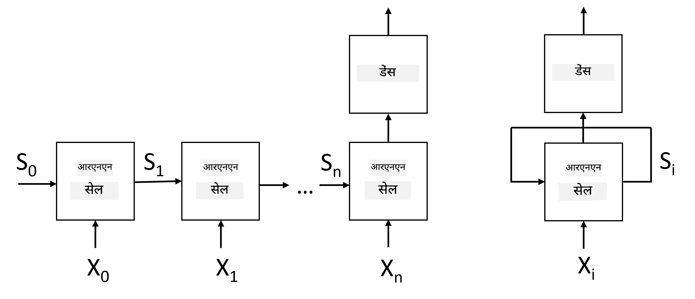
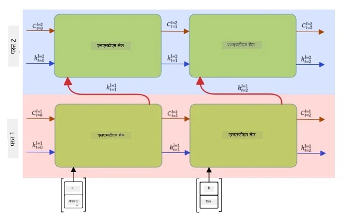

# पुनरावर्ती न्यूरल नेटवर्क्स

## [प्री-लेक्चर क्विज़](https://ff-quizzes.netlify.app/en/ai/quiz/31)

पिछले सेक्शन्स में, हमने टेक्स्ट के समृद्ध सेमांटिक रिप्रेजेंटेशन और उनके ऊपर एक साधारण लीनियर क्लासिफायर का उपयोग किया। यह आर्किटेक्चर वाक्य में शब्दों के समग्र अर्थ को पकड़ता है, लेकिन यह शब्दों के **क्रम** को ध्यान में नहीं रखता, क्योंकि एम्बेडिंग्स पर की गई एग्रीगेशन ऑपरेशन ने मूल टेक्स्ट से यह जानकारी हटा दी। चूंकि ये मॉडल शब्दों के क्रम को मॉडल नहीं कर सकते, वे टेक्स्ट जनरेशन या प्रश्नोत्तर जैसे अधिक जटिल या अस्पष्ट कार्यों को हल नहीं कर सकते।

टेक्स्ट अनुक्रम के अर्थ को पकड़ने के लिए, हमें एक अन्य न्यूरल नेटवर्क आर्किटेक्चर का उपयोग करना होगा, जिसे **पुनरावर्ती न्यूरल नेटवर्क** या RNN कहा जाता है। RNN में, हम अपने वाक्य को नेटवर्क के माध्यम से एक समय में एक प्रतीक पास करते हैं, और नेटवर्क कुछ **स्थिति** उत्पन्न करता है, जिसे हम अगले प्रतीक के साथ नेटवर्क में फिर से पास करते हैं।

> चित्र लेखक द्वारा

प्रतीकों के इनपुट अनुक्रम X0,...,Xn को देखते हुए, RNN एक न्यूरल नेटवर्क ब्लॉक्स का अनुक्रम बनाता है, और इस अनुक्रम को एंड-टू-एंड बैकप्रोपेगेशन का उपयोग करके प्रशिक्षित करता है। प्रत्येक नेटवर्क ब्लॉक (Xi,Si) की एक जोड़ी को इनपुट के रूप में लेता है, और परिणामस्वरूप Si+1 उत्पन्न करता है। अंतिम स्थिति Sn या (आउटपुट Yn) को परिणाम उत्पन्न करने के लिए एक लीनियर क्लासिफायर में भेजा जाता है। सभी नेटवर्क ब्लॉक्स समान वेट्स साझा करते हैं, और एक बैकप्रोपेगेशन पास का उपयोग करके एंड-टू-एंड प्रशिक्षित होते हैं।

चूंकि स्थिति वेक्टर S0,...,Sn नेटवर्क के माध्यम से पास होते हैं, यह शब्दों के बीच अनुक्रमिक निर्भरताओं को सीखने में सक्षम होता है। उदाहरण के लिए, जब अनुक्रम में कहीं *not* शब्द आता है, तो यह स्थिति वेक्टर के कुछ तत्वों को नकारात्मक बनाने के लिए सीख सकता है, जिससे नकारात्मकता उत्पन्न होती है।

> ✅ चूंकि ऊपर दिए गए चित्र में सभी RNN ब्लॉक्स के वेट्स साझा किए गए हैं, वही चित्र एक ब्लॉक (दाईं ओर) के रूप में दर्शाया जा सकता है, जिसमें एक पुनरावर्ती फीडबैक लूप होता है, जो नेटवर्क की आउटपुट स्थिति को इनपुट में वापस भेजता है।

## RNN सेल की संरचना

आइए देखें कि एक साधारण RNN सेल कैसे संगठित होता है। यह पिछले स्थिति Si-1 और वर्तमान प्रतीक Xi को इनपुट के रूप में स्वीकार करता है, और आउटपुट स्थिति Si उत्पन्न करता है (और, कभी-कभी, हम कुछ अन्य आउटपुट Yi में भी रुचि रखते हैं, जैसा कि जनरेटिव नेटवर्क्स के मामले में होता है)।

एक साधारण RNN सेल के अंदर दो वेट मैट्रिस होती हैं: एक इनपुट प्रतीक को ट्रांसफॉर्म करता है (इसे W कहते हैं), और दूसरा इनपुट स्थिति को ट्रांसफॉर्म करता है (H)। इस मामले में नेटवर्क का आउटपुट &sigma;(W&times;Xi+H&times;Si-1+b) के रूप में गणना किया जाता है, जहां &sigma; सक्रियण फ़ंक्शन है और b अतिरिक्त बायस है।

> चित्र लेखक द्वारा

कई मामलों में, इनपुट प्रतीकों को RNN में प्रवेश करने से पहले एम्बेडिंग लेयर के माध्यम से पास किया जाता है ताकि आयाम को कम किया जा सके। इस मामले में, यदि इनपुट वेक्टर का आयाम *emb_size* है, और स्थिति वेक्टर का आयाम *hid_size* है - तो W का आकार *emb_size*&times;*hid_size* होगा, और H का आकार *hid_size*&times;*hid_size* होगा।

## लॉन्ग शॉर्ट टर्म मेमोरी (LSTM)

क्लासिकल RNNs की मुख्य समस्याओं में से एक है **वैनिशिंग ग्रेडिएंट्स** समस्या। चूंकि RNNs को एक बैकप्रोपेगेशन पास में एंड-टू-एंड प्रशिक्षित किया जाता है, यह नेटवर्क की पहली लेयर्स तक त्रुटि को प्रसारित करने में कठिनाई करता है, और इस प्रकार नेटवर्क दूरस्थ प्रतीकों के बीच संबंधों को नहीं सीख सकता। इस समस्या से बचने के तरीकों में से एक है **स्पष्ट स्थिति प्रबंधन** को **गेट्स** का उपयोग करके पेश करना। इस प्रकार की दो प्रसिद्ध आर्किटेक्चर हैं: **लॉन्ग शॉर्ट टर्म मेमोरी** (LSTM) और **गेटेड रिले यूनिट** (GRU)।

> चित्र स्रोत TBD

LSTM नेटवर्क RNN के समान तरीके से संगठित होता है, लेकिन इसमें दो स्थितियां होती हैं जो लेयर से लेयर तक पास होती हैं: वास्तविक स्थिति C, और छिपा हुआ वेक्टर H। प्रत्येक यूनिट पर, छिपा हुआ वेक्टर Hi इनपुट Xi के साथ संयोजित होता है, और वे **गेट्स** के माध्यम से स्थिति C के साथ क्या होता है, इसे नियंत्रित करते हैं। प्रत्येक गेट एक सिग्मॉइड सक्रियण (आउटपुट [0,1] की रेंज में) के साथ एक न्यूरल नेटवर्क होता है, जिसे स्थिति वेक्टर के साथ गुणा करते समय बिटवाइज़ मास्क के रूप में सोचा जा सकता है। निम्नलिखित गेट्स होते हैं (चित्र में बाएं से दाएं):

* **फॉरगेट गेट** छिपे हुए वेक्टर को लेता है और निर्धारित करता है कि वेक्टर C के किन घटकों को भूलना है और किन्हें पास करना है।
* **इनपुट गेट** इनपुट और छिपे हुए वेक्टर से कुछ जानकारी लेता है और इसे स्थिति में डालता है।
* **आउटपुट गेट** स्थिति को *tanh* सक्रियण के साथ एक लीनियर लेयर के माध्यम से ट्रांसफॉर्म करता है, फिर नई स्थिति Ci+1 उत्पन्न करने के लिए इसके कुछ घटकों का चयन करता है।

स्थिति C के घटकों को कुछ फ्लैग्स के रूप में सोचा जा सकता है जिन्हें चालू और बंद किया जा सकता है। उदाहरण के लिए, जब हम अनुक्रम में *Alice* नाम पाते हैं, तो हम मान सकते हैं कि यह एक महिला चरित्र को संदर्भित करता है, और स्थिति में एक फ्लैग उठाते हैं कि वाक्य में एक महिला संज्ञा है। जब हम आगे *and Tom* वाक्यांश पाते हैं, तो हम एक फ्लैग उठाते हैं कि हमारे पास बहुवचन संज्ञा है। इस प्रकार, स्थिति को हेरफेर करके, हम वाक्य के व्याकरणिक गुणों का ट्रैक रख सकते हैं।

> ✅ LSTM की आंतरिक संरचना को समझने के लिए एक उत्कृष्ट संसाधन है क्रिस्टोफर ओलाह का यह शानदार लेख [Understanding LSTM Networks](https://colah.github.io/posts/2015-08-Understanding-LSTMs/)।

## बाईडायरेक्शनल और मल्टीलेयर RNNs

हमने उन पुनरावर्ती नेटवर्क्स पर चर्चा की है जो एक दिशा में काम करते हैं, अनुक्रम की शुरुआत से अंत तक। यह स्वाभाविक लगता है, क्योंकि यह उस तरीके जैसा है जैसे हम पढ़ते हैं और भाषण सुनते हैं। हालांकि, चूंकि कई व्यावहारिक मामलों में हमारे पास इनपुट अनुक्रम तक रैंडम एक्सेस होता है, यह दोनों दिशाओं में पुनरावर्ती गणना चलाने के लिए समझ में आता है। ऐसे नेटवर्क्स को **बाईडायरेक्शनल** RNNs कहा जाता है। बाईडायरेक्शनल नेटवर्क के साथ काम करते समय, हमें प्रत्येक दिशा के लिए दो छिपे हुए स्थिति वेक्टर की आवश्यकता होगी।

एक पुनरावर्ती नेटवर्क, चाहे वह एक-दिशात्मक हो या बाईडायरेक्शनल, अनुक्रम के भीतर कुछ पैटर्न को कैप्चर करता है, और उन्हें स्थिति वेक्टर में संग्रहीत कर सकता है या आउटपुट में पास कर सकता है। जैसे कि कन्वोल्यूशनल नेटवर्क्स के साथ, हम पहले लेयर द्वारा निकाले गए निम्न-स्तरीय पैटर्न से उच्च-स्तरीय पैटर्न को कैप्चर करने के लिए पहले लेयर के ऊपर एक और पुनरावर्ती लेयर बना सकते हैं। यह हमें **मल्टी-लेयर RNN** की धारणा तक ले जाता है, जिसमें दो या अधिक पुनरावर्ती नेटवर्क होते हैं, जहां पिछले लेयर का आउटपुट अगले लेयर में इनपुट के रूप में पास होता है।

*चित्र [इस शानदार पोस्ट](https://towardsdatascience.com/from-a-lstm-cell-to-a-multilayer-lstm-network-with-pytorch-2899eb5696f3) से लिया गया है, लेखक: फर्नांडो लोपेज़*

## ✍️ अभ्यास: एम्बेडिंग्स

निम्नलिखित नोटबुक्स में अपना अध्ययन जारी रखें:

* [PyTorch के साथ RNNs](RNNPyTorch.ipynb)
* [TensorFlow के साथ RNNs](RNNTF.ipynb)

## निष्कर्ष

इस यूनिट में, हमने देखा कि RNNs का उपयोग अनुक्रम वर्गीकरण के लिए किया जा सकता है, लेकिन वास्तव में, वे कई और कार्यों को संभाल सकते हैं, जैसे टेक्स्ट जनरेशन, मशीन ट्रांसलेशन, और अधिक। हम अगले यूनिट में इन कार्यों पर विचार करेंगे।

## 🚀 चुनौती

LSTMs के बारे में कुछ साहित्य पढ़ें और उनके अनुप्रयोगों पर विचार करें:

- [ग्रिड लॉन्ग शॉर्ट-टर्म मेमोरी](https://arxiv.org/pdf/1507.01526v1.pdf)
- [शो, अटेंड और टेल: न्यूरल इमेज कैप्शन जनरेशन विथ विजुअल अटेंशन](https://arxiv.org/pdf/1502.03044v2.pdf)

## [पोस्ट-लेक्चर क्विज़](https://ff-quizzes.netlify.app/en/ai/quiz/32)

## समीक्षा और स्व-अध्ययन

- [Understanding LSTM Networks](https://colah.github.io/posts/2015-08-Understanding-LSTMs/) क्रिस्टोफर ओलाह द्वारा।

## [असाइनमेंट: नोटबुक्स](assignment.md)

---

