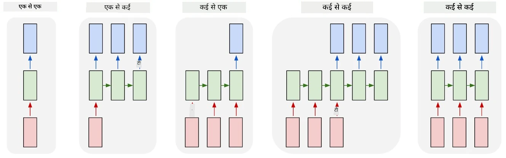

# जनरेटिव नेटवर्क्स

## [प्री-लेक्चर क्विज़](https://ff-quizzes.netlify.app/en/ai/quiz/33)

Recurrent Neural Networks (RNNs) और उनके gated cell वेरिएंट जैसे Long Short Term Memory Cells (LSTMs) और Gated Recurrent Units (GRUs) ने भाषा मॉडलिंग के लिए एक तंत्र प्रदान किया है, जिससे वे शब्दों के क्रम को सीख सकते हैं और अनुक्रम में अगले शब्द की भविष्यवाणी कर सकते हैं। यह हमें RNNs का उपयोग **जनरेटिव कार्यों** के लिए करने की अनुमति देता है, जैसे सामान्य टेक्स्ट जनरेशन, मशीन ट्रांसलेशन, और यहां तक कि इमेज कैप्शनिंग।

> ✅ उन सभी मौकों के बारे में सोचें जब आपने टेक्स्ट कंप्लीशन जैसे जनरेटिव कार्यों से लाभ उठाया है। अपने पसंदीदा एप्लिकेशन पर शोध करें और देखें कि क्या उन्होंने RNNs का उपयोग किया है।

पिछले यूनिट में चर्चा किए गए RNN आर्किटेक्चर में, प्रत्येक RNN यूनिट ने अगले hidden state को आउटपुट के रूप में उत्पन्न किया। हालांकि, हम प्रत्येक recurrent unit में एक और आउटपुट जोड़ सकते हैं, जो हमें एक **sequence** आउटपुट करने की अनुमति देगा (जो मूल sequence के बराबर लंबाई का होगा)। इसके अलावा, हम RNN यूनिट्स का उपयोग कर सकते हैं जो प्रत्येक चरण में इनपुट स्वीकार नहीं करते हैं, और केवल एक प्रारंभिक state vector लेते हैं, और फिर आउटपुट का एक sequence उत्पन्न करते हैं।

यह विभिन्न neural architectures की अनुमति देता है, जो नीचे दी गई तस्वीर में दिखाए गए हैं:



> चित्र ब्लॉग पोस्ट [Unreasonable Effectiveness of Recurrent Neural Networks](http://karpathy.github.io/2015/05/21/rnn-effectiveness/) से लिया गया है, लेखक [Andrej Karpaty](http://karpathy.github.io/)।

* **One-to-one** एक पारंपरिक neural network है जिसमें एक इनपुट और एक आउटपुट होता है।
* **One-to-many** एक जनरेटिव आर्किटेक्चर है जो एक इनपुट मान स्वीकार करता है और आउटपुट मानों का एक sequence उत्पन्न करता है। उदाहरण के लिए, यदि हम एक **image captioning** नेटवर्क को प्रशिक्षित करना चाहते हैं जो किसी चित्र का टेक्स्ट विवरण उत्पन्न करे, तो हम एक चित्र को इनपुट के रूप में ले सकते हैं, इसे hidden state प्राप्त करने के लिए CNN के माध्यम से पास कर सकते हैं, और फिर एक recurrent chain कैप्शन को शब्द-दर-शब्द उत्पन्न कर सकता है।
* **Many-to-one** पिछले यूनिट में वर्णित RNN आर्किटेक्चर से मेल खाता है, जैसे टेक्स्ट वर्गीकरण।
* **Many-to-many**, या **sequence-to-sequence** उन कार्यों से मेल खाता है जैसे **मशीन ट्रांसलेशन**, जहां हमारे पास पहला RNN इनपुट sequence से सभी जानकारी hidden state में इकट्ठा करता है, और दूसरा RNN chain इस state को आउटपुट sequence में अनरोल करता है।

इस यूनिट में, हम सरल जनरेटिव मॉडल्स पर ध्यान केंद्रित करेंगे जो हमें टेक्स्ट उत्पन्न करने में मदद करते हैं। सरलता के लिए, हम character-level टोकनाइज़ेशन का उपयोग करेंगे।

हम इस RNN को टेक्स्ट step-by-step उत्पन्न करने के लिए प्रशिक्षित करेंगे। प्रत्येक चरण में, हम `nchars` लंबाई के characters का एक sequence लेंगे, और नेटवर्क से प्रत्येक इनपुट character के लिए अगला आउटपुट character उत्पन्न करने के लिए कहेंगे:


जब टेक्स्ट उत्पन्न किया जाता है (inference के दौरान), हम कुछ **prompt** के साथ शुरू करते हैं, जिसे RNN cells के माध्यम से पास किया जाता है ताकि इसका intermediate state उत्पन्न हो सके, और फिर इस state से जनरेशन शुरू होती है। हम एक बार में एक character उत्पन्न करते हैं, और state और उत्पन्न character को अगले RNN cell में पास करते हैं ताकि अगला character उत्पन्न हो सके, जब तक कि हम पर्याप्त characters उत्पन्न न कर लें।


> चित्र लेखक द्वारा

## ✍️ अभ्यास: जनरेटिव नेटवर्क्स

नीचे दिए गए नोटबुक्स में अपनी सीख जारी रखें:

* [PyTorch के साथ जनरेटिव नेटवर्क्स](GenerativePyTorch.ipynb)
* [TensorFlow के साथ जनरेटिव नेटवर्क्स](GenerativeTF.ipynb)

## सॉफ्ट टेक्स्ट जनरेशन और टेम्परेचर

प्रत्येक RNN cell का आउटपुट characters का एक probability distribution होता है। यदि हम हमेशा सबसे अधिक probability वाले character को अगले character के रूप में चुनते हैं, तो उत्पन्न टेक्स्ट अक्सर "cycled" हो सकता है, जिसमें वही character sequences बार-बार आते हैं, जैसे इस उदाहरण में:

```
today of the second the company and a second the company ...
```

हालांकि, यदि हम अगले character के लिए probability distribution को देखें, तो यह हो सकता है कि कुछ उच्चतम probabilities के बीच का अंतर बहुत बड़ा न हो, जैसे एक character की probability 0.2 हो, और दूसरे की 0.19। उदाहरण के लिए, जब sequence '*play*' में अगले character की तलाश की जाती है, तो अगला character space या **e** (जैसे शब्द *player* में) हो सकता है।

यह हमें इस निष्कर्ष पर ले जाता है कि हमेशा उच्चतम probability वाले character को चुनना "न्यायसंगत" नहीं है, क्योंकि दूसरे उच्चतम को चुनना भी अर्थपूर्ण टेक्स्ट की ओर ले जा सकता है। यह अधिक समझदारी है कि नेटवर्क आउटपुट द्वारा दिए गए probability distribution से characters को **sample** किया जाए। हम एक parameter, **temperature**, का उपयोग भी कर सकते हैं, जो probability distribution को flatten कर सकता है, यदि हम अधिक randomness जोड़ना चाहते हैं, या इसे अधिक steep बना सकता है, यदि हम उच्चतम-probability characters पर अधिक टिके रहना चाहते हैं।

ऊपर दिए गए नोटबुक्स में देखें कि यह सॉफ्ट टेक्स्ट जनरेशन कैसे लागू किया गया है।

## निष्कर्ष

हालांकि टेक्स्ट जनरेशन अपने आप में उपयोगी हो सकता है, मुख्य लाभ RNNs का उपयोग करके टेक्स्ट उत्पन्न करने की क्षमता से आता है, जो किसी प्रारंभिक feature vector से शुरू होता है। उदाहरण के लिए, टेक्स्ट जनरेशन का उपयोग मशीन ट्रांसलेशन (sequence-to-sequence, इस मामले में *encoder* से state vector का उपयोग करके अनुवादित संदेश को उत्पन्न या *decode* किया जाता है) या किसी चित्र का टेक्स्ट विवरण उत्पन्न करने (इस मामले में feature vector CNN extractor से आता है) में किया जाता है।

## 🚀 चुनौती

Microsoft Learn पर इस विषय पर कुछ पाठ लें:

* [PyTorch](https://docs.microsoft.com/learn/modules/intro-natural-language-processing-pytorch/6-generative-networks/?WT.mc_id=academic-77998-cacaste)/[TensorFlow](https://docs.microsoft.com/learn/modules/intro-natural-language-processing-tensorflow/5-generative-networks/?WT.mc_id=academic-77998-cacaste) के साथ टेक्स्ट जनरेशन

## [पोस्ट-लेक्चर क्विज़](https://ff-quizzes.netlify.app/en/ai/quiz/34)

## समीक्षा और स्व-अध्ययन

अपना ज्ञान बढ़ाने के लिए यहां कुछ लेख दिए गए हैं:

* Markov Chain, LSTM और GPT-2 के साथ टेक्स्ट जनरेशन के विभिन्न दृष्टिकोण: [ब्लॉग पोस्ट](https://towardsdatascience.com/text-generation-gpt-2-lstm-markov-chain-9ea371820e1e)
* [Keras दस्तावेज़](https://keras.io/examples/generative/lstm_character_level_text_generation/) में टेक्स्ट जनरेशन का उदाहरण

## [असाइनमेंट](lab/README.md)

हमने देखा कि कैसे character-by-character टेक्स्ट उत्पन्न किया जा सकता है। लैब में, आप word-level टेक्स्ट जनरेशन का पता लगाएंगे।

---

