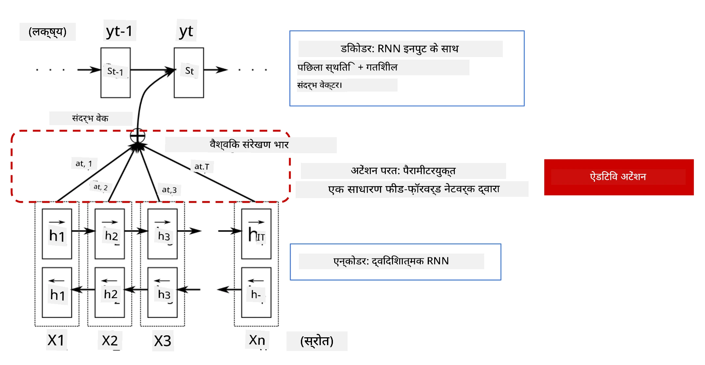
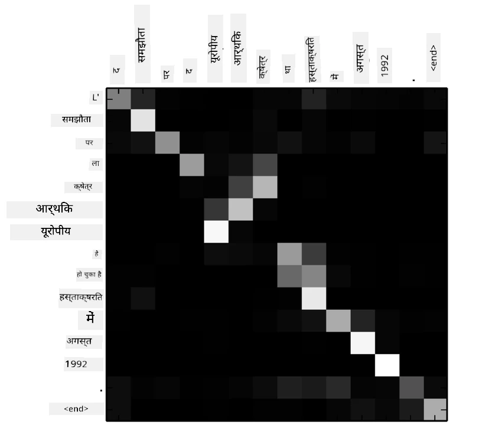
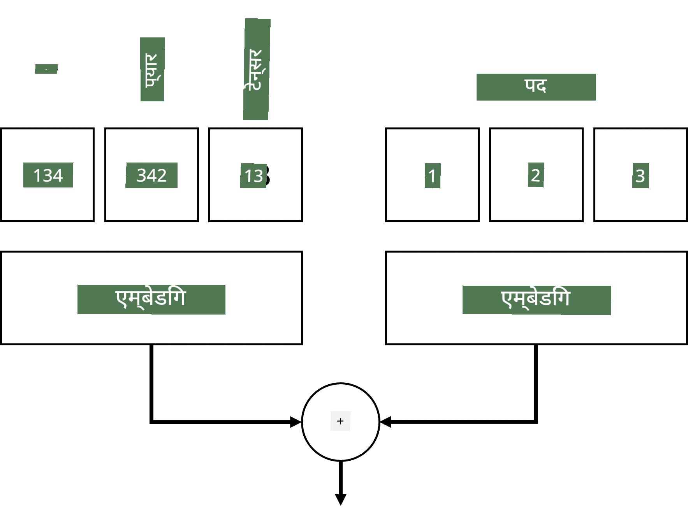
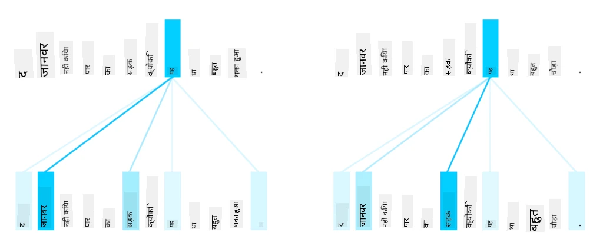
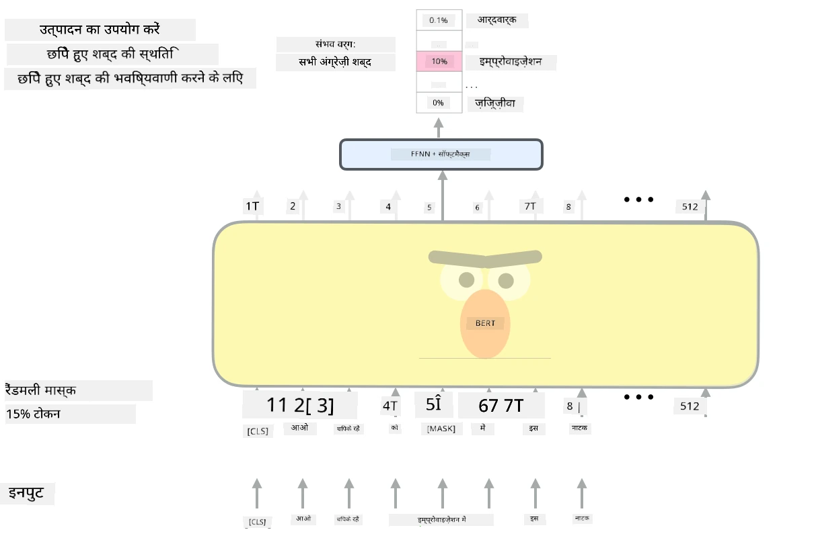

# ध्यान तंत्र और ट्रांसफॉर्मर्स

## [प्री-लेक्चर क्विज़](https://ff-quizzes.netlify.app/en/ai/quiz/35)

NLP क्षेत्र में सबसे महत्वपूर्ण समस्याओं में से एक है **मशीन अनुवाद**, जो Google Translate जैसे उपकरणों के पीछे का मुख्य कार्य है। इस सेक्शन में, हम मशीन अनुवाद पर ध्यान केंद्रित करेंगे, या सामान्य रूप से, किसी भी *सीक्वेंस-टू-सीक्वेंस* कार्य पर (जिसे **सेंटेंस ट्रांसडक्शन** भी कहा जाता है)।

RNNs के साथ, सीक्वेंस-टू-सीक्वेंस को दो पुनरावर्ती नेटवर्क द्वारा लागू किया जाता है, जहां एक नेटवर्क, **एन्कोडर**, इनपुट सीक्वेंस को एक हिडन स्टेट में संक्षिप्त करता है, जबकि दूसरा नेटवर्क, **डिकोडर**, इस हिडन स्टेट को अनुवादित परिणाम में बदलता है। इस दृष्टिकोण के साथ कुछ समस्याएं हैं:

* एन्कोडर नेटवर्क की अंतिम स्थिति को वाक्य की शुरुआत को याद रखने में कठिनाई होती है, जिससे लंबे वाक्यों के लिए मॉडल की गुणवत्ता खराब हो जाती है।
* सीक्वेंस में सभी शब्दों का परिणाम पर समान प्रभाव होता है। हालांकि, वास्तविकता में, इनपुट सीक्वेंस में कुछ शब्दों का अनुक्रमिक आउटपुट पर अधिक प्रभाव होता है।

**ध्यान तंत्र** प्रत्येक इनपुट वेक्टर के संदर्भ प्रभाव को प्रत्येक आउटपुट भविष्यवाणी पर वेटिंग प्रदान करने का एक तरीका है। इसे लागू करने का तरीका यह है कि इनपुट RNN और आउटपुट RNN की मध्यवर्ती अवस्थाओं के बीच शॉर्टकट बनाए जाते हैं। इस प्रकार, जब आउटपुट प्रतीक yt उत्पन्न किया जाता है, तो हम सभी इनपुट हिडन स्टेट्स hi को विभिन्न वेट कोएफिशिएंट्स &alpha;t,i के साथ ध्यान में रखते हैं।

> [Bahdanau et al., 2015](https://arxiv.org/pdf/1409.0473.pdf) में एडिटिव ध्यान तंत्र के साथ एन्कोडर-डिकोडर मॉडल, [इस ब्लॉग पोस्ट](https://lilianweng.github.io/lil-log/2018/06/24/attention-attention.html) से लिया गया।

ध्यान मैट्रिक्स {&alpha;i,j} यह दर्शाता है कि आउटपुट सीक्वेंस में दिए गए शब्द के निर्माण में कुछ इनपुट शब्दों की भूमिका कितनी है। नीचे एक उदाहरण दिया गया है:

> [Bahdanau et al., 2015](https://arxiv.org/pdf/1409.0473.pdf) से चित्र (Fig.3)

ध्यान तंत्र NLP में वर्तमान या लगभग वर्तमान स्टेट ऑफ द आर्ट के लिए जिम्मेदार हैं। हालांकि ध्यान जोड़ने से मॉडल पैरामीटर की संख्या काफी बढ़ जाती है, जिससे RNNs के साथ स्केलिंग समस्याएं उत्पन्न होती हैं। RNNs को स्केल करने की एक प्रमुख बाधा यह है कि मॉडल की पुनरावृत्त प्रकृति प्रशिक्षण को बैच और समानांतर बनाना चुनौतीपूर्ण बनाती है। RNN में सीक्वेंस के प्रत्येक तत्व को क्रमिक क्रम में संसाधित करना पड़ता है, जिसका अर्थ है कि इसे आसानी से समानांतर नहीं किया जा सकता।

> [Google के ब्लॉग](https://research.googleblog.com/2016/09/a-neural-network-for-machine.html) से चित्र

ध्यान तंत्र को अपनाने और इस बाधा ने आज के स्टेट ऑफ द आर्ट ट्रांसफॉर्मर मॉडल्स जैसे BERT और Open-GPT3 के निर्माण को प्रेरित किया।

## ट्रांसफॉर्मर मॉडल्स

ट्रांसफॉर्मर्स के पीछे मुख्य विचारों में से एक RNNs की क्रमिक प्रकृति से बचना और प्रशिक्षण के दौरान समानांतर बनाने योग्य मॉडल बनाना है। इसे दो विचारों को लागू करके प्राप्त किया गया है:

* पोजिशनल एनकोडिंग
* RNNs (या CNNs) के बजाय पैटर्न को कैप्चर करने के लिए सेल्फ-अटेंशन तंत्र का उपयोग करना (यही कारण है कि ट्रांसफॉर्मर्स को पेश करने वाला पेपर *[Attention is all you need](https://arxiv.org/abs/1706.03762)* कहा जाता है)

### पोजिशनल एनकोडिंग/एम्बेडिंग

पोजिशनल एनकोडिंग का विचार निम्नलिखित है:
1. RNNs का उपयोग करते समय, टोकन की सापेक्ष स्थिति को चरणों की संख्या द्वारा दर्शाया जाता है, और इसलिए इसे स्पष्ट रूप से दर्शाने की आवश्यकता नहीं होती।
2. हालांकि, एक बार जब हम ध्यान पर स्विच करते हैं, तो हमें सीक्वेंस के भीतर टोकन की सापेक्ष स्थिति जानने की आवश्यकता होती है।
3. पोजिशनल एनकोडिंग प्राप्त करने के लिए, हम अपने टोकन सीक्वेंस को सीक्वेंस में टोकन पोजिशन के सीक्वेंस (जैसे, 0,1, ...) के साथ बढ़ाते हैं।
4. फिर हम टोकन पोजिशन को टोकन एम्बेडिंग वेक्टर के साथ मिलाते हैं। पोजिशन (इंटीजर) को वेक्टर में बदलने के लिए, हम विभिन्न दृष्टिकोणों का उपयोग कर सकते हैं:

* टोकन एम्बेडिंग के समान ट्रेन करने योग्य एम्बेडिंग। यह वह दृष्टिकोण है जिसे हम यहां मानते हैं। हम टोकन और उनके पोजिशन दोनों पर एम्बेडिंग लेयर लागू करते हैं, जिससे समान आयामों के एम्बेडिंग वेक्टर प्राप्त होते हैं, जिन्हें हम फिर जोड़ते हैं।
* मूल पेपर में प्रस्तावित फिक्स्ड पोजिशन एनकोडिंग फंक्शन।

> लेखक द्वारा बनाई गई छवि

पोजिशनल एम्बेडिंग के साथ हमें जो परिणाम मिलता है, वह मूल टोकन और सीक्वेंस के भीतर उसकी स्थिति दोनों को एम्बेड करता है।

### मल्टी-हेड सेल्फ-अटेंशन

अब हमें अपने सीक्वेंस के भीतर कुछ पैटर्न कैप्चर करने की आवश्यकता है। ऐसा करने के लिए, ट्रांसफॉर्मर्स **सेल्फ-अटेंशन** तंत्र का उपयोग करते हैं, जो मूल रूप से इनपुट और आउटपुट के रूप में एक ही सीक्वेंस पर लागू ध्यान है। सेल्फ-अटेंशन लागू करने से हमें वाक्य के भीतर **संदर्भ** को ध्यान में रखने और यह देखने की अनुमति मिलती है कि कौन से शब्द आपस में संबंधित हैं। उदाहरण के लिए, यह हमें यह देखने की अनुमति देता है कि कौन से शब्द *it* जैसे कोरफेरेंस द्वारा संदर्भित हैं, और संदर्भ को ध्यान में रखता है:

> [Google ब्लॉग](https://research.googleblog.com/2017/08/transformer-novel-neural-network.html) से छवि

ट्रांसफॉर्मर्स में, हम **मल्टी-हेड अटेंशन** का उपयोग करते हैं ताकि नेटवर्क को विभिन्न प्रकार की निर्भरताओं को कैप्चर करने की शक्ति दी जा सके, जैसे कि लंबे समय तक बनाम छोटे समय के शब्द संबंध, कोरफेरेंस बनाम कुछ और, आदि।

[TensorFlow Notebook](TransformersTF.ipynb) में ट्रांसफॉर्मर लेयर के कार्यान्वयन पर अधिक विवरण हैं।

### एन्कोडर-डिकोडर अटेंशन

ट्रांसफॉर्मर्स में, ध्यान दो स्थानों पर उपयोग किया जाता है:

* इनपुट टेक्स्ट के भीतर पैटर्न को कैप्चर करने के लिए सेल्फ-अटेंशन का उपयोग करना
* सीक्वेंस अनुवाद करने के लिए - यह एन्कोडर और डिकोडर के बीच ध्यान लेयर है।

एन्कोडर-डिकोडर अटेंशन RNNs में उपयोग किए गए ध्यान तंत्र के समान है, जैसा कि इस सेक्शन की शुरुआत में वर्णित है। यह एनिमेटेड डायग्राम एन्कोडर-डिकोडर अटेंशन की भूमिका को समझाता है।

चूंकि प्रत्येक इनपुट स्थिति को स्वतंत्र रूप से प्रत्येक आउटपुट स्थिति पर मैप किया जाता है, ट्रांसफॉर्मर्स RNNs की तुलना में बेहतर समानांतर बना सकते हैं, जो बहुत बड़े और अधिक अभिव्यक्तिपूर्ण भाषा मॉडल को सक्षम बनाता है। प्रत्येक अटेंशन हेड का उपयोग शब्दों के बीच विभिन्न संबंधों को सीखने के लिए किया जा सकता है, जो डाउनस्ट्रीम नेचुरल लैंग्वेज प्रोसेसिंग कार्यों में सुधार करता है।

## BERT

**BERT** (Bidirectional Encoder Representations from Transformers) एक बहुत बड़ा मल्टी लेयर ट्रांसफॉर्मर नेटवर्क है जिसमें *BERT-base* के लिए 12 लेयर और *BERT-large* के लिए 24 लेयर हैं। मॉडल को पहले एक बड़े टेक्स्ट डेटा कॉर्पस (WikiPedia + किताबें) पर अनसुपरवाइज्ड ट्रेनिंग (वाक्य में मास्क किए गए शब्दों की भविष्यवाणी) का उपयोग करके प्री-ट्रेन किया जाता है। प्री-ट्रेनिंग के दौरान मॉडल महत्वपूर्ण स्तर की भाषा समझ को अवशोषित करता है, जिसे फिर अन्य डेटासेट्स के साथ फाइन ट्यूनिंग का उपयोग करके लाभ उठाया जा सकता है। इस प्रक्रिया को **ट्रांसफर लर्निंग** कहा जाता है।

> छवि [स्रोत](http://jalammar.github.io/illustrated-bert/)

## ✍️ अभ्यास: ट्रांसफॉर्मर्स

निम्नलिखित नोटबुक्स में अपना अध्ययन जारी रखें:

* [PyTorch में ट्रांसफॉर्मर्स](TransformersPyTorch.ipynb)
* [TensorFlow में ट्रांसफॉर्मर्स](TransformersTF.ipynb)

## निष्कर्ष

इस पाठ में आपने ट्रांसफॉर्मर्स और ध्यान तंत्र के बारे में सीखा, जो NLP टूलबॉक्स में आवश्यक उपकरण हैं। ट्रांसफॉर्मर आर्किटेक्चर के कई प्रकार हैं, जिनमें BERT, DistilBERT, BigBird, OpenGPT3 और अन्य शामिल हैं, जिन्हें फाइन ट्यून किया जा सकता है। [HuggingFace पैकेज](https://github.com/huggingface/) PyTorch और TensorFlow दोनों के साथ इन आर्किटेक्चर को ट्रेन करने के लिए रिपॉजिटरी प्रदान करता है।

## 🚀 चुनौती

## [पोस्ट-लेक्चर क्विज़](https://ff-quizzes.netlify.app/en/ai/quiz/36)

## समीक्षा और स्व-अध्ययन

* [ब्लॉग पोस्ट](https://mchromiak.github.io/articles/2017/Sep/12/Transformer-Attention-is-all-you-need/), जो ट्रांसफॉर्मर्स पर क्लासिकल [Attention is all you need](https://arxiv.org/abs/1706.03762) पेपर को समझाती है।
* [ब्लॉग पोस्ट की एक श्रृंखला](https://towardsdatascience.com/transformers-explained-visually-part-1-overview-of-functionality-95a6dd460452) ट्रांसफॉर्मर्स पर, जो आर्किटेक्चर को विस्तार से समझाती है।

## [असाइनमेंट](assignment.md)

---

