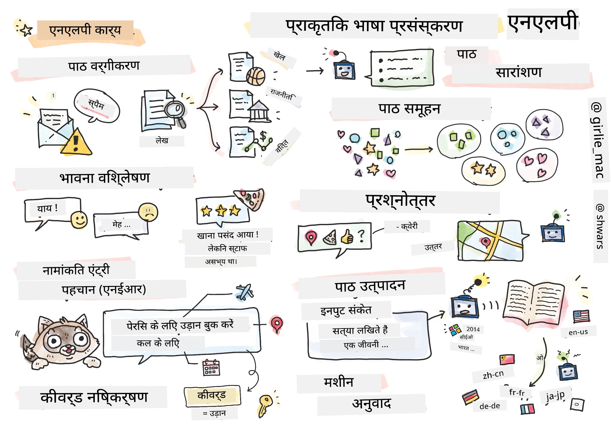

# प्राकृतिक भाषा प्रसंस्करण



इस खंड में, हम **प्राकृतिक भाषा प्रसंस्करण (NLP)** से संबंधित कार्यों को संभालने के लिए न्यूरल नेटवर्क का उपयोग करने पर ध्यान केंद्रित करेंगे। कई NLP समस्याएँ हैं जिन्हें हम चाहते हैं कि कंप्यूटर हल कर सके:

* **टेक्स्ट वर्गीकरण** एक सामान्य वर्गीकरण समस्या है जो पाठ अनुक्रमों से संबंधित है। उदाहरणों में ईमेल संदेशों को स्पैम बनाम नॉन-स्पैम के रूप में वर्गीकृत करना, या लेखों को खेल, व्यवसाय, राजनीति आदि के रूप में वर्गीकृत करना शामिल है। इसके अलावा, चैट बॉट विकसित करते समय, हमें अक्सर यह समझने की जरूरत होती है कि उपयोगकर्ता क्या कहना चाहता था -- इस मामले में हम **इरादा वर्गीकरण** से निपट रहे हैं। अक्सर, इरादा वर्गीकरण में हमें कई श्रेणियों से निपटना पड़ता है।
* **भावना विश्लेषण** एक सामान्य प्रतिगमन समस्या है, जहाँ हमें एक संख्या (भावना) निर्दिष्ट करनी होती है जो यह बताती है कि वाक्य का अर्थ कितना सकारात्मक/नकारात्मक है। भावना विश्लेषण का एक उन्नत संस्करण है **पहलू-आधारित भावना विश्लेषण** (ABSA), जहाँ हम भावना को पूरे वाक्य के बजाय इसके विभिन्न हिस्सों (पहलुओं) को निर्दिष्ट करते हैं, जैसे *इस रेस्तरां में, मुझे भोजन पसंद आया, लेकिन वातावरण भयानक था*।
* **नामित इकाई मान्यता** (NER) पाठ से कुछ विशिष्ट इकाइयों को निकालने की समस्या को संदर्भित करता है। उदाहरण के लिए, हमें यह समझना पड़ सकता है कि वाक्यांश *मुझे कल पेरिस जाना है* में शब्द *कल* DATE (तिथि) को संदर्भित करता है, और *पेरिस* LOCATION (स्थान) है।
* **कीवर्ड निष्कर्षण** NER के समान है, लेकिन इसमें हमें बिना किसी विशिष्ट इकाई प्रकार के लिए पूर्व-प्रशिक्षण के, वाक्य के अर्थ के लिए महत्वपूर्ण शब्दों को स्वचालित रूप से निकालना होता है।
* **टेक्स्ट क्लस्टरिंग** तब उपयोगी हो सकती है जब हम समान वाक्यों को समूहबद्ध करना चाहते हैं, उदाहरण के लिए, तकनीकी सहायता वार्तालापों में समान अनुरोध।
* **प्रश्न-उत्तर** किसी विशिष्ट प्रश्न का उत्तर देने की मॉडल की क्षमता को संदर्भित करता है। मॉडल को एक पाठ अंश और एक प्रश्न इनपुट के रूप में प्राप्त होता है, और इसे उस पाठ में वह स्थान बताना होता है जहाँ प्रश्न का उत्तर निहित है (या कभी-कभी उत्तर पाठ जनरेट करना होता है)।
* **टेक्स्ट जनरेशन** एक मॉडल की नई टेक्स्ट बनाने की क्षमता है। इसे एक वर्गीकरण कार्य माना जा सकता है जो कुछ *टेक्स्ट प्रॉम्प्ट* के आधार पर अगला अक्षर/शब्द भविष्यवाणी करता है। उन्नत टेक्स्ट जनरेशन मॉडल, जैसे GPT-3, अन्य NLP कार्यों को भी हल करने में सक्षम हैं, जैसे वर्गीकरण, जो [प्रॉम्प्ट प्रोग्रामिंग](https://towardsdatascience.com/software-3-0-how-prompting-will-change-the-rules-of-the-game-a982fbfe1e0) या [प्रॉम्प्ट इंजीनियरिंग](https://medium.com/swlh/openai-gpt-3-and-prompt-engineering-dcdc2c5fcd29) नामक तकनीक का उपयोग करते हैं।
* **टेक्स्ट सारांशण** एक तकनीक है जब हम चाहते हैं कि कंप्यूटर लंबा पाठ "पढ़े" और उसे कुछ वाक्यों में सारांशित करे।
* **मशीन अनुवाद** को एक भाषा में पाठ को समझने और दूसरी भाषा में पाठ बनाने के संयोजन के रूप में देखा जा सकता है।

प्रारंभ में, अधिकांश NLP कार्य पारंपरिक विधियों जैसे व्याकरणों का उपयोग करके हल किए जाते थे। उदाहरण के लिए, मशीन अनुवाद में पार्सर का उपयोग प्रारंभिक वाक्य को एक वाक्यविन्यास वृक्ष में बदलने के लिए किया जाता था, फिर वाक्य का अर्थ प्रस्तुत करने के लिए उच्च स्तरीय अर्थसूचक संरचनाओं को निकाला जाता था, और इस अर्थ और लक्ष्य भाषा के व्याकरण के आधार पर परिणाम उत्पन्न होता था। आजकल, कई NLP कार्य न्यूरल नेटवर्क का उपयोग करके अधिक प्रभावी ढंग से हल किए जाते हैं।

> कई पारंपरिक NLP विधियाँ [Natural Language Processing Toolkit (NLTK)](https://www.nltk.org) पायथन पुस्तकालय में लागू होती हैं। वहाँ एक उत्कृष्ट [NLTK पुस्तक](https://www.nltk.org/book/) ऑनलाइन उपलब्ध है जो विभिन्न NLP कार्यों को NLTK का उपयोग करके कैसे हल किया जा सकता है, यह बताती है।

हमारे कोर्स में, हम मुख्य रूप से NLP के लिए न्यूरल नेटवर्क के उपयोग पर ध्यान केंद्रित करेंगे, और जहां आवश्यक होगा वहां NLTK का उपयोग करेंगे।

हमने पहले ही न्यूरल नेटवर्क के उपयोग के बारे में सीखा है, जो तालिकाबद्ध डेटा और छवियों के साथ काम करते हैं। उन डेटा प्रकारों और टेक्स्ट के बीच मुख्य अंतर यह है कि टेक्स्ट एक चर लंबाई का अनुक्रम है, जबकि छवियों के मामले में इनपुट आकार पहले से जाना जाता है। जबकि कन्वोल्यूशनल नेटवर्क इनपुट डेटा से पैटर्न निकाल सकते हैं, टेक्स्ट में पैटर्न अधिक जटिल होते हैं। उदाहरण के लिए, नकारात्मकता को विषय से अलग किया जा सकता है, जो कई शब्दों के लिए मनमाना हो सकता है (जैसे *मुझे संतरे पसंद नहीं हैं*, बनाम *मुझे वे बड़े रंगीन स्वादिष्ट संतरे पसंद नहीं हैं*), और इसे अभी भी एक ही पैटर्न के रूप में समझना चाहिए। इसलिए, भाषा को संभालने के लिए हमें नए प्रकार के न्यूरल नेटवर्क, जैसे *पुनरावर्ती नेटवर्क* और *ट्रांसफॉर्मर* पेश करने की आवश्यकता है।

## लाइब्रेरी स्थापित करें

यदि आप इस कोर्स को चलाने के लिए स्थानीय पायथन इंस्टॉलेशन का उपयोग कर रहे हैं, तो आपको NLP के लिए सभी आवश्यक लाइब्रेरी निम्नलिखित कमांड्स का उपयोग करके स्थापित करनी पड़ सकती हैं:

**पायटॉर्च के लिए**
```bash
pip install -r requirements-pytorch.txt
```
**टेंसर्फ्लो के लिए**
```bash
pip install -r requirements-tf.txt
```

> आप [Microsoft Learn](https://docs.microsoft.com/learn/modules/intro-natural-language-processing-tensorflow/?WT.mc_id=academic-77998-cacaste) पर TensorFlow के साथ NLP आज़मा सकते हैं।

## GPU चेतावनी

इस खंड में, कुछ उदाहरणों में हम काफी बड़े मॉडल प्रशिक्षित करेंगे।
* **GPU सक्षम कंप्यूटर का उपयोग करें**: बड़े मॉडल के साथ काम करते समय प्रतीक्षा समय कम करने के लिए अपनी नोटबुक्स को GPU सक्षम कंप्यूटर पर चलाना सलाह दी जाती है।
* **GPU मेमोरी प्रतिबंध**: GPU पर चलाने से ऐसी स्थिति हो सकती है जहां आपके GPU की मेमोरी समाप्त हो जाए, विशेष रूप से बड़े मॉडल प्रशिक्षण के दौरान।
* **GPU मेमोरी उपभोग**: प्रशिक्षण के दौरान उपयोग की गई GPU मेमोरी की मात्रा विभिन्न कारकों पर निर्भर करती है, जिनमें मिनीबैच का आकार शामिल है।
* **मिनीबैच आकार कम करें**: यदि आपको GPU मेमोरी समस्याएं आती हैं, तो समाधान के रूप में अपने कोड में मिनीबैच आकार कम करने पर विचार करें।
* **टेंसर्फ्लो GPU मेमोरी रिलीज़**: पुराने संस्करण के टेंसर्फ्लो एक पायथन कर्नेल में एक से अधिक मॉडल प्रशिक्षण के दौरान GPU मेमोरी सही ढंग से रिलीज़ नहीं कर सकते। GPU मेमोरी का प्रभावी प्रबंधन करने के लिए, आप टेंसर्फ्लो को केवल आवश्यकतानुसार GPU मेमोरी आवंटित करने के लिए कॉन्फ़िगर कर सकते हैं।
* **कोड शामिल करना**: अपनी नोटबुक्स में टेंसर्फ्लो को केवल आवश्यकतानुसार GPU मेमोरी आवंटित करने के लिए सेट करने के लिए निम्नलिखित कोड शामिल करें:

```python
physical_devices = tf.config.list_physical_devices('GPU') 
if len(physical_devices)>0:
    tf.config.experimental.set_memory_growth(physical_devices[0], True) 
```

यदि आप क्लासिक मशीन लर्निंग दृष्टिकोण से NLP सीखने में रुचि रखते हैं, तो [यह पाठों का सेट](https://github.com/microsoft/ML-For-Beginners/tree/main/6-NLP) देखें।

## इस खंड में
इस खंड में हम निम्नलिखित के बारे में सीखेंगे:

* [टेक्स्ट को टेंसर के रूप में प्रस्तुत करना](13-TextRep/README.md)
* [वर्ड एम्बेडिंग्स](14-Embeddings/README.md)
* [भाषा मॉडलिंग](15-LanguageModeling/README.md)
* [पुनरावर्ती न्यूरल नेटवर्क](16-RNN/README.md)
* [जनरेटिव नेटवर्क](17-GenerativeNetworks/README.md)
* [ट्रांसफॉर्मर्स](18-Transformers/README.md)

---

<!-- CO-OP TRANSLATOR DISCLAIMER START -->
**अस्वीकरण**:
इस दस्तावेज़ का अनुवाद AI अनुवाद सेवा [Co-op Translator](https://github.com/Azure/co-op-translator) का उपयोग करके किया गया है। जबकि हम सटीकता के लिए प्रयास करते हैं, कृपया ध्यान दें कि स्वचालित अनुवादों में त्रुटियाँ या अशुद्धियाँ हो सकती हैं। मूल दस्तावेज़ अपनी मूल भाषा में ही प्रामाणिक स्रोत माना जाना चाहिए। महत्वपूर्ण जानकारी के लिए, पेशेवर मानव अनुवाद की सिफारिश की जाती है। इस अनुवाद के उपयोग से उत्पन्न किसी भी गलतफहमी या गलत व्याख्या के लिए हम उत्तरदायी नहीं हैं।
<!-- CO-OP TRANSLATOR DISCLAIMER END -->