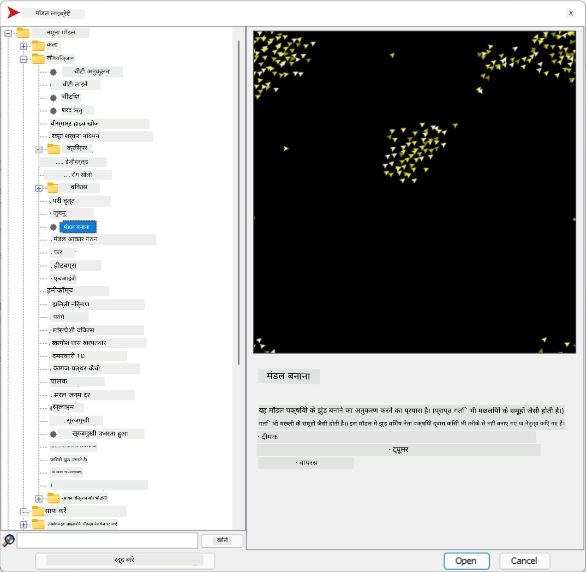
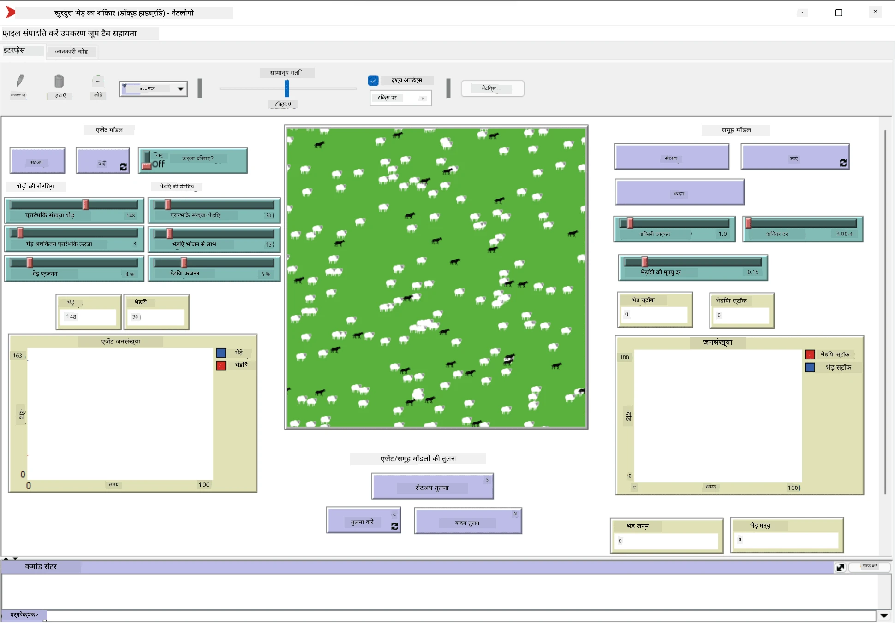

# मल्टी-एजेंट सिस्टम्स

बुद्धिमत्ता प्राप्त करने के संभावित तरीकों में से एक है **उभरता हुआ** (या **सिनर्जेटिक**) दृष्टिकोण, जो इस तथ्य पर आधारित है कि कई अपेक्षाकृत सरल एजेंटों का संयुक्त व्यवहार पूरे सिस्टम के अधिक जटिल (या बुद्धिमान) व्यवहार का परिणाम हो सकता है। सैद्धांतिक रूप से, यह [सामूहिक बुद्धिमत्ता](https://en.wikipedia.org/wiki/Collective_intelligence), [उभरतावाद](https://en.wikipedia.org/wiki/Global_brain) और [विकासवादी साइबरनेटिक्स](https://en.wikipedia.org/wiki/Global_brain) के सिद्धांतों पर आधारित है, जो कहते हैं कि उच्च-स्तरीय सिस्टम कुछ अतिरिक्त मूल्य प्राप्त करते हैं जब उन्हें सही तरीके से निम्न-स्तरीय सिस्टम से जोड़ा जाता है (जिसे *मेटासिस्टम ट्रांज़िशन का सिद्धांत* कहा जाता है)।

## [प्री-लेक्चर क्विज़](https://ff-quizzes.netlify.app/en/ai/quiz/45)

**मल्टी-एजेंट सिस्टम्स** की दिशा 1990 के दशक में इंटरनेट और वितरित सिस्टम्स के विकास के जवाब में AI में उभरी। AI के एक क्लासिकल टेक्स्टबुक, [Artificial Intelligence: A Modern Approach](https://en.wikipedia.org/wiki/Artificial_Intelligence:_A_Modern_Approach), मल्टी-एजेंट सिस्टम्स के दृष्टिकोण से क्लासिकल AI को देखता है।

मल्टी-एजेंट दृष्टिकोण का केंद्रबिंदु **एजेंट** की अवधारणा है - एक इकाई जो किसी **पर्यावरण** में रहती है, जिसे वह देख सकती है और उस पर कार्य कर सकती है। यह एक बहुत व्यापक परिभाषा है, और एजेंटों के कई प्रकार और वर्गीकरण हो सकते हैं:

* उनकी तर्क करने की क्षमता के आधार पर:
   - **प्रतिक्रियाशील** एजेंट आमतौर पर सरल अनुरोध-प्रतिक्रिया प्रकार के व्यवहार रखते हैं
   - **विचारशील** एजेंट कुछ प्रकार की तार्किक तर्क और/या योजना क्षमताओं का उपयोग करते हैं
* उस स्थान के आधार पर जहां एजेंट अपना कोड निष्पादित करता है:
   - **स्थिर** एजेंट एक समर्पित नेटवर्क नोड पर काम करते हैं
   - **मोबाइल** एजेंट अपना कोड नेटवर्क नोड्स के बीच स्थानांतरित कर सकते हैं
* उनके व्यवहार के आधार पर:
   - **निष्क्रिय एजेंट** के पास विशिष्ट लक्ष्य नहीं होते। ऐसे एजेंट बाहरी उत्तेजनाओं पर प्रतिक्रिया कर सकते हैं, लेकिन स्वयं कोई कार्रवाई शुरू नहीं करेंगे।
   - **सक्रिय एजेंट** के पास कुछ लक्ष्य होते हैं जिन्हें वे प्राप्त करने का प्रयास करते हैं
   - **संज्ञानात्मक एजेंट** जटिल योजना और तर्क शामिल करते हैं

आजकल मल्टी-एजेंट सिस्टम्स कई अनुप्रयोगों में उपयोग किए जाते हैं:

* गेम्स में, कई गैर-खिलाड़ी पात्र कुछ प्रकार की AI का उपयोग करते हैं और उन्हें बुद्धिमान एजेंट माना जा सकता है
* वीडियो उत्पादन में, भीड़ वाले जटिल 3D दृश्यों को रेंडर करना आमतौर पर मल्टी-एजेंट सिमुलेशन का उपयोग करके किया जाता है
* सिस्टम मॉडलिंग में, मल्टी-एजेंट दृष्टिकोण का उपयोग जटिल मॉडल के व्यवहार का अनुकरण करने के लिए किया जाता है। उदाहरण के लिए, मल्टी-एजेंट दृष्टिकोण का उपयोग COVID-19 बीमारी के वैश्विक प्रसार की भविष्यवाणी करने के लिए सफलतापूर्वक किया गया है। इसी दृष्टिकोण का उपयोग शहर में यातायात को मॉडल करने और यातायात नियमों में बदलाव पर उसकी प्रतिक्रिया देखने के लिए किया जा सकता है।
* जटिल स्वचालन सिस्टम्स में, प्रत्येक डिवाइस एक स्वतंत्र एजेंट के रूप में कार्य कर सकता है, जिससे पूरा सिस्टम कम मोनोलिथिक और अधिक मजबूत बनता है।

हम मल्टी-एजेंट सिस्टम्स में गहराई तक जाने में ज्यादा समय नहीं लगाएंगे, लेकिन **मल्टी-एजेंट मॉडलिंग** के एक उदाहरण पर विचार करेंगे।

## नेटलोगो

[NetLogo](https://ccl.northwestern.edu/netlogo/) एक मल्टी-एजेंट मॉडलिंग वातावरण है जो [Logo](https://en.wikipedia.org/wiki/Logo_(programming_language)) प्रोग्रामिंग भाषा के संशोधित संस्करण पर आधारित है। यह भाषा बच्चों को प्रोग्रामिंग अवधारणाओं सिखाने के लिए विकसित की गई थी, और यह आपको **टर्टल** नामक एक एजेंट को नियंत्रित करने की अनुमति देती है, जो चलते समय पीछे एक निशान छोड़ता है। यह जटिल ज्यामितीय आकृतियों को बनाने की अनुमति देता है, जो एजेंट के व्यवहार को समझने का एक बहुत ही दृश्यात्मक तरीका है।

NetLogo में, हम `create-turtles` कमांड का उपयोग करके कई टर्टल्स बना सकते हैं। फिर हम सभी टर्टल्स को कुछ क्रियाएं करने का आदेश दे सकते हैं (नीचे दिए गए उदाहरण में - 10 पॉइंट आगे बढ़ें):

```
create-turtles 10
ask turtles [
  forward 10
]
```

बेशक, यह दिलचस्प नहीं है जब सभी टर्टल्स एक ही काम करते हैं, इसलिए हम `ask` का उपयोग करके टर्टल्स के समूहों को आदेश दे सकते हैं, जैसे कि वे जो किसी निश्चित बिंदु के आसपास हैं। हम `breed [cats cat]` कमांड का उपयोग करके विभिन्न *प्रजातियों* के टर्टल्स भी बना सकते हैं। यहां `cat` प्रजाति का नाम है, और हमें एकवचन और बहुवचन दोनों शब्द निर्दिष्ट करने की आवश्यकता है, क्योंकि विभिन्न कमांड स्पष्टता के लिए विभिन्न रूपों का उपयोग करते हैं।

> ✅ हम NetLogo भाषा सीखने में गहराई तक नहीं जाएंगे - यदि आप अधिक जानने में रुचि रखते हैं तो आप शानदार [Beginner's Interactive NetLogo Dictionary](https://ccl.northwestern.edu/netlogo/bind/) संसाधन पर जा सकते हैं।

आप [डाउनलोड](https://ccl.northwestern.edu/netlogo/download.shtml) करके NetLogo को आज़मा सकते हैं।

### मॉडल्स लाइब्रेरी

NetLogo की एक शानदार बात यह है कि इसमें काम करने वाले मॉडलों की एक लाइब्रेरी है जिसे आप आज़मा सकते हैं। **File &rightarrow; Models Library** पर जाएं, और आपके पास चुनने के लिए मॉडलों की कई श्रेणियां हैं।



> दिमित्री सोश्निकोव द्वारा मॉडल्स लाइब्रेरी का स्क्रीनशॉट

आप एक मॉडल खोल सकते हैं, उदाहरण के लिए **Biology &rightarrow; Flocking**।

### मुख्य सिद्धांत

मॉडल खोलने के बाद, आप मुख्य NetLogo स्क्रीन पर ले जाए जाते हैं। यहां एक नमूना मॉडल है जो सीमित संसाधनों (घास) को ध्यान में रखते हुए भेड़ियों और भेड़ों की आबादी का वर्णन करता है।



> दिमित्री सोश्निकोव द्वारा स्क्रीनशॉट

इस स्क्रीन पर, आप देख सकते हैं:

* **इंटरफेस** सेक्शन जिसमें शामिल हैं:
  - मुख्य क्षेत्र, जहां सभी एजेंट रहते हैं
  - विभिन्न नियंत्रण: बटन, स्लाइडर्स, आदि।
  - ग्राफ़ जो आप सिमुलेशन के पैरामीटर प्रदर्शित करने के लिए उपयोग कर सकते हैं
* **कोड** टैब जिसमें संपादक होता है, जहां आप NetLogo प्रोग्राम टाइप कर सकते हैं

अधिकांश मामलों में, इंटरफेस में एक **Setup** बटन होता है, जो सिमुलेशन स्थिति को प्रारंभ करता है, और एक **Go** बटन होता है जो निष्पादन शुरू करता है। इन्हें कोड में संबंधित हैंडलर्स द्वारा संभाला जाता है जो इस प्रकार दिखते हैं:

```
to go [
...
]
```

NetLogo की दुनिया निम्नलिखित वस्तुओं से बनी होती है:

* **एजेंट्स** (टर्टल्स) जो क्षेत्र में घूम सकते हैं और कुछ कर सकते हैं। आप `ask turtles [...]` सिंटैक्स का उपयोग करके एजेंट्स को आदेश देते हैं, और कोष्ठक में कोड सभी एजेंट्स द्वारा *टर्टल मोड* में निष्पादित किया जाता है।
* **पैचेस** क्षेत्र के वर्गाकार क्षेत्र हैं, जिन पर एजेंट्स रहते हैं। आप सभी एजेंट्स को एक ही पैच पर संदर्भित कर सकते हैं, या आप पैच के रंग और कुछ अन्य गुण बदल सकते हैं। आप `ask patches` का उपयोग करके पैचेस को कुछ करने के लिए कह सकते हैं।
* **ऑब्ज़र्वर** एक अद्वितीय एजेंट है जो दुनिया को नियंत्रित करता है। सभी बटन हैंडलर्स *ऑब्ज़र्वर मोड* में निष्पादित होते हैं।

> ✅ मल्टी-एजेंट वातावरण की खूबसूरती यह है कि टर्टल मोड या पैच मोड में चलने वाला कोड सभी एजेंट्स द्वारा समानांतर में निष्पादित किया जाता है। इस प्रकार, थोड़ा कोड लिखकर और व्यक्तिगत एजेंट के व्यवहार को प्रोग्राम करके, आप सिमुलेशन सिस्टम के समग्र व्यवहार को जटिल बना सकते हैं।

### फ्लॉकिंग

मल्टी-एजेंट व्यवहार के एक उदाहरण के रूप में, आइए **[Flocking](https://en.wikipedia.org/wiki/Flocking_(behavior))** पर विचार करें। फ्लॉकिंग एक जट

---

