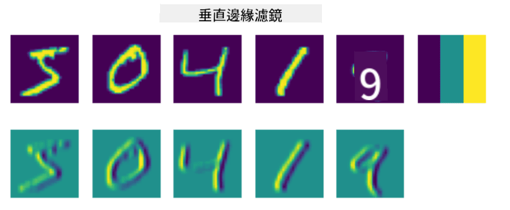
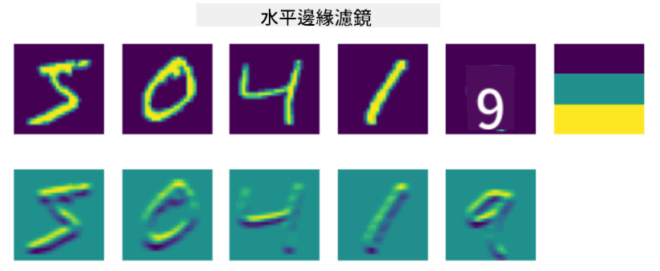

<!--
CO_OP_TRANSLATOR_METADATA:
{
  "original_hash": "088837b42b7d99198bf62db8a42411e0",
  "translation_date": "2025-08-24T21:59:16+00:00",
  "source_file": "lessons/4-ComputerVision/07-ConvNets/README.md",
  "language_code": "hk"
}
-->
# 卷積神經網絡

我們之前已經看到，神經網絡在處理圖像方面表現得相當不錯，即使是一層的感知機也能以合理的準確率識別 MNIST 數據集中的手寫數字。然而，MNIST 數據集非常特殊，所有的數字都被集中在圖像的中心，這使得任務變得更簡單。

## [課前測驗](https://red-field-0a6ddfd03.1.azurestaticapps.net/quiz/107)

在現實生活中，我們希望能夠識別圖片中的物體，而不需要考慮它們在圖像中的具體位置。計算機視覺與一般的分類任務不同，因為當我們試圖在圖片中找到某個特定物體時，我們是在掃描圖像，尋找一些特定的**模式**及其組合。例如，當尋找一隻貓時，我們可能會先尋找水平線條，這些線條可能形成貓鬚，然後某些貓鬚的組合可以告訴我們這確實是一張貓的圖片。某些模式的相對位置和存在是重要的，而不是它們在圖像中的精確位置。

為了提取模式，我們將使用**卷積濾波器**的概念。如你所知，圖像可以用一個二維矩陣或帶有色彩深度的三維張量來表示。應用濾波器意味著我們使用一個相對較小的**濾波核**矩陣，並對原始圖像中的每個像素與其鄰近點計算加權平均值。我們可以將其視為一個小窗口在整個圖像上滑動，並根據濾波核矩陣中的權重對所有像素進行平均。

 | 
----|----

> 圖片來源：Dmitry Soshnikov

例如，如果我們對 MNIST 數字應用 3x3 的垂直邊緣和水平邊緣濾波器，我們可以在原始圖像中有垂直和水平邊緣的地方得到高亮（例如高值）。因此，這兩個濾波器可以用來“尋找”邊緣。同樣，我們可以設計不同的濾波器來尋找其他低層次的模式：

> [Leung-Malik 濾波器組](https://www.robots.ox.ac.uk/~vgg/research/texclass/filters.html)的圖片

然而，雖然我們可以手動設計濾波器來提取某些模式，但我們也可以設計網絡，使其能夠自動學習這些模式。這正是 CNN 背後的主要思想之一。

## CNN 的主要思想

CNN 的工作原理基於以下幾個重要的概念：

* 卷積濾波器可以提取模式
* 我們可以設計網絡，使濾波器能夠自動訓練
* 我們可以使用相同的方法來發現高層次特徵中的模式，而不僅僅是原始圖像中的模式。因此，CNN 的特徵提取是基於特徵的層次結構，從低層次的像素組合開始，到更高層次的圖像部分組合。

> 圖片來源：[Hislop-Lynch 的論文](https://www.semanticscholar.org/paper/Computer-vision-based-pedestrian-trajectory-Hislop-Lynch/26e6f74853fc9bbb7487b06dc2cf095d36c9021d)，基於[他們的研究](https://dl.acm.org/doi/abs/10.1145/1553374.1553453)

## ✍️ 練習：卷積神經網絡

讓我們繼續探索卷積神經網絡的工作原理，以及如何通過相關的筆記本實現可訓練的濾波器：

* [卷積神經網絡 - PyTorch](../../../../../lessons/4-ComputerVision/07-ConvNets/ConvNetsPyTorch.ipynb)
* [卷積神經網絡 - TensorFlow](../../../../../lessons/4-ComputerVision/07-ConvNets/ConvNetsTF.ipynb)

## 金字塔結構

大多數用於圖像處理的 CNN 都遵循所謂的金字塔結構。應用於原始圖像的第一層卷積通常具有相對較少的濾波器（8-16 個），這些濾波器對應於不同的像素組合，例如水平/垂直線條或筆劃。在下一層，我們減少網絡的空間維度，並增加濾波器的數量，這對應於更多簡單特徵的可能組合。隨著每一層的進展，當我們接近最終分類器時，圖像的空間維度減小，而濾波器的數量增加。

例如，讓我們來看看 VGG-16 的結構，這是一個在 2014 年 ImageNet 的 top-5 分類中達到 92.7% 準確率的網絡：

> 圖片來源：[Researchgate](https://www.researchgate.net/figure/Vgg16-model-structure-To-get-the-VGG-NIN-model-we-replace-the-2-nd-4-th-6-th-7-th_fig2_335194493)

## 最知名的 CNN 結構

[繼續學習最知名的 CNN 結構](CNN_Architectures.md)

**免責聲明**：  
本文件已使用人工智能翻譯服務 [Co-op Translator](https://github.com/Azure/co-op-translator) 進行翻譯。我們致力於提供準確的翻譯，但請注意，自動翻譯可能包含錯誤或不準確之處。應以原文文件作為權威來源。對於關鍵資訊，建議尋求專業人工翻譯。我們對因使用此翻譯而引起的任何誤解或錯誤解釋概不負責。