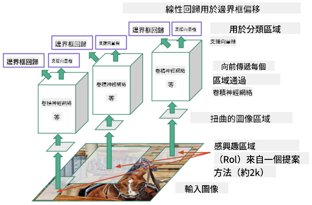

<!--
CO_OP_TRANSLATOR_METADATA:
{
  "original_hash": "d85c8b08f6d1b48fd7f35b99f93c1138",
  "translation_date": "2025-08-24T21:58:01+00:00",
  "source_file": "lessons/4-ComputerVision/11-ObjectDetection/README.md",
  "language_code": "hk"
}
-->
# 物件偵測

我們之前處理的影像分類模型，會接收一張圖片並產生一個分類結果，例如在 MNIST 問題中分類為「數字」的類別。然而，在許多情況下，我們不僅僅想知道圖片中有什麼物件，還希望能夠確定它們的精確位置。這正是**物件偵測**的目的。

## [課前小測驗](https://ff-quizzes.netlify.app/en/ai/quiz/21)

> 圖片來源：[YOLO v2 網站](https://pjreddie.com/darknet/yolov2/)

## 一個簡單的物件偵測方法

假設我們想在一張圖片中找到一隻貓，一個非常簡單的物件偵測方法如下：

1. 將圖片分割成多個小區塊。
2. 對每個區塊進行影像分類。
3. 將分類結果中激活值足夠高的區塊視為包含目標物件的區域。

> *圖片來源：[練習筆記本](../../../../../lessons/4-ComputerVision/11-ObjectDetection/ObjectDetection-TF.ipynb)*

然而，這種方法遠非理想，因為它只能非常粗略地定位物件的邊界框。若要更精確地定位，我們需要進行某種**回歸分析**來預測邊界框的座標，而這需要特定的數據集。

## 用於物件偵測的回歸分析

[這篇部落格文章](https://towardsdatascience.com/object-detection-with-neural-networks-a4e2c46b4491)對於偵測形狀提供了一個很好的入門介紹。

## 物件偵測的數據集

在執行這項任務時，你可能會遇到以下數據集：

* [PASCAL VOC](http://host.robots.ox.ac.uk/pascal/VOC/) - 包含 20 個類別
* [COCO](http://cocodataset.org/#home) - 常見物件上下文數據集，包含 80 個類別、邊界框和分割遮罩

## 物件偵測的評估指標

### 交集比聯集 (Intersection over Union, IoU)

對於影像分類來說，衡量演算法的表現相對簡單；但對於物件偵測，我們需要同時衡量類別的正確性以及推測邊界框位置的精確性。後者使用所謂的**交集比聯集** (IoU) 來衡量，這是一種用來評估兩個框（或任意兩個區域）重疊程度的指標。

> *圖片來源：[這篇優秀的 IoU 部落格文章](https://pyimagesearch.com/2016/11/07/intersection-over-union-iou-for-object-detection/)*

概念很簡單：將兩個區域的交集面積除以它們的聯集面積。對於完全相同的區域，IoU 值為 1；對於完全不相交的區域，IoU 值為 0。其他情況下，IoU 值介於 0 到 1 之間。我們通常只考慮 IoU 超過某個值的邊界框。

### 平均準確率 (Average Precision, AP)

假設我們想衡量某個類別 $C$ 的物件被識別的效果。為此，我們使用**平均準確率** (AP) 指標，其計算方式如下：

1. 考慮準確率-召回率曲線，該曲線顯示了檢測閾值（從 0 到 1）對準確率的影響。
2. 根據閾值的不同，我們會在圖片中檢測到更多或更少的物件，並得到不同的準確率和召回率值。
3. 該曲線看起來如下：

> *圖片來源：[NeuroWorkshop](http://github.com/shwars/NeuroWorkshop)*

對於給定類別 $C$ 的平均準確率是該曲線下的面積。更精確地說，召回率軸通常被分成 10 個部分，並對這些點的準確率取平均值：

$$
AP = {1\over11}\sum_{i=0}^{10}\mbox{Precision}(\mbox{Recall}={i\over10})
$$

### AP 與 IoU

我們只考慮那些 IoU 超過某個值的檢測。例如，在 PASCAL VOC 數據集中，通常假設 $\mbox{IoU Threshold} = 0.5$，而在 COCO 數據集中，AP 是針對不同的 $\mbox{IoU Threshold}$ 值進行測量的。

> *圖片來源：[NeuroWorkshop](http://github.com/shwars/NeuroWorkshop)*

### 平均平均準確率 (Mean Average Precision, mAP)

物件偵測的主要評估指標是**平均平均準確率** (mAP)。它是所有物件類別的平均準確率，有時也包括不同 $\mbox{IoU Threshold}$ 的平均值。更詳細的 mAP 計算過程可以參考[這篇部落格文章](https://medium.com/@timothycarlen/understanding-the-map-evaluation-metric-for-object-detection-a07fe6962cf3))，以及[這裡的程式碼範例](https://gist.github.com/tarlen5/008809c3decf19313de216b9208f3734)。

## 不同的物件偵測方法

物件偵測演算法主要分為兩大類：

* **區域提議網路** (Region Proposal Networks, R-CNN, Fast R-CNN, Faster R-CNN)。主要的想法是生成**感興趣區域** (ROI)，並對其執行 CNN，尋找最大激活值。這與簡單方法有些相似，但 ROI 是以更聰明的方式生成的。這類方法的主要缺點是速度較慢，因為需要對圖片進行多次 CNN 分類。
* **單次通過** (One-pass) 方法（如 YOLO、SSD、RetinaNet）。這些架構設計為在一次通過中同時預測類別和 ROI。

### R-CNN: 基於區域的 CNN

[R-CNN](http://islab.ulsan.ac.kr/files/announcement/513/rcnn_pami.pdf) 使用 [Selective Search](http://www.huppelen.nl/publications/selectiveSearchDraft.pdf) 生成 ROI 區域的層次結構，然後通過 CNN 特徵提取器和 SVM 分類器來確定物件類別，並使用線性回歸確定*邊界框*座標。[官方論文](https://arxiv.org/pdf/1506.01497v1.pdf)

> *圖片來源：van de Sande et al. ICCV’11*

> *圖片來源：[這篇部落格](https://towardsdatascience.com/r-cnn-fast-r-cnn-faster-r-cnn-yolo-object-detection-algorithms-36d53571365e)*

### F-RCNN - 快速 R-CNN

這種方法與 R-CNN 類似，但區域是在應用卷積層後定義的。

> 圖片來源：[官方論文](https://www.cv-foundation.org/openaccess/content_iccv_2015/papers/Girshick_Fast_R-CNN_ICCV_2015_paper.pdf)，[arXiv](https://arxiv.org/pdf/1504.08083.pdf)，2015

### Faster R-CNN

這種方法的主要想法是使用神經網路來預測 ROI，稱為*區域提議網路*。[論文](https://arxiv.org/pdf/1506.01497.pdf)，2016

> 圖片來源：[官方論文](https://arxiv.org/pdf/1506.01497.pdf)

### R-FCN: 基於區域的全卷積網路

這種演算法比 Faster R-CNN 更快。主要想法如下：

1. 使用 ResNet-101 提取特徵。
2. 特徵經過**位置敏感分數圖**處理。每個來自 $C$ 類別的物件被劃分為 $k\times k$ 區域，並訓練預測物件的部分。
3. 對於來自 $k\times k$ 區域的每個部分，所有網路對物件類別進行投票，選擇得票最多的類別。

> 圖片來源：[官方論文](https://arxiv.org/abs/1605.06409)

### YOLO - You Only Look Once

YOLO 是一種實時單次通過的演算法。主要想法如下：

 * 將圖片劃分為 $S\times S$ 區域。
 * 對於每個區域，**CNN** 預測 $n$ 個可能的物件、*邊界框*座標以及*置信度*=*概率* * IoU。

 

> 圖片來源：[官方論文](https://arxiv.org/abs/1506.02640)

### 其他演算法

* RetinaNet: [官方論文](https://arxiv.org/abs/1708.02002)
   - [PyTorch 實現](https://pytorch.org/vision/stable/_modules/torchvision/models/detection/retinanet.html)
   - [Keras 實現](https://github.com/fizyr/keras-retinanet)
   - [Keras 示例中的 RetinaNet](https://keras.io/examples/vision/retinanet/)
* SSD (單次檢測器): [官方論文](https://arxiv.org/abs/1512.02325)

## ✍️ 練習：物件偵測

繼續學習以下筆記本：

[ObjectDetection.ipynb](../../../../../lessons/4-ComputerVision/11-ObjectDetection/ObjectDetection.ipynb)

## 結論

在這節課中，你快速瀏覽了各種實現物件偵測的方法！

## 🚀 挑戰

閱讀以下關於 YOLO 的文章和筆記本，並嘗試自己實現：

* [優秀的部落格文章](https://www.analyticsvidhya.com/blog/2018/12/practical-guide-object-detection-yolo-framewor-python/) 描述 YOLO
 * [官方網站](https://pjreddie.com/darknet/yolo/)
 * YOLO: [Keras 實現](https://github.com/experiencor/keras-yolo2)，[逐步筆記本](https://github.com/experiencor/basic-yolo-keras/blob/master/Yolo%20Step-by-Step.ipynb)
 * YOLO v2: [Keras 實現](https://github.com/experiencor/keras-yolo2)，[逐步筆記本](https://github.com/experiencor/keras-yolo2/blob/master/Yolo%20Step-by-Step.ipynb)

## [課後小測驗](https://ff-quizzes.netlify.app/en/ai/quiz/22)

## 複習與自學

* [物件偵測](https://tjmachinelearning.com/lectures/1718/obj/) by Nikhil Sardana
* [物件偵測演算法的良好比較](https://lilianweng.github.io/lil-log/2018/12/27/object-detection-part-4.html)
* [深度學習物件偵測演算法回顧](https://medium.com/comet-app/review-of-deep-learning-algorithms-for-object-detection-c1f3d437b852)
* [基本物件偵測演算法的逐步介紹](https://www.analyticsvidhya.com/blog/2018/10/a-step-by-step-introduction-to-the-basic-object-detection-algorithms-part-1/)
* [Python 中 Faster R-CNN 的實現](https://www.analyticsvidhya.com/blog/2018/11/implementation-faster-r-cnn-python-object-detection/)

## [作業：物件偵測](lab/README.md)

**免責聲明**：  
本文件已使用人工智能翻譯服務 [Co-op Translator](https://github.com/Azure/co-op-translator) 進行翻譯。我們致力於提供準確的翻譯，但請注意，自動翻譯可能包含錯誤或不準確之處。應以原文文件作為權威來源。如涉及關鍵資訊，建議尋求專業人工翻譯。我們對因使用此翻譯而引起的任何誤解或誤釋概不負責。