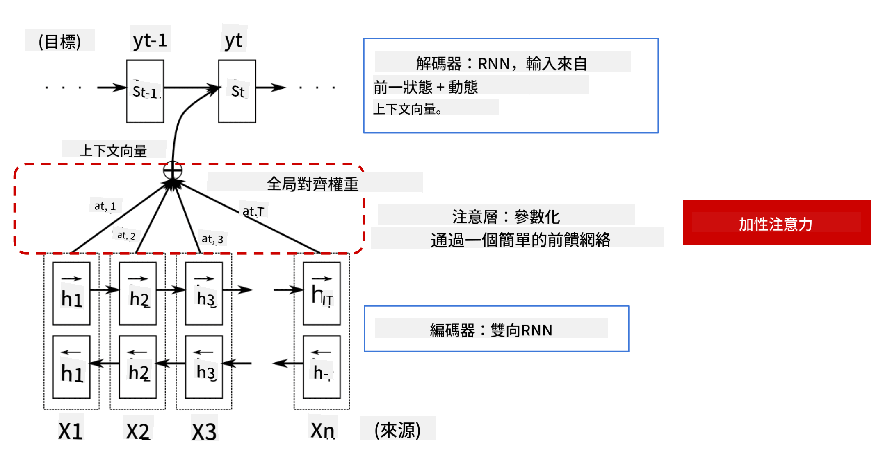

<!--
CO_OP_TRANSLATOR_METADATA:
{
  "original_hash": "7e617f0b8de85a43957a853aba09bfeb",
  "translation_date": "2025-08-24T21:48:52+00:00",
  "source_file": "lessons/5-NLP/18-Transformers/README.md",
  "language_code": "hk"
}
-->
# 注意機制與Transformer

## [課前測驗](https://red-field-0a6ddfd03.1.azurestaticapps.net/quiz/118)

自然語言處理（NLP）領域中最重要的問題之一是**機器翻譯**，這是一項支撐工具（如Google翻譯）的核心任務。在本節中，我們將專注於機器翻譯，或者更廣泛地說，任何*序列到序列*的任務（也稱為**句子轉換**）。

使用RNN時，序列到序列的實現是通過兩個循環神經網絡完成的，其中一個網絡是**編碼器**，將輸入序列壓縮成隱藏狀態；另一個網絡是**解碼器**，將該隱藏狀態展開為翻譯結果。然而，這種方法存在一些問題：

* 編碼器網絡的最終狀態難以記住句子的開頭，導致模型在處理長句子時效果不佳。
* 序列中的所有詞對結果的影響相同，但實際上，輸入序列中的某些詞對輸出序列的影響往往更大。

**注意機制**提供了一種方法，能夠對每個輸入向量對RNN輸出預測的上下文影響進行加權。其實現方式是通過在輸入RNN的中間狀態與輸出RNN之間創建捷徑。這樣，在生成輸出符號yt時，我們會考慮所有輸入的隱藏狀態hi，並賦予不同的權重係數αt,i。

> [Bahdanau等人, 2015](https://arxiv.org/pdf/1409.0473.pdf)中的加性注意機制編碼器-解碼器模型，圖片來源於[這篇博客文章](https://lilianweng.github.io/lil-log/2018/06/24/attention-attention.html)

注意矩陣{αi,j}表示某些輸入詞在生成輸出序列中某個詞時的影響程度。以下是一個這樣的矩陣示例：

> 圖片來自[Bahdanau等人, 2015](https://arxiv.org/pdf/1409.0473.pdf)（圖3）

注意機制是當前或接近當前NLP領域最先進技術的核心。然而，添加注意機制會大幅增加模型參數的數量，這導致了RNN的擴展問題。RNN擴展的一個主要限制是模型的循環特性使得訓練過程難以批量化和並行化。在RNN中，序列的每個元素需要按順序處理，這意味著它無法輕易並行化。

> 圖片來自[Google的博客](https://research.googleblog.com/2016/09/a-neural-network-for-machine.html)

注意機制的採用以及上述限制促成了如今我們熟知並使用的最先進Transformer模型的誕生，例如BERT和Open-GPT3。

## Transformer模型

Transformer的核心思想之一是避免RNN的序列特性，並創建一個在訓練過程中可並行化的模型。這是通過實現以下兩個概念來完成的：

* 位置編碼
* 使用自注意機制來捕捉模式，而不是使用RNN（或CNN）（這也是為什麼介紹Transformer的論文被稱為*[Attention is all you need](https://arxiv.org/abs/1706.03762)*）

### 位置編碼/嵌入

位置編碼的想法如下：
1. 使用RNN時，詞元的相對位置由步數表示，因此不需要顯式表示。
2. 然而，一旦我們切換到注意機制，我們需要知道序列中詞元的相對位置。
3. 為了獲得位置編碼，我們將詞元序列與序列中的詞元位置序列（例如，0,1, ...）結合。
4. 然後，我們將詞元位置與詞元嵌入向量混合。為了將位置（整數）轉換為向量，我們可以使用不同的方法：

* 可訓練的嵌入，類似於詞元嵌入。我們在這裡考慮這種方法。我們在詞元及其位置上應用嵌入層，生成相同維度的嵌入向量，然後將它們相加。
* 固定位置編碼函數，這是原始論文中提出的方法。

> 圖片由作者提供

通過位置嵌入，我們獲得的結果同時嵌入了原始詞元及其在序列中的位置。

### 多頭自注意機制

接下來，我們需要捕捉序列中的一些模式。為此，Transformer使用了**自注意機制**，這本質上是將注意機制應用於相同的輸入和輸出序列。應用自注意機制使我們能夠考慮句子中的**上下文**，並了解哪些詞之間存在關聯。例如，它可以幫助我們理解代詞（如*it*）所指代的詞，並考慮上下文：

> 圖片來自[Google博客](https://research.googleblog.com/2017/08/transformer-novel-neural-network.html)

在Transformer中，我們使用**多頭注意機制**，以賦予網絡捕捉多種類型依賴關係的能力，例如長期與短期詞關係、共指關係與其他關係等。

[TensorFlow Notebook](../../../../../lessons/5-NLP/18-Transformers/TransformersTF.ipynb)中包含有關Transformer層實現的更多細節。

### 編碼器-解碼器注意機制

在Transformer中，注意機制用於兩個地方：

* 使用自注意機制捕捉輸入文本中的模式
* 執行序列翻譯——這是編碼器與解碼器之間的注意層。

編碼器-解碼器注意機制與RNN中使用的注意機制非常相似，如本節開頭所述。以下動畫圖解釋了編碼器-解碼器注意機制的作用。

由於每個輸入位置可以獨立映射到每個輸出位置，Transformer比RNN更容易並行化，這使得更大、更具表達力的語言模型成為可能。每個注意頭可以用於學習詞之間的不同關係，從而改進下游自然語言處理任務。

## BERT

**BERT**（Bidirectional Encoder Representations from Transformers）是一個非常大的多層Transformer網絡，*BERT-base*有12層，*BERT-large*有24層。該模型首先在大規模文本數據（維基百科+書籍）上進行無監督預訓練（預測句子中的被遮蔽詞）。在預訓練過程中，模型吸收了大量的語言理解能力，這些能力可以通過微調其他數據集來利用。這個過程被稱為**遷移學習**。

> 圖片[來源](http://jalammar.github.io/illustrated-bert/)

## ✍️ 練習：Transformer

繼續學習以下筆記本：

* [PyTorch中的Transformer](../../../../../lessons/5-NLP/18-Transformers/TransformersPyTorch.ipynb)
* [TensorFlow中的Transformer](../../../../../lessons/5-NLP/18-Transformers/TransformersTF.ipynb)

## 總結

在本課中，你學習了Transformer和注意機制，這些都是NLP工具箱中的重要工具。Transformer架構有許多變體，包括BERT、DistilBERT、BigBird、OpenGPT3等，這些模型可以進行微調。[HuggingFace套件](https://github.com/huggingface/)提供了使用PyTorch和TensorFlow訓練這些架構的資源庫。

## 🚀 挑戰

## [課後測驗](https://red-field-0a6ddfd03.1.azurestaticapps.net/quiz/218)

## 複習與自學

* [博客文章](https://mchromiak.github.io/articles/2017/Sep/12/Transformer-Attention-is-all-you-need/)，解釋了經典的[Attention is all you need](https://arxiv.org/abs/1706.03762) Transformer論文。
* [一系列博客文章](https://towardsdatascience.com/transformers-explained-visually-part-1-overview-of-functionality-95a6dd460452)，詳細解釋了Transformer的架構。

## [作業](assignment.md)

**免責聲明**：  
本文件已使用人工智能翻譯服務 [Co-op Translator](https://github.com/Azure/co-op-translator) 進行翻譯。我們致力於提供準確的翻譯，但請注意，自動翻譯可能包含錯誤或不準確之處。應以原文文件作為權威來源。如涉及關鍵資訊，建議尋求專業人工翻譯。我們對因使用此翻譯而引起的任何誤解或誤釋概不負責。