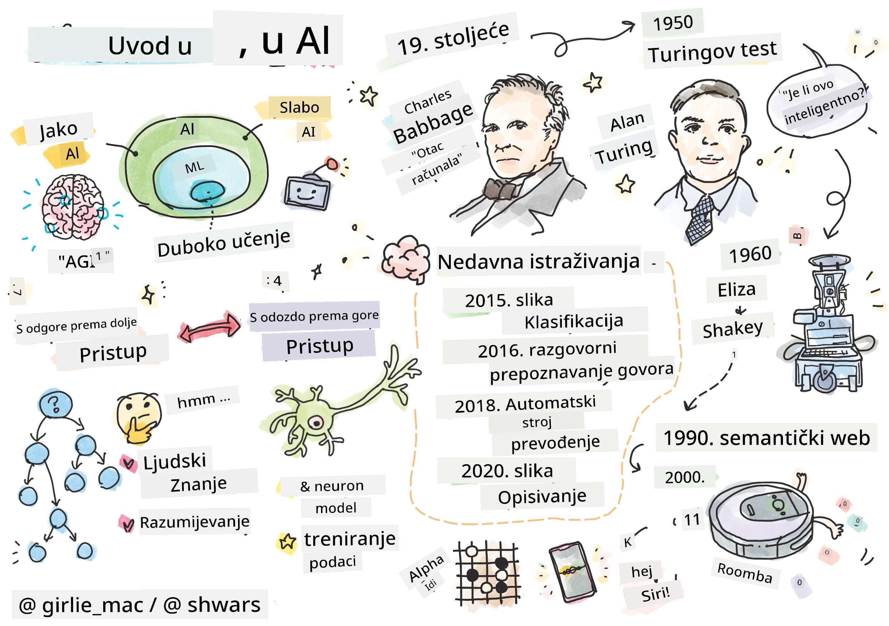
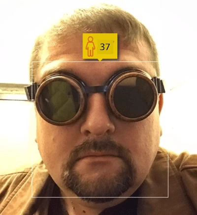
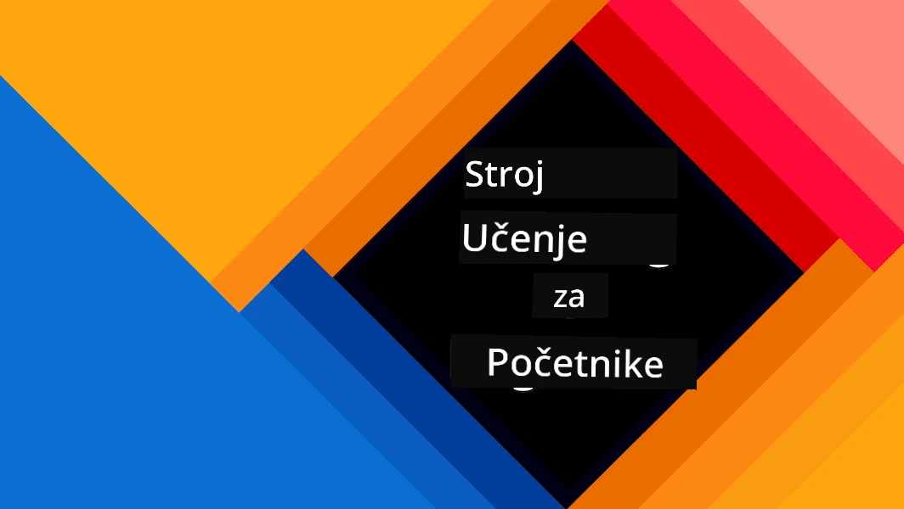
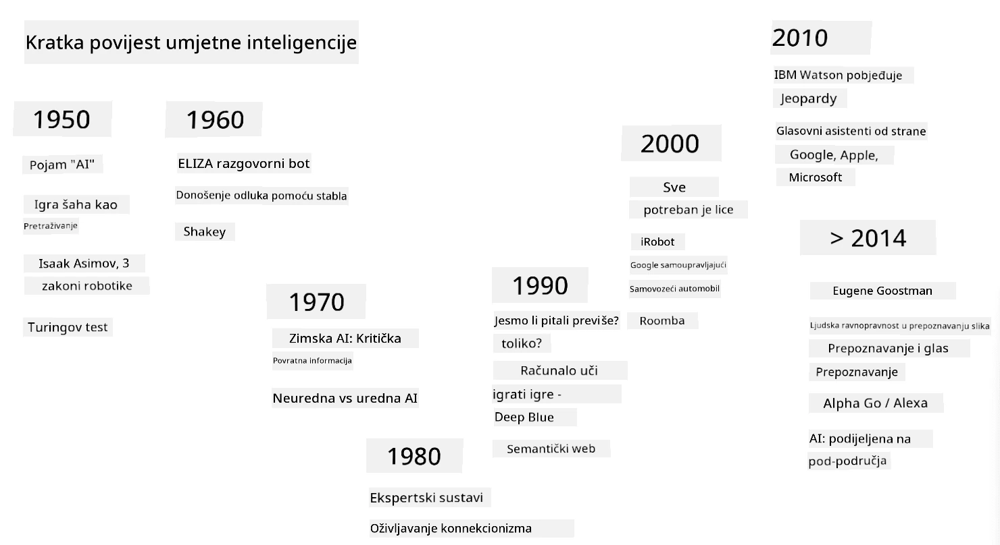
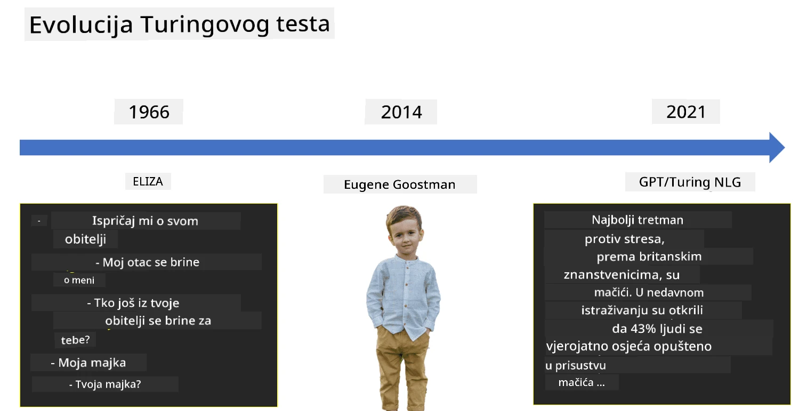

# Uvod u AI

> Crtež od [Tomomi Imura](https://twitter.com/girlie_mac)

## [Kviz prije predavanja](https://ff-quizzes.netlify.app/en/ai/quiz/1)

**Umjetna inteligencija** je uzbudljiva znanstvena disciplina koja proučava kako možemo učiniti da računala pokazuju inteligentno ponašanje, npr. obavljaju stvari u kojima su ljudi dobri.

Izvorno, računala je izumio [Charles Babbage](https://en.wikipedia.org/wiki/Charles_Babbage) kako bi radila s brojevima slijedeći dobro definirani postupak - algoritam. Moderna računala, iako znatno naprednija od originalnog modela predloženog u 19. stoljeću, i dalje slijede istu ideju kontroliranih izračuna. Stoga je moguće programirati računalo da nešto učini ako znamo točan slijed koraka koji trebamo poduzeti kako bismo postigli cilj.

> Fotografija od [Vickie Soshnikova](http://twitter.com/vickievalerie)

> ✅ Određivanje dobi osobe na temelju njezine fotografije zadatak je koji se ne može eksplicitno programirati, jer ne znamo kako dolazimo do broja u svojoj glavi kada to radimo.

---

Međutim, postoje neki zadaci za koje ne znamo eksplicitno kako ih riješiti. Razmislite o određivanju dobi osobe na temelju njezine fotografije. Nekako to naučimo jer smo vidjeli mnogo primjera ljudi različite dobi, ali ne možemo eksplicitno objasniti kako to radimo, niti možemo programirati računalo da to učini. Upravo su takvi zadaci od interesa za **umjetnu inteligenciju** (skraćeno AI).

✅ Razmislite o nekim zadacima koje biste mogli prepustiti računalu i koji bi imali koristi od AI-a. Razmotrite područja financija, medicine i umjetnosti - kako ta područja danas imaju koristi od AI-a?

## Slaba AI vs. Jaka AI

Slaba AI | Jaka AI
---------------------------------------|-------------------------------------
Slaba AI odnosi se na AI sustave koji su dizajnirani i obučeni za određeni zadatak ili uski skup zadataka.|Jaka AI, ili Umjetna Opća Inteligencija (AGI), odnosi se na AI sustave s inteligencijom i razumijevanjem na razini čovjeka.
Ovi AI sustavi nisu općenito inteligentni; izvrsni su u obavljanju unaprijed definiranog zadatka, ali nemaju pravo razumijevanje ili svijest.|Ovi AI sustavi imaju sposobnost obavljanja bilo kojeg intelektualnog zadatka koji čovjek može učiniti, prilagoditi se različitim domenama i posjedovati oblik svijesti ili samosvijesti.
Primjeri slabe AI uključuju virtualne asistente poput Siri ili Alexa, algoritme preporuka koje koriste streaming servisi i chatbotove dizajnirane za specifične zadatke korisničke podrške.|Postizanje jake AI dugoročni je cilj istraživanja AI-a i zahtijevalo bi razvoj AI sustava koji mogu razmišljati, učiti, razumjeti i prilagoditi se širokom rasponu zadataka i konteksta.
Slaba AI je visoko specijalizirana i ne posjeduje kognitivne sposobnosti nalik ljudskim ili opće sposobnosti rješavanja problema izvan svoje uske domene.|Jaka AI trenutno je teorijski koncept i nijedan AI sustav nije dosegao ovu razinu opće inteligencije.

Za više informacija pogledajte **[Umjetna Opća Inteligencija](https://en.wikipedia.org/wiki/Artificial_general_intelligence)** (AGI).
## Definicija inteligencije i Turingov test

Jedan od problema pri bavljenju pojmom **[inteligencija](https://en.wikipedia.org/wiki/Intelligence)** jest taj što ne postoji jasna definicija ovog pojma. Može se tvrditi da je inteligencija povezana s **apstraktnim razmišljanjem** ili **samosviješću**, ali je ne možemo pravilno definirati.

> [Fotografija](https://unsplash.com/photos/75715CVEJhI) od [Amber Kipp](https://unsplash.com/@sadmax) s Unsplash-a

Da bismo vidjeli nejasnoću pojma *inteligencija*, pokušajte odgovoriti na pitanje: "Je li mačka inteligentna?". Različiti ljudi imaju tendenciju davati različite odgovore na ovo pitanje, jer ne postoji univerzalno prihvaćen test koji bi dokazao da je tvrdnja istinita ili ne. A ako mislite da postoji - pokušajte provesti svoju mačku kroz IQ test...

✅ Razmislite na trenutak o tome kako definirate inteligenciju. Je li vrana koja može riješiti labirint i doći do hrane inteligentna? Je li dijete inteligentno?

---

Kada govorimo o AGI-u, trebamo imati neki način da utvrdimo jesmo li stvorili istinski inteligentan sustav. [Alan Turing](https://en.wikipedia.org/wiki/Alan_Turing) predložio je način nazvan **[Turingov test](https://en.wikipedia.org/wiki/Turing_test)**, koji također djeluje kao definicija inteligencije. Test uspoređuje dani sustav s nečim inherentno inteligentnim - stvarnim ljudskim bićem, a budući da se svaka automatska usporedba može zaobići računalnim programom, koristimo ljudskog ispitivača. Dakle, ako ljudsko biće nije u stanju razlikovati stvarnu osobu od računalnog sustava u tekstualnom dijalogu - sustav se smatra inteligentnim.

> Chat-bot nazvan [Eugene Goostman](https://en.wikipedia.org/wiki/Eugene_Goostman), razvijen u St. Petersburgu, bio je blizu prolaska Turingovog testa 2014. koristeći pametan trik s osobnošću. Odmah je najavio da je 13-godišnji ukrajinski dječak, što bi objasnilo nedostatak znanja i neke nedosljednosti u tekstu. Bot je uvjerio 30% sudaca da je čovjek nakon 5-minutnog dijaloga, metrika za koju je Turing vjerovao da će je stroj moći proći do 2000. Međutim, treba razumjeti da to ne ukazuje na to da smo stvorili inteligentan sustav ili da je računalni sustav prevario ljudskog ispitivača - sustav nije prevario ljude, već su to učinili kreatori bota!

✅ Jeste li ikada bili prevareni od strane chat-bota da mislite da razgovarate s čovjekom? Kako vas je uvjerio?

## Različiti pristupi AI-u

Ako želimo da računalo djeluje poput čovjeka, moramo nekako modelirati naš način razmišljanja unutar računala. Posljedično, moramo pokušati razumjeti što čini ljudsko biće inteligentnim.

> Da bismo mogli programirati inteligenciju u stroj, moramo razumjeti kako funkcioniraju naši vlastiti procesi donošenja odluka. Ako malo introspektivno razmislite, shvatit ćete da postoje neki procesi koji se događaju podsvjesno – npr. možemo razlikovati mačku od psa bez razmišljanja o tome - dok drugi uključuju razmišljanje.

Postoje dva moguća pristupa ovom problemu:

Pristup odozgo prema dolje (Simboličko zaključivanje) | Pristup odozdo prema gore (Neuronske mreže)
---------------------------------------|-------------------------------------
Pristup odozgo prema dolje modelira način na koji osoba razmišlja kako bi riješila problem. Uključuje izdvajanje **znanja** od ljudskog bića i njegovo predstavljanje u obliku čitljivom za računalo. Također moramo razviti način modeliranja **zaključivanja** unutar računala. | Pristup odozdo prema gore modelira strukturu ljudskog mozga, koji se sastoji od velikog broja jednostavnih jedinica nazvanih **neuroni**. Svaki neuron djeluje kao ponderirani prosjek svojih ulaza, a mrežu neurona možemo obučiti za rješavanje korisnih problema pružanjem **podataka za obuku**.

Postoje i neki drugi mogući pristupi inteligenciji:

* **Emergentni**, **sinergijski** ili **pristup više agenata** temelje se na činjenici da se složeno inteligentno ponašanje može dobiti interakcijom velikog broja jednostavnih agenata. Prema [evolucijskoj kibernetici](https://en.wikipedia.org/wiki/Global_brain#Evolutionary_cybernetics), inteligencija može *nastati* iz jednostavnijeg, reaktivnog ponašanja u procesu *prijelaza metasustava*.

* **Evolucijski pristup**, ili **genetski algoritam** je proces optimizacije temeljen na principima evolucije.

Razmotrit ćemo te pristupe kasnije u tečaju, ali trenutno ćemo se usredotočiti na dva glavna smjera: odozgo prema dolje i odozdo prema gore.

### Pristup odozgo prema dolje

U **pristupu odozgo prema dolje**, pokušavamo modelirati naše zaključivanje. Budući da možemo pratiti svoje misli dok razmišljamo, možemo pokušati formalizirati ovaj proces i programirati ga unutar računala. To se naziva **simboličko zaključivanje**.

Ljudi imaju tendenciju imati neka pravila u svojoj glavi koja vode njihove procese donošenja odluka. Na primjer, kada liječnik dijagnosticira pacijenta, može shvatiti da osoba ima temperaturu, pa bi moglo postojati neko upalno stanje u tijelu. Primjenom velikog skupa pravila na određeni problem liječnik može doći do konačne dijagnoze.

Ovaj pristup uvelike se oslanja na **predstavljanje znanja** i **zaključivanje**. Izdvajanje znanja od ljudskog stručnjaka može biti najteži dio, jer liječnik u mnogim slučajevima ne bi znao točno zašto dolazi do određene dijagnoze. Ponekad rješenje jednostavno dolazi u njegovu ili njezinu glavu bez eksplicitnog razmišljanja. Neki zadaci, poput određivanja dobi osobe na temelju fotografije, uopće se ne mogu svesti na manipulaciju znanjem.

### Pristup odozdo prema gore

Alternativno, možemo pokušati modelirati najjednostavnije elemente unutar našeg mozga – neuron. Možemo konstruirati takozvanu **umjetnu neuronsku mrežu** unutar računala, a zatim je pokušati naučiti rješavati probleme dajući joj primjere. Ovaj proces je sličan načinu na koji novorođenče uči o svojoj okolini promatranjem.

✅ Malo istražite kako bebe uče. Koji su osnovni elementi mozga bebe?

> | Što je s ML?         |      |
> |--------------|-----------|
> | Dio umjetne inteligencije koji se temelji na učenju računala da riješi problem na temelju nekih podataka naziva se **strojno učenje**. Nećemo razmatrati klasično strojno učenje u ovom tečaju - upućujemo vas na zasebni kurikulum [Strojno učenje za početnike](http://aka.ms/ml-beginners). |       |

## Kratka povijest AI-a

Umjetna inteligencija započela je kao područje sredinom dvadesetog stoljeća. U početku je simboličko zaključivanje bilo prevladavajući pristup, što je dovelo do brojnih važnih uspjeha, poput stručnih sustava – računalnih programa koji su mogli djelovati kao stručnjaci u nekim ograničenim domenama problema. Međutim, ubrzo je postalo jasno da se takav pristup ne skalira dobro. Izdvajanje znanja od stručnjaka, njegovo predstavljanje u računalu i održavanje te baze znanja točnom pokazalo se vrlo složenim zadatkom i preskupim za praktičnu primjenu u mnogim slučajevima. To je dovelo do takozvane [AI zime](https://en.wikipedia.org/wiki/AI_winter) 1970-ih.

> Slika od [Dmitry Soshnikov](http://soshnikov.com)

Kako je vrijeme prolazilo, računalni resursi postali su jeftiniji, a dostupno je više podataka, pa su pristupi neuronskim mrežama počeli pokazivati izvrsne performanse u natjecanju s ljudima u mnogim područjima, poput računalnog vida ili razumijevanja govora. U posljednjem desetljeću, pojam umjetne inteligencije uglavnom se koristi kao sinonim za neuronske mreže, jer većina uspjeha AI-a o kojima čujemo temelji se na njima.

Možemo promatrati kako su se pristupi mijenjali, na primjer, u stvaranju računalnog programa za igranje šaha:

* Rani šahovski programi temeljili su se na pretraživanju – program je eksplicitno pokušavao procijeniti moguće poteze protivnika za određeni broj sljedećih poteza i odabrao optimalan potez na temelju optimalne pozicije koja se može postići u nekoliko poteza. To je dovelo do razvoja takozvanog [alpha-beta rezanja](https://en.wikipedia.org/wiki/Alpha%E2%80%93beta_pruning) algoritma pretraživanja.
* Strategije pretraživanja dobro funkcioniraju prema kraju igre, gdje je prostor pretraživanja ograničen malim brojem mogućih poteza. Međutim, na početku igre prostor pretraživanja je ogroman, a algoritam se može poboljšati učenjem iz postojećih mečeva između ljudskih igrača. Naknadni eksperimenti koristili su takozvano [zaključivanje temeljeno na slučajevima](https://en.wikipedia.org/wiki/Case-based_reasoning), gdje je program tražio slučajeve u bazi znanja vrlo slične trenutnoj poziciji u igri.
* Moderni programi koji pobjeđuju ljudske igrače temelje se na neuronskim mrežama i [učenju pojačanjem](https://en.wikipedia.org/wiki/Reinforcement_learning), gdje programi uče igrati isključivo igrajući dugo vremena protiv sebe i učeći iz vlastitih pogrešaka – slično kao što ljudi rade kada uče igrati šah. Međutim, računalni program može odigrati mnogo više partija u puno kraćem vremenu i tako učiti mnogo brže.

✅ Malo istražite o drugim igrama koje su igrali AI sustavi.

Slično, možemo vidjeti kako se pristup stvaranju "govornih programa" (koji bi mogli proći Turingov test) mijenjao:

* Rani programi ove vrste, poput [Elize](https://en.wikipedia.org/wiki/ELIZA), temeljili su se na vrlo jednostavnim gramatičkim pravilima i preoblikovanju ulazne rečenice u pitanje.
* Moderni asistenti, poput Cortane, Siri ili Google Assistanta, svi su hibridni sustavi koji koriste neuronske mreže za pretvaranje govora u tekst i prepoznavanje naše namjere, a zatim koriste neko zaključivanje ili eksplicitne algoritme za obavljanje potrebnih radnji.
* U budućnosti možemo očekivati potpuni model temeljen na neuronskim mrežama koji će samostalno upravljati dijalogom. Nedavne GPT i [Turing-NLG](https://www.microsoft.com/research/blog/turing-nlg-a-17-billion-parameter-language-model-by-microsoft) obitelji neuronskih mreža pokazuju veliki uspjeh u tome.

> Slika Dmitry Soshnikov, [fotografija](https://unsplash.com/photos/r8LmVbUKgns) od [Marina Abrosimova](https://unsplash.com/@abrosimova_marina_foto), Unsplash

## Nedavna istraživanja u području umjetne inteligencije

Ogroman rast istraživanja neuronskih mreža započeo je oko 2010. godine, kada su veliki javni skupovi podataka postali dostupni. Velika zbirka slika nazvana [ImageNet](https://en.wikipedia.org/wiki/ImageNet), koja sadrži oko 14 milijuna anotiranih slika, dala je povod za [ImageNet Large Scale Visual Recognition Challenge](https://image-net.org/challenges/LSVRC/).

> Slika od [Dmitry Soshnikov](http://soshnikov.com)

Godine 2012., [Konvolucijske neuronske mreže](../4-ComputerVision/07-ConvNets/README.md) prvi su put korištene u klasifikaciji slika, što je dovelo do značajnog smanjenja pogrešaka u klasifikaciji (s gotovo 30% na 16,4%). Godine 2015., ResNet arhitektura iz Microsoft Researcha [postigla je točnost na razini ljudske](https://doi.org/10.1109/ICCV.2015.123).

Od tada, neuronske mreže pokazale su vrlo uspješno ponašanje u mnogim zadacima:

---

Godina | Postignuta ljudska razina
-----|--------
2015 | [Klasifikacija slika](https://doi.org/10.1109/ICCV.2015.123)
2016 | [Prepoznavanje govora u razgovoru](https://arxiv.org/abs/1610.05256)
2018 | [Automatski strojni prijevod](https://arxiv.org/abs/1803.05567) (kineski na engleski)
2020 | [Opisivanje slika](https://arxiv.org/abs/2009.13682)

Tijekom posljednjih nekoliko godina svjedočili smo velikim uspjesima s velikim jezičnim modelima, poput BERT-a i GPT-3. To se dogodilo uglavnom zbog činjenice da postoji mnogo općih tekstualnih podataka koji omogućuju treniranje modela za razumijevanje strukture i značenja tekstova, njihovo pred-treniranje na općim zbirkama tekstova, a zatim specijalizaciju tih modela za specifičnije zadatke. Više ćemo naučiti o [Obradi prirodnog jezika](../5-NLP/README.md) kasnije u ovom tečaju.

## 🚀 Izazov

Provedite istraživanje na internetu kako biste odredili gdje se, po vašem mišljenju, umjetna inteligencija najefikasnije koristi. Je li to u aplikaciji za mapiranje, nekoj usluzi za pretvaranje govora u tekst ili videoigri? Istražite kako je sustav izgrađen.

## [Kviz nakon predavanja](https://ff-quizzes.netlify.app/en/ai/quiz/2)

## Pregled i samostalno učenje

Pregledajte povijest umjetne inteligencije i strojnog učenja čitajući [ovu lekciju](https://github.com/microsoft/ML-For-Beginners/tree/main/1-Introduction/2-history-of-ML). Uzmite jedan element iz sketchnote-a na vrhu te lekcije ili ove i istražite ga detaljnije kako biste razumjeli kulturni kontekst koji je utjecao na njegov razvoj.

**Zadatak**: [Game Jam](assignment.md)

---

<!-- CO-OP TRANSLATOR DISCLAIMER START -->
**Odricanje od odgovornosti**:  
Ovaj dokument je preveden pomoću AI usluge za prevođenje [Co-op Translator](https://github.com/Azure/co-op-translator). Iako nastojimo osigurati točnost, imajte na umu da automatski prijevodi mogu sadržavati pogreške ili netočnosti. Izvorni dokument na izvornom jeziku treba smatrati autoritativnim izvorom. Za ključne informacije preporučuje se profesionalni prijevod od strane čovjeka. Ne preuzimamo odgovornost za nesporazume ili pogrešna tumačenja koja proizlaze iz korištenja ovog prijevoda.
<!-- CO-OP TRANSLATOR DISCLAIMER END -->