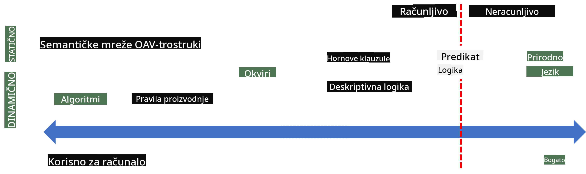

<!--
CO_OP_TRANSLATOR_METADATA:
{
  "original_hash": "98c5222ff9556b55223fed2337145e18",
  "translation_date": "2025-08-26T00:26:33+00:00",
  "source_file": "lessons/2-Symbolic/README.md",
  "language_code": "hr"
}
-->
# Reprezentacija znanja i ekspertni sustavi


> Sketchnote autorice [Tomomi Imura](https://twitter.com/girlie_mac)

Potraga za umjetnom inteligencijom temelji se na traženju znanja kako bi se svijet razumio na način sličan ljudskom. Ali kako to postići?

## [Kviz prije predavanja](https://ff-quizzes.netlify.app/en/ai/quiz/3)

U ranim danima razvoja umjetne inteligencije, popularan je bio pristup "odozgo prema dolje" za stvaranje inteligentnih sustava (o kojem smo govorili u prethodnoj lekciji). Ideja je bila izvući znanje od ljudi u oblik koji računalo može čitati, a zatim ga koristiti za automatsko rješavanje problema. Ovaj pristup temelji se na dva velika koncepta:

* Reprezentacija znanja
* Zaključivanje

## Reprezentacija znanja

Jedan od važnih koncepata u simboličkoj umjetnoj inteligenciji je **znanje**. Važno je razlikovati znanje od *informacija* ili *podataka*. Na primjer, može se reći da knjige sadrže znanje jer ih možemo proučavati i postati stručnjaci. Međutim, ono što knjige zapravo sadrže naziva se *podaci*, a čitanjem knjiga i integriranjem tih podataka u naš model svijeta pretvaramo podatke u znanje.

> ✅ **Znanje** je nešto što se nalazi u našoj glavi i predstavlja naše razumijevanje svijeta. Ono se stječe aktivnim procesom **učenja**, koji integrira informacije koje primamo u naš aktivni model svijeta.

Najčešće ne definiramo strogo znanje, već ga povezujemo s drugim srodnim konceptima koristeći [DIKW piramidu](https://en.wikipedia.org/wiki/DIKW_pyramid). Ona uključuje sljedeće koncepte:

* **Podaci** su nešto što je predstavljeno na fizičkom mediju, poput pisanog teksta ili izgovorenih riječi. Podaci postoje neovisno o ljudima i mogu se prenositi među ljudima.
* **Informacije** su način na koji tumačimo podatke u našoj glavi. Na primjer, kada čujemo riječ *računalo*, imamo neko razumijevanje što je to.
* **Znanje** je informacija integrirana u naš model svijeta. Na primjer, kada naučimo što je računalo, počinjemo imati ideje o tome kako radi, koliko košta i za što se može koristiti. Ova mreža međusobno povezanih koncepata čini naše znanje.
* **Mudrost** je još jedna razina našeg razumijevanja svijeta i predstavlja *meta-znanje*, tj. neku ideju o tome kako i kada koristiti znanje.

*Slika [s Wikipedije](https://commons.wikimedia.org/w/index.php?curid=37705247), autor Longlivetheux - vlastiti rad, CC BY-SA 4.0*

Dakle, problem **reprezentacije znanja** je pronaći učinkovit način za predstavljanje znanja unutar računala u obliku podataka kako bi ono bilo automatski upotrebljivo. To se može promatrati kao spektar:



> Slika autora [Dmitry Soshnikov](http://soshnikov.com)

* Na lijevoj strani nalaze se vrlo jednostavni tipovi reprezentacije znanja koji se mogu učinkovito koristiti u računalima. Najjednostavniji je algoritamski, gdje je znanje predstavljeno računalnim programom. Međutim, to nije najbolji način za predstavljanje znanja jer nije fleksibilan. Znanje u našoj glavi često nije algoritamsko.
* Na desnoj strani nalaze se reprezentacije poput prirodnog teksta. To je najmoćniji oblik, ali se ne može koristiti za automatsko zaključivanje.

> ✅ Razmislite na trenutak kako predstavljate znanje u svojoj glavi i pretvarate ga u bilješke. Postoji li određeni format koji vam pomaže u pamćenju?

## Klasifikacija računalnih reprezentacija znanja

Različite metode računalne reprezentacije znanja možemo klasificirati u sljedeće kategorije:

* **Mrežne reprezentacije** temelje se na činjenici da u našoj glavi imamo mrežu međusobno povezanih koncepata. Možemo pokušati reproducirati iste mreže kao graf unutar računala - takozvanu **semantičku mrežu**.

1. **Objekt-atribut-vrijednost trojke** ili **parovi atribut-vrijednost**. Budući da se graf može predstaviti unutar računala kao popis čvorova i rubova, možemo predstaviti semantičku mrežu popisom trojki koje sadrže objekte, atribute i vrijednosti. Na primjer, možemo izgraditi sljedeće trojke o programskim jezicima:

Objekt | Atribut | Vrijednost
-------|---------|-----------
Python | je | Ne-tipizirani jezik
Python | izumio | Guido van Rossum
Python | sintaksa bloka | uvlaka
Ne-tipizirani jezik | nema | definicije tipova

> ✅ Razmislite kako se trojke mogu koristiti za predstavljanje drugih vrsta znanja.

2. **Hijerarhijske reprezentacije** naglašavaju činjenicu da često stvaramo hijerarhiju objekata u našoj glavi. Na primjer, znamo da je kanarinac ptica i da sve ptice imaju krila. Također imamo neku ideju o tome koje je boje kanarinac obično i kojom brzinom leti.

   - **Reprezentacija okvira** temelji se na predstavljanju svakog objekta ili klase objekata kao **okvira** koji sadrži **utore**. Utori imaju moguće zadane vrijednosti, ograničenja vrijednosti ili pohranjene procedure koje se mogu pozvati za dobivanje vrijednosti utora. Svi okviri čine hijerarhiju sličnu hijerarhiji objekata u objektno orijentiranim programskim jezicima.
   - **Scenariji** su posebna vrsta okvira koji predstavljaju složene situacije koje se mogu odvijati tijekom vremena.

**Python**

Utor | Vrijednost | Zadana vrijednost | Interval |
-----|-----------|-------------------|----------|
Ime | Python | | |
Je | Ne-tipizirani jezik | | |
Velika/mala slova varijabli | | CamelCase | |
Duljina programa | | | 5-5000 linija |
Sintaksa bloka | Uvlaka | | |

3. **Proceduralne reprezentacije** temelje se na predstavljanju znanja popisom radnji koje se mogu izvršiti kada se dogodi određeni uvjet.
   - Proizvodna pravila su if-then izjave koje nam omogućuju donošenje zaključaka. Na primjer, liječnik može imati pravilo koje kaže da **AKO** pacijent ima visoku temperaturu **ILI** visoku razinu C-reaktivnog proteina u krvnom testu **ONDA** ima upalu. Kada naiđemo na jedan od uvjeta, možemo donijeti zaključak o upali, a zatim ga koristiti u daljnjem zaključivanju.
   - Algoritmi se mogu smatrati još jednim oblikom proceduralne reprezentacije, iako se gotovo nikada ne koriste izravno u sustavima temeljenim na znanju.

4. **Logika** je izvorno predložena od strane Aristotela kao način predstavljanja univerzalnog ljudskog znanja.
   - Predikatna logika kao matematička teorija je prebogata da bi bila izračunljiva, stoga se obično koristi neki njezin podskup, poput Hornovih klauzula koje se koriste u Prologu.
   - Opisna logika je obitelj logičkih sustava koji se koriste za predstavljanje i zaključivanje o hijerarhijama objekata i distribuiranim reprezentacijama znanja poput *semantičkog weba*.

## Ekspertni sustavi

Jedan od ranih uspjeha simboličke umjetne inteligencije bili su takozvani **ekspertni sustavi** - računalni sustavi dizajnirani da djeluju kao stručnjaci u nekom ograničenom problematičnom području. Temeljili su se na **bazi znanja** izvučenoj od jednog ili više ljudskih stručnjaka i sadržavali su **mehanizam zaključivanja** koji je provodio određeno zaključivanje na temelju te baze.

 | 
---------------------------------------------|------------------------------------------------
Pojednostavljena struktura ljudskog živčanog sustava | Arhitektura sustava temeljenog na znanju

Ekspertni sustavi izgrađeni su poput ljudskog sustava zaključivanja, koji sadrži **kratkoročno pamćenje** i **dugoročno pamćenje**. Slično tome, u sustavima temeljenim na znanju razlikujemo sljedeće komponente:

* **Memorija problema**: sadrži znanje o problemu koji se trenutno rješava, npr. temperaturu ili krvni tlak pacijenta, ima li upalu ili ne itd. Ovo znanje također se naziva **statičko znanje**, jer sadrži snimku onoga što trenutno znamo o problemu - takozvano *stanje problema*.
* **Baza znanja**: predstavlja dugoročno znanje o problematičnom području. Ručno se izvlači od ljudskih stručnjaka i ne mijenja se od konzultacije do konzultacije. Budući da nam omogućuje navigaciju od jednog stanja problema do drugog, također se naziva **dinamičko znanje**.
* **Mehanizam zaključivanja**: orkestrira cijeli proces pretraživanja u prostoru stanja problema, postavljajući pitanja korisniku kada je to potrebno. Također je odgovoran za pronalaženje pravih pravila koja će se primijeniti na svako stanje.

Kao primjer, razmotrimo sljedeći ekspertni sustav za određivanje životinje na temelju njezinih fizičkih karakteristika:


> Slika autora [Dmitry Soshnikov](http://soshnikov.com)

Ovaj dijagram naziva se **AND-OR stablo**, i to je grafički prikaz skupa proizvodnih pravila. Crtanje stabla korisno je na početku izvlačenja znanja od stručnjaka. Za predstavljanje znanja unutar računala prikladnije je koristiti pravila:

```
IF the animal eats meat
OR (animal has sharp teeth
    AND animal has claws
    AND animal has forward-looking eyes
) 
THEN the animal is a carnivore
```

Možete primijetiti da svaki uvjet na lijevoj strani pravila i akcija predstavljaju objekt-atribut-vrijednost (OAV) trojke. **Radna memorija** sadrži skup OAV trojki koje odgovaraju problemu koji se trenutno rješava. **Mehanizam pravila** traži pravila za koja je uvjet zadovoljen i primjenjuje ih, dodajući novu trojku u radnu memoriju.

> ✅ Nacrtajte vlastito AND-OR stablo na temu koja vas zanima!

### Naprijed vs. unatrag zaključivanje

Proces opisan gore naziva se **naprijed zaključivanje**. Počinje s nekim početnim podacima o problemu dostupnim u radnoj memoriji, a zatim izvršava sljedeću petlju zaključivanja:

1. Ako je ciljani atribut prisutan u radnoj memoriji - zaustavi se i daj rezultat
2. Potraži sva pravila čiji je uvjet trenutno zadovoljen - dobije se **skup sukoba** pravila.
3. Izvrši **rješavanje sukoba** - odaberi jedno pravilo koje će se izvršiti u ovom koraku. Moguće su različite strategije rješavanja sukoba:
   - Odaberi prvo primjenjivo pravilo u bazi znanja
   - Odaberi nasumično pravilo
   - Odaberi *specifičnije* pravilo, tj. ono koje zadovoljava najviše uvjeta na "lijevoj strani" (LHS)
4. Primijeni odabrano pravilo i unesi novi dio znanja u stanje problema
5. Ponovi od koraka 1.

Međutim, u nekim slučajevima možda želimo započeti s praznim znanjem o problemu i postavljati pitanja koja će nam pomoći da dođemo do zaključka. Na primjer, prilikom medicinske dijagnoze obično ne provodimo sve medicinske analize unaprijed prije nego što započnemo dijagnosticiranje pacijenta. Radije želimo provesti analize kada treba donijeti odluku.

Ovaj proces može se modelirati koristeći **unatrag zaključivanje**. Ono je vođeno **ciljem** - vrijednošću atributa koju želimo pronaći:

1. Odaberi sva pravila koja nam mogu dati vrijednost cilja (tj. s ciljem na RHS ("desnoj strani")) - skup sukoba
1. Ako ne postoje pravila za ovaj atribut ili postoji pravilo koje kaže da bismo trebali pitati korisnika za vrijednost - pitaj za to, inače:
1. Koristi strategiju rješavanja sukoba za odabir jednog pravila koje ćemo koristiti kao *hipotezu* - pokušat ćemo je dokazati
1. Rekurzivno ponovi proces za sve atribute na LHS pravila, pokušavajući ih dokazati kao ciljeve
1. Ako proces u bilo kojem trenutku ne uspije - koristi drugo pravilo u koraku 3.

> ✅ U kojim je situacijama naprijed zaključivanje prikladnije? A što je s unatrag zaključivanjem?

### Implementacija ekspertnih sustava

Ekspertni sustavi mogu se implementirati koristeći različite alate:

* Izravno programiranje u nekom visoko razinom programskom jeziku. Ovo nije najbolja ideja jer je glavna prednost sustava temeljenog na znanju to što je znanje odvojeno od zaključivanja, a potencijalno bi stručnjak za problematično područje trebao biti u mogućnosti pisati pravila bez razumijevanja detalja procesa zaključivanja.
* Korištenje **ljuske ekspertnih sustava**, tj. sustava posebno dizajniranog za popunjavanje znanjem koristeći neki jezik za reprezentaciju znanja.

## ✍️ Vježba: Zaključivanje o životinjama

Pogledajte [Animals.ipynb](https://github.com/microsoft/AI-For-Beginners/blob/main/lessons/2-Symbolic/Animals.ipynb) za primjer implementacije ekspertnih sustava s naprijed i unatrag zaključivanjem.
> **Napomena**: Ovaj primjer je prilično jednostavan i samo daje ideju o tome kako izgleda stručni sustav. Kada počnete stvarati takav sustav, primijetit ćete neku *inteligentnu* ponašanje tek kada dosegnete određeni broj pravila, otprilike 200+. U nekom trenutku pravila postaju previše složena da biste ih sve mogli držati na umu, i tada se možete početi pitati zašto sustav donosi određene odluke. Međutim, važna karakteristika sustava temeljenih na znanju je da uvijek možete *objasniti* točno kako je donesena bilo koja odluka.
## Ontologije i Semantički Web

Krajem 20. stoljeća pokrenuta je inicijativa za korištenje reprezentacije znanja kako bi se označili internetski resursi, omogućujući pronalaženje resursa koji odgovaraju vrlo specifičnim upitima. Ovaj pokret nazvan je **Semantički Web**, a oslanjao se na nekoliko koncepata:

- Posebna reprezentacija znanja temeljena na **[logici opisa](https://en.wikipedia.org/wiki/Description_logic)** (DL). Slična je okvirnoj reprezentaciji znanja jer gradi hijerarhiju objekata s atributima, ali ima formalnu logičku semantiku i zaključivanje. Postoji cijela obitelj DL-a koja balansira između izražajnosti i algoritamske složenosti zaključivanja.
- Distribuirana reprezentacija znanja, gdje su svi koncepti predstavljeni globalnim URI identifikatorom, omogućujući stvaranje hijerarhija znanja koje obuhvaćaju internet.
- Obitelj jezika temeljenih na XML-u za opis znanja: RDF (Okvir za opis resursa), RDFS (RDF shema), OWL (Jezik za web ontologije).

Ključni koncept u Semantičkom Webu je koncept **Ontologije**. Odnosi se na eksplicitnu specifikaciju domene problema koristeći neku formalnu reprezentaciju znanja. Najjednostavnija ontologija može biti samo hijerarhija objekata u domeni problema, dok složenije ontologije uključuju pravila koja se mogu koristiti za zaključivanje.

U semantičkom webu, sve reprezentacije temelje se na trojkama. Svaki objekt i svaka relacija jedinstveno su identificirani URI-jem. Na primjer, ako želimo navesti činjenicu da je ovaj AI kurikulum razvio Dmitry Soshnikov 1. siječnja 2022. - evo trojki koje možemo koristiti:


```
http://github.com/microsoft/ai-for-beginners http://www.example.com/terms/creation-date “Jan 13, 2007”
http://github.com/microsoft/ai-for-beginners http://purl.org/dc/elements/1.1/creator http://soshnikov.com
```

> ✅ Ovdje su `http://www.example.com/terms/creation-date` i `http://purl.org/dc/elements/1.1/creator` neki dobro poznati i univerzalno prihvaćeni URI-ji za izražavanje koncepata *kreator* i *datum kreiranja*.

U složenijem slučaju, ako želimo definirati popis kreatora, možemo koristiti neke podatkovne strukture definirane u RDF-u.


> Dijagrami gore od [Dmitry Soshnikov](http://soshnikov.com)

Napredak u izgradnji Semantičkog Weba donekle je usporen uspjehom tražilica i tehnika obrade prirodnog jezika, koje omogućuju izdvajanje strukturiranih podataka iz teksta. Međutim, u nekim područjima i dalje postoje značajni napori za održavanje ontologija i baza znanja. Nekoliko projekata vrijednih spomena:

* [WikiData](https://wikidata.org/) je zbirka strojno čitljivih baza znanja povezanih s Wikipedijom. Većina podataka izvučena je iz Wikipedia *InfoBoxova*, dijelova strukturiranog sadržaja unutar stranica Wikipedije. Možete [upitima](https://query.wikidata.org/) pretraživati WikiData koristeći SPARQL, poseban jezik upita za Semantički Web. Evo primjera upita koji prikazuje najpopularnije boje očiju među ljudima:

```sparql
#defaultView:BubbleChart
SELECT ?eyeColorLabel (COUNT(?human) AS ?count)
WHERE
{
  ?human wdt:P31 wd:Q5.       # human instance-of homo sapiens
  ?human wdt:P1340 ?eyeColor. # human eye-color ?eyeColor
  SERVICE wikibase:label { bd:serviceParam wikibase:language "en". }
}
GROUP BY ?eyeColorLabel
```

* [DBpedia](https://www.dbpedia.org/) je još jedan projekt sličan WikiData.

> ✅ Ako želite eksperimentirati s izradom vlastitih ontologija ili otvaranjem postojećih, postoji izvrstan vizualni uređivač ontologija nazvan [Protégé](https://protege.stanford.edu/). Preuzmite ga ili koristite online.


*Web Protégé uređivač otvoren s ontologijom obitelji Romanov. Snimka zaslona Dmitry Soshnikov*

## ✍️ Vježba: Ontologija obitelji

Pogledajte [FamilyOntology.ipynb](https://github.com/Ezana135/AI-For-Beginners/blob/main/lessons/2-Symbolic/FamilyOntology.ipynb) za primjer korištenja tehnika Semantičkog Weba za zaključivanje o obiteljskim odnosima. Uzet ćemo obiteljsko stablo predstavljeno u uobičajenom GEDCOM formatu i ontologiju obiteljskih odnosa te izgraditi graf svih obiteljskih odnosa za zadani skup pojedinaca.

## Microsoft Concept Graph

U većini slučajeva, ontologije se pažljivo izrađuju ručno. Međutim, također je moguće **izvući** ontologije iz nestrukturiranih podataka, na primjer, iz tekstova prirodnog jezika.

Jedan takav pokušaj napravljen je od strane Microsoft Researcha, što je rezultiralo [Microsoft Concept Graph](https://blogs.microsoft.com/ai/microsoft-researchers-release-graph-that-helps-machines-conceptualize/?WT.mc_id=academic-77998-cacaste).

To je velika zbirka entiteta grupiranih pomoću nasljedne relacije `is-a`. Omogućuje odgovaranje na pitanja poput "Što je Microsoft?" - odgovor bi bio nešto poput "tvrtka s vjerojatnošću 0.87, i brend s vjerojatnošću 0.75".

Graf je dostupan ili kao REST API, ili kao veliki tekstualni datoteku za preuzimanje koja navodi sve parove entiteta.

## ✍️ Vježba: Graf koncepta

Isprobajte bilježnicu [MSConceptGraph.ipynb](https://github.com/microsoft/AI-For-Beginners/blob/main/lessons/2-Symbolic/MSConceptGraph.ipynb) kako biste vidjeli kako možemo koristiti Microsoft Concept Graph za grupiranje vijesti u nekoliko kategorija.

## Zaključak

Danas se AI često smatra sinonimom za *strojno učenje* ili *neuronske mreže*. Međutim, ljudsko biće također pokazuje eksplicitno zaključivanje, što je nešto što trenutno nije obuhvaćeno neuronskim mrežama. U stvarnim projektima, eksplicitno zaključivanje i dalje se koristi za obavljanje zadataka koji zahtijevaju objašnjenja ili mogućnost kontrolirane promjene ponašanja sustava.

## 🚀 Izazov

U bilježnici Ontologija obitelji povezanoj s ovom lekcijom, postoji prilika za eksperimentiranje s drugim obiteljskim odnosima. Pokušajte otkriti nove veze između ljudi u obiteljskom stablu.

## [Post-predavanje kviz](https://ff-quizzes.netlify.app/en/ai/quiz/4)

## Pregled i samostalno učenje

Istražite na internetu područja u kojima su ljudi pokušali kvantificirati i kodificirati znanje. Pogledajte Bloomovu taksonomiju i vratite se u povijest kako biste saznali kako su ljudi pokušavali razumjeti svoj svijet. Istražite rad Linnaeusa na stvaranju taksonomije organizama i promatrajte način na koji je Dmitri Mendeleev stvorio način za opisivanje i grupiranje kemijskih elemenata. Koje druge zanimljive primjere možete pronaći?

**Zadatak**: [Izradite ontologiju](assignment.md)

**Odricanje od odgovornosti**:  
Ovaj dokument je preveden pomoću AI usluge za prevođenje [Co-op Translator](https://github.com/Azure/co-op-translator). Iako nastojimo osigurati točnost, imajte na umu da automatski prijevodi mogu sadržavati pogreške ili netočnosti. Izvorni dokument na izvornom jeziku treba smatrati autoritativnim izvorom. Za kritične informacije preporučuje se profesionalni prijevod od strane čovjeka. Ne preuzimamo odgovornost za nesporazume ili pogrešna tumačenja koja mogu proizaći iz korištenja ovog prijevoda.