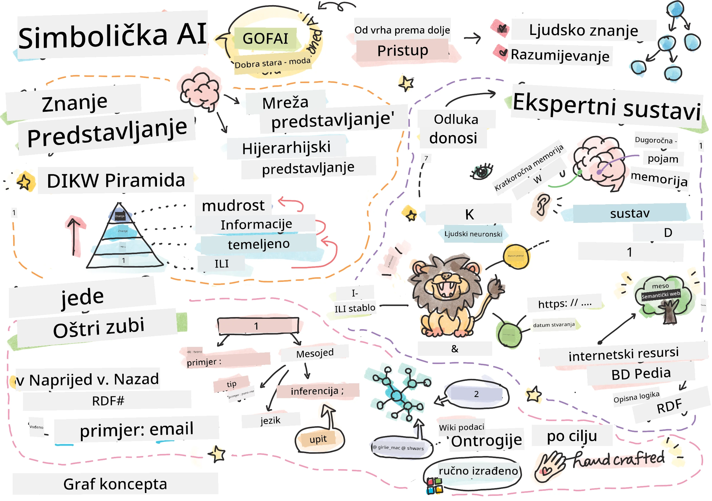
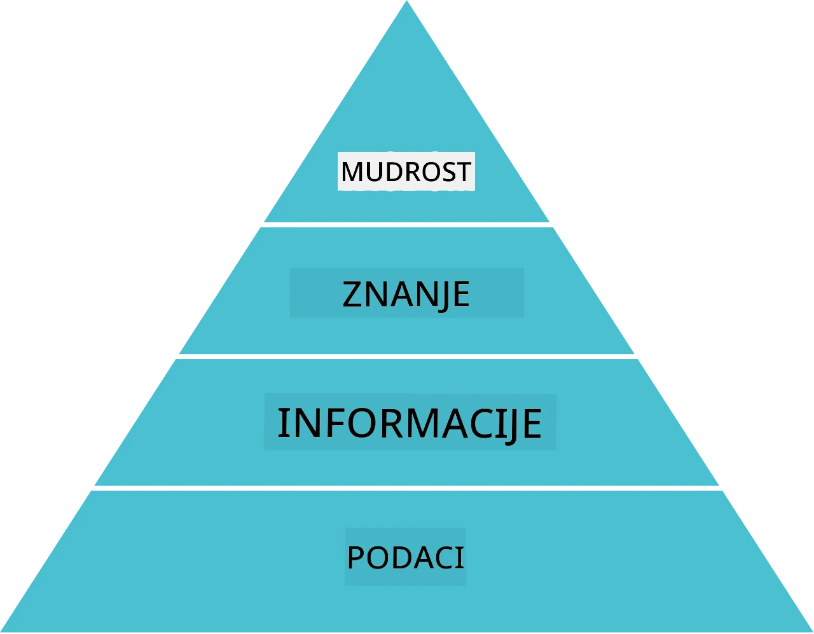
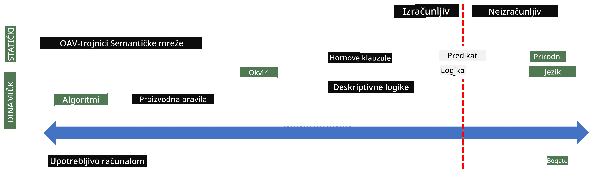
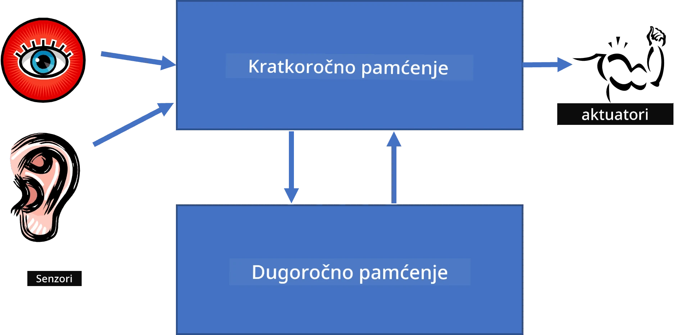
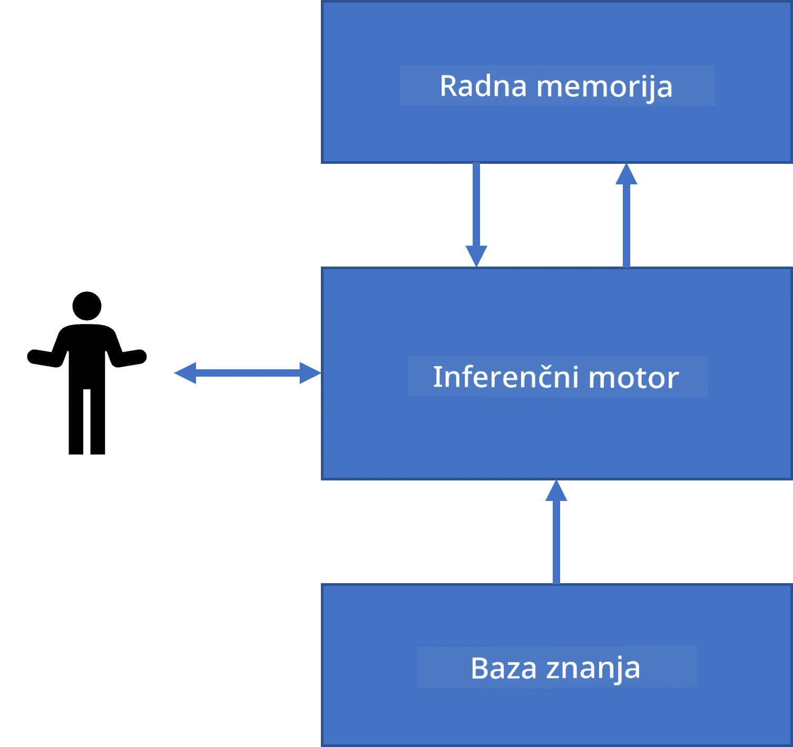
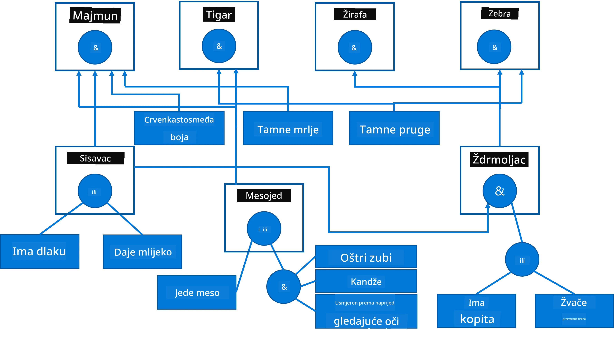
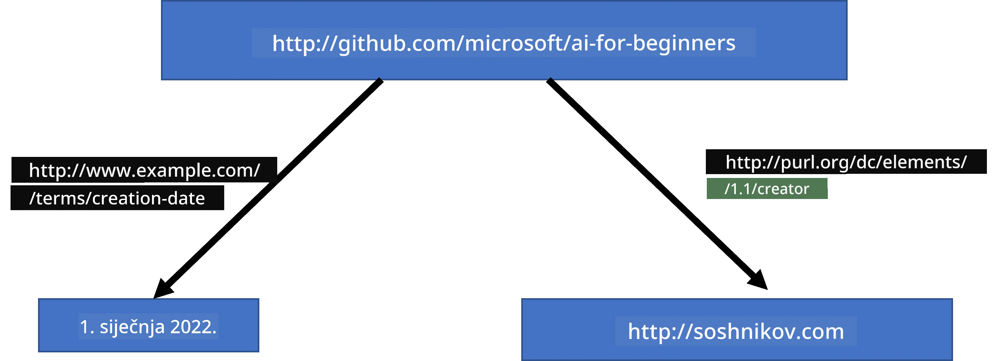
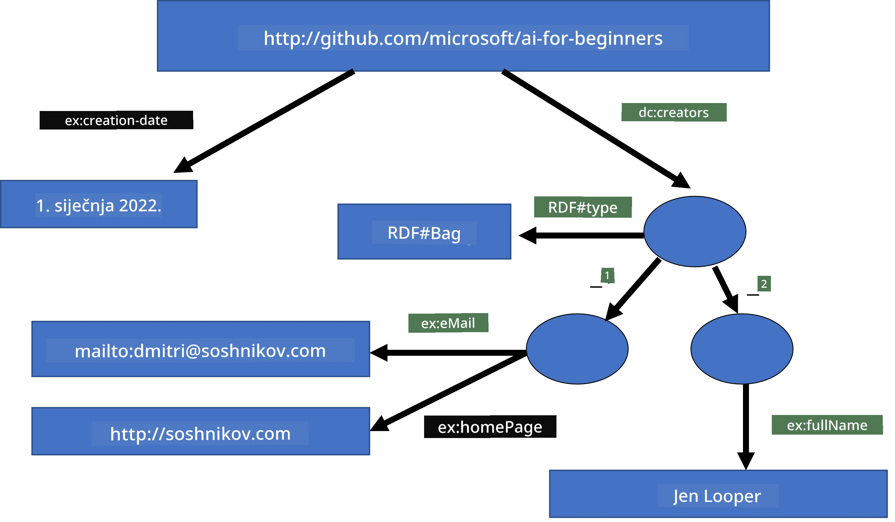
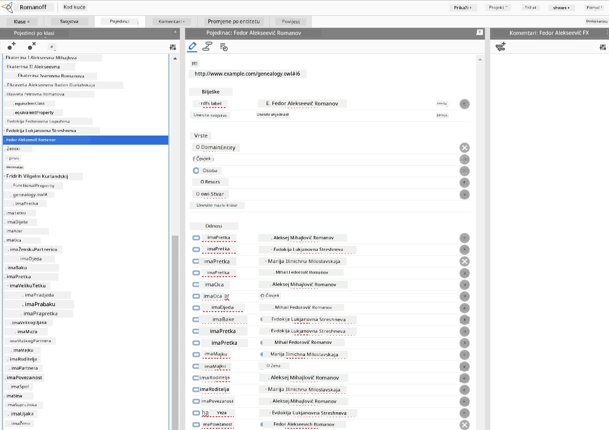

# Predstavljanje znanja i stručni sustavi



> Sketchnote autora [Tomomi Imura](https://twitter.com/girlie_mac)

Potraga za umjetnom inteligencijom temelji se na traženju znanja kako bi se svijet shvatio slično kao što to rade ljudi. Ali kako to učiniti?

## [Kviz prije predavanja](https://ff-quizzes.netlify.app/en/ai/quiz/3)

U ranim danima AI, popularan je bio pristup odozgo prema dolje za stvaranje inteligentnih sustava (objašnjen u prethodnoj lekciji). Ideja je bila izdvojiti znanje od ljudi u neki oblik razumljiv stroju, a zatim ga automatski koristiti za rješavanje problema. Ovaj pristup temelji se na dvije velike ideje:

* Predstavljanje znanja
* Zaključivanje

## Predstavljanje znanja

Jedan od važnih pojmova u simboličkoj umjetnoj inteligenciji je **znanje**. Važno je razlikovati znanje od *informacija* ili *podataka*. Na primjer, može se reći da knjige sadrže znanje jer proučavanjem knjiga postajemo stručnjaci. Međutim, ono što knjige sadrže zapravo su *podatci*, a čitanjem knjiga i integriranjem tih podataka u naš svjetonazor pretvaramo te podatke u znanje.

> ✅ **Znanje** je nešto što se nalazi u našem umu i predstavlja naše razumijevanje svijeta. Dobiva se aktivnim procesom **učenja**, koji integrira dijelove informacija koje primamo u naš aktivni model svijeta.

Najčešće ne definiramo strogo znanje, već ga usklađujemo s drugim povezanim pojmovima pomoću [DIKW piramide](https://en.wikipedia.org/wiki/DIKW_pyramid). Sadrži sljedeće pojmove:

* **Podaci** su nešto predstavljeno na fizičkim medijima, poput pisanog teksta ili izgovorenih riječi. Podaci postoje neovisno o ljudima i mogu se prenositi među ljudima.
* **Informacije** su način na koji tumačimo podatke u svojoj glavi. Na primjer, kad čujemo riječ *računalo*, imamo neko razumijevanje što to jest.
* **Znanje** je informacije integrirane u naš svjetonazor. Na primjer, nakon što naučimo što je računalo, počinjemo imati ideje o tome kako radi, koliko košta i za što se može koristiti. Ta mreža međusobno povezanih pojmova čini naše znanje.
* **Mudrost** je još jedna razina našeg razumijevanja svijeta i predstavlja *meta-znanje*, npr. neku ideju o tome kako i kada treba koristiti znanje.



*Slika [s Wikipedije](https://commons.wikimedia.org/w/index.php?curid=37705247), autor Longlivetheux - vlastiti rad, CC BY-SA 4.0*

Dakle, problem **predstavljanja znanja** je pronaći neki učinkovit način predstavljanja znanja unutar računala u obliku podataka kako bi bilo automatski upotrebljivo. To se može promatrati kao spektar:



> Slika autora [Dmitry Soshnikov](http://soshnikov.com)

* S lijeve strane postoje vrlo jednostavni tipovi predstavljanja znanja koje računala mogu učinkovito koristiti. Najjednostavniji je algoritamski, kada se znanje predstavlja računalnim programom. To, međutim, nije najbolji način predstavljanja znanja jer nije fleksibilan. Znanje u našim umovima često nije algoritamsko.
* S desne strane su prikazi poput prirodnog teksta. To je najsnažniji oblik, no ne može se koristiti za automatsko zaključivanje.

> ✅ Razmislite na trenutak kako predstavljate znanje u svojoj glavi i kako ga pretvarate u bilješke. Postoji li neki poseban format koji vam pomaže u zadržavanju znanja?

## Klasicifikacija računalnih načina predstavljanja znanja

Možemo klasificirati različite metode računalnog predstavljanja znanja u sljedeće kategorije:

* **Mrežna predstava** temelji se na činjenici da u glavi imamo mrežu međusobno povezanih pojmova. Možemo pokušati reproducirati iste mreže kao graf unutar računala - tzv. **semantičku mrežu**.

1. **Triade objekt-atribut-vrijednost** ili **parovi atribut-vrijednost**. Kako se graf može predstaviti unutar računala kao popis čvorova i bridova, možemo predstaviti semantičku mrežu kao popis troki koje sadrže objekte, atribute i vrijednosti. Na primjer, možemo napraviti sljedeće trojke o programskim jezicima:

Objekt | Atribut | Vrijednost
-------|---------|-----------
Python | je | Netyperani jezik
Python | izumio | Guido van Rossum
Python | sintaksa bloka | uvlačenje
Netyperani jezik | nema | definicije tipova

> ✅ Razmislite kako se trojke mogu koristiti za predstavljanje drugih vrsta znanja.

2. **Hijerarhijske predstave** naglašavaju činjenicu da često u glavi stvaramo hijerarhiju objekata. Na primjer, znamo da je kanarinac ptica, a sve ptice imaju krila. Također imamo neku ideju o boji kanarinca i brzini leta.

   - **Predstava okvira** temelji se na predstavljanju svakog objekta ili klase objekata kao **okvira** koji sadrži **slotove**. Slotovi imaju moguće zadane vrijednosti, ograničenja vrijednosti ili pohranjene procedure koje se pozivaju za dobivanje vrijednosti slota. Svi okviri formiraju hijerarhiju slično kao hijerarhija objekata u objektno orijentiranim programskim jezicima.
   - **Scenariji** su posebna vrsta okvira koji predstavljaju složene situacije koje se mogu razviti u vremenu.

**Python**

Slot | Vrijednost | Zadana vrijednost | Interval
-----|------------|-------------------|---------
Name | Python | | |
Is-A | Netyperani jezik | | |
Variable Case | | CamelCase | |
Duljina programa | | | 5-5000 linija |
Sintaksa bloka | Indent | | |

3. **Proceduralne predstave** temelje se na predstavljanju znanja kao popisa akcija koje se mogu izvršiti kada nastupi određeni uvjet.
   - Produkcijska pravila su if-then izrazi koji nam omogućuju donošenje zaključaka. Na primjer, liječnik može imati pravilo koje kaže da **AKO** pacijent ima visoku temperaturu **ILI** visok nivo C-reaktivnog proteina u krvnom testu **ONDA** ima upalu. Kada naiđemo na jedan od uvjeta, možemo donijeti zaključak o upali i koristiti ga u daljnjem zaključivanju.
   - Algoritmi se mogu smatrati oblikom proceduralne predodžbe, iako se gotovo nikad ne koriste izravno u sustavima temeljenim na znanju.

4. **Logika** je izvorno predložena od strane Aristotela kao način predstavljanja univerzalnog ljudskog znanja.
   - Predikatna logika kao matematička teorija je prebogata da bi bila računski dostižna, stoga se obično koristi neki njezin podskup, poput Hornovih klauzula korištenih u Prologu.
   - Deskriptivna logika je skup logičkih sustava koji se koriste za predstavljanje i zaključivanje o hijerarhijama objekata u distribuiranim predstavama znanja kao što je *semantički web*.

## Stručni sustavi

Jedan od ranih uspjeha simboličke AI bili su tzv. **stručni sustavi** - računalni sustavi dizajnirani da djeluju kao stručnjak u nekom ograničenom području problema. Temeljili su se na **bazi znanja** izvučenoj od jednog ili više ljudskih stručnjaka i sadržavali su **zaključni stroj** koji je vršio zaključivanje na temelju nje.

 | 
---------------------------------------------|------------------------------------------------
Pojednostavljena struktura ljudskog živčanog sustava | Arhitektura sustava temeljenog na znanju

Stručni sustavi se grade poput ljudskog sustava zaključivanja, koji sadrži **kratkoročnu memoriju** i **dugoročnu memoriju**. Slično tome u sustavima temeljenim na znanju razlikujemo sljedeće komponente:

* **Memorija problema**: sadrži znanje o problemu koji se trenutačno rješava, npr. tjelesnu temperaturu ili krvni tlak pacijenta, ima li upalu ili ne itd. Ovo znanje se naziva i **statističko znanje**, jer sadrži trenutni prikaz onoga što trenutno znamo o problemu - tzv. *stanje problema*.
* **Baza znanja**: predstavlja dugoročno znanje o nekom području problema. Izvučena je ručno od ljudskih stručnjaka i ne mijenja se od konzultacije do konzultacije. Budući da nam omogućuje navigaciju iz jednog stanja problema u drugo, također se naziva **dinamičko znanje**.
* **Zaključni stroj**: orkestrira cijeli proces pretraživanja prostora stanja problema, postavljajući korisniku pitanja kad je potrebno. Također je odgovoran za pronalaženje pravila koja će se primijeniti u svakom stanju.

Kao primjer, razmotrimo sljedeći stručni sustav za određivanje životinje na temelju fizičkih karakteristika:



> Slika autora [Dmitry Soshnikov](http://soshnikov.com)

Ovaj dijagram naziva se **AND-ILI stablo** i grafički je prikaz skupa produkcijskih pravila. Crtanje stabla korisno je na početku izvlačenja znanja od stručnjaka. Za predstavljanje znanja unutar računala prikladnije je koristiti pravila:

```
IF the animal eats meat
OR (animal has sharp teeth
    AND animal has claws
    AND animal has forward-looking eyes
) 
THEN the animal is a carnivore
```

Primijetit ćete da su svi uvjeti na lijevoj strani pravila i akcija u biti trojke objekt-atribut-vrijednost (OAV). **Radna memorija** sadrži skup OAV trojki koje odgovaraju trenutačnom rješavanju problema. **Stroj za pravila** traži pravila za koja je uvjet zadovoljen i primjenjuje ih, dodajući novu trojku u radnu memoriju.

> ✅ Napišite svoje AND-ILI stablo na temu koja vam se sviđa!

### Zaključivanje unaprijed naspram unatrag

Ovo gore opisani proces naziva se **zaključivanje unaprijed**. Počinje s početnim podacima o problemu dostupnim u radnoj memoriji, a zatim izvršava sljedeću petlju zaključivanja:

1. Ako je ciljna značajka prisutna u radnoj memoriji - zaustavi se i da rezultat
2. Pronađi sva pravila čiji je uvjet trenutno zadovoljen - dobiva se **skup sukoba** pravila.
3. Izvrši **rješavanje sukoba** - odaberi jedno pravilo koje će se izvršiti u ovom koraku. Mogu postojati različite strategije rješavanja sukoba:
   - Odaberi prvo primjenjivo pravilo u bazi znanja
   - Odaberi nasumično pravilo
   - Odaberi *specifičnije* pravilo, tj. ono koje zadovoljava najviše uvjeta na "lijevoj strani" (LHS)
4. Primijeni odabrano pravilo i ubaci novi dio znanja u stanje problema
5. Ponovi od koraka 1.

Međutim, u nekim slučajevima želimo započeti s praznim znanjem o problemu i postavljati pitanja koja će nam pomoći da dođemo do zaključka. Na primjer, kod medicinske dijagnoze obično ne radimo sve medicinske analize unaprijed prije dijagnosticiranja pacijenta. Radije želimo napraviti analize kad treba donijeti odluku.

Ovaj se proces može modelirati pomoću **zaključivanja unatrag**. Njime upravlja **cilj** - vrijednost svojstva koju želimo pronaći:

1. Odaberi sva pravila koja nam mogu dati vrijednost cilja (tj. s ciljem na desnoj strani [RHS]) - skup sukoba
1. Ako nema pravila za ovaj atribut ili postoji pravilo koje kaže da trebamo pitati korisnika za vrijednost - pitaj, inače:
1. Koristi strategiju rješavanja sukoba da odabereš pravilo koje će se koristiti kao *hipoteza* - pokušat ćemo ga dokazati
1. Rekurzivno ponavljaj postupak za sve atribute s lijeve strane (LHS) pravila, pokušavajući ih dokazati kao ciljeve
1. Ako proces u bilo kojem trenutku ne uspije - koristi drugo pravilo iz koraka 3.

> ✅ U kojim situacijama je pogodnije upotrijebiti zaključivanje unaprijed? Kako je s zaključivanjem unatrag?

### Implementacija stručnih sustava

Stručni se sustavi mogu implementirati koristeći različite alate:

* Izravnim programiranjem u nekom visoko razinom programskom jeziku. To nije najbolja ideja jer je glavna prednost sustava temeljenog na znanju to što je znanje odvojeno od zaključivanja, pa stručnjak za problem domene potencijalno može pisati pravila bez razumijevanja detalja postupka zaključivanja.
* Korištenjem **stručnih ljuski**, tj. sustava specijalno dizajniranih da budu popunjavani znanjem koristeći neki jezik za predstavljanje znanja.

## ✍️ Vježba: Zaključivanje o životinjama

Pogledajte [Animals.ipynb](https://github.com/microsoft/AI-For-Beginners/blob/main/lessons/2-Symbolic/Animals.ipynb) kao primjer implementacije stručnog sustava s zaključivanjem unaprijed i unatrag.

> **Napomena**: Ovaj primjer je prilično jednostavan i daje samo ideju kako izgleda stručni sustav. Kad počnete izrađivati takav sustav, primijetit ćete *inteligentno* ponašanje tek kad se dosegne određen broj pravila, otprilike 200+. U nekom trenutku pravila postaju previše složena da bismo ih sve držali na umu, i tada se možete zapitati zašto sustav donosi određene odluke. Ipak, važna karakteristika sustava temeljenih na znanju jest da uvijek možete *objasniti* kako je koja odluka donesena.

## Ontologije i semantički web

Krajem 20. stoljeća postojala je inicijativa za korištenje predstavljanja znanja za označavanje internetskih resursa, kako bi se moglo pronalaziti resurse koji odgovaraju vrlo specifičnim upitima. Taj je pokret nazvan **Semantički web** i oslanjao se na nekoliko koncepata:

- Posebno predstavljanje znanja temeljeno na **[deskriptivnoj logici](https://en.wikipedia.org/wiki/Description_logic)** (DL). Slično je predstavljanju znanja u okviru jer gradi hijerarhiju objekata sa svojstvima, ali ima formalnu logičku semantiku i zaključivanje. Postoji cijela skupina DL sustava koji balansiraju između izražajnosti i algoritamske složenosti zaključivanja.
- Distribuirano predstavljanje znanja, gdje su svi pojmovi predstavljeni globalnim URI identifikatorom, što omogućuje stvaranje hijerarhija znanja koje se šire internetom.
- Obitelj XML-basiranih jezika za opis znanja: RDF (Resource Description Framework), RDFS (RDF Schema), OWL (Ontology Web Language).

Ključni koncept u Semantičkom webu je koncept **Ontologije**. Odnosi se na eksplicitnu specifikaciju domena problema koristeći neki formalni prikaz znanja. Najjednostavnija ontologija može biti samo hijerarhija objekata u domeni problema, ali složenije ontologije uključuju pravila koja se mogu koristiti za zaključivanje.

U semantičkom webu, svi prikazi temeljeni su na trojkama. Svaki objekt i svaki odnos jedinstveno su identificirani URI-jem. Na primjer, ako želimo navesti činjenicu da je ovaj AI Kurikulum razvijen od strane Dmitryja Soshnikova 1. siječnja 2022. - evo trojki koje možemo koristiti:



```
http://github.com/microsoft/ai-for-beginners http://www.example.com/terms/creation-date “Jan 1, 2022”
http://github.com/microsoft/ai-for-beginners http://purl.org/dc/elements/1.1/creator http://soshnikov.com
```

> ✅ Ovdje su `http://www.example.com/terms/creation-date` i `http://purl.org/dc/elements/1.1/creator` neki dobro poznati i univerzalno prihvaćeni URI-ji za izražavanje pojmova *stvoritelja* i *datuma stvaranja*.

U složenijem slučaju, ako želimo definirati popis stvoritelja, možemo koristiti neke podatkovne strukture definirane u RDF-u.



> Dijagrami iznad autora su [Dmitry Soshnikov](http://soshnikov.com)

Napredak izgradnje Semantičkog weba donekle je usporen uspjehom tražilica i tehnika za obradu prirodnog jezika, koje omogućuju izdvajanje strukturiranih podataka iz teksta. Međutim, u nekim područjima i dalje postoje značajni napori za održavanje ontologija i baza znanja. Neki projekti vrijedni spomena:

* [WikiData](https://wikidata.org/) je zbirka strojno čitljivih baza podataka povezanim s Wikipedijom. Većina podataka iskopana je iz Wikipedia *InfoBoxova*, dijelova strukturiranog sadržaja unutar stranica Wikipedije. Možete [upitima](https://query.wikidata.org/) koristiti wikidata u SPARQL-u, posebnom upitnom jeziku za Semantički Web. Evo primjera upita koji prikazuje najpopularnije boje očiju među ljudima:

```sparql
#defaultView:BubbleChart
SELECT ?eyeColorLabel (COUNT(?human) AS ?count)
WHERE
{
  ?human wdt:P31 wd:Q5.       # human instance-of homo sapiens
  ?human wdt:P1340 ?eyeColor. # human eye-color ?eyeColor
  SERVICE wikibase:label { bd:serviceParam wikibase:language "en". }
}
GROUP BY ?eyeColorLabel
```

* [DBpedia](https://www.dbpedia.org/) je još jedan sličan pokušaj kao WikiData.

> ✅ Ako želite eksperimentirati s izgradnjom vlastitih ontologija ili otvaranjem postojećih, postoji izvrstan vizualni uređivač ontologija nazvan [Protégé](https://protege.stanford.edu/). Preuzmite ga ili koristite online.



*Web Protégé uređivač otvoren s ontologijom obitelji Romanov. Screenshot Dmitryja Soshnikova*

## ✍️ Vježba: Ontologija obitelji

Pogledajte [FamilyOntology.ipynb](https://github.com/Ezana135/AI-For-Beginners/blob/main/lessons/2-Symbolic/FamilyOntology.ipynb) za primjer korištenja tehnika Semantičkog weba za zaključivanje o obiteljskim odnosima. Uzet ćemo obiteljsko stablo predstavljeno u uobičajenom GEDCOM formatu i ontologiju obiteljskih odnosa te izgraditi graf svih obiteljskih odnosa za zadani skup pojedinaca.

## Microsoft Concept Graph

U većini slučajeva, ontologije se pažljivo izrađuju ručno. Međutim, moguće je i **iskopavati** ontologije iz nestrukturiranih podataka, na primjer, iz tekstova prirodnog jezika.

Jedan takav pokušaj napravio je Microsoft Research, što je rezultiralo [Microsoft Concept Graphom](https://blogs.microsoft.com/ai/microsoft-researchers-release-graph-that-helps-machines-conceptualize/?WT.mc_id=academic-77998-cacaste).

Radi se o velikoj zbirci entiteta grupiranih pomoću `is-a` nasljednih odnosa. Omogućuje odgovore na pitanja poput "Što je Microsoft?" – a odgovor bi bio nešto poput "tvrtka s vjerojatnošću 0.87, i brend s vjerojatnošću 0.75".

Graf je dostupan kao REST API ili kao velika datoteka za preuzimanje koja sadrži popis svih parova entiteta.

## ✍️ Vježba: Graf koncepata

Isprobajte bilježnicu [MSConceptGraph.ipynb](https://github.com/microsoft/AI-For-Beginners/blob/main/lessons/2-Symbolic/MSConceptGraph.ipynb) da vidite kako možemo koristiti Microsoft Concept Graph za grupiranje vijesti u nekoliko kategorija.

## Zaključak

Danas se AI često smatra sinonimom za *strojno učenje* ili *neuronske mreže*. Međutim, ljudsko biće također pokazuje eksplicitno zaključivanje, što trenutačno nije pokriveno neuronskim mrežama. U stvarnim projektima, eksplicitno zaključivanje još se koristi za obavljanje zadataka koji zahtijevaju objašnjenja ili mogućnost kontroliranog mijenjanja ponašanja sustava.

## 🚀 Izazov

U bilježnici Ontologija obitelji povezanoj s ovim predavanjem postoji mogućnost eksperimentiranja s ostalim obiteljskim odnosima. Pokušajte otkriti nove veze između ljudi u obiteljskom stablu.

## [Kviz nakon predavanja](https://ff-quizzes.netlify.app/en/ai/quiz/4)

## Pregled & Samostalan rad

Istražite na internetu područja gdje su ljudi pokušali kvantificirati i kodificirati znanje. Pogledajte Bloomovu taksonomiju i vratite se u povijest kako biste naučili kako su ljudi pokušavali razumjeti svoj svijet. Istražite rad Linneusa na stvaranju taksonomije organizama i promatrajte način na koji je Dmitrij Mendelejev stvorio način da se kemijski elementi opisuju i grupiraju. Koje druge zanimljive primjere možete pronaći?

**Zadatak**: [Izradite ontologiju](assignment.md)

---

<!-- CO-OP TRANSLATOR DISCLAIMER START -->
**Odricanje od odgovornosti**:  
Ovaj dokument je preveden korištenjem AI prevoditeljskog servisa [Co-op Translator](https://github.com/Azure/co-op-translator). Iako nastojimo osigurati točnost, imajte na umu da automatski prijevodi mogu sadržavati pogreške ili netočnosti. Izvorni dokument na izvornom jeziku treba se smatrati autoritativnim izvorom. Za kritične informacije preporučuje se profesionalni ljudski prijevod. Nismo odgovorni za bilo kakve nesporazume ili pogrešna tumačenja koja proizlaze iz korištenja ovog prijevoda.
<!-- CO-OP TRANSLATOR DISCLAIMER END -->