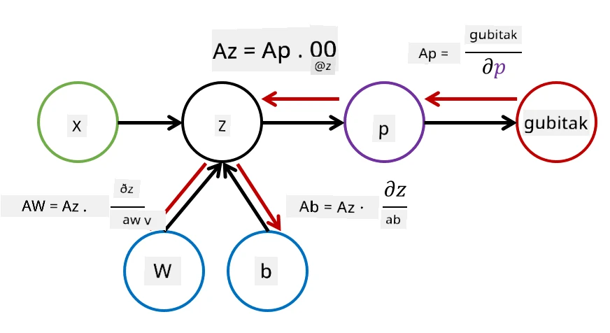

# Uvod u neuronske mreže. Višeslojni perceptron

U prethodnom dijelu naučili ste o najjednostavnijem modelu neuronske mreže - jednoslojnom perceptronu, linearnom modelu za klasifikaciju s dvije klase.

U ovom dijelu proširit ćemo ovaj model u fleksibilniji okvir koji nam omogućuje:

* obavljanje **klasifikacije s više klasa** uz klasifikaciju s dvije klase
* rješavanje **problema regresije** uz klasifikaciju
* razdvajanje klasa koje nisu linearno razdvojive

Također ćemo razviti vlastiti modularni okvir u Pythonu koji će nam omogućiti konstrukciju različitih arhitektura neuronskih mreža.

## [Kviz prije predavanja](https://ff-quizzes.netlify.app/en/ai/quiz/7)

## Formalizacija strojnog učenja

Započnimo formalizacijom problema strojnog učenja. Pretpostavimo da imamo skup podataka za treniranje **X** s oznakama **Y**, i trebamo izgraditi model *f* koji će davati najtočnije predikcije. Kvaliteta predikcija mjeri se pomoću **funkcije gubitka** &lagran;. Često se koriste sljedeće funkcije gubitka:

* Za problem regresije, kada trebamo predvidjeti broj, možemo koristiti **apsolutnu pogrešku** &sum;i|f(x(i))-y(i)| ili **kvadratnu pogrešku** &sum;i(f(x(i))-y(i))2
* Za klasifikaciju koristimo **0-1 gubitak** (što je u suštini isto kao **točnost** modela) ili **logistički gubitak**.

Za jednoslojni perceptron, funkcija *f* bila je definirana kao linearna funkcija *f(x)=wx+b* (ovdje je *w* matrica težina, *x* je vektor ulaznih značajki, a *b* je vektor pomaka). Za različite arhitekture neuronskih mreža, ova funkcija može poprimiti složeniji oblik.

> U slučaju klasifikacije, često je poželjno dobiti vjerojatnosti odgovarajućih klasa kao izlaz mreže. Kako bismo pretvorili proizvoljne brojeve u vjerojatnosti (npr. normalizirali izlaz), često koristimo **softmax** funkciju &sigma;, pa funkcija *f* postaje *f(x)=&sigma;(wx+b)*

U definiciji *f* iznad, *w* i *b* nazivaju se **parametri** &theta;=⟨*w,b*⟩. S obzirom na skup podataka ⟨**X**,**Y**⟩, možemo izračunati ukupnu pogrešku na cijelom skupu podataka kao funkciju parametara &theta;.

> ✅ **Cilj treniranja neuronske mreže je minimizirati pogrešku mijenjanjem parametara &theta;**

## Optimizacija gradijentnim spuštanjem

Postoji dobro poznata metoda optimizacije funkcija nazvana **gradijentno spuštanje**. Ideja je da možemo izračunati derivaciju (u višedimenzionalnom slučaju nazvanu **gradijent**) funkcije gubitka u odnosu na parametre i mijenjati parametre na način da se pogreška smanji. To se može formalizirati na sljedeći način:

* Inicijalizirajte parametre s nekim slučajnim vrijednostima w(0), b(0)
* Ponavljajte sljedeći korak mnogo puta:
    - w(i+1) = w(i)-&eta;&part;&lagran;/&part;w
    - b(i+1) = b(i)-&eta;&part;&lagran;/&part;b

Tijekom treniranja, koraci optimizacije trebali bi se izračunavati uzimajući u obzir cijeli skup podataka (sjetite se da se gubitak računa kao zbroj kroz sve uzorke za treniranje). Međutim, u stvarnosti uzimamo male dijelove skupa podataka nazvane **minibatch**, i izračunavamo gradijente na temelju podskupa podataka. Budući da se podskup uzima slučajno svaki put, takva metoda naziva se **stohastičko gradijentno spuštanje** (SGD).

## Višeslojni perceptroni i povratna propagacija

Jednoslojna mreža, kao što smo vidjeli gore, sposobna je klasificirati linearno razdvojive klase. Kako bismo izgradili bogatiji model, možemo kombinirati nekoliko slojeva mreže. Matematički bi to značilo da funkcija *f* ima složeniji oblik i računa se u nekoliko koraka:
* z1=w1x+b1
* z2=w2&alpha;(z1)+b2
* f = &sigma;(z2)

Ovdje je &alpha; **nelinearna aktivacijska funkcija**, &sigma; je softmax funkcija, a parametri su &theta;=<*w1,b1,w2,b2*>.

Algoritam gradijentnog spuštanja ostaje isti, ali postaje teže izračunati gradijente. S obzirom na pravilo diferencijacije lanca, možemo izračunati derivacije kao:

* &part;&lagran;/&part;w2 = (&part;&lagran;/&part;&sigma;)(&part;&sigma;/&part;z2)(&part;z2/&part;w2)
* &part;&lagran;/&part;w1 = (&part;&lagran;/&part;&sigma;)(&part;&sigma;/&part;z2)(&part;z2/&part;&alpha;)(&part;&alpha;/&part;z1)(&part;z1/&part;w1)

> ✅ Pravilo diferencijacije lanca koristi se za izračunavanje derivacija funkcije gubitka u odnosu na parametre.

Primijetite da je lijevi dio svih tih izraza isti, i stoga možemo učinkovito izračunavati derivacije počevši od funkcije gubitka i idući "unatrag" kroz računski graf. Stoga se metoda treniranja višeslojnog perceptrona naziva **povratna propagacija**, ili 'backprop'.

> TODO: citiranje slike

> ✅ Povratnu propagaciju ćemo detaljnije obraditi u našem primjeru u bilježnici.

## Zaključak

U ovoj lekciji izgradili smo vlastitu biblioteku za neuronske mreže i koristili je za jednostavan zadatak klasifikacije u dvije dimenzije.

## 🚀 Izazov

U pratećoj bilježnici implementirat ćete vlastiti okvir za izgradnju i treniranje višeslojnih perceptrona. Moći ćete detaljno vidjeti kako moderne neuronske mreže funkcioniraju.

Nastavite na bilježnicu [OwnFramework](OwnFramework.ipynb) i prođite kroz nju.

## [Kviz nakon predavanja](https://ff-quizzes.netlify.app/en/ai/quiz/8)

## Pregled i samostalno učenje

Povratna propagacija je uobičajeni algoritam koji se koristi u AI i ML, vrijedan proučavanja [detaljnije](https://wikipedia.org/wiki/Backpropagation)

## [Zadatak](lab/README.md)

U ovom laboratorijskom zadatku traži se da koristite okvir koji ste izgradili u ovoj lekciji za rješavanje klasifikacije rukom pisanih znamenki iz MNIST skupa podataka.

* [Upute](lab/README.md)
* [Bilježnica](lab/MyFW_MNIST.ipynb)

---

