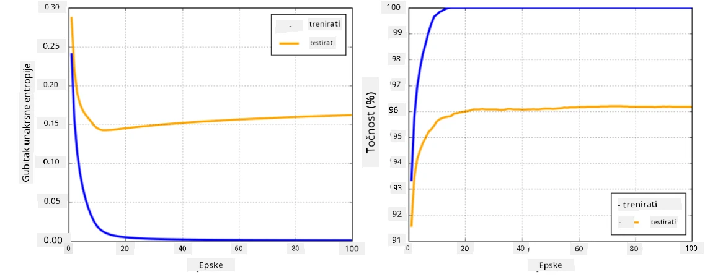

# Okviri za neuronske mreže

Kao što smo već naučili, da bismo učinkovito trenirali neuronske mreže, moramo učiniti dvije stvari:

* Raditi s tenzorima, npr. množiti, zbrajati i izračunavati funkcije poput sigmoid ili softmax
* Izračunati gradijente svih izraza kako bismo mogli provesti optimizaciju gradijentnog spuštanja

## [Prethodni kviz](https://ff-quizzes.netlify.app/en/ai/quiz/9)

Iako biblioteka `numpy` može obaviti prvi dio, potrebna nam je neka metoda za izračun gradijenata. U [našem okviru](../04-OwnFramework/OwnFramework.ipynb) koji smo razvili u prethodnom dijelu morali smo ručno programirati sve funkcije derivacije unutar metode `backward`, koja provodi povratnu propagaciju. Idealno bi bilo da nam okvir omogućuje izračun gradijenata *bilo kojeg izraza* koji možemo definirati.

Još jedna važna stvar je mogućnost izvođenja izračuna na GPU-u ili drugim specijaliziranim jedinicama za izračun, poput [TPU](https://en.wikipedia.org/wiki/Tensor_Processing_Unit). Treniranje dubokih neuronskih mreža zahtijeva *puno* izračuna, a mogućnost paralelizacije tih izračuna na GPU-ima je vrlo važna.

> ✅ Pojam 'paralelizacija' znači raspodjelu izračuna na više uređaja.

Trenutno su dva najpopularnija okvira za neuronske mreže: [TensorFlow](http://TensorFlow.org) i [PyTorch](https://pytorch.org/). Oba pružaju niskorazinski API za rad s tenzorima na CPU-u i GPU-u. Povrh niskorazinskog API-ja, postoji i visokorazinski API, nazvan [Keras](https://keras.io/) i [PyTorch Lightning](https://pytorchlightning.ai/) za odgovarajuće okvire.

Niskorazinski API | [TensorFlow](http://TensorFlow.org) | [PyTorch](https://pytorch.org/)
------------------|-------------------------------------|--------------------------------
Visokorazinski API| [Keras](https://keras.io/) | [PyTorch Lightning](https://pytorchlightning.ai/)

**Niskorazinski API-ji** u oba okvira omogućuju izgradnju takozvanih **računalnih grafova**. Ovaj graf definira kako izračunati izlaz (obično funkciju gubitka) s obzirom na ulazne parametre i može se poslati na GPU za izračun, ako je dostupan. Postoje funkcije za diferenciranje ovog računalnog grafa i izračun gradijenata, koji se zatim mogu koristiti za optimizaciju parametara modela.

**Visokorazinski API-ji** tretiraju neuronske mreže kao **sekvencu slojeva** i olakšavaju konstrukciju većine neuronskih mreža. Treniranje modela obično zahtijeva pripremu podataka, a zatim pozivanje funkcije `fit` za obavljanje posla.

Visokorazinski API omogućuje brzu konstrukciju tipičnih neuronskih mreža bez brige o mnogim detaljima. Istovremeno, niskorazinski API pruža mnogo veću kontrolu nad procesom treniranja, pa se često koristi u istraživanjima, kada se radi s novim arhitekturama neuronskih mreža.

Također je važno razumjeti da možete koristiti oba API-ja zajedno, npr. možete razviti vlastitu arhitekturu sloja mreže koristeći niskorazinski API, a zatim je koristiti unutar veće mreže konstruirane i trenirane visokorazinskim API-jem. Ili možete definirati mrežu koristeći visokorazinski API kao sekvencu slojeva, a zatim koristiti vlastitu niskorazinsku petlju za treniranje kako biste proveli optimizaciju. Oba API-ja koriste iste osnovne koncepte i dizajnirani su da dobro surađuju.

## Učenje

U ovom tečaju nudimo većinu sadržaja za PyTorch i TensorFlow. Možete odabrati svoj preferirani okvir i proći samo odgovarajuće bilježnice. Ako niste sigurni koji okvir odabrati, pročitajte neke rasprave na internetu o **PyTorch vs. TensorFlow**. Također možete pogledati oba okvira kako biste stekli bolji uvid.

Gdje je moguće, koristit ćemo visokorazinske API-je radi jednostavnosti. Međutim, vjerujemo da je važno razumjeti kako neuronske mreže funkcioniraju od temelja, pa na početku počinjemo raditi s niskorazinskim API-jem i tenzorima. Međutim, ako želite brzo krenuti i ne želite trošiti puno vremena na učenje ovih detalja, možete preskočiti te dijelove i odmah prijeći na bilježnice s visokorazinskim API-jem.

## ✍️ Vježbe: Okviri

Nastavite svoje učenje u sljedećim bilježnicama:

Niskorazinski API | [TensorFlow+Keras Bilježnica](IntroKerasTF.ipynb) | [PyTorch](IntroPyTorch.ipynb)
------------------|-------------------------------------|--------------------------------
Visokorazinski API| [Keras](IntroKeras.ipynb) | *PyTorch Lightning*

Nakon što savladate okvire, ponovimo pojam pretreniranja.

# Pretreniranje

Pretreniranje je iznimno važan koncept u strojnom učenju, i vrlo je važno razumjeti ga!

Razmotrimo sljedeći problem aproksimacije 5 točaka (prikazanih kao `x` na grafovima dolje):

 | 
-------------------------|--------------------------
**Linearni model, 2 parametra** | **Nelinearni model, 7 parametara**
Pogreška na treningu = 5.3 | Pogreška na treningu = 0
Pogreška na validaciji = 5.1 | Pogreška na validaciji = 20

* Na lijevoj strani vidimo dobru aproksimaciju ravnom linijom. Budući da je broj parametara adekvatan, model ispravno razumije raspodjelu točaka.
* Na desnoj strani model je previše moćan. Budući da imamo samo 5 točaka, a model ima 7 parametara, može se prilagoditi tako da prolazi kroz sve točke, čime pogreška na treningu postaje 0. Međutim, to sprječava model da razumije pravi obrazac podataka, pa je pogreška na validaciji vrlo visoka.

Vrlo je važno pronaći ispravnu ravnotežu između složenosti modela (broja parametara) i broja uzoraka za treniranje.

## Zašto dolazi do pretreniranja

  * Nedovoljno podataka za treniranje
  * Previše moćan model
  * Previše šuma u ulaznim podacima

## Kako otkriti pretreniranje

Kao što možete vidjeti na grafu iznad, pretreniranje se može otkriti vrlo niskom pogreškom na treningu i visokom pogreškom na validaciji. Obično tijekom treninga vidimo kako pogreške na treningu i validaciji počinju opadati, a zatim u nekom trenutku pogreška na validaciji prestaje opadati i počinje rasti. To će biti znak pretreniranja i pokazatelj da bismo trebali prestati trenirati u tom trenutku (ili barem napraviti snimku modela).

## Kako spriječiti pretreniranje

Ako primijetite da dolazi do pretreniranja, možete učiniti sljedeće:

 * Povećati količinu podataka za treniranje
 * Smanjiti složenost modela
 * Koristiti neku [tehniku regularizacije](../../4-ComputerVision/08-TransferLearning/TrainingTricks.md), poput [Dropout](../../4-ComputerVision/08-TransferLearning/TrainingTricks.md#Dropout), koju ćemo kasnije razmotriti.

## Pretreniranje i kompromis pristranosti-varijance

Pretreniranje je zapravo slučaj općenitijeg problema u statistici nazvanog [kompromis pristranosti-varijance](https://en.wikipedia.org/wiki/Bias%E2%80%93variance_tradeoff). Ako razmotrimo moguće izvore pogreške u našem modelu, možemo vidjeti dvije vrste pogrešaka:

* **Pogreške pristranosti** uzrokovane su time što naš algoritam ne može pravilno uhvatiti odnos između podataka za treniranje. To može biti rezultat činjenice da naš model nije dovoljno moćan (**podtreniranje**).
* **Pogreške varijance**, koje su uzrokovane time što model aproksimira šum u ulaznim podacima umjesto značajnog odnosa (**pretreniranje**).

Tijekom treninga, pogreška pristranosti opada (kako naš model uči aproksimirati podatke), a pogreška varijance raste. Važno je zaustaviti trening - bilo ručno (kada otkrijemo pretreniranje) ili automatski (uvođenjem regularizacije) - kako bismo spriječili pretreniranje.

## Zaključak

U ovoj lekciji naučili ste razlike između različitih API-ja za dva najpopularnija AI okvira, TensorFlow i PyTorch. Osim toga, naučili ste o vrlo važnoj temi, pretreniranje.

## 🚀 Izazov

U pratećim bilježnicama pronaći ćete 'zadatke' na dnu; prođite kroz bilježnice i dovršite zadatke.

## [Kviz nakon predavanja](https://ff-quizzes.netlify.app/en/ai/quiz/10)

## Pregled i samostalno učenje

Istražite sljedeće teme:

- TensorFlow
- PyTorch
- Pretreniranje

Postavite si sljedeća pitanja:

- Koja je razlika između TensorFlow-a i PyTorch-a?
- Koja je razlika između pretreniranja i podtreniranja?

## [Zadatak](lab/README.md)

U ovom laboratoriju traži se da riješite dva problema klasifikacije koristeći jednostavne i višeslojne potpuno povezane mreže koristeći PyTorch ili TensorFlow.

* [Upute](lab/README.md)
* [Bilježnica](lab/LabFrameworks.ipynb)

---

