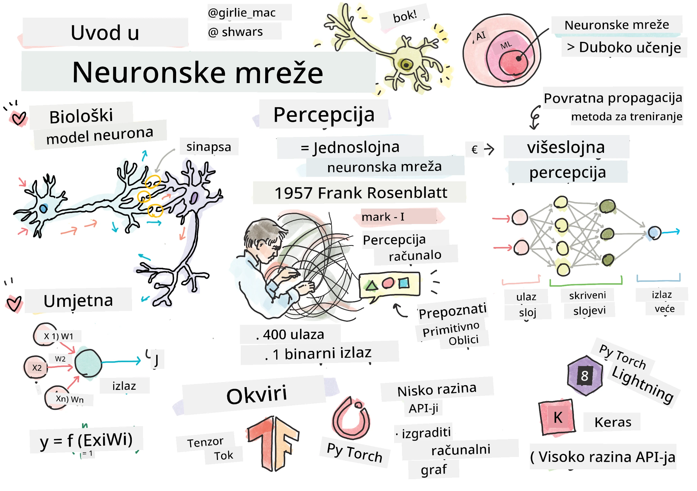
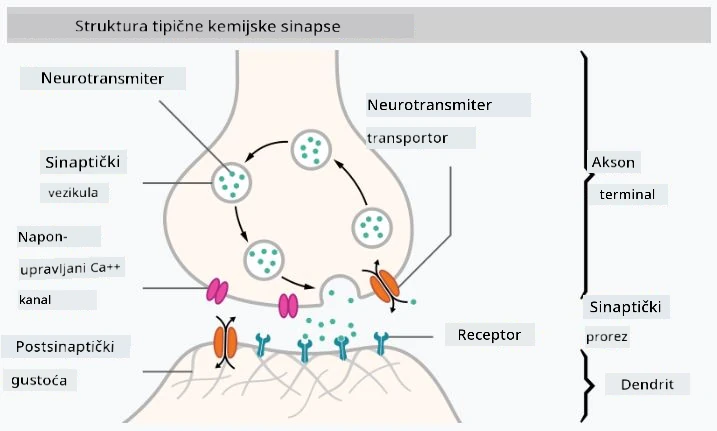

# Uvod u neuronske mreže

Kao što smo raspravili u uvodu, jedan od načina za postizanje inteligencije je treniranje **računalnog modela** ili **umjetnog mozga**. Od sredine 20. stoljeća, istraživači su isprobavali različite matematičke modele, sve dok se u posljednjim godinama ovaj smjer nije pokazao izuzetno uspješnim. Takvi matematički modeli mozga nazivaju se **neuronske mreže**.

> Ponekad se neuronske mreže nazivaju *Umjetne neuronske mreže* (Artificial Neural Networks, ANNs) kako bi se naglasilo da govorimo o modelima, a ne o stvarnim mrežama neurona.

## Strojno učenje

Neuronske mreže dio su šire discipline zvane **Strojno učenje**, čiji je cilj koristiti podatke za treniranje računalnih modela koji mogu rješavati probleme. Strojno učenje čini velik dio umjetne inteligencije, no u ovom kurikulumu ne pokrivamo klasično strojno učenje.

> Posjetite naš zasebni kurikulum **[Strojno učenje za početnike](http://github.com/microsoft/ml-for-beginners)** kako biste saznali više o klasičnom strojnome učenju.

U strojnome učenju pretpostavljamo da imamo neki skup podataka primjera **X** i odgovarajuće izlazne vrijednosti **Y**. Primjeri su često N-dimenzionalni vektori koji se sastoje od **značajki**, a izlazi se nazivaju **oznake**.

Razmotrit ćemo dva najčešća problema strojnog učenja:

* **Klasifikacija**, gdje trebamo klasificirati ulazni objekt u dvije ili više klasa.
* **Regresija**, gdje trebamo predvidjeti numeričku vrijednost za svaki od ulaznih uzoraka.

> Kada predstavljamo ulaze i izlaze kao tenzore, ulazni skup podataka je matrica veličine M&times;N, gdje je M broj uzoraka, a N broj značajki. Izlazne oznake Y su vektor veličine M.

U ovom kurikulumu fokusirat ćemo se isključivo na modele neuronskih mreža.

## Model neurona

Iz biologije znamo da naš mozak sastoji se od neuralnih stanica (neurona), od kojih svaka ima više "ulaza" (dendrita) i jedan "izlaz" (akson). I dendriti i aksoni mogu provoditi električne signale, a veze između njih — poznate kao sinapse — mogu pokazivati različite stupnjeve provodljivosti, koje reguliraju neurotransmiteri.

 | 
----|----
Stvarni neuron *([Slika](https://en.wikipedia.org/wiki/Synapse#/media/File:SynapseSchematic_lines.svg) s Wikipedije)* | Umjetni neuron *(Slika autora)*

Dakle, najjednostavniji matematički model neurona sadrži nekoliko ulaza X1, ..., XN i jedan izlaz Y, te niz težina W1, ..., WN. Izlaz se računa kao:

gdje je f neka nelinearna **funkcija aktivacije**.

> Rani modeli neurona opisani su u klasičnom radu [A logical calculus of the ideas immanent in nervous activity](https://www.cs.cmu.edu/~./epxing/Class/10715/reading/McCulloch.and.Pitts.pdf) autora Warrena McCullocka i Waltera Pittsa iz 1943. Donald Hebb u svojoj knjizi "[The Organization of Behavior: A Neuropsychological Theory](https://books.google.com/books?id=VNetYrB8EBoC)" predložio je način na koji se te mreže mogu trenirati.

## U ovom dijelu

U ovom dijelu naučit ćemo o:
* [Perceptronu](03-Perceptron/README.md), jednom od najranijih modela neuronskih mreža za klasifikaciju s dvije klase
* [Višeslojnim mrežama](04-OwnFramework/README.md) uz prateću bilježnicu [kako izgraditi vlastiti okvir](04-OwnFramework/OwnFramework.ipynb)
* [Okvirima za neuronske mreže](05-Frameworks/README.md), uz ove bilježnice: [PyTorch](05-Frameworks/IntroPyTorch.ipynb) i [Keras/Tensorflow](05-Frameworks/IntroKerasTF.ipynb)
* [Prenaučavanju](../../../../lessons/3-NeuralNetworks/05-Frameworks)

---

**Odricanje od odgovornosti**:  
Ovaj dokument je preveden pomoću AI usluge za prevođenje [Co-op Translator](https://github.com/Azure/co-op-translator). Iako nastojimo osigurati točnost, imajte na umu da automatski prijevodi mogu sadržavati pogreške ili netočnosti. Izvorni dokument na izvornom jeziku treba smatrati autoritativnim izvorom. Za ključne informacije preporučuje se profesionalni prijevod od strane čovjeka. Ne preuzimamo odgovornost za nesporazume ili pogrešna tumačenja koja mogu proizaći iz korištenja ovog prijevoda.