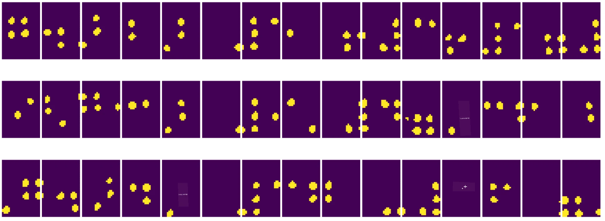

# Uvod u računalni vid

[Računalni vid](https://wikipedia.org/wiki/Computer_vision) je disciplina čiji je cilj omogućiti računalima da steknu visok nivo razumijevanja digitalnih slika. Ovo je prilično široka definicija jer *razumijevanje* može značiti mnogo različitih stvari, uključujući pronalaženje objekta na slici (**detekcija objekata**), razumijevanje što se događa (**detekcija događaja**), opisivanje slike tekstom ili rekonstrukciju scene u 3D. Postoje i posebni zadaci vezani uz slike ljudi: procjena dobi i emocija, detekcija i identifikacija lica te procjena 3D poze, da spomenemo samo neke.

## [Kviz prije predavanja](https://ff-quizzes.netlify.app/en/ai/quiz/11)

Jedan od najjednostavnijih zadataka računalnog vida je **klasifikacija slika**.

Računalni vid se često smatra granom umjetne inteligencije (AI). Danas se većina zadataka računalnog vida rješava pomoću neuronskih mreža. U ovom ćemo dijelu naučiti više o posebnoj vrsti neuronskih mreža koje se koriste za računalni vid, [konvolucijskim neuronskim mrežama](../07-ConvNets/README.md).

Međutim, prije nego što sliku proslijedite neuronskoj mreži, u mnogim slučajevima ima smisla koristiti neke algoritamske tehnike za poboljšanje slike.

Dostupno je nekoliko Python biblioteka za obradu slika:

* **[imageio](https://imageio.readthedocs.io/en/stable/)** može se koristiti za čitanje/pisanje različitih formata slika. Također podržava ffmpeg, koristan alat za pretvaranje video okvira u slike.
* **[Pillow](https://pillow.readthedocs.io/en/stable/index.html)** (poznat i kao PIL) je nešto moćniji i podržava manipulaciju slikama poput morfinga, prilagodbe palete i još mnogo toga.
* **[OpenCV](https://opencv.org/)** je moćna biblioteka za obradu slika napisana u C++, koja je postala *de facto* standard za obradu slika. Ima praktično Python sučelje.
* **[dlib](http://dlib.net/)** je C++ biblioteka koja implementira mnoge algoritme strojnog učenja, uključujući neke algoritme računalnog vida. Također ima Python sučelje i može se koristiti za izazovne zadatke poput detekcije lica i prepoznavanja ključnih točaka na licu.

## OpenCV

[OpenCV](https://opencv.org/) se smatra *de facto* standardom za obradu slika. Sadrži mnogo korisnih algoritama implementiranih u C++. OpenCV možete koristiti i iz Pythona.

Dobro mjesto za učenje OpenCV-a je [ovaj Learn OpenCV tečaj](https://learnopencv.com/getting-started-with-opencv/). U našem kurikulumu cilj nije naučiti OpenCV, već vam pokazati neke primjere kada se može koristiti i kako.

### Učitavanje slika

Slike u Pythonu mogu se praktično predstavljati pomoću NumPy nizova. Na primjer, slike u sivim tonovima veličine 320x200 piksela bile bi pohranjene u nizu dimenzija 200x320, dok bi slike u boji iste dimenzije imale oblik 200x320x3 (za 3 kanala boja). Za učitavanje slike možete koristiti sljedeći kod:

```python
import cv2
import matplotlib.pyplot as plt

im = cv2.imread('image.jpeg')
plt.imshow(im)
```

Tradicionalno, OpenCV koristi BGR (plavo-zelena-crvena) kodiranje za slike u boji, dok ostatak Python alata koristi tradicionalniji RGB (crveno-zelena-plava). Da bi slika izgledala ispravno, trebate je pretvoriti u RGB prostor boja, bilo zamjenom dimenzija u NumPy nizu ili pozivanjem OpenCV funkcije:

```python
im = cv2.cvtColor(im,cv2.COLOR_BGR2RGB)
```

Ista funkcija `cvtColor` može se koristiti za izvođenje drugih transformacija prostora boja, poput pretvaranja slike u sive tonove ili u HSV (nijansa-zasićenost-vrijednost) prostor boja.

OpenCV također možete koristiti za učitavanje videozapisa okvir po okvir - primjer je dan u vježbi [OpenCV Notebook](OpenCV.ipynb).

### Obrada slika

Prije nego što sliku proslijedite neuronskoj mreži, možda ćete htjeti primijeniti nekoliko koraka predobrade. OpenCV može učiniti mnogo toga, uključujući:

* **Promjenu veličine** slike pomoću `im = cv2.resize(im, (320,200),interpolation=cv2.INTER_LANCZOS)`
* **Zamućivanje** slike pomoću `im = cv2.medianBlur(im,3)` ili `im = cv2.GaussianBlur(im, (3,3), 0)`
* Promjenu **svjetline i kontrasta** slike manipulacijom NumPy nizovima, kako je opisano [u ovoj bilješci na Stackoverflowu](https://stackoverflow.com/questions/39308030/how-do-i-increase-the-contrast-of-an-image-in-python-opencv).
* Korištenje [praga](https://docs.opencv.org/4.x/d7/d4d/tutorial_py_thresholding.html) pozivanjem funkcija `cv2.threshold`/`cv2.adaptiveThreshold`, što je često bolje od prilagodbe svjetline ili kontrasta.
* Primjenu različitih [transformacija](https://docs.opencv.org/4.5.5/da/d6e/tutorial_py_geometric_transformations.html) na sliku:
    - **[Afine transformacije](https://docs.opencv.org/4.5.5/d4/d61/tutorial_warp_affine.html)** mogu biti korisne ako trebate kombinirati rotaciju, promjenu veličine i iskrivljenje slike te znate izvorne i odredišne lokacije tri točke na slici. Afine transformacije zadržavaju paralelne linije paralelnima.
    - **[Perspektivne transformacije](https://medium.com/analytics-vidhya/opencv-perspective-transformation-9edffefb2143)** mogu biti korisne kada znate izvorne i odredišne pozicije 4 točke na slici. Na primjer, ako slikate pravokutni dokument pametnim telefonom iz nekog kuta i želite dobiti pravokutnu sliku samog dokumenta.
* Razumijevanje kretanja unutar slike pomoću **[optčkog toka](https://docs.opencv.org/4.5.5/d4/dee/tutorial_optical_flow.html)**.

## Primjeri korištenja računalnog vida

U našem [OpenCV Notebook](OpenCV.ipynb) dajemo neke primjere kada se računalni vid može koristiti za obavljanje specifičnih zadataka:

* **Predobrada fotografije Brailleove knjige**. Fokusiramo se na to kako možemo koristiti pragove, detekciju značajki, perspektivne transformacije i manipulacije NumPy nizovima kako bismo odvojili pojedinačne Brailleove simbole za daljnju klasifikaciju neuronskom mrežom.

 |  | 
----|-----|-----

> Slika iz [OpenCV.ipynb](OpenCV.ipynb)

* **Detekcija kretanja u videu pomoću razlike između okvira**. Ako je kamera fiksna, tada bi okviri iz videozapisa trebali biti prilično slični. Budući da su okviri predstavljeni kao nizovi, jednostavnim oduzimanjem tih nizova za dva uzastopna okvira dobit ćemo razliku piksela, koja bi trebala biti mala za statične okvire, a postati veća kada postoji značajno kretanje na slici.


> Slika iz [OpenCV.ipynb](OpenCV.ipynb)

* **Detekcija kretanja pomoću optičkog toka**. [Optički tok](https://docs.opencv.org/3.4/d4/dee/tutorial_optical_flow.html) omogućuje nam razumijevanje kako se pojedini pikseli na video okvirima kreću. Postoje dvije vrste optičkog toka:

   - **Gusti optički tok** izračunava vektorsko polje koje pokazuje za svaki piksel kamo se kreće
   - **Rijetki optički tok** temelji se na uzimanju nekih prepoznatljivih značajki na slici (npr. rubova) i praćenju njihove putanje od okvira do okvira.


> Slika iz [OpenCV.ipynb](OpenCV.ipynb)

## ✍️ Primjeri bilježnica: OpenCV [isprobajte OpenCV u praksi](OpenCV.ipynb)

Eksperimentirajmo s OpenCV-om istražujući [OpenCV Notebook](OpenCV.ipynb)

## Zaključak

Ponekad se relativno složeni zadaci poput detekcije kretanja ili detekcije vrhova prstiju mogu riješiti isključivo računalnim vidom. Stoga je vrlo korisno poznavati osnovne tehnike računalnog vida i što biblioteke poput OpenCV-a mogu učiniti.

## 🚀 Izazov

Pogledajte [ovaj video](https://docs.microsoft.com/shows/ai-show/ai-show--2021-opencv-ai-competition--grand-prize-winners--cortic-tigers--episode-32?WT.mc_id=academic-77998-cacaste) iz AI showa kako biste saznali više o projektu Cortic Tigers i kako su izgradili rješenje temeljeno na blokovima za demokratizaciju zadataka računalnog vida putem robota. Istražite druge slične projekte koji pomažu novim učenicima da se uključe u ovo područje.

## [Kviz nakon predavanja](https://ff-quizzes.netlify.app/en/ai/quiz/12)

## Pregled i samostalno učenje

Pročitajte više o optičkom toku [u ovom odličnom vodiču](https://learnopencv.com/optical-flow-in-opencv/).

## [Zadatak](lab/README.md)

U ovom laboratoriju snimit ćete video s jednostavnim gestama, a vaš cilj je izdvojiti pokrete gore/dolje/lijevo/desno pomoću optičkog toka.


---

