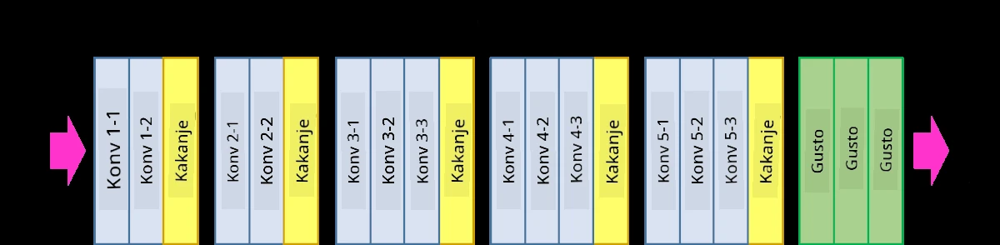
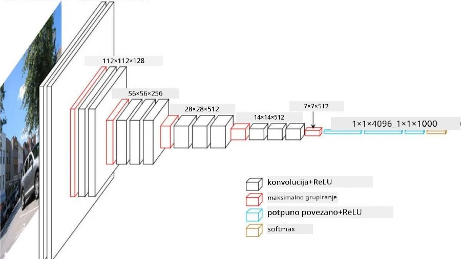
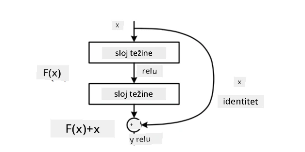
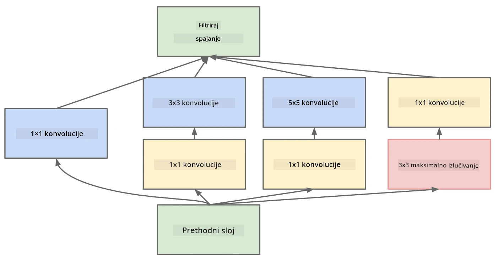

# Dobro poznate CNN arhitekture

### VGG-16

VGG-16 je mreža koja je postigla 92.7% točnosti u ImageNet top-5 klasifikaciji 2014. godine. Ima sljedeću strukturu slojeva:

Kao što možete vidjeti, VGG slijedi tradicionalnu piramidalnu arhitekturu, koja je niz slojeva konvolucije i pooling-a.

> Slika preuzeta s [Researchgate](https://www.researchgate.net/figure/Vgg16-model-structure-To-get-the-VGG-NIN-model-we-replace-the-2-nd-4-th-6-th-7-th_fig2_335194493)

### ResNet

ResNet je obitelj modela koju je predložio Microsoft Research 2015. godine. Glavna ideja ResNet-a je korištenje **rezidualnih blokova**:

> Slika preuzeta iz [ovog rada](https://arxiv.org/pdf/1512.03385.pdf)

Razlog korištenja identitetskog prijenosa je da sloj predviđa **razliku** između rezultata prethodnog sloja i izlaza rezidualnog bloka - otuda naziv *rezidual*. Ti blokovi su mnogo lakši za treniranje, a moguće je konstruirati mreže s nekoliko stotina takvih blokova (najčešće varijante su ResNet-52, ResNet-101 i ResNet-152).

Ovu mrežu možete zamisliti i kao mrežu koja prilagođava svoju složenost datasetu. Na početku, kada započinjete treniranje mreže, vrijednosti težina su male i većina signala prolazi kroz slojeve identitetskog prijenosa. Kako treniranje napreduje i težine postaju veće, značaj parametara mreže raste, a mreža se prilagođava kako bi osigurala potrebnu izražajnu moć za ispravnu klasifikaciju slika za treniranje.

### Google Inception

Google Inception arhitektura ide korak dalje i gradi svaki sloj mreže kao kombinaciju nekoliko različitih putova:

> Slika preuzeta s [Researchgate](https://www.researchgate.net/figure/Inception-module-with-dimension-reductions-left-and-schema-for-Inception-ResNet-v1_fig2_355547454)

Ovdje trebamo naglasiti ulogu konvolucija 1x1, jer na prvi pogled nemaju smisla. Zašto bismo trebali prolaziti kroz sliku s filterom 1x1? Međutim, treba zapamtiti da konvolucijski filteri također rade s nekoliko dubinskih kanala (izvorno - RGB boje, u kasnijim slojevima - kanali za različite filtere), a konvolucija 1x1 koristi se za miješanje tih ulaznih kanala pomoću različitih trenirajućih težina. Također se može promatrati kao downsampling (pooling) preko dimenzije kanala.

Evo [dobrog blog posta](https://medium.com/analytics-vidhya/talented-mr-1x1-comprehensive-look-at-1x1-convolution-in-deep-learning-f6b355825578) o ovoj temi i [originalnog rada](https://arxiv.org/pdf/1312.4400.pdf).

### MobileNet

MobileNet je obitelj modela smanjenih dimenzija, pogodnih za mobilne uređaje. Koristite ih ako imate ograničene resurse i možete žrtvovati malo točnosti. Glavna ideja iza njih je takozvana **depthwise separable convolution**, koja omogućuje predstavljanje konvolucijskih filtera kao kompoziciju prostorne konvolucije i konvolucije 1x1 preko dubinskih kanala. To značajno smanjuje broj parametara, čineći mrežu manjom i lakšom za treniranje s manje podataka.

Evo [dobrog blog posta o MobileNetu](https://medium.com/analytics-vidhya/image-classification-with-mobilenet-cc6fbb2cd470).

## Zaključak

U ovoj jedinici ste naučili glavne koncepte iza neuronskih mreža za računalni vid - konvolucijske mreže. Arhitekture iz stvarnog života koje omogućuju klasifikaciju slika, detekciju objekata, pa čak i generiranje slika, sve se temelje na CNN-ovima, samo s više slojeva i nekim dodatnim trikovima za treniranje.

## 🚀 Izazov

U pratećim bilježnicama postoje bilješke na dnu o tome kako postići veću točnost. Napravite nekoliko eksperimenata kako biste vidjeli možete li postići veću točnost.

## [Post-predavanje kviz](https://ff-quizzes.netlify.app/en/ai/quiz/14)

## Pregled i samostalno učenje

Iako se CNN-ovi najčešće koriste za zadatke računalnog vida, općenito su dobri za izdvajanje uzoraka fiksne veličine. Na primjer, ako se bavimo zvukovima, možda ćemo također htjeti koristiti CNN-ove za traženje specifičnih uzoraka u audio signalu - u tom slučaju filteri bi bili jednodimenzionalni (i taj CNN bi se zvao 1D-CNN). Također, ponekad se koristi 3D-CNN za izdvajanje značajki u višedimenzionalnom prostoru, poput određenih događaja koji se pojavljuju na videu - CNN može uhvatiti određene uzorke promjena značajki tijekom vremena. Napravite pregled i samostalno istraživanje o drugim zadacima koji se mogu obaviti pomoću CNN-ova.

## [Zadatak](lab/README.md)

U ovom laboratoriju vaš je zadatak klasificirati različite pasmine mačaka i pasa. Ove slike su složenije od MNIST dataset-a, imaju veće dimenzije i više od 10 klasa.

---

