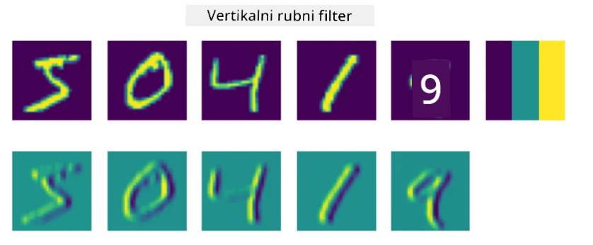
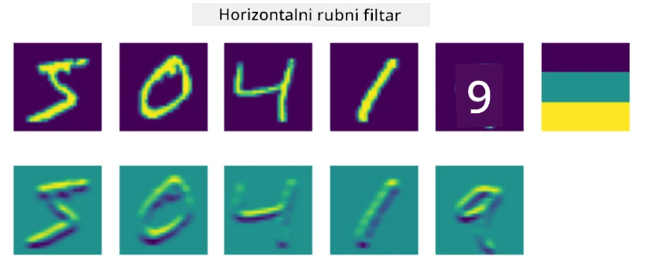
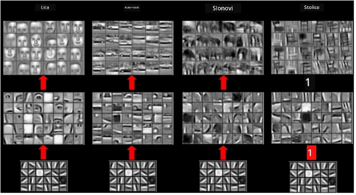

# Konvolucijske neuronske mreže

Već smo vidjeli da su neuronske mreže prilično dobre u obradi slika, pa čak i perceptron s jednim slojem može prepoznati rukom pisane znamenke iz MNIST skupa podataka s razumnom točnošću. Međutim, MNIST skup podataka je vrlo specifičan, jer su sve znamenke centrirane unutar slike, što zadatak čini jednostavnijim.

## [Kviz prije predavanja](https://ff-quizzes.netlify.app/en/ai/quiz/13)

U stvarnom životu želimo biti u mogućnosti prepoznati objekte na slici bez obzira na njihovu točnu lokaciju unutar slike. Računalni vid razlikuje se od opće klasifikacije, jer kada pokušavamo pronaći određeni objekt na slici, skeniramo sliku tražeći specifične **uzorke** i njihove kombinacije. Na primjer, kada tražimo mačku, prvo možemo tražiti horizontalne linije koje mogu oblikovati brkove, a zatim određena kombinacija brkova može ukazati na to da je riječ o slici mačke. Relativni položaj i prisutnost određenih uzoraka su važni, a ne njihova točna pozicija na slici.

Za izdvajanje uzoraka koristit ćemo pojam **konvolucijskih filtera**. Kao što znate, slika je predstavljena 2D-matricom ili 3D-tenzorom s dubinom boje. Primjena filtera znači da uzimamo relativno malu matricu **jezgre filtera** i za svaki piksel u originalnoj slici izračunavamo ponderirani prosjek s okolnim točkama. To možemo zamisliti kao mali prozor koji klizi preko cijele slike i izračunava prosjek svih piksela prema težinama u matrici jezgre filtera.

 | 
----|----

> Slika: Dmitry Soshnikov

Na primjer, ako primijenimo 3x3 vertikalni i horizontalni rubni filter na znamenke iz MNIST skupa podataka, možemo dobiti istaknute dijelove (npr. visoke vrijednosti) gdje postoje vertikalni i horizontalni rubovi u našoj originalnoj slici. Tako se ta dva filtera mogu koristiti za "traženje" rubova. Slično tome, možemo dizajnirati različite filtere za traženje drugih niskorazinskih uzoraka:

> Slika: [Leung-Malik Filter Bank](https://www.robots.ox.ac.uk/~vgg/research/texclass/filters.html)

Iako možemo ručno dizajnirati filtere za izdvajanje nekih uzoraka, možemo također dizajnirati mrežu na način da ona automatski uči uzorke. To je jedna od glavnih ideja iza CNN-a.

## Glavne ideje iza CNN-a

Način na koji CNN funkcionira temelji se na sljedećim važnim idejama:

* Konvolucijski filteri mogu izdvajati uzorke
* Možemo dizajnirati mrežu na način da se filteri automatski treniraju
* Možemo koristiti isti pristup za pronalaženje uzoraka u visokorazinskim značajkama, ne samo u originalnoj slici. Tako ekstrakcija značajki u CNN-u funkcionira na hijerarhiji značajki, počevši od niskorazinskih kombinacija piksela do visokorazinskih kombinacija dijelova slike.

> Slika iz [rada Hislop-Lynch](https://www.semanticscholar.org/paper/Computer-vision-based-pedestrian-trajectory-Hislop-Lynch/26e6f74853fc9bbb7487b06dc2cf095d36c9021d), temeljenog na [njihovom istraživanju](https://dl.acm.org/doi/abs/10.1145/1553374.1553453)

## ✍️ Vježbe: Konvolucijske neuronske mreže

Nastavimo istraživati kako konvolucijske neuronske mreže funkcioniraju i kako možemo postići trenirajuće filtere, radeći kroz odgovarajuće bilježnice:

* [Konvolucijske neuronske mreže - PyTorch](ConvNetsPyTorch.ipynb)
* [Konvolucijske neuronske mreže - TensorFlow](ConvNetsTF.ipynb)

## Piramidalna arhitektura

Većina CNN-a koji se koriste za obradu slika slijedi tzv. piramidalnu arhitekturu. Prvi konvolucijski sloj primijenjen na originalne slike obično ima relativno mali broj filtera (8-16), koji odgovaraju različitim kombinacijama piksela, poput horizontalnih/vertikalnih linija ili poteza. Na sljedećoj razini smanjujemo prostornu dimenziju mreže i povećavamo broj filtera, što odgovara većem broju mogućih kombinacija jednostavnih značajki. Sa svakim slojem, kako se približavamo završnom klasifikatoru, prostorne dimenzije slike se smanjuju, a broj filtera raste.

Kao primjer, pogledajmo arhitekturu VGG-16, mreže koja je postigla 92.7% točnosti u ImageNet-ovoj top-5 klasifikaciji 2014. godine:

> Slika: [Researchgate](https://www.researchgate.net/figure/Vgg16-model-structure-To-get-the-VGG-NIN-model-we-replace-the-2-nd-4-th-6-th-7-th_fig2_335194493)

## Najpoznatije CNN arhitekture

[Pročitajte više o najpoznatijim CNN arhitekturama](CNN_Architectures.md)

---

