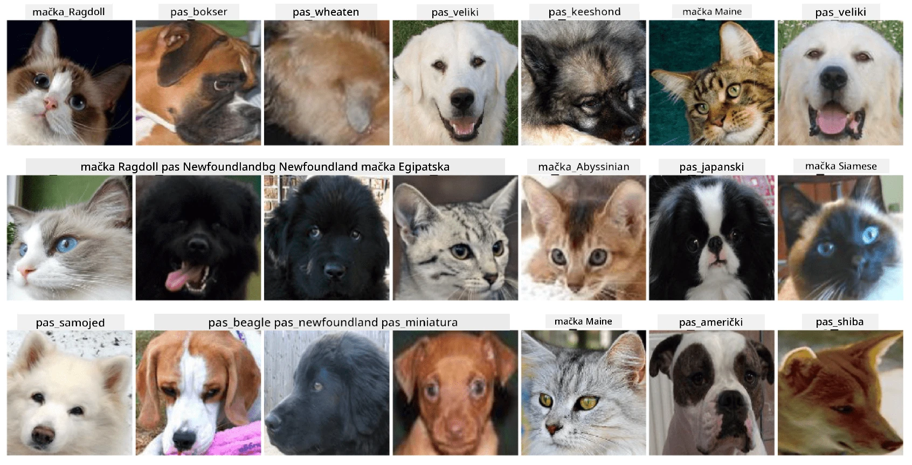

# Klasifikacija lica kućnih ljubimaca

Laboratorijska vježba iz [AI za početnike](https://github.com/microsoft/ai-for-beginners).

## Zadatak

Zamislite da trebate razviti aplikaciju za vrtić za kućne ljubimce kako biste katalogizirali sve ljubimce. Jedna od sjajnih značajki takve aplikacije bila bi automatsko prepoznavanje pasmine s fotografije. Ovo se može uspješno postići korištenjem neuronskih mreža.

Vaš zadatak je trenirati konvolucijsku neuronsku mrežu za klasifikaciju različitih pasmina mačaka i pasa koristeći **Pet Faces** skup podataka.

## Skup podataka

Koristit ćemo [Oxford-IIIT Pet Dataset](https://www.robots.ox.ac.uk/~vgg/data/pets/), koji sadrži slike 37 različitih pasmina pasa i mačaka.



Za preuzimanje skupa podataka, koristite ovaj isječak koda:

```python
!wget https://thor.robots.ox.ac.uk/~vgg/data/pets/images.tar.gz
!tar xfz images.tar.gz
!rm images.tar.gz
```

**Napomena:** Slike u Oxford-IIIT Pet Datasetu organizirane su prema nazivima datoteka (npr. `Abyssinian_1.jpg`, `Bengal_2.jpg`). Notebook uključuje kod za organizaciju ovih slika u poddirektorije specifične za pasmine radi lakše klasifikacije.

## Početni Notebook

Započnite laboratorij otvaranjem [PetFaces.ipynb](PetFaces.ipynb)

## Zaključak

Riješili ste relativno složen problem klasifikacije slika od nule! Postojalo je prilično mnogo klasa, a ipak ste uspjeli postići razumnu točnost! Također ima smisla mjeriti top-k točnost, jer je lako zamijeniti neke klase koje čak i ljudima nisu jasno različite.

---

**Izjava o odricanju odgovornosti**:  
Ovaj dokument je preveden pomoću AI usluge za prevođenje [Co-op Translator](https://github.com/Azure/co-op-translator). Iako nastojimo osigurati točnost, imajte na umu da automatski prijevodi mogu sadržavati pogreške ili netočnosti. Izvorni dokument na izvornom jeziku treba smatrati autoritativnim izvorom. Za ključne informacije preporučuje se profesionalni prijevod od strane stručnjaka. Ne preuzimamo odgovornost za nesporazume ili pogrešna tumačenja koja mogu proizaći iz korištenja ovog prijevoda.