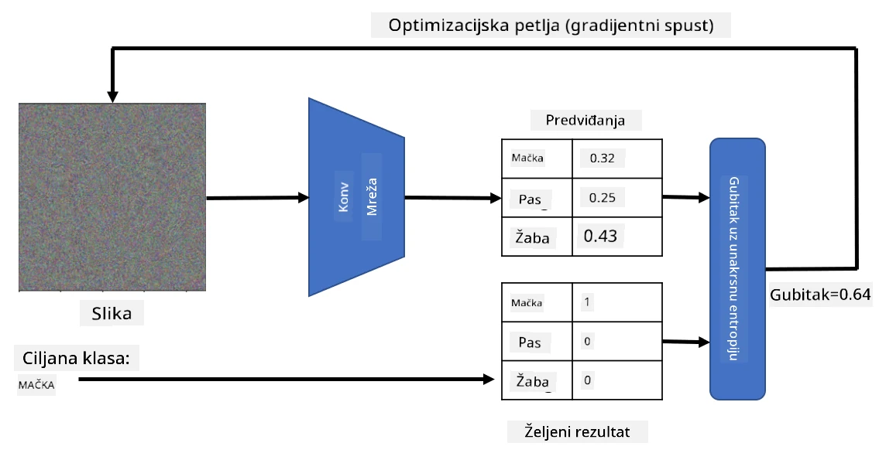

# Pretrenirane mreže i prijenos učenja

Treniranje CNN-a može zahtijevati puno vremena, a za taj zadatak potrebno je mnogo podataka. Međutim, velik dio vremena troši se na učenje najboljih niskorazinskih filtera koje mreža može koristiti za izdvajanje uzoraka iz slika. Postavlja se prirodno pitanje - možemo li koristiti neuronsku mrežu treniranu na jednom skupu podataka i prilagoditi je za klasifikaciju različitih slika bez potrebe za potpunim procesom treniranja?

## [Pre-lecture quiz](https://ff-quizzes.netlify.app/en/ai/quiz/15)

Ovaj pristup naziva se **prijenos učenja**, jer prenosimo dio znanja iz jednog modela neuronske mreže u drugi. Kod prijenosa učenja obično počinjemo s unaprijed treniranim modelom, koji je treniran na nekom velikom skupu slika, poput **ImageNet**. Ti modeli već dobro obavljaju posao izdvajanja različitih značajki iz generičkih slika, a u mnogim slučajevima samo izgradnja klasifikatora na temelju tih izdvojenih značajki može dati dobre rezultate.

> ✅ Prijenos učenja je pojam koji se koristi i u drugim akademskim područjima, poput obrazovanja. Odnosi se na proces primjene znanja iz jedne domene u drugu.

## Pretrenirani modeli kao ekstraktori značajki

Konvolucijske mreže o kojima smo govorili u prethodnom dijelu sadrže niz slojeva, od kojih svaki treba izdvojiti neke značajke iz slike, počevši od niskorazinskih kombinacija piksela (poput horizontalnih/vertikalnih linija ili poteza), pa sve do višerazinskih kombinacija značajki koje odgovaraju stvarima poput oka ili plamena. Ako treniramo CNN na dovoljno velikom skupu generičkih i raznolikih slika, mreža bi trebala naučiti izdvajati te zajedničke značajke.

I Keras i PyTorch sadrže funkcije za jednostavno učitavanje unaprijed treniranih težina neuronske mreže za neke uobičajene arhitekture, od kojih je većina trenirana na slikama iz ImageNet-a. Najčešće korištene opisane su na stranici [CNN Architectures](../07-ConvNets/CNN_Architectures.md) iz prethodne lekcije. Konkretno, možete razmotriti korištenje jednog od sljedećih modela:

* **VGG-16/VGG-19** koji su relativno jednostavni modeli, a ipak daju dobru točnost. Često je korištenje VGG-a kao prvog pokušaja dobar izbor za provjeru kako prijenos učenja funkcionira.
* **ResNet** je obitelj modela koju je predložio Microsoft Research 2015. godine. Imaju više slojeva, pa stoga zahtijevaju više resursa.
* **MobileNet** je obitelj modela smanjene veličine, prikladna za mobilne uređaje. Koristite ih ako imate ograničene resurse i možete žrtvovati malo točnosti.

Evo primjera značajki koje je VGG-16 mreža izdvojila iz slike mačke:

## Skup podataka Mačke vs. Psi

U ovom primjeru koristit ćemo skup podataka [Mačke i Psi](https://www.microsoft.com/download/details.aspx?id=54765&WT.mc_id=academic-77998-cacaste), koji je vrlo blizak stvarnom scenariju klasifikacije slika.

## ✍️ Vježba: Prijenos učenja

Pogledajmo prijenos učenja u praksi u pripadajućim bilježnicama:

* [Transfer Learning - PyTorch](TransferLearningPyTorch.ipynb)
* [Transfer Learning - TensorFlow](TransferLearningTF.ipynb)

## Vizualizacija idealne mačke

Unaprijed trenirana neuronska mreža sadrži različite uzorke unutar svog *mozga*, uključujući pojmove **idealne mačke** (kao i idealnog psa, idealne zebre itd.). Bilo bi zanimljivo nekako **vizualizirati ovu sliku**. Međutim, to nije jednostavno, jer su uzorci raspoređeni po težinama mreže i organizirani u hijerarhijsku strukturu.

Jedan pristup koji možemo koristiti je započeti s nasumičnom slikom, a zatim pokušati koristiti tehniku **optimizacije gradijentnog spuštanja** kako bismo prilagodili tu sliku na način da mreža počne misliti da je to mačka.

Međutim, ako to učinimo, dobit ćemo nešto vrlo slično nasumičnom šumu. To je zato što *postoji mnogo načina da mreža pomisli da je ulazna slika mačka*, uključujući neke koji vizualno nemaju smisla. Iako te slike sadrže mnogo uzoraka tipičnih za mačku, ništa ih ne ograničava da budu vizualno prepoznatljive.

Kako bismo poboljšali rezultat, možemo dodati još jedan član u funkciju gubitka, koji se naziva **gubitak varijacije**. To je metrika koja pokazuje koliko su slični susjedni pikseli slike. Minimiziranje gubitka varijacije čini sliku glađom i uklanja šum - otkrivajući tako vizualno privlačnije uzorke. Evo primjera takvih "idealnih" slika koje se klasificiraju kao mačka i zebra s visokom vjerojatnošću:

 | 
-----|-----
 *Idealna mačka* | *Idealna zebra*

Sličan pristup može se koristiti za izvođenje takozvanih **adversarijalnih napada** na neuronsku mrežu. Pretpostavimo da želimo zavarati neuronsku mrežu i učiniti da pas izgleda kao mačka. Ako uzmemo sliku psa, koju mreža prepoznaje kao psa, možemo je malo prilagoditi koristeći optimizaciju gradijentnog spuštanja dok mreža ne počne klasificirati sliku kao mačku:

 | 
-----|-----
*Izvorna slika psa* | *Slika psa klasificirana kao mačka*

Pogledajte kod za reprodukciju gore navedenih rezultata u sljedećoj bilježnici:

* [Ideal and Adversarial Cat - TensorFlow](AdversarialCat_TF.ipynb)

## Zaključak

Koristeći prijenos učenja, možete brzo sastaviti klasifikator za zadatak klasifikacije prilagođenih objekata i postići visoku točnost. Možete vidjeti da složeniji zadaci koje sada rješavamo zahtijevaju veću računalnu snagu i ne mogu se lako riješiti na CPU-u. U sljedećoj jedinici pokušat ćemo koristiti lakšu implementaciju za treniranje istog modela koristeći manje računalne resurse, što rezultira samo malo nižom točnošću.

## 🚀 Izazov

U pratećim bilježnicama postoje bilješke na dnu o tome kako prijenos znanja najbolje funkcionira s donekle sličnim podacima za treniranje (novi tip životinje, možda). Eksperimentirajte s potpuno novim vrstama slika kako biste vidjeli koliko dobro ili loše vaši modeli prijenosa znanja funkcioniraju.

## [Post-lecture quiz](https://ff-quizzes.netlify.app/en/ai/quiz/16)

## Pregled i samostalno učenje

Pročitajte [TrainingTricks.md](TrainingTricks.md) kako biste produbili svoje znanje o nekim drugim načinima treniranja modela.

## [Zadatak](lab/README.md)

U ovom laboratoriju koristit ćemo stvarni skup podataka [Oxford-IIIT](https://www.robots.ox.ac.uk/~vgg/data/pets/) o kućnim ljubimcima s 35 pasmina mačaka i pasa te ćemo izgraditi klasifikator prijenosa učenja.

---

