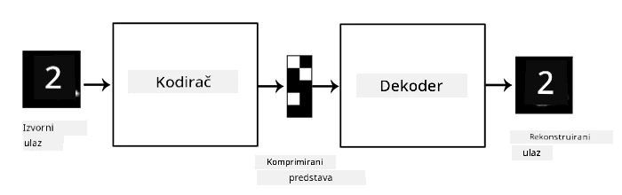

# Autoenkoderi

Kod treniranja CNN-a, jedan od problema je potreba za velikom količinom označenih podataka. U slučaju klasifikacije slika, potrebno je razvrstati slike u različite klase, što zahtijeva ručni rad.

## [Pre-predavanje kviz](https://ff-quizzes.netlify.app/en/ai/quiz/17)

Međutim, možda bismo željeli koristiti sirove (neoznačene) podatke za treniranje CNN ekstraktora značajki, što se naziva **samostalno nadzirano učenje**. Umjesto oznaka, koristit ćemo slike za treniranje kao ulaz i izlaz mreže. Glavna ideja **autoenkodera** je da ćemo imati **enkodersku mrežu** koja pretvara ulaznu sliku u neki **latentni prostor** (obično je to samo vektor manje veličine), a zatim **dekodersku mrežu**, čiji je cilj rekonstruirati originalnu sliku.

> ✅ [Autoenkoder](https://wikipedia.org/wiki/Autoencoder) je "vrsta umjetne neuronske mreže koja se koristi za učenje učinkovitih kodiranja neoznačenih podataka."

Budući da treniramo autoenkoder kako bi uhvatio što više informacija iz originalne slike za točnu rekonstrukciju, mreža pokušava pronaći najbolju **ugradnju** ulaznih slika kako bi uhvatila njihovo značenje.

> Slika s [Keras bloga](https://blog.keras.io/building-autoencoders-in-keras.html)

## Scenariji za korištenje autoenkodera

Iako rekonstrukcija originalnih slika sama po sebi ne izgleda korisno, postoje neki scenariji u kojima su autoenkoderi posebno korisni:

* **Smanjenje dimenzije slika za vizualizaciju** ili **treniranje ugrađivanja slika**. Obično autoenkoderi daju bolje rezultate od PCA, jer uzimaju u obzir prostornu prirodu slika i hijerarhijske značajke.
* **Uklanjanje šuma**, tj. uklanjanje šuma sa slike. Budući da šum nosi puno beskorisnih informacija, autoenkoder ne može sve to uklopiti u relativno mali latentni prostor, pa hvata samo važan dio slike. Kod treniranja za uklanjanje šuma, počinjemo s originalnim slikama i koristimo slike s umjetno dodanim šumom kao ulaz za autoenkoder.
* **Super-rezolucija**, povećanje rezolucije slike. Počinjemo s slikama visoke rezolucije i koristimo sliku niže rezolucije kao ulaz za autoenkoder.
* **Generativni modeli**. Nakon što treniramo autoenkoder, dekoderski dio može se koristiti za stvaranje novih objekata počevši od slučajnih latentnih vektora.

## Varijacijski autoenkoderi (VAE)

Tradicionalni autoenkoderi smanjuju dimenziju ulaznih podataka na neki način, otkrivajući važne značajke ulaznih slika. Međutim, latentni vektori često nemaju puno smisla. Drugim riječima, uzimajući MNIST dataset kao primjer, otkrivanje koji brojevi odgovaraju različitim latentnim vektorima nije jednostavan zadatak, jer bliski latentni vektori ne moraju nužno odgovarati istim brojevima.

S druge strane, za treniranje *generativnih* modela bolje je imati neko razumijevanje latentnog prostora. Ova ideja vodi nas do **varijacijskog autoenkodera** (VAE).

VAE je autoenkoder koji uči predviđati *statističku distribuciju* latentnih parametara, tzv. **latentnu distribuciju**. Na primjer, možda želimo da latentni vektori budu normalno distribuirani s nekom srednjom vrijednosti zmean i standardnom devijacijom zsigma (srednja vrijednost i standardna devijacija su vektori neke dimenzionalnosti d). Enkoder u VAE-u uči predviđati te parametre, a zatim dekoder uzima slučajni vektor iz te distribucije za rekonstrukciju objekta.

Ukratko:

 * Iz ulaznog vektora predviđamo `z_mean` i `z_log_sigma` (umjesto da predviđamo samu standardnu devijaciju, predviđamo njezin logaritam)
 * Uzorkujemo vektor `sample` iz distribucije N(zmean,exp(zlog\_sigma))
 * Dekoder pokušava dekodirati originalnu sliku koristeći `sample` kao ulazni vektor

 

> Slika iz [ovog blog posta](https://ijdykeman.github.io/ml/2016/12/21/cvae.html) autora Isaaka Dykemana

Varijacijski autoenkoderi koriste složenu funkciju gubitka koja se sastoji od dva dijela:

* **Gubitak rekonstrukcije** je funkcija gubitka koja pokazuje koliko je rekonstruirana slika bliska cilju (može biti srednja kvadratna pogreška, ili MSE). To je ista funkcija gubitka kao kod normalnih autoenkodera.
* **KL gubitak**, koji osigurava da distribucija latentnih varijabli ostane blizu normalne distribucije. Temelji se na konceptu [Kullback-Leiblerove divergencije](https://www.countbayesie.com/blog/2017/5/9/kullback-leibler-divergence-explained) - metrički način procjene koliko su dvije statističke distribucije slične.

Jedna važna prednost VAE-a je da nam omogućuju relativno lako generiranje novih slika, jer znamo iz koje distribucije uzorkovati latentne vektore. Na primjer, ako treniramo VAE s 2D latentnim vektorom na MNIST datasetu, možemo zatim mijenjati komponente latentnog vektora kako bismo dobili različite brojeve:

> Slika autora [Dmitry Soshnikov](http://soshnikov.com)

Primijetite kako se slike stapaju jedna u drugu, dok počinjemo dobivati latentne vektore iz različitih dijelova latentnog prostora parametara. Također možemo vizualizirati ovaj prostor u 2D:

 

> Slika autora [Dmitry Soshnikov](http://soshnikov.com)

## ✍️ Vježbe: Autoenkoderi

Saznajte više o autoenkoderima u ovim pripadajućim bilježnicama:

* [Autoenkoderi u TensorFlowu](AutoencodersTF.ipynb)
* [Autoenkoderi u PyTorchu](AutoEncodersPyTorch.ipynb)

## Svojstva autoenkodera

* **Specifični za podatke** - dobro funkcioniraju samo s vrstom slika na kojima su trenirani. Na primjer, ako treniramo mrežu za super-rezoluciju na cvjetovima, neće dobro funkcionirati na portretima. To je zato što mreža može proizvesti sliku više rezolucije uzimajući fine detalje iz značajki naučenih iz skupa podataka za treniranje.
* **Gubitni** - rekonstruirana slika nije ista kao originalna slika. Priroda gubitka definirana je *funkcijom gubitka* korištenom tijekom treniranja.
* Funkcionira na **neoznačenim podacima**

## [Post-predavanje kviz](https://ff-quizzes.netlify.app/en/ai/quiz/18)

## Zaključak

U ovoj lekciji naučili ste o različitim vrstama autoenkodera dostupnih AI znanstveniku. Naučili ste kako ih izgraditi i kako ih koristiti za rekonstrukciju slika. Također ste naučili o VAE-u i kako ga koristiti za generiranje novih slika.

## 🚀 Izazov

U ovoj lekciji naučili ste o korištenju autoenkodera za slike. No, oni se mogu koristiti i za glazbu! Pogledajte projekt Magenta [MusicVAE](https://magenta.tensorflow.org/music-vae), koji koristi autoenkodere za učenje rekonstrukcije glazbe. Napravite nekoliko [eksperimenata](https://colab.research.google.com/github/magenta/magenta-demos/blob/master/colab-notebooks/Multitrack_MusicVAE.ipynb) s ovom bibliotekom kako biste vidjeli što možete stvoriti.

## [Post-predavanje kviz](https://ff-quizzes.netlify.app/en/ai/quiz/16)

## Pregled i samostalno učenje

Za referencu, pročitajte više o autoenkoderima u ovim resursima:

* [Izgradnja autoenkodera u Kerasu](https://blog.keras.io/building-autoencoders-in-keras.html)
* [Blog post na NeuroHive](https://neurohive.io/ru/osnovy-data-science/variacionnyj-avtojenkoder-vae/)
* [Objašnjenje varijacijskih autoenkodera](https://kvfrans.com/variational-autoencoders-explained/)
* [Uvjetni varijacijski autoenkoderi](https://ijdykeman.github.io/ml/2016/12/21/cvae.html)

## Zadatak

Na kraju [ove bilježnice koristeći TensorFlow](AutoencodersTF.ipynb), pronaći ćete 'zadatak' - koristite ga kao svoj zadatak.

---

