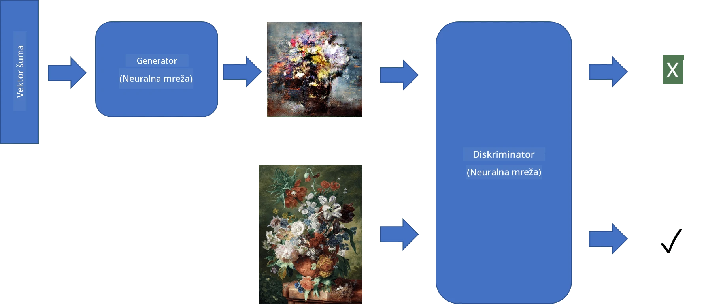
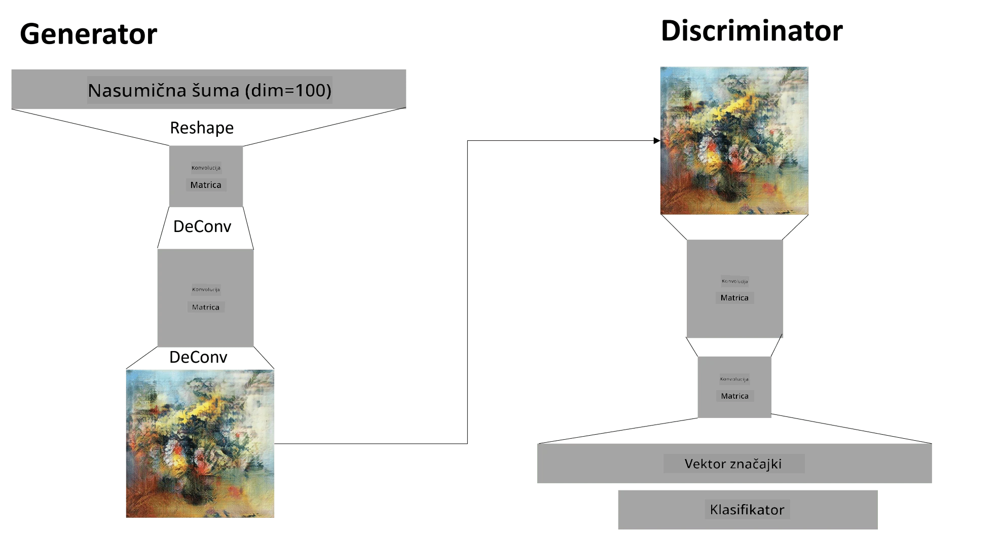

# Generativne suparničke mreže

U prethodnom dijelu naučili smo o **generativnim modelima**: modelima koji mogu generirati nove slike slične onima iz skupa za treniranje. VAE je bio dobar primjer generativnog modela.

## [Kviz prije predavanja](https://ff-quizzes.netlify.app/en/ai/quiz/19)

Međutim, ako pokušamo generirati nešto zaista značajno, poput slike visoke rezolucije, koristeći VAE, vidjet ćemo da treniranje ne konvergira dobro. Za ovaj slučaj trebamo naučiti o drugoj arhitekturi koja je posebno usmjerena na generativne modele - **Generativne suparničke mreže**, ili GAN-ove.

Glavna ideja GAN-a je imati dvije neuronske mreže koje se treniraju jedna protiv druge:

> Slika: [Dmitry Soshnikov](http://soshnikov.com)

> ✅ Mali rječnik:
> * **Generator** je mreža koja uzima neki slučajni vektor i kao rezultat proizvodi sliku.
> * **Diskriminator** je mreža koja uzima sliku i treba odrediti je li to stvarna slika (iz skupa za treniranje) ili je generirana od strane generatora. U suštini, to je klasifikator slika.

### Diskriminator

Arhitektura diskriminatora ne razlikuje se od obične mreže za klasifikaciju slika. U najjednostavnijem slučaju može biti potpuno povezan klasifikator, ali najvjerojatnije će biti [konvolucijska mreža](../07-ConvNets/README.md).

> ✅ GAN temeljen na konvolucijskim mrežama naziva se [DCGAN](https://arxiv.org/pdf/1511.06434.pdf)

CNN diskriminator sastoji se od sljedećih slojeva: nekoliko konvolucija + pooling (s smanjenjem prostorne veličine) i jednog ili više potpuno povezanih slojeva za dobivanje "vektora značajki", te završnog binarnog klasifikatora.

> ✅ 'Pooling' u ovom kontekstu je tehnika koja smanjuje veličinu slike. "Pooling slojevi smanjuju dimenzije podataka kombiniranjem izlaza klastera neurona u jednom sloju u jedan neuron u sljedećem sloju." - [izvor](https://wikipedia.org/wiki/Convolutional_neural_network#Pooling_layers)

### Generator

Generator je malo složeniji. Možete ga smatrati obrnutim diskriminatorom. Počevši od latentnog vektora (umjesto vektora značajki), ima potpuno povezani sloj za pretvaranje u potrebnu veličinu/oblik, nakon čega slijede dekonvolucije + povećanje rezolucije. Ovo je slično *dekoderu* dijela [autoenkodera](../09-Autoencoders/README.md).

> ✅ Budući da je konvolucijski sloj implementiran kao linearni filter koji prolazi kroz sliku, dekonvolucija je u suštini slična konvoluciji i može se implementirati koristeći istu logiku sloja.

> Slika: [Dmitry Soshnikov](http://soshnikov.com)

### Treniranje GAN-a

GAN-ovi se nazivaju **suparničkim** jer postoji stalno natjecanje između generatora i diskriminatora. Tijekom ovog natjecanja, i generator i diskriminator se poboljšavaju, čime mreža uči proizvoditi sve bolje slike.

Treniranje se odvija u dvije faze:

* **Treniranje diskriminatora**. Ovaj zadatak je prilično jednostavan: generiramo batch slika pomoću generatora, označavajući ih s 0, što označava lažnu sliku, i uzimamo batch slika iz ulaznog skupa podataka (s oznakom 1, stvarna slika). Dobivamo neki *gubitak diskriminatora* i provodimo backprop.
* **Treniranje generatora**. Ovo je malo složenije jer ne znamo očekivani izlaz za generator izravno. Uzimamo cijelu GAN mrežu koja se sastoji od generatora praćenog diskriminatorom, hranimo je nekim slučajnim vektorima i očekujemo da rezultat bude 1 (što odgovara stvarnim slikama). Zatim zamrzavamo parametre diskriminatora (ne želimo da se trenira u ovom koraku) i provodimo backprop.

Tijekom ovog procesa, gubici generatora i diskriminatora ne opadaju značajno. U idealnoj situaciji, trebali bi oscilirati, što odgovara poboljšanju performansi obje mreže.

## ✍️ Vježbe: GAN-ovi

* [GAN Notebook u TensorFlow/Keras](GANTF.ipynb)
* [GAN Notebook u PyTorch](GANPyTorch.ipynb)

### Problemi s treniranjem GAN-ova

GAN-ovi su poznati po tome što ih je posebno teško trenirati. Evo nekoliko problema:

* **Kolaps moda**. Ovim pojmom označavamo situaciju kada generator nauči proizvoditi jednu uspješnu sliku koja zavarava diskriminator, ali ne i raznolikost različitih slika.
* **Osjetljivost na hiperparametre**. Često možete vidjeti da GAN uopće ne konvergira, a zatim iznenada smanjenje stope učenja dovodi do konvergencije.
* Održavanje **ravnoteže** između generatora i diskriminatora. U mnogim slučajevima gubitak diskriminatora može brzo pasti na nulu, što rezultira time da generator ne može dalje trenirati. Da bismo to prevladali, možemo pokušati postaviti različite stope učenja za generator i diskriminator ili preskočiti treniranje diskriminatora ako je gubitak već prenizak.
* Treniranje za **visoku rezoluciju**. Odražavajući isti problem kao kod autoenkodera, ovaj problem se javlja jer rekonstrukcija previše slojeva konvolucijske mreže dovodi do artefakata. Ovaj problem se obično rješava tzv. **progresivnim rastom**, gdje se prvo nekoliko slojeva trenira na slikama niske rezolucije, a zatim se slojevi "otključavaju" ili dodaju. Drugo rješenje bilo bi dodavanje dodatnih veza između slojeva i treniranje nekoliko rezolucija odjednom - pogledajte ovaj [Multi-Scale Gradient GANs rad](https://arxiv.org/abs/1903.06048) za detalje.

## Prijenos stila

GAN-ovi su izvrstan način za generiranje umjetničkih slika. Druga zanimljiva tehnika je tzv. **prijenos stila**, koji uzima jednu **sliku sadržaja** i ponovno je crta u drugom stilu, primjenjujući filtre iz **slike stila**.

Kako to funkcionira:
* Počinjemo s nasumičnom slikom šuma (ili sa slikom sadržaja, ali radi lakšeg razumijevanja bolje je početi s nasumičnim šumom).
* Naš cilj je stvoriti takvu sliku koja bi bila bliska i slici sadržaja i slici stila. To se određuje pomoću dvije funkcije gubitka:
   - **Gubitak sadržaja** se računa na temelju značajki koje CNN izvuče na nekim slojevima iz trenutne slike i slike sadržaja.
   - **Gubitak stila** se računa između trenutne slike i slike stila na pametan način koristeći Gram matrice (više detalja u [primjeru notebooka](StyleTransfer.ipynb)).
* Kako bismo sliku učinili glađom i uklonili šum, uvodimo i **Gubitak varijacije**, koji računa prosječnu udaljenost između susjednih piksela.
* Glavna petlja optimizacije prilagođava trenutnu sliku koristeći gradijentni spust (ili neki drugi algoritam optimizacije) kako bi minimizirala ukupni gubitak, koji je ponderirani zbroj svih triju gubitaka.

## ✍️ Primjer: [Prijenos stila](StyleTransfer.ipynb)

## [Kviz nakon predavanja](https://ff-quizzes.netlify.app/en/ai/quiz/20)

## Zaključak

U ovoj lekciji naučili ste o GAN-ovima i kako ih trenirati. Također ste naučili o posebnim izazovima s kojima se ovaj tip neuronske mreže može suočiti i nekim strategijama kako ih prevladati.

## 🚀 Izazov

Prođite kroz [notebook za prijenos stila](StyleTransfer.ipynb) koristeći vlastite slike.

## Pregled i samostalno učenje

Za referencu, pročitajte više o GAN-ovima u ovim resursima:

* Marco Pasini, [10 lekcija koje sam naučio trenirajući GAN-ove godinu dana](https://towardsdatascience.com/10-lessons-i-learned-training-generative-adversarial-networks-gans-for-a-year-c9071159628)
* [StyleGAN](https://en.wikipedia.org/wiki/StyleGAN), *de facto* GAN arhitektura koju vrijedi razmotriti
* [Stvaranje generativne umjetnosti koristeći GAN-ove na Azure ML](https://soshnikov.com/scienceart/creating-generative-art-using-gan-on-azureml/)

## Zadatak

Ponovno pregledajte jedan od dva notebooka povezana s ovom lekcijom i ponovno trenirajte GAN na vlastitim slikama. Što možete stvoriti?

---

