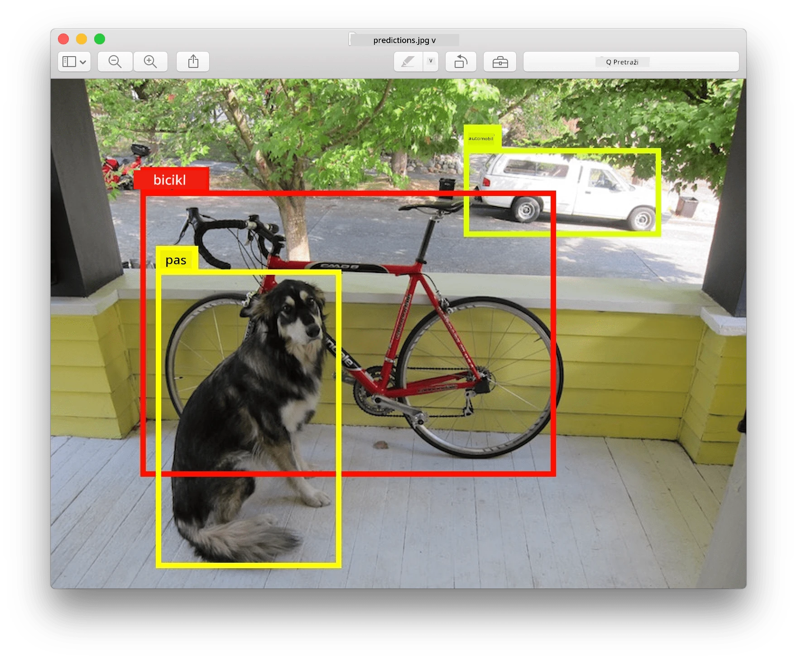
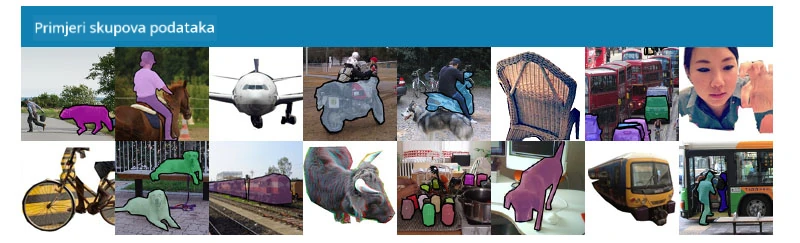
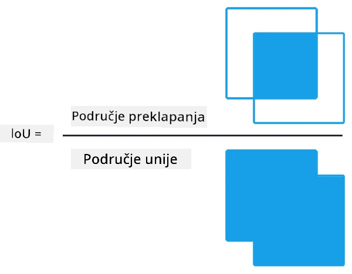
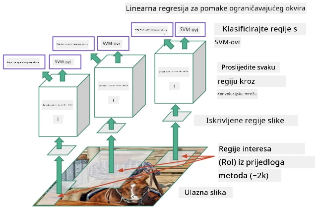
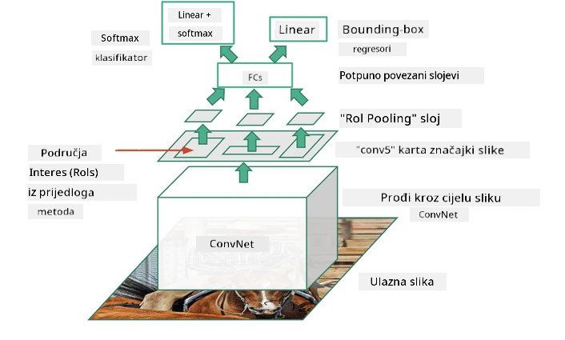
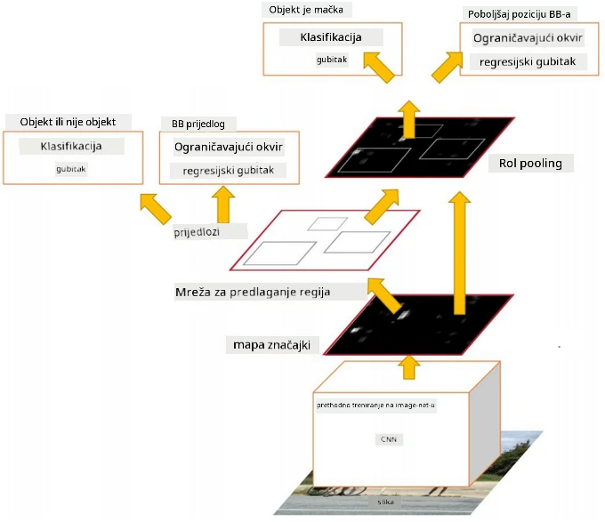
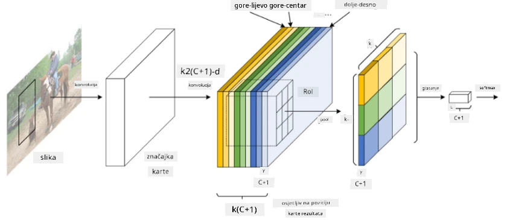
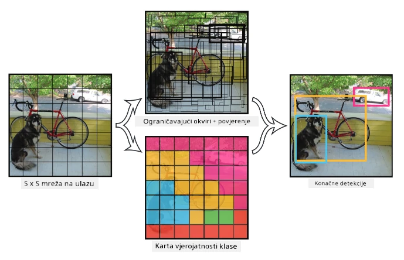

# Detekcija objekata

Modeli za klasifikaciju slika s kojima smo se dosad susretali uzimaju sliku i proizvode kategorijski rezultat, poput klase 'broj' u MNIST problemu. Međutim, u mnogim slučajevima ne želimo samo znati da slika prikazuje objekte – želimo odrediti njihovu točnu lokaciju. Upravo to je cilj **detekcije objekata**.

## [Prethodni kviz](https://ff-quizzes.netlify.app/en/ai/quiz/21)

> Slika s [YOLO v2 web stranice](https://pjreddie.com/darknet/yolov2/)

## Naivan pristup detekciji objekata

Pretpostavimo da želimo pronaći mačku na slici. Vrlo naivan pristup detekciji objekata bio bi sljedeći:

1. Podijeliti sliku na niz pločica.
2. Provoditi klasifikaciju slike na svakoj pločici.
3. Pločice koje rezultiraju dovoljno visokom aktivacijom mogu se smatrati da sadrže traženi objekt.

> *Slika iz [vježbenice](ObjectDetection-TF.ipynb)*

Međutim, ovaj pristup je daleko od idealnog jer omogućuje algoritmu da vrlo neprecizno odredi okvir objekta. Za precizniju lokaciju potrebno je provesti neku vrstu **regresije** kako bi se predvidjele koordinate okvira – a za to su potrebni specifični skupovi podataka.

## Regresija za detekciju objekata

[Ovaj blog post](https://towardsdatascience.com/object-detection-with-neural-networks-a4e2c46b4491) pruža odličan uvod u detekciju oblika.

## Skupovi podataka za detekciju objekata

Možete naići na sljedeće skupove podataka za ovu zadaću:

* [PASCAL VOC](http://host.robots.ox.ac.uk/pascal/VOC/) – 20 klasa
* [COCO](http://cocodataset.org/#home) – Uobičajeni objekti u kontekstu. 80 klasa, okviri i maske za segmentaciju

## Metrike za detekciju objekata

### Presjek kroz uniju (Intersection over Union)

Dok je za klasifikaciju slika lako izmjeriti koliko dobro algoritam radi, za detekciju objekata moramo mjeriti i točnost klase, kao i preciznost lokacije predviđenog okvira. Za ovo drugo koristimo metodu **Presjek kroz uniju** (IoU), koja mjeri koliko se dobro dva okvira (ili dva proizvoljna područja) preklapaju.

> *Slika 2 iz [ovog izvrsnog blog posta o IoU](https://pyimagesearch.com/2016/11/07/intersection-over-union-iou-for-object-detection/)*

Ideja je jednostavna – podijelimo područje presjeka između dvije figure s područjem njihove unije. Za dva identična područja IoU bi bio 1, dok bi za potpuno nepovezana područja bio 0. Inače će varirati od 0 do 1. Obično uzimamo u obzir samo one okvire za koje je IoU iznad određene vrijednosti.

### Prosječna preciznost (Average Precision)

Pretpostavimo da želimo izmjeriti koliko dobro je prepoznata određena klasa objekata $C$. Za mjerenje koristimo metriku **Prosječne preciznosti**, koja se računa na sljedeći način:

1. Razmotrite krivulju Preciznost-Poziv koja pokazuje točnost ovisno o vrijednosti praga detekcije (od 0 do 1).
2. Ovisno o pragu, dobit ćemo više ili manje detektiranih objekata na slici, te različite vrijednosti preciznosti i poziva.
3. Krivulja će izgledati ovako:

> *Slika iz [NeuroWorkshop](http://github.com/shwars/NeuroWorkshop)*

Prosječna preciznost za određenu klasu $C$ je područje ispod ove krivulje. Preciznije, os poziva obično se dijeli na 10 dijelova, a preciznost se prosječuje preko svih tih točaka:

$$
AP = {1\over11}\sum_{i=0}^{10}\mbox{Precision}(\mbox{Recall}={i\over10})
$$

### AP i IoU

Razmatramo samo one detekcije za koje je IoU iznad određene vrijednosti. Na primjer, u PASCAL VOC skupu podataka obično se pretpostavlja $\mbox{IoU Threshold} = 0.5$, dok se u COCO skupu AP mjeri za različite vrijednosti $\mbox{IoU Threshold}$.

> *Slika iz [NeuroWorkshop](http://github.com/shwars/NeuroWorkshop)*

### Prosječna preciznost po klasama – mAP

Glavna metrika za detekciju objekata naziva se **Prosječna preciznost po klasama**, ili **mAP**. To je vrijednost Prosječne preciznosti, prosječna preko svih klasa objekata, a ponekad i preko $\mbox{IoU Threshold}$. Detaljan proces izračuna **mAP** opisan je
[u ovom blog postu](https://medium.com/@timothycarlen/understanding-the-map-evaluation-metric-for-object-detection-a07fe6962cf3)), kao i [ovdje s primjerima koda](https://gist.github.com/tarlen5/008809c3decf19313de216b9208f3734).

## Različiti pristupi detekciji objekata

Postoje dvije široke kategorije algoritama za detekciju objekata:

* **Mreže za predlaganje regija** (R-CNN, Fast R-CNN, Faster R-CNN). Glavna ideja je generirati **regije interesa** (ROI) i provoditi CNN preko njih, tražeći maksimalnu aktivaciju. Ovo je donekle slično naivnom pristupu, osim što se ROI generiraju na pametniji način. Jedan od glavnih nedostataka ovih metoda je što su spore jer zahtijevaju mnogo prolaza CNN klasifikatora preko slike.
* **Jedan prolaz** (YOLO, SSD, RetinaNet) metode. U tim arhitekturama dizajniramo mrežu da predviđa i klase i ROI u jednom prolazu.

### R-CNN: CNN temeljen na regijama

[R-CNN](http://islab.ulsan.ac.kr/files/announcement/513/rcnn_pami.pdf) koristi [Selektivno pretraživanje](http://www.huppelen.nl/publications/selectiveSearchDraft.pdf) za generiranje hijerarhijske strukture ROI regija, koje se zatim prosljeđuju kroz CNN ekstraktore značajki i SVM klasifikatore za određivanje klase objekta, te linearnu regresiju za određivanje koordinata *okvira*. [Službeni rad](https://arxiv.org/pdf/1506.01497v1.pdf)

> *Slika iz van de Sande et al. ICCV’11*

> *Slike iz [ovog bloga](https://towardsdatascience.com/r-cnn-fast-r-cnn-faster-r-cnn-yolo-object-detection-algorithms-36d53571365e)*

### F-RCNN – Brzi R-CNN

Ovaj pristup je sličan R-CNN-u, ali regije se definiraju nakon što su primijenjeni slojevi konvolucije.

> Slika iz [službenog rada](https://www.cv-foundation.org/openaccess/content_iccv_2015/papers/Girshick_Fast_R-CNN_ICCV_2015_paper.pdf), [arXiv](https://arxiv.org/pdf/1504.08083.pdf), 2015

### Brži R-CNN

Glavna ideja ovog pristupa je korištenje neuronske mreže za predviđanje ROI – takozvane *Mreže za predlaganje regija*. [Rad](https://arxiv.org/pdf/1506.01497.pdf), 2016

> Slika iz [službenog rada](https://arxiv.org/pdf/1506.01497.pdf)

### R-FCN: Potpuno konvolucijska mreža temeljena na regijama

Ovaj algoritam je čak brži od Faster R-CNN-a. Glavna ideja je sljedeća:

1. Ekstrahiramo značajke koristeći ResNet-101.
2. Značajke se obrađuju pomoću **Pozicijski osjetljive mape rezultata**. Svaki objekt iz $C$ klasa dijeli se na $k\times k$ regije, i treniramo mrežu da predviđa dijelove objekata.
3. Za svaki dio iz $k\times k$ regija sve mreže glasaju za klase objekata, a klasa objekta s najviše glasova se odabire.

> Slika iz [službenog rada](https://arxiv.org/abs/1605.06409)

### YOLO – You Only Look Once

YOLO je algoritam za detekciju u stvarnom vremenu s jednim prolazom. Glavna ideja je sljedeća:

 * Slika se dijeli na $S\times S$ regije.
 * Za svaku regiju, **CNN** predviđa $n$ mogućih objekata, koordinate *okvira* i *povjerenje*=*vjerojatnost* * IoU.

 

> Slika iz [službenog rada](https://arxiv.org/abs/1506.02640)

### Ostali algoritmi

* RetinaNet: [službeni rad](https://arxiv.org/abs/1708.02002)
   - [PyTorch implementacija u Torchvisionu](https://pytorch.org/vision/stable/_modules/torchvision/models/detection/retinanet.html)
   - [Keras implementacija](https://github.com/fizyr/keras-retinanet)
   - [Detekcija objekata s RetinaNetom](https://keras.io/examples/vision/retinanet/) u Keras primjerima
* SSD (Single Shot Detector): [službeni rad](https://arxiv.org/abs/1512.02325)

## ✍️ Vježbe: Detekcija objekata

Nastavite učenje u sljedećoj vježbenici:

[ObjectDetection.ipynb](ObjectDetection.ipynb)

## Zaključak

U ovoj lekciji ste prošli kroz razne načine na koje se detekcija objekata može ostvariti!

## 🚀 Izazov

Pročitajte ove članke i vježbenice o YOLO-u i isprobajte ih sami:

* [Dobar blog post](https://www.analyticsvidhya.com/blog/2018/12/practical-guide-object-detection-yolo-framewor-python/) koji opisuje YOLO
 * [Službena stranica](https://pjreddie.com/darknet/yolo/)
 * Yolo: [Keras implementacija](https://github.com/experiencor/keras-yolo2), [vježbenica korak-po-korak](https://github.com/experiencor/basic-yolo-keras/blob/master/Yolo%20Step-by-Step.ipynb)
 * Yolo v2: [Keras implementacija](https://github.com/experiencor/keras-yolo2), [vježbenica korak-po-korak](https://github.com/experiencor/keras-yolo2/blob/master/Yolo%20Step-by-Step.ipynb)

## [Kviz nakon predavanja](https://ff-quizzes.netlify.app/en/ai/quiz/22)

## Pregled i samostalno učenje

* [Detekcija objekata](https://tjmachinelearning.com/lectures/1718/obj/) autora Nikhila Sardane
* [Dobra usporedba algoritama za detekciju objekata](https://lilianweng.github.io/lil-log/2018/12/27/object-detection-part-4.html)
* [Pregled algoritama dubokog učenja za detekciju objekata](https://medium.com/comet-app/review-of-deep-learning-algorithms-for-object-detection-c1f3d437b852)
* [Uvod u osnovne algoritme za detekciju objekata korak-po-korak](https://www.analyticsvidhya.com/blog/2018/10/a-step-by-step-introduction-to-the-basic-object-detection-algorithms-part-1/)
* [Implementacija Faster R-CNN-a u Pythonu za detekciju objekata](https://www.analyticsvidhya.com/blog/2018/11/implementation-faster-r-cnn-python-object-detection/)

## [Zadatak: Detekcija objekata](lab/README.md)

---

