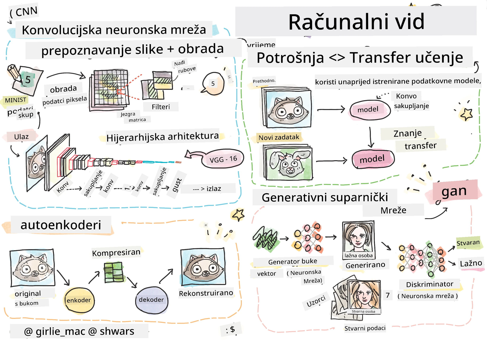

# Računalni vid

U ovom dijelu ćemo naučiti o:

* [Uvod u računalni vid i OpenCV](06-IntroCV/README.md)
* [Konvolucijske neuronske mreže](07-ConvNets/README.md)
* [Unaprijed istrenirane mreže i prijenos učenja](08-TransferLearning/README.md) 
* [Autoenkoderi](09-Autoencoders/README.md)
* [Generativne suparničke mreže](10-GANs/README.md)
* [Detekcija objekata](11-ObjectDetection/README.md)
* [Semantička segmentacija](12-Segmentation/README.md)

**Odricanje od odgovornosti**:  
Ovaj dokument je preveden pomoću AI usluge za prevođenje [Co-op Translator](https://github.com/Azure/co-op-translator). Iako nastojimo osigurati točnost, imajte na umu da automatski prijevodi mogu sadržavati pogreške ili netočnosti. Izvorni dokument na izvornom jeziku treba smatrati autoritativnim izvorom. Za ključne informacije preporučuje se profesionalni prijevod od strane čovjeka. Ne preuzimamo odgovornost za nesporazume ili pogrešna tumačenja koja mogu proizaći iz korištenja ovog prijevoda.