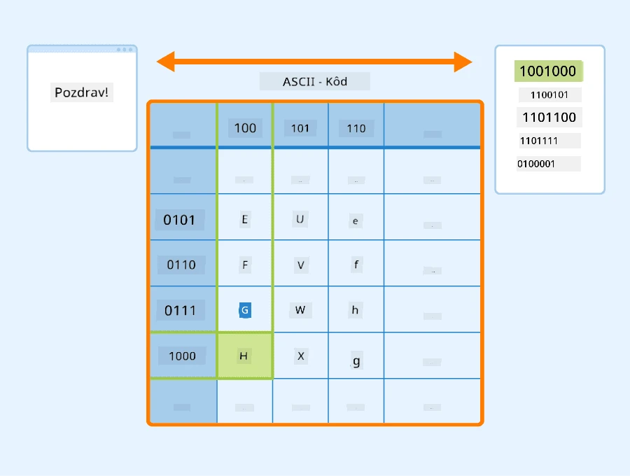
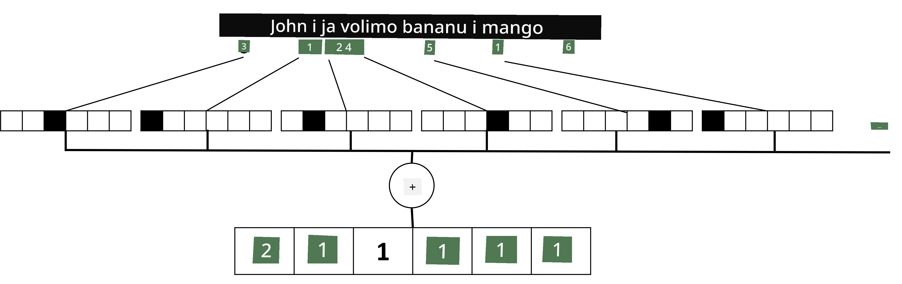

# Predstavljanje teksta kao tenzora

## [Kviz prije predavanja](https://ff-quizzes.netlify.app/en/ai/quiz/25)

## Klasifikacija teksta

U prvom dijelu ovog poglavlja fokusirat ćemo se na zadatak **klasifikacije teksta**. Koristit ćemo [AG News](https://www.kaggle.com/amananandrai/ag-news-classification-dataset) dataset, koji sadrži vijesti poput sljedeće:

* Kategorija: Znanost/Tehnologija  
* Naslov: Ky. Company Wins Grant to Study Peptides (AP)  
* Tekst: AP - Tvrtka koju je osnovao istraživač kemije na Sveučilištu Louisville dobila je potporu za razvoj...

Naš cilj bit će klasificirati vijest u jednu od kategorija na temelju teksta.

## Predstavljanje teksta

Ako želimo rješavati zadatke obrade prirodnog jezika (NLP) pomoću neuronskih mreža, trebamo način za predstavljanje teksta kao tenzora. Računala već predstavljaju tekstualne znakove kao brojeve koji se mapiraju na fontove na vašem ekranu koristeći kodiranja poput ASCII ili UTF-8.

> [Izvor slike](https://www.seobility.net/en/wiki/ASCII)

Kao ljudi, razumijemo što svako slovo **predstavlja** i kako se svi znakovi spajaju u riječi rečenice. Međutim, računala sama po sebi nemaju takvo razumijevanje, a neuronska mreža mora naučiti značenje tijekom treninga.

Stoga možemo koristiti različite pristupe za predstavljanje teksta:

* **Reprezentacija na razini znakova**, gdje tekst predstavljamo tretirajući svaki znak kao broj. Ako imamo *C* različitih znakova u našem korpusu teksta, riječ *Hello* bila bi predstavljena kao 5x*C* tenzor. Svako slovo odgovara stupcu tenzora u one-hot kodiranju.  
* **Reprezentacija na razini riječi**, gdje stvaramo **vokabular** svih riječi u našem tekstu i zatim predstavljamo riječi koristeći one-hot kodiranje. Ovaj pristup je donekle bolji jer samo slovo nema puno značenja, pa korištenjem viših semantičkih koncepata - riječi - pojednostavljujemo zadatak za neuronsku mrežu. Međutim, zbog velikog vokabulara moramo se nositi s visokodimenzionalnim rijetkim tenzorima.

Bez obzira na način reprezentacije, prvo moramo pretvoriti tekst u niz **tokena**, pri čemu je jedan token znak, riječ ili ponekad čak dio riječi. Zatim token pretvaramo u broj, obično koristeći **vokabular**, a taj broj može se unijeti u neuronsku mrežu koristeći one-hot kodiranje.

## N-Gramovi

U prirodnom jeziku precizno značenje riječi može se odrediti samo u kontekstu. Na primjer, značenja *neuronska mreža* i *ribarska mreža* potpuno su različita. Jedan od načina da to uzmemo u obzir je da gradimo naš model na parovima riječi, tretirajući parove riječi kao zasebne tokene vokabulara. Na taj način rečenica *Volim ići na pecanje* bit će predstavljena sljedećim nizom tokena: *Volim ići*, *ići na*, *na pecanje*. Problem s ovim pristupom je što vokabular značajno raste, a kombinacije poput *na pecanje* i *na kupovinu* predstavljene su različitim tokenima, koji ne dijele nikakvu semantičku sličnost unatoč istom glagolu.

U nekim slučajevima možemo razmotriti korištenje tri-grama -- kombinacija tri riječi -- također. Ovaj pristup često se naziva **n-gramovi**. Također, ima smisla koristiti n-gramove s reprezentacijom na razini znakova, gdje n-gramovi otprilike odgovaraju različitim slogovima.

## Bag-of-Words i TF/IDF

Kod rješavanja zadataka poput klasifikacije teksta, trebamo biti u mogućnosti predstaviti tekst jednim vektorom fiksne veličine, koji ćemo koristiti kao ulaz za završni gusti klasifikator. Jedan od najjednostavnijih načina za to je kombiniranje svih pojedinačnih reprezentacija riječi, npr. njihovim zbrajanjem. Ako zbrojimo one-hot kodiranja svake riječi, dobit ćemo vektor frekvencija, koji pokazuje koliko se puta svaka riječ pojavljuje unutar teksta. Takva reprezentacija teksta naziva se **bag-of-words** (BoW).

> Slika autora

BoW u osnovi predstavlja koje riječi se pojavljuju u tekstu i u kojim količinama, što može biti dobar pokazatelj o čemu se tekst radi. Na primjer, članak o politici vjerojatno će sadržavati riječi poput *predsjednik* i *država*, dok će znanstvena publikacija imati nešto poput *sudarač*, *otkriveno*, itd. Dakle, frekvencije riječi u mnogim slučajevima mogu biti dobar pokazatelj sadržaja teksta.

Problem s BoW je što se određene uobičajene riječi, poput *i*, *je*, itd., pojavljuju u većini tekstova i imaju najviše frekvencije, zasjenjujući riječi koje su zaista važne. Možemo smanjiti važnost tih riječi uzimajući u obzir učestalost pojavljivanja riječi u cijeloj kolekciji dokumenata. Ovo je glavna ideja iza TF/IDF pristupa, koji je detaljnije objašnjen u priloženim bilježnicama uz ovo poglavlje.

Međutim, nijedan od ovih pristupa ne može u potpunosti uzeti u obzir **semantiku** teksta. Za to su nam potrebni moćniji modeli neuronskih mreža, o kojima ćemo raspravljati kasnije u ovom poglavlju.

## ✍️ Vježbe: Reprezentacija teksta

Nastavite učiti u sljedećim bilježnicama:

* [Reprezentacija teksta s PyTorchom](TextRepresentationPyTorch.ipynb)  
* [Reprezentacija teksta s TensorFlowom](TextRepresentationTF.ipynb)  

## Zaključak

Do sada smo proučavali tehnike koje mogu dodati težinu frekvencijama različitih riječi. Međutim, one nisu sposobne predstaviti značenje ili redoslijed. Kao što je poznati lingvist J. R. Firth rekao 1935. godine: "Potpuno značenje riječi uvijek je kontekstualno, i nijedno proučavanje značenja izvan konteksta ne može se smatrati ozbiljnim." Kasnije u ovom tečaju naučit ćemo kako izvući kontekstualne informacije iz teksta koristeći jezično modeliranje.

## 🚀 Izazov

Isprobajte neke druge vježbe koristeći bag-of-words i različite modele podataka. Možete se inspirirati ovim [natjecanjem na Kaggleu](https://www.kaggle.com/competitions/word2vec-nlp-tutorial/overview/part-1-for-beginners-bag-of-words)

## [Kviz nakon predavanja](https://ff-quizzes.netlify.app/en/ai/quiz/26)

## Pregled i samostalno učenje

Vježbajte svoje vještine s tehnikama ugrađivanja teksta i bag-of-words na [Microsoft Learn](https://docs.microsoft.com/learn/modules/intro-natural-language-processing-pytorch/?WT.mc_id=academic-77998-cacaste)

## [Zadatak: Bilježnice](assignment.md)

---

