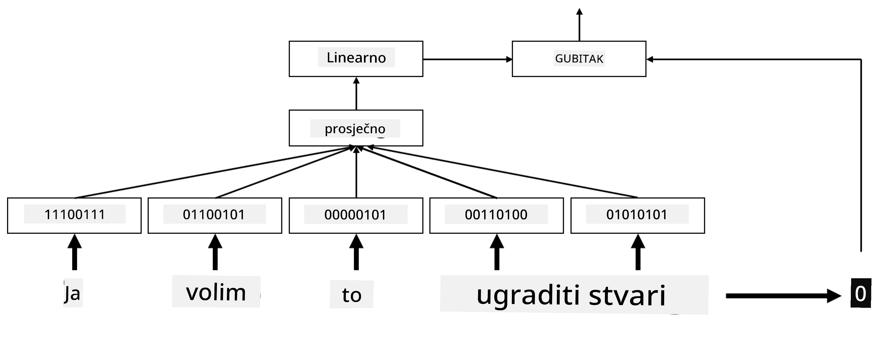
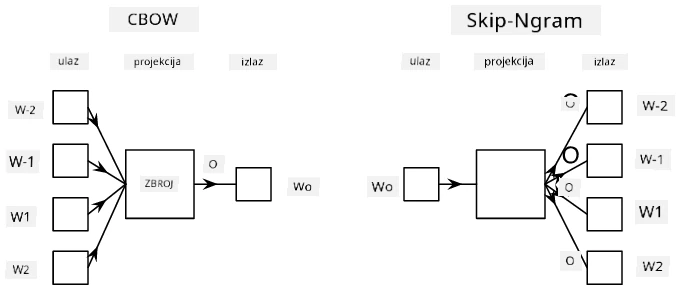

# Ugrađivanja

## [Pre-lecture kviz](https://ff-quizzes.netlify.app/en/ai/quiz/27)

Kod treniranja klasifikatora temeljenih na BoW ili TF/IDF, radili smo s visokodimenzionalnim vektorima vreće riječi duljine `vocab_size`, i eksplicitno smo pretvarali niskodimenzionalne vektore pozicijskog prikaza u rijetke one-hot prikaze. Međutim, ovaj one-hot prikaz nije memorijski učinkovit. Osim toga, svaka riječ se tretira neovisno o drugima, tj. one-hot kodirani vektori ne izražavaju nikakvu semantičku sličnost između riječi.

Ideja **ugrađivanja** je predstavljati riječi pomoću niskodimenzionalnih gustih vektora koji na neki način odražavaju semantičko značenje riječi. Kasnije ćemo raspravljati o tome kako izgraditi značajna ugrađivanja riječi, ali za sada razmislimo o ugrađivanjima kao načinu smanjenja dimenzionalnosti vektora riječi.

Dakle, sloj za ugrađivanje uzima riječ kao ulaz i proizvodi izlazni vektor određene veličine `embedding_size`. Na neki način, vrlo je sličan sloju `Linear`, ali umjesto da uzima one-hot kodirani vektor, može uzeti broj riječi kao ulaz, omogućujući nam da izbjegnemo stvaranje velikih one-hot kodiranih vektora.

Koristeći sloj za ugrađivanje kao prvi sloj u našoj mreži klasifikatora, možemo se prebaciti s modela vreće riječi na model **vreće ugrađivanja**, gdje prvo svaku riječ u našem tekstu pretvaramo u odgovarajuće ugrađivanje, a zatim izračunavamo neku agregatnu funkciju preko svih tih ugrađivanja, poput `sum`, `average` ili `max`.  

> Slika autora

## ✍️ Vježbe: Ugrađivanja

Nastavite učiti u sljedećim bilježnicama:
* [Ugrađivanja s PyTorch](EmbeddingsPyTorch.ipynb)
* [Ugrađivanja s TensorFlow](EmbeddingsTF.ipynb)

## Semantička ugrađivanja: Word2Vec

Iako je sloj za ugrađivanje naučio mapirati riječi u vektorski prikaz, taj prikaz nije nužno imao puno semantičkog značenja. Bilo bi korisno naučiti vektorski prikaz takav da slične riječi ili sinonimi odgovaraju vektorima koji su blizu jedni drugima prema nekoj vektorskoj udaljenosti (npr. Euklidskoj udaljenosti).

Da bismo to postigli, trebamo unaprijed trenirati naš model za ugrađivanje na velikoj zbirci teksta na specifičan način. Jedan način treniranja semantičkih ugrađivanja naziva se [Word2Vec](https://en.wikipedia.org/wiki/Word2vec). Temelji se na dvije glavne arhitekture koje se koriste za stvaranje distribuiranog prikaza riječi:

 - **Kontinuirana vreća riječi** (CBoW) — u ovoj arhitekturi treniramo model da predvidi riječ iz okolnog konteksta. S obzirom na ngram $(W_{-2},W_{-1},W_0,W_1,W_2)$, cilj modela je predvidjeti $W_0$ iz $(W_{-2},W_{-1},W_1,W_2)$.
 - **Kontinuirani skip-gram** je suprotan CBoW-u. Model koristi okolni prozor riječi iz konteksta kako bi predvidio trenutnu riječ.

CBoW je brži, dok je skip-gram sporiji, ali bolje predstavlja rijetke riječi.

> Slika iz [ovog rada](https://arxiv.org/pdf/1301.3781.pdf)

Unaprijed trenirana ugrađivanja Word2Vec (kao i drugi slični modeli, poput GloVe) također se mogu koristiti umjesto sloja za ugrađivanje u neuronskim mrežama. Međutim, moramo se nositi s rječnicima, jer se rječnik korišten za unaprijed treniranje Word2Vec/GloVe vjerojatno razlikuje od rječnika u našem tekstualnom korpusu. Pogledajte gore navedene bilježnice kako biste vidjeli kako se ovaj problem može riješiti.

## Kontekstualna ugrađivanja

Jedno ključno ograničenje tradicionalnih unaprijed treniranih prikaza ugrađivanja poput Word2Vec je problem razlučivanja značenja riječi. Iako unaprijed trenirana ugrađivanja mogu uhvatiti dio značenja riječi u kontekstu, svako moguće značenje riječi kodirano je u isto ugrađivanje. To može uzrokovati probleme u modelima koji dolaze nakon, jer mnoge riječi, poput riječi 'play', imaju različita značenja ovisno o kontekstu u kojem se koriste.

Na primjer, riječ 'play' u ove dvije rečenice ima sasvim različita značenja:

- Išao sam na **predstavu** u kazalištu.
- John želi **igrati** s prijateljima.

Unaprijed trenirana ugrađivanja gore predstavljaju oba značenja riječi 'play' u istom ugrađivanju. Da bismo prevladali ovo ograničenje, trebamo izgraditi ugrađivanja temeljena na **jezičnom modelu**, koji je treniran na velikom korpusu teksta i *zna* kako se riječi mogu slagati u različitim kontekstima. Rasprava o kontekstualnim ugrađivanjima je izvan dosega ovog vodiča, ali ćemo se vratiti na njih kada budemo govorili o jezičnim modelima kasnije u tečaju.

## Zaključak

U ovoj lekciji otkrili ste kako izgraditi i koristiti slojeve za ugrađivanje u TensorFlowu i PyTorchu kako biste bolje odrazili semantička značenja riječi.

## 🚀 Izazov

Word2Vec je korišten za neke zanimljive primjene, uključujući generiranje stihova pjesama i poezije. Pogledajte [ovaj članak](https://www.politetype.com/blog/word2vec-color-poems) koji objašnjava kako je autor koristio Word2Vec za generiranje poezije. Pogledajte i [ovaj video Dana Shiffmanna](https://www.youtube.com/watch?v=LSS_bos_TPI&ab_channel=TheCodingTrain) kako biste otkrili drugačije objašnjenje ove tehnike. Zatim pokušajte primijeniti ove tehnike na vlastiti tekstualni korpus, možda preuzet s Kagglea.

## [Post-lecture kviz](https://ff-quizzes.netlify.app/en/ai/quiz/28)

## Pregled i samostalno učenje

Pročitajte ovaj rad o Word2Vecu: [Efficient Estimation of Word Representations in Vector Space](https://arxiv.org/pdf/1301.3781.pdf)

## [Zadatak: Bilježnice](assignment.md)

---

