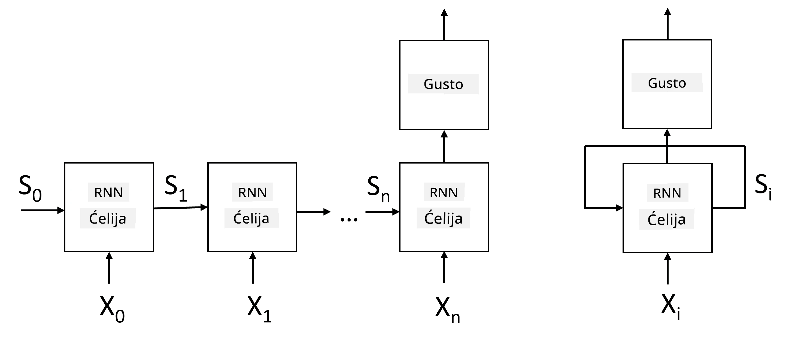
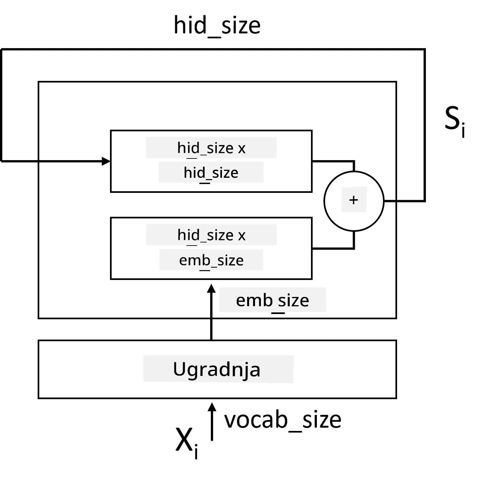
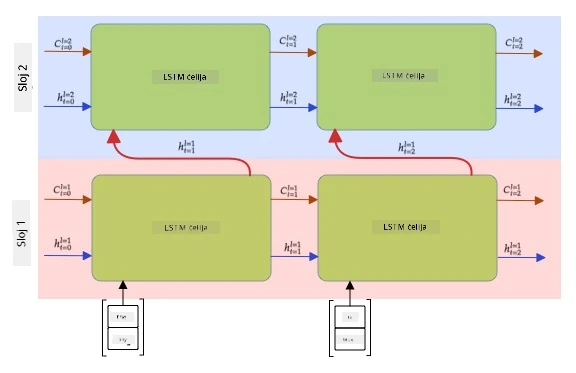

# Rekurentne neuronske mreže

## [Kviz prije predavanja](https://ff-quizzes.netlify.app/en/ai/quiz/31)

U prethodnim odjeljcima koristili smo bogate semantičke reprezentacije teksta i jednostavan linearni klasifikator na vrhu ugrađenih vektora. Ova arhitektura hvata agregirano značenje riječi u rečenici, ali ne uzima u obzir **redoslijed** riječi, jer operacija agregacije na ugrađenim vektorima uklanja ovu informaciju iz izvornog teksta. Budući da ovi modeli ne mogu modelirati redoslijed riječi, nisu sposobni riješiti složenije ili dvosmislene zadatke poput generiranja teksta ili odgovaranja na pitanja.

Kako bismo uhvatili značenje sekvenci teksta, trebamo koristiti drugu arhitekturu neuronske mreže, koja se naziva **rekurentna neuronska mreža** ili RNN. U RNN-u, rečenicu prosljeđujemo kroz mrežu jedan simbol po simbol, a mreža proizvodi određeno **stanje**, koje zatim ponovno prosljeđujemo mreži s idućim simbolom.

> Slika autora

Za danu ulaznu sekvencu tokena X0,...,Xn, RNN stvara sekvencu blokova neuronske mreže i trenira ovu sekvencu od početka do kraja koristeći unatrag širenje pogreške (backpropagation). Svaki blok mreže uzima par (Xi,Si) kao ulaz i proizvodi Si+1 kao rezultat. Konačno stanje Sn ili (izlaz Yn) ide u linearni klasifikator kako bi proizveo rezultat. Svi blokovi mreže dijele iste težine i treniraju se od početka do kraja koristeći jedan prolaz unatrag širenja pogreške.

Budući da se vektori stanja S0,...,Sn prosljeđuju kroz mrežu, ona može naučiti sekvencijalne ovisnosti između riječi. Na primjer, kada se riječ *ne* pojavi negdje u sekvenci, mreža može naučiti negirati određene elemente unutar vektora stanja, što rezultira negacijom.

> ✅ Budući da su težine svih RNN blokova na slici gore zajedničke, ista slika može se prikazati kao jedan blok (desno) s povratnom petljom, koja prosljeđuje izlazno stanje mreže natrag na ulaz.

## Anatomija RNN ćelije

Pogledajmo kako je organizirana jednostavna RNN ćelija. Ona prihvaća prethodno stanje Si-1 i trenutni simbol Xi kao ulaze, te mora proizvesti izlazno stanje Si (a ponekad nas zanima i neki drugi izlaz Yi, kao u slučaju generativnih mreža).

Jednostavna RNN ćelija ima dvije matrice težina unutar sebe: jedna transformira ulazni simbol (nazovimo je W), a druga transformira ulazno stanje (H). U ovom slučaju izlaz mreže se računa kao &sigma;(W&times;Xi+H&times;Si-1+b), gdje je &sigma; funkcija aktivacije, a b dodatna pristranost.

> Slika autora

U mnogim slučajevima, ulazni tokeni prolaze kroz sloj ugrađivanja prije nego uđu u RNN kako bi se smanjila dimenzionalnost. U ovom slučaju, ako je dimenzija ulaznih vektora *emb_size*, a vektor stanja *hid_size* - veličina W je *emb_size*&times;*hid_size*, a veličina H je *hid_size*&times;*hid_size*.

## Long Short Term Memory (LSTM)

Jedan od glavnih problema klasičnih RNN-ova je takozvani problem **nestajućih gradijenata**. Budući da se RNN-ovi treniraju od početka do kraja u jednom prolazu unatrag širenja pogreške, teško je propagirati pogrešku do prvih slojeva mreže, pa mreža ne može naučiti odnose između udaljenih tokena. Jedan od načina za izbjegavanje ovog problema je uvođenje **eksplicitnog upravljanja stanjem** pomoću takozvanih **vrata**. Postoje dvije poznate arhitekture ovog tipa: **Long Short Term Memory** (LSTM) i **Gated Relay Unit** (GRU).

> Izvor slike TBD

LSTM mreža je organizirana na način sličan RNN-u, ali postoje dva stanja koja se prenose iz sloja u sloj: stvarno stanje C i skriveni vektor H. U svakoj jedinici, skriveni vektor Hi se spaja s ulazom Xi, i oni kontroliraju što se događa sa stanjem C putem **vrata**. Svaka vrata su neuronska mreža sa sigmoidnom aktivacijom (izlaz u rasponu [0,1]), koja se može smatrati maskom po bitovima kada se pomnoži s vektorom stanja. Postoje sljedeća vrata (s lijeva na desno na slici gore):

* **Vrata zaborava** uzimaju skriveni vektor i određuju koje komponente vektora C trebamo zaboraviti, a koje proslijediti dalje.
* **Ulazna vrata** uzimaju neke informacije iz ulaznog i skrivenog vektora i ubacuju ih u stanje.
* **Izlazna vrata** transformiraju stanje putem linearnog sloja s *tanh* aktivacijom, zatim odabiru neke od njegovih komponenti koristeći skriveni vektor Hi kako bi proizveli novo stanje Ci+1.

Komponente stanja C mogu se smatrati zastavicama koje se mogu uključiti i isključiti. Na primjer, kada u sekvenci naiđemo na ime *Alice*, možemo pretpostaviti da se odnosi na ženski lik i podići zastavicu u stanju da imamo ženski imenicu u rečenici. Kada dalje naiđemo na frazu *i Tom*, podići ćemo zastavicu da imamo množinsku imenicu. Tako manipulacijom stanjem možemo pratiti gramatička svojstva dijelova rečenice.

> ✅ Izvrstan resurs za razumijevanje unutarnjeg funkcioniranja LSTM-a je ovaj odličan članak [Understanding LSTM Networks](https://colah.github.io/posts/2015-08-Understanding-LSTMs/) Christophera Olaha.

## Dvosmjerni i višeslojni RNN-ovi

Razgovarali smo o rekurentnim mrežama koje djeluju u jednom smjeru, od početka sekvence do kraja. To se čini prirodnim, jer podsjeća na način na koji čitamo i slušamo govor. Međutim, budući da u mnogim praktičnim slučajevima imamo nasumičan pristup ulaznoj sekvenci, može imati smisla pokrenuti rekurentni izračun u oba smjera. Takve mreže nazivaju se **dvosmjerni** RNN-ovi. Kada radimo s dvosmjernom mrežom, trebamo dva skrivena vektora stanja, po jedan za svaki smjer.

Rekurentna mreža, bilo jednosmjerna ili dvosmjerna, hvata određene uzorke unutar sekvence i može ih pohraniti u vektor stanja ili proslijediti u izlaz. Kao i kod konvolucijskih mreža, možemo izgraditi drugi rekurentni sloj na vrhu prvog kako bismo uhvatili uzorke višeg nivoa i izgradili na temelju uzoraka nižeg nivoa koje je izvukao prvi sloj. To nas dovodi do pojma **višeslojnog RNN-a**, koji se sastoji od dva ili više rekurentnih mreža, gdje se izlaz prethodnog sloja prosljeđuje sljedećem sloju kao ulaz.

*Slika iz [ovog izvrsnog posta](https://towardsdatascience.com/from-a-lstm-cell-to-a-multilayer-lstm-network-with-pytorch-2899eb5696f3) Fernanda Lópeza*

## ✍️ Vježbe: Ugrađivanja

Nastavite učiti u sljedećim bilježnicama:

* [RNN-ovi s PyTorchom](RNNPyTorch.ipynb)
* [RNN-ovi s TensorFlowom](RNNTF.ipynb)

## Zaključak

U ovoj jedinici vidjeli smo da se RNN-ovi mogu koristiti za klasifikaciju sekvenci, ali zapravo mogu obraditi mnogo više zadataka, poput generiranja teksta, strojnog prevođenja i drugih. Te zadatke ćemo razmotriti u sljedećoj jedinici.

## 🚀 Izazov

Pročitajte literaturu o LSTM-ovima i razmotrite njihove primjene:

- [Grid Long Short-Term Memory](https://arxiv.org/pdf/1507.01526v1.pdf)
- [Show, Attend and Tell: Neural Image Caption
Generation with Visual Attention](https://arxiv.org/pdf/1502.03044v2.pdf)

## [Kviz nakon predavanja](https://ff-quizzes.netlify.app/en/ai/quiz/32)

## Pregled i samostalno učenje

- [Understanding LSTM Networks](https://colah.github.io/posts/2015-08-Understanding-LSTMs/) Christophera Olaha.

## [Zadatak: Bilježnice](assignment.md)

---

