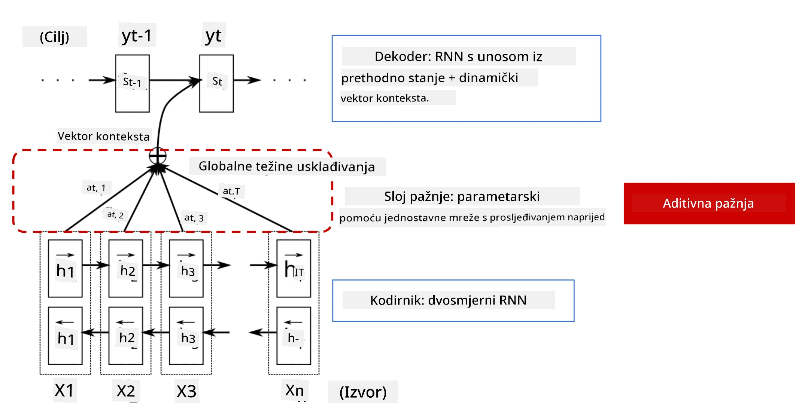
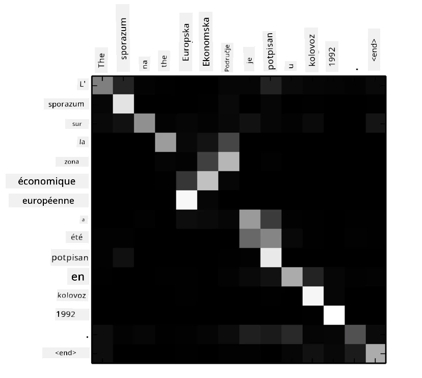
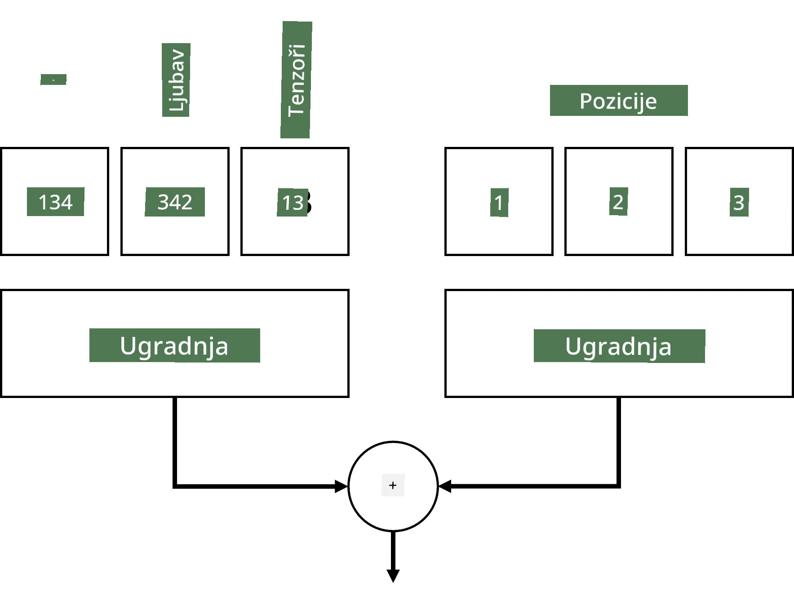
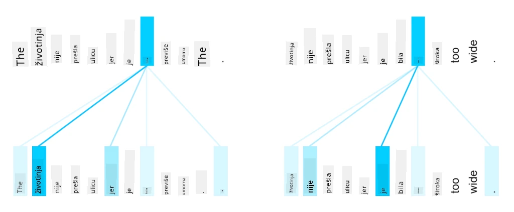

# Mehanizmi pažnje i transformeri

## [Pre-kviz predavanja](https://ff-quizzes.netlify.app/en/ai/quiz/35)

Jedan od najvažnijih problema u području NLP-a je **strojno prevođenje**, ključni zadatak koji stoji iza alata poput Google Translatea. U ovom dijelu usredotočit ćemo se na strojno prevođenje, ili općenitije, na bilo koji zadatak *sekvenca-u-sekvencu* (koji se također naziva **transdukcija rečenica**).

Kod RNN-ova, sekvenca-u-sekvencu se implementira pomoću dvije rekurentne mreže, gdje jedna mreža, **enkoder**, sažima ulaznu sekvencu u skriveno stanje, dok druga mreža, **dekoder**, razmotava to skriveno stanje u prevedeni rezultat. Postoji nekoliko problema s ovim pristupom:

* Završno stanje enkoderske mreže teško pamti početak rečenice, što uzrokuje lošu kvalitetu modela za duge rečenice.
* Sve riječi u sekvenci imaju isti utjecaj na rezultat. Međutim, u stvarnosti, određene riječi u ulaznoj sekvenci često imaju veći utjecaj na izlazne sekvence od drugih.

**Mehanizmi pažnje** omogućuju ponderiranje kontekstualnog utjecaja svakog ulaznog vektora na svaku izlaznu predikciju RNN-a. To se implementira stvaranjem prečaca između međustanja ulaznog RNN-a i izlaznog RNN-a. Na taj način, pri generiranju izlaznog simbola yt, uzet ćemo u obzir sva skrivena stanja ulaza hi, s različitim težinskim koeficijentima &alpha;t,i.

> Enkoder-dekoder model s aditivnim mehanizmom pažnje u [Bahdanau et al., 2015](https://arxiv.org/pdf/1409.0473.pdf), citirano iz [ovog blog posta](https://lilianweng.github.io/lil-log/2018/06/24/attention-attention.html)

Matrica pažnje {&alpha;i,j} predstavlja stupanj u kojem određene ulazne riječi sudjeluju u generiranju određene riječi u izlaznoj sekvenci. Ispod je primjer takve matrice:

> Slika iz [Bahdanau et al., 2015](https://arxiv.org/pdf/1409.0473.pdf) (Slika 3)

Mehanizmi pažnje odgovorni su za velik dio trenutnog ili bliskog trenutnom stanju umjetne inteligencije u NLP-u. Dodavanje pažnje značajno povećava broj parametara modela, što je dovelo do problema skaliranja kod RNN-ova. Ključna ograničenja skaliranja RNN-ova su rekurentna priroda modela koja otežava grupiranje i paralelizaciju treninga. Kod RNN-a svaki element sekvence mora se obraditi redoslijedom, što znači da se ne može lako paralelizirati.

> Slika iz [Googleovog bloga](https://research.googleblog.com/2016/09/a-neural-network-for-machine.html)

Usvajanje mehanizama pažnje u kombinaciji s ovim ograničenjem dovelo je do stvaranja sadašnjih vrhunskih Transformer modela koje poznajemo i koristimo danas, poput BERT-a i Open-GPT3.

## Transformer modeli

Jedna od glavnih ideja iza transformera je izbjegavanje sekvencijalne prirode RNN-ova i stvaranje modela koji se može paralelizirati tijekom treninga. To se postiže implementacijom dviju ideja:

* pozicijsko kodiranje
* korištenje mehanizma samopozornosti za hvatanje uzoraka umjesto RNN-ova (ili CNN-ova) (zbog čega se rad koji uvodi transformere naziva *[Attention is all you need](https://arxiv.org/abs/1706.03762)*)

### Pozicijsko kodiranje/ugrađivanje

Ideja pozicijskog kodiranja je sljedeća.  
1. Kod korištenja RNN-ova, relativni položaj tokena predstavlja se brojem koraka, i stoga ne mora biti eksplicitno predstavljen.  
2. Međutim, kada se prebacimo na pažnju, moramo znati relativne položaje tokena unutar sekvence.  
3. Da bismo dobili pozicijsko kodiranje, proširujemo našu sekvencu tokena sekvencom pozicija tokena u sekvenci (tj. sekvencom brojeva 0,1, ...).  
4. Zatim miješamo poziciju tokena s vektorom ugrađivanja tokena. Za transformaciju pozicije (cijelog broja) u vektor, možemo koristiti različite pristupe:

* Ugrađivanje koje se trenira, slično ugrađivanju tokena. Ovo je pristup koji ovdje razmatramo. Primjenjujemo slojeve ugrađivanja na tokene i njihove pozicije, što rezultira vektorima ugrađivanja iste dimenzije, koje zatim zbrajamo.
* Fiksna funkcija pozicijskog kodiranja, kako je predloženo u originalnom radu.

> Slika autora

Rezultat koji dobivamo s pozicijskim ugrađivanjem uključuje i originalni token i njegov položaj unutar sekvence.

### Višeglava samopozornost

Zatim trebamo uhvatiti neke uzorke unutar naše sekvence. Da bismo to učinili, transformeri koriste mehanizam **samopozornosti**, koji je u osnovi pažnja primijenjena na istu sekvencu kao ulaz i izlaz. Primjena samopozornosti omogućuje nam uzimanje u obzir **konteksta** unutar rečenice i uvid u međusobne odnose između riječi. Na primjer, omogućuje nam da vidimo na koje riječi se odnose zamjenice poput *to*, i također uzimamo kontekst u obzir:

> Slika iz [Googleovog bloga](https://research.googleblog.com/2017/08/transformer-novel-neural-network.html)

Kod transformera koristimo **višeglavu pažnju** kako bismo mreži dali moć hvatanja različitih vrsta ovisnosti, npr. dugoročnih naspram kratkoročnih odnosa između riječi, koreferencija naspram nečeg drugog itd.

[TensorFlow Notebook](TransformersTF.ipynb) sadrži više detalja o implementaciji slojeva transformera.

### Pažnja enkoder-dekoder

Kod transformera pažnja se koristi na dva mjesta:

* Za hvatanje uzoraka unutar ulaznog teksta pomoću samopozornosti
* Za izvođenje prevođenja sekvenci - to je sloj pažnje između enkodera i dekodera.

Pažnja enkoder-dekoder vrlo je slična mehanizmu pažnje korištenom kod RNN-ova, kako je opisano na početku ovog dijela. Ovaj animirani dijagram objašnjava ulogu pažnje enkoder-dekoder.

Budući da se svaka ulazna pozicija neovisno mapira na svaku izlaznu poziciju, transformeri se mogu bolje paralelizirati od RNN-ova, što omogućuje mnogo veće i izražajnije jezične modele. Svaka glava pažnje može se koristiti za učenje različitih odnosa između riječi, što poboljšava zadatke obrade prirodnog jezika.

## BERT

**BERT** (Bidirectional Encoder Representations from Transformers) je vrlo velika višeslojna transformer mreža s 12 slojeva za *BERT-base*, i 24 za *BERT-large*. Model se prvo unaprijed trenira na velikom korpusu tekstualnih podataka (WikiPedia + knjige) koristeći nenadzirano učenje (predviđanje maskiranih riječi u rečenici). Tijekom unaprijed treniranja model usvaja značajne razine razumijevanja jezika koje se zatim mogu iskoristiti s drugim skupovima podataka pomoću finog podešavanja. Ovaj proces naziva se **transferno učenje**.

> Slika [izvor](http://jalammar.github.io/illustrated-bert/)

## ✍️ Vježbe: Transformeri

Nastavite svoje učenje u sljedećim bilježnicama:

* [Transformeri u PyTorch-u](TransformersPyTorch.ipynb)
* [Transformeri u TensorFlow-u](TransformersTF.ipynb)

## Zaključak

U ovoj lekciji naučili ste o Transformerima i mehanizmima pažnje, ključnim alatima u NLP alatu. Postoji mnogo varijacija arhitektura Transformera, uključujući BERT, DistilBERT, BigBird, OpenGPT3 i druge, koje se mogu fino podešavati. Paket [HuggingFace](https://github.com/huggingface/) pruža repozitorij za treniranje mnogih od ovih arhitektura s PyTorch-om i TensorFlow-om.

## 🚀 Izazov

## [Post-kviz predavanja](https://ff-quizzes.netlify.app/en/ai/quiz/36)

## Pregled i samostalno učenje

* [Blog post](https://mchromiak.github.io/articles/2017/Sep/12/Transformer-Attention-is-all-you-need/), koji objašnjava klasični rad [Attention is all you need](https://arxiv.org/abs/1706.03762) o transformerima.
* [Serija blog postova](https://towardsdatascience.com/transformers-explained-visually-part-1-overview-of-functionality-95a6dd460452) o transformerima, koja detaljno objašnjava arhitekturu.

## [Zadatak](assignment.md)

---

