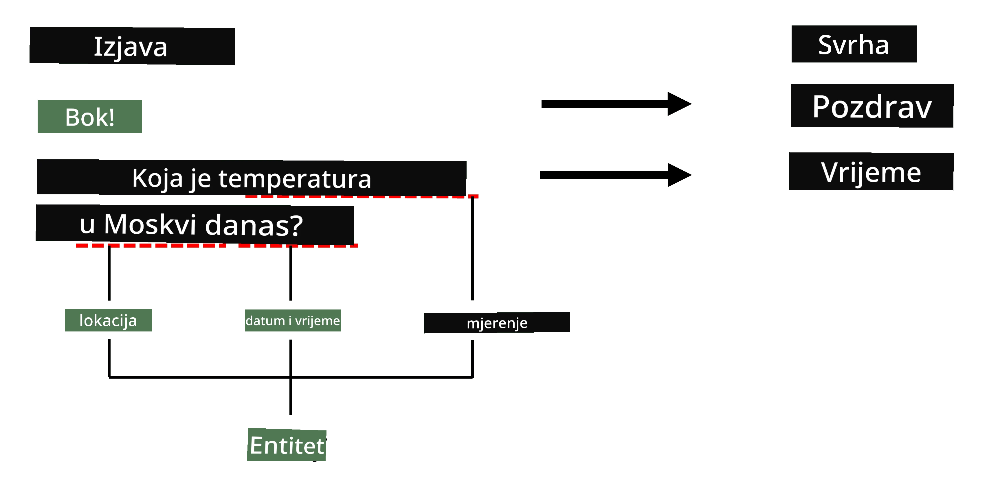
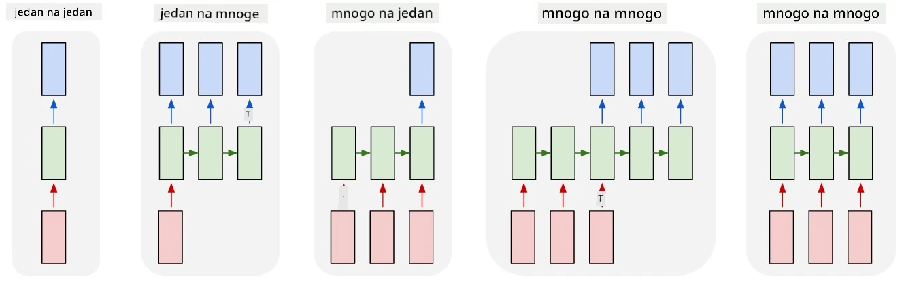

# Prepoznavanje imenovanih entiteta

Do sada smo se uglavnom fokusirali na jedan NLP zadatak - klasifikaciju. Međutim, postoje i drugi NLP zadaci koji se mogu ostvariti pomoću neuronskih mreža. Jedan od tih zadataka je **[Prepoznavanje imenovanih entiteta](https://wikipedia.org/wiki/Named-entity_recognition)** (NER), koji se bavi prepoznavanjem specifičnih entiteta unutar teksta, poput mjesta, imena osoba, vremenskih intervala, kemijskih formula i slično.

## [Kviz prije predavanja](https://ff-quizzes.netlify.app/en/ai/quiz/37)

## Primjer korištenja NER-a

Pretpostavimo da želite razviti chatbot za prirodni jezik, sličan Amazon Alexi ili Google Asistentu. Inteligentni chatboti funkcioniraju tako da *razumiju* što korisnik želi, koristeći klasifikaciju teksta na ulaznoj rečenici. Rezultat te klasifikacije je takozvani **intencija**, koja određuje što chatbot treba učiniti.

> Slika autora

Međutim, korisnik može pružiti neke parametre kao dio fraze. Na primjer, kada pita za vremensku prognozu, može navesti lokaciju ili datum. Bot bi trebao razumjeti te entitete i popuniti odgovarajuće parametarske prostore prije nego što izvrši radnju. Upravo tu dolazi NER.

> ✅ Drugi primjer bio bi [analiza znanstvenih medicinskih radova](https://soshnikov.com/science/analyzing-medical-papers-with-azure-and-text-analytics-for-health/). Jedna od glavnih stvari koje trebamo tražiti su specifični medicinski pojmovi, poput bolesti i medicinskih supstanci. Dok se mali broj bolesti vjerojatno može izdvojiti pretraživanjem podnizova, složeniji entiteti, poput kemijskih spojeva i naziva lijekova, zahtijevaju složeniji pristup.

## NER kao klasifikacija tokena

NER modeli su u suštini **modeli za klasifikaciju tokena**, jer za svaki ulazni token moramo odlučiti pripada li nekom entitetu ili ne, a ako pripada - kojem razredu entiteta.

Razmotrimo sljedeći naslov rada:

**Regurgitacija trikuspidnog zaliska** i **litijev karbonat** **toksičnost** kod novorođenčeta.

Entiteti ovdje su:

* Regurgitacija trikuspidnog zaliska je bolest (`DIS`)
* Litijev karbonat je kemijska supstanca (`CHEM`)
* Toksičnost je također bolest (`DIS`)

Primijetite da jedan entitet može obuhvatiti nekoliko tokena. I, kao u ovom slučaju, moramo razlikovati između dva uzastopna entiteta. Stoga je uobičajeno koristiti dvije klase za svaki entitet - jednu koja označava prvi token entiteta (često se koristi prefiks `B-`, za **početak**), i drugu - nastavak entiteta (`I-`, za **unutarnji token**). Također koristimo `O` kao klasu za predstavljanje svih **ostalih** tokena. Takvo označavanje tokena naziva se [BIO označavanje](https://en.wikipedia.org/wiki/Inside%E2%80%93outside%E2%80%93beginning_(tagging)) (ili IOB). Kada se označi, naš naslov će izgledati ovako:

Token | Oznaka
------|-----
Trikuspidni | B-DIS
zalistak | I-DIS
regurgitacija | I-DIS
i | O
litijev | B-CHEM
karbonat | I-CHEM
toksičnost | B-DIS
kod | O
novorođenčeta | O
. | O

Budući da trebamo izgraditi jedno-na-jedno korespondenciju između tokena i klasa, možemo trenirati desno **mnogostruko-na-mnogostruko** neuronski mrežni model iz ove slike:

> *Slika iz [ovog blog posta](http://karpathy.github.io/2015/05/21/rnn-effectiveness/) autora [Andreja Karpathyja](http://karpathy.github.io/). NER modeli za klasifikaciju tokena odgovaraju desno najudaljenijoj arhitekturi mreže na ovoj slici.*

## Treniranje NER modela

Budući da je NER model u suštini model za klasifikaciju tokena, možemo koristiti RNN-ove s kojima smo već upoznati za ovaj zadatak. U ovom slučaju, svaki blok rekurentne mreže vraća ID tokena. Sljedeći primjer bilježnice pokazuje kako trenirati LSTM za klasifikaciju tokena.

## ✍️ Primjeri bilježnica: NER

Nastavite svoje učenje u sljedećoj bilježnici:

* [NER s TensorFlowom](NER-TF.ipynb)

## Zaključak

NER model je **model za klasifikaciju tokena**, što znači da se može koristiti za klasifikaciju tokena. Ovo je vrlo čest zadatak u NLP-u, koji pomaže prepoznati specifične entitete unutar teksta, uključujući mjesta, imena, datume i više.

## 🚀 Izazov

Dovršite zadatak povezan dolje kako biste trenirali model za prepoznavanje medicinskih entiteta, a zatim ga isprobajte na drugom skupu podataka.

## [Kviz nakon predavanja](https://ff-quizzes.netlify.app/en/ai/quiz/38)

## Pregled i samostalno učenje

Pročitajte blog [Nevjerojatna učinkovitost rekurentnih neuronskih mreža](http://karpathy.github.io/2015/05/21/rnn-effectiveness/) i slijedite odjeljak Daljnje čitanje u tom članku kako biste produbili svoje znanje.

## [Zadatak](lab/README.md)

U zadatku za ovu lekciju, morat ćete trenirati model za prepoznavanje medicinskih entiteta. Možete započeti s treniranjem LSTM modela kako je opisano u ovoj lekciji, a zatim nastaviti s korištenjem BERT transformacijskog modela. Pročitajte [upute](lab/README.md) kako biste dobili sve detalje.

---

