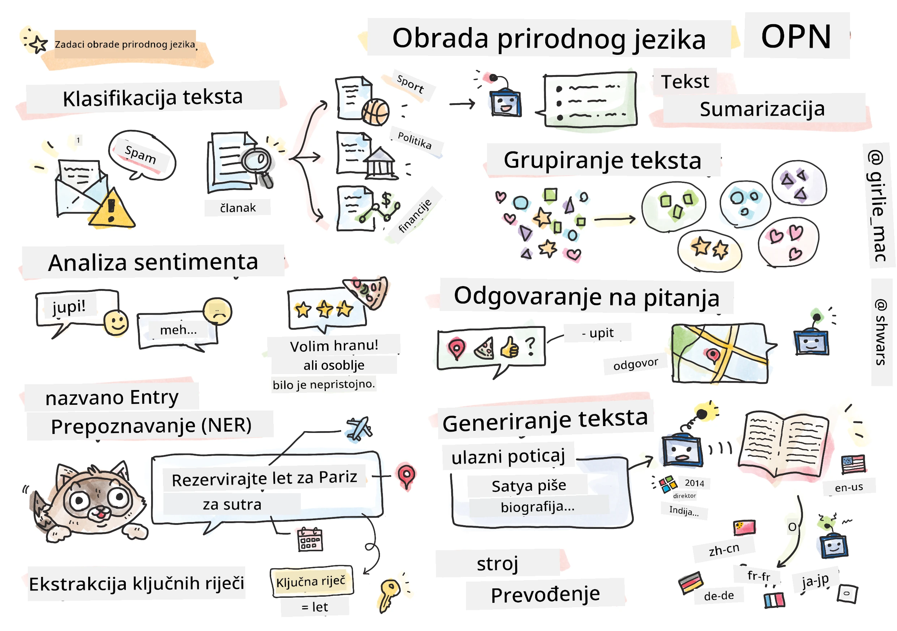

# Obrada Prirodnog Jezika



U ovom dijelu fokusirat ćemo se na korištenje neuronskih mreža za rješavanje zadataka povezanih s **Obradom Prirodnog Jezika (NLP)**. Postoji mnogo NLP problema koje želimo da računala mogu riješiti:

* **Klasifikacija teksta** je tipičan problem klasifikacije koji se odnosi na tekstualne sekvence. Primjeri uključuju klasifikaciju e-mail poruka kao spam ili ne-spam, ili kategorizaciju članaka kao sport, biznis, politika itd. Također, pri razvoju chat botova često trebamo razumjeti što korisnik želi reći — u tom slučaju bavimo se **klasifikacijom namjere**. Često, kod klasifikacije namjere, moramo raditi s mnogo kategorija.
* **Analiza sentimenta** je tipičan regresijski problem, gdje trebamo dodijeliti broj (sentiment) koji odgovara tome koliko je značenje rečenice pozitivno/negativno. Naprednija verzija analize sentimenta je **analiza sentimenta po aspektima** (ABSA), gdje sentiment ne dodjeljujemo cijeloj rečenici, već različitim dijelovima (aspektima), npr. *U ovom restoranu mi se svidjela kuhinja, ali atmosfera je bila grozna*.
* **Prepoznavanje imenovanih entiteta** (NER) odnosi se na problem izdvajanja određenih entiteta iz teksta. Na primjer, trebamo razumjeti da u frazi *Moram letjeti za Pariz sutra* riječ *sutra* označava DATUM, a *Pariz* je LOKACIJA.  
* **Ekstrakcija ključnih riječi** je slična NER-u, ali trebamo automatski izdvojiti riječi važne za značenje rečenice, bez prethodnog treniranja za specifične tipove entiteta.
* **Grupiranje teksta** može biti korisno kada želimo grupirati slične rečenice, na primjer, slične zahtjeve u razgovorima tehničke podrške.
* **Odgovaranje na pitanja** odnosi se na sposobnost modela da odgovori na specifično pitanje. Model prima tekstualni odlomak i pitanje kao ulaz, te treba pružiti mjesto u tekstu gdje se nalazi odgovor na pitanje (ili, ponekad, generirati tekst odgovora).
* **Generiranje teksta** je sposobnost modela da generira novi tekst. To se može smatrati zadatkom klasifikacije koji predviđa sljedeće slovo/riječ na temelju nekog *tekstualnog upita*. Napredni modeli za generiranje teksta, poput GPT-3, mogu rješavati druge NLP zadatke poput klasifikacije koristeći tehniku zvanu [programiranje upita](https://towardsdatascience.com/software-3-0-how-prompting-will-change-the-rules-of-the-game-a982fbfe1e0) ili [inženjering upita](https://medium.com/swlh/openai-gpt-3-and-prompt-engineering-dcdc2c5fcd29).
* **Sažimanje teksta** je tehnika kada želimo da računalo "pročita" dugi tekst i sažme ga u nekoliko rečenica.
* **Strojno prevođenje** može se promatrati kao kombinacija razumijevanja teksta na jednom jeziku i generiranja teksta na drugom jeziku.

U početku su se većina NLP zadataka rješavala tradicionalnim metodama poput gramatika. Na primjer, u strojnome prevođenju parseri su se koristili za transformaciju početne rečenice u sintaktičko stablo, zatim su se izdvajale semantičke strukture višeg nivoa kako bi se predstavilo značenje rečenice, a na temelju tog značenja i gramatike ciljnog jezika generirao se rezultat. Danas se mnogi NLP zadaci učinkovitije rješavaju pomoću neuronskih mreža.

> Mnoge klasične NLP metode implementirane su u Python biblioteci [Natural Language Processing Toolkit (NLTK)](https://www.nltk.org). Dostupna je izvrsna [NLTK knjiga](https://www.nltk.org/book/) online koja pokriva kako se različiti NLP zadaci mogu riješiti pomoću NLTK-a.

Na našem tečaju uglavnom ćemo se fokusirati na korištenje neuronskih mreža za NLP, a NLTK ćemo koristiti gdje je potrebno.

Već smo naučili kako koristiti neuronske mreže za rad s tabličnim podacima i slikama. Glavna razlika između tih vrsta podataka i teksta je ta što je tekst sekvenca promjenjive duljine, dok je veličina ulaza u slučaju slika unaprijed poznata. Dok konvolucijske mreže mogu izdvojiti uzorke iz ulaznih podataka, uzorci u tekstu su složeniji. Na primjer, negacija može biti odvojena od subjekta za mnogo riječi (npr. *Ne volim naranče* naspram *Ne volim one velike šarene ukusne naranče*), i to bi se još uvijek trebalo interpretirati kao jedan uzorak. Stoga, za obradu jezika trebamo uvesti nove vrste neuronskih mreža, poput *rekurentnih mreža* i *transformera*.

## Instalacija Biblioteka

Ako koristite lokalnu Python instalaciju za pokretanje ovog tečaja, možda ćete trebati instalirati sve potrebne biblioteke za NLP pomoću sljedećih naredbi:

**Za PyTorch**
```bash
pip install -r requirements-torch.txt
```
**Za TensorFlow**
```bash
pip install -r requirements-tf.txt
```

> NLP s TensorFlowom možete isprobati na [Microsoft Learn](https://docs.microsoft.com/learn/modules/intro-natural-language-processing-tensorflow/?WT.mc_id=academic-77998-cacaste)

## Upozorenje o GPU-u

U ovom dijelu, u nekim primjerima trenirat ćemo prilično velike modele.
* **Koristite računalo s GPU-om**: Preporučuje se pokretanje vaših bilježnica na računalu s GPU-om kako biste smanjili vrijeme čekanja pri radu s velikim modelima.
* **Ograničenja GPU memorije**: Pokretanje na GPU-u može dovesti do situacija u kojima vam ponestane GPU memorije, posebno pri treniranju velikih modela.
* **Potrošnja GPU memorije**: Količina GPU memorije koja se troši tijekom treniranja ovisi o raznim faktorima, uključujući veličinu minibatch-a.
* **Smanjite veličinu minibatch-a**: Ako naiđete na probleme s GPU memorijom, razmislite o smanjenju veličine minibatch-a u vašem kodu kao potencijalnom rješenju.
* **Oslobađanje GPU memorije u TensorFlowu**: Starije verzije TensorFlowa možda neće pravilno osloboditi GPU memoriju pri treniranju više modela unutar jednog Python kernela. Kako biste učinkovito upravljali korištenjem GPU memorije, možete konfigurirati TensorFlow da alocira GPU memoriju samo po potrebi.
* **Uključivanje koda**: Da biste postavili TensorFlow da alocira GPU memoriju samo kada je to potrebno, uključite sljedeći kod u svoje bilježnice:

```python
physical_devices = tf.config.list_physical_devices('GPU') 
if len(physical_devices)>0:
    tf.config.experimental.set_memory_growth(physical_devices[0], True) 
```

Ako vas zanima učenje o NLP-u iz perspektive klasičnog ML-a, posjetite [ovaj niz lekcija](https://github.com/microsoft/ML-For-Beginners/tree/main/6-NLP).

## U ovom dijelu
U ovom dijelu naučit ćemo o:

* [Predstavljanje teksta kao tenzora](13-TextRep/README.md)
* [Ugrađivanje riječi](14-Emdeddings/README.md)
* [Modeliranje jezika](15-LanguageModeling/README.md)
* [Rekurentne neuronske mreže](16-RNN/README.md)
* [Generativne mreže](17-GenerativeNetworks/README.md)
* [Transformeri](18-Transformers/README.md)

**Odricanje od odgovornosti**:  
Ovaj dokument je preveden pomoću AI usluge za prevođenje [Co-op Translator](https://github.com/Azure/co-op-translator). Iako nastojimo osigurati točnost, imajte na umu da automatski prijevodi mogu sadržavati pogreške ili netočnosti. Izvorni dokument na izvornom jeziku treba smatrati autoritativnim izvorom. Za kritične informacije preporučuje se profesionalni prijevod od strane čovjeka. Ne preuzimamo odgovornost za nesporazume ili pogrešna tumačenja koja mogu proizaći iz korištenja ovog prijevoda.