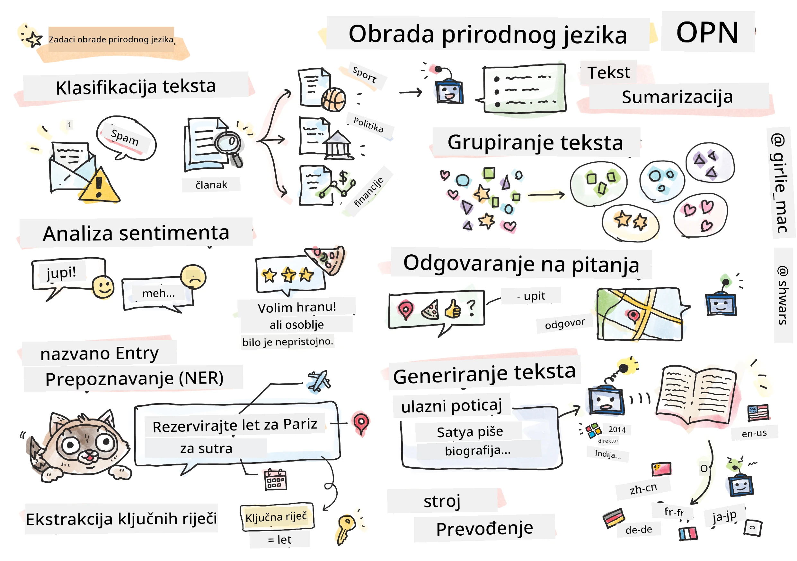

# Obrada Prirodnog Jezika



U ovom odjeljku fokusirat ćemo se na korištenje neuronskih mreža za rješavanje zadataka vezanih uz **Obradu Prirodnog Jezika (NLP)**. Postoji mnogo NLP problema koje želimo da računala budu sposobna riješiti:

* **Klasifikacija teksta** je tipični problem klasifikacije koji se odnosi na tekstualne nizove. Primjeri uključuju klasifikaciju e-mail poruka kao spam ili ne-spam, ili kategorizaciju članaka kao sport, posao, politika itd. Također, pri razvoju chat botova često trebamo razumjeti što je korisnik želio reći – u tom slučaju radimo s **klasifikacijom namjere**. Često kod klasifikacije namjere trebamo imati posla s mnogim kategorijama.
* **Analiza sentimenta** je tipični problem regresije, gdje trebamo pridružiti broj (sentiment) koji odgovara koliko je značenje rečenice pozitivno/negativno. Naprednija verzija analize sentimenta je **analiza sentimenta bazirana na aspektima** (ABSA), gdje sentiment pridružujemo ne cijeloj rečenici, već različitim njezinim dijelovima (aspektima), npr. *U ovom restoranu svidjela mi se kuhinja, ali atmosfera je bila užasna*.
* **Prepoznavanje imenovanih entiteta** (NER) odnosi se na problem izdvajanja određenih entiteta iz teksta. Na primjer, mogli bismo trebati razumjeti da u frazi *Moram letjeti u Pariz sutra* riječ *sutra* označava DATUM, a *Pariz* je LOKACIJA.  
* **Izdvajanje ključnih riječi** sličan je NER-u, ali trebamo automatski izdvojiti riječi važne za značenje rečenice, bez predtreniravanja za specifične vrste entiteta.
* **Grupiranje teksta** može biti korisno kada želimo grupirati slične rečenice, primjerice slične zahtjeve u razgovorima tehničke podrške.
* **Odgovaranje na pitanja** odnosi se na sposobnost modela da odgovori na specifično pitanje. Model prima tekstovni odlomak i pitanje kao ulaze, a treba pružiti mjesto u tekstu gdje se nalazi odgovor na pitanje (ili, ponekad, generirati tekstualni odgovor).
* **Generiranje teksta** je sposobnost modela da generira novi tekst. To se može smatrati klasifikacijskim zadatkom koji predviđa sljedeće slovo/riječ na temelju nekog *tekstualnog uvoda*. Napredni modeli za generiranje teksta, poput GPT-3, sposobni su riješiti i druge NLP zadatke poput klasifikacije koristeći tehniku zvanu [prompt programiranje](https://towardsdatascience.com/software-3-0-how-prompting-will-change-the-rules-of-the-game-a982fbfe1e0) ili [prompt inženjering](https://medium.com/swlh/openai-gpt-3-and-prompt-engineering-dcdc2c5fcd29)
* **Sažimanje teksta** je tehnika kada želimo da računalo "pročita" dugi tekst i sažme ga u nekoliko rečenica.
* **Strojno prevođenje** može se promatrati kao kombinacija razumijevanja teksta na jednom jeziku i generiranje teksta na drugom jeziku.

U početku su većina NLP zadataka rješavana korištenjem klasičnih metoda poput gramatika. Primjerice, pri strojnome prevođenju koristili su se parseri za transformaciju početne rečenice u sintaksno stablo, zatim su izdvajane semantičke strukture viših razina za predstavljanje značenja rečenice, a na temelju tog značenja i gramatike ciljnog jezika generiran je rezultat. Danas se mnogi NLP zadaci učinkovitije rješavaju koristeći neuronske mreže.

> Mnoge klasične NLP metode implementirane su u [Natural Language Processing Toolkit (NLTK)](https://www.nltk.org) Python biblioteci. Postoji sjajna [NLTK Knjiga](https://www.nltk.org/book/) dostupna online koja objašnjava kako se različiti NLP zadaci mogu riješiti koristeći NLTK.

Na našem tečaju uglavnom ćemo se fokusirati na korištenje neuronskih mreža za NLP, a NLTK ćemo koristiti gdje je potrebno.

Već smo naučili o korištenju neuronskih mreža za rad s tabličnim podacima i slikama. Glavna razlika između tih vrsta podataka i teksta jest u tome što je tekst niz varijabilne duljine, dok je veličina ulaza kod slika unaprijed poznata. Dok konvolucijske mreže mogu izdvajati obrasce iz ulaznih podataka, obrasci u tekstu su složeniji. Npr., negacija može biti odvojena od subjekta proizvoljnim brojem riječi (npr. *Ne volim naranče*, vs. *Ne volim te velike šarene ukusne naranče*), a to se još uvijek treba interpretirati kao jedan obrazac. Zato za obradu jezika trebamo uvesti nove vrste neuronskih mreža, poput *rekurentnih mreža* i *transformera*.

## Instalacija Biblioteka

Ako koristite lokalnu Python instalaciju za izvođenje ovog tečaja, možda ćete trebati instalirati sve potrebne biblioteke za NLP koristeći sljedeće naredbe:

**Za PyTorch**
```bash
pip install -r requirements-pytorch.txt
```
**Za TensorFlow**
```bash
pip install -r requirements-tf.txt
```

> NLP s TensorFlow možete isprobati na [Microsoft Learn](https://docs.microsoft.com/learn/modules/intro-natural-language-processing-tensorflow/?WT.mc_id=academic-77998-cacaste)

## Upozorenje za GPU

U ovom odjeljku u nekim ćemo primjerima trenirati prilično velike modele.
* **Koristite računalo s podrškom za GPU**: Preporučuje se pokretanje vaših bilježnica na računalu s podrškom za GPU kako biste smanjili vrijeme čekanja pri radu s velikim modelima.
* **Ograničenja memorije GPU-a**: Pokretanje na GPU može dovesti do situacija u kojima vam ponestane memorije GPU-a, osobito pri treniranju velikih modela.
* **Potrošnja memorije GPU-a**: Količina memorije GPU-a koju model troši tijekom treniranja ovisi o raznim čimbenicima, uključujući veličinu minibatch-a.
* **Minimizirajte veličinu minibatch-a**: Ako naiđete na probleme s memorijom GPU-a, razmislite o smanjenju veličine minibatch-a u vašem kodu kao potencijalnom rješenju.
* **Otpust memorije GPU-a u TensorFlowu**: Starije verzije TensorFlowa možda neće pravilno otpustiti memoriju GPU-a kada trenirate više modela u jednoj Python sesiji. Za učinkovito upravljanje potrošnjom memorije na GPU-u, možete konfigurirati TensorFlow da alocira memoriju GPU-a samo po potrebi.
* **Uključivanje koda**: Da biste postavili TensorFlow da povećava alokaciju memorije GPU-a samo kada je potrebna, uključite sljedeći kod u vaše bilježnice:

```python
physical_devices = tf.config.list_physical_devices('GPU') 
if len(physical_devices)>0:
    tf.config.experimental.set_memory_growth(physical_devices[0], True) 
```

Ako ste zainteresirani za učenje o NLP-u iz klasične perspektive strojnog učenja, posjetite [ovaj skup lekcija](https://github.com/microsoft/ML-For-Beginners/tree/main/6-NLP)

## U ovom odjeljku
U ovom odjeljku naučit ćemo o:

* [Predstavljanje teksta kao tenzora](13-TextRep/README.md)
* [Word Embeddings](14-Embeddings/README.md)
* [Modeliranje jezika](15-LanguageModeling/README.md)
* [Rekurentne neuronske mreže](16-RNN/README.md)
* [Generativne mreže](17-GenerativeNetworks/README.md)
* [Transformeri](18-Transformers/README.md)

---

<!-- CO-OP TRANSLATOR DISCLAIMER START -->
**Napomena**:
Ovaj dokument je preveden korištenjem AI prevoditeljskog servisa [Co-op Translator](https://github.com/Azure/co-op-translator). Iako težimo točnosti, imajte na umu da automatski prijevodi mogu sadržavati greške ili netočnosti. Izvorni dokument na izvornom jeziku treba smatrati autoritativnim izvorom. Za važne informacije preporuča se profesionalni ljudski prijevod. Nismo odgovorni za bilo kakva nesporazumevanja ili pogrešne interpretacije koje proizlaze iz korištenja ovog prijevoda.
<!-- CO-OP TRANSLATOR DISCLAIMER END -->