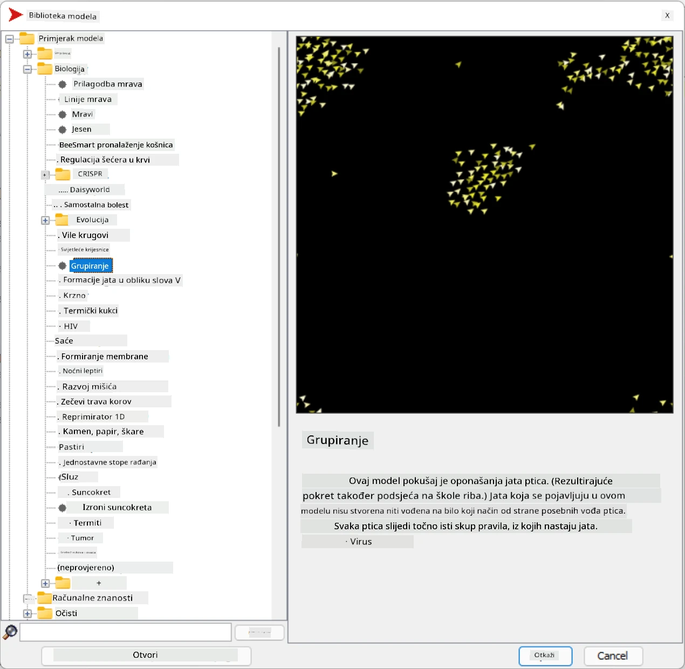
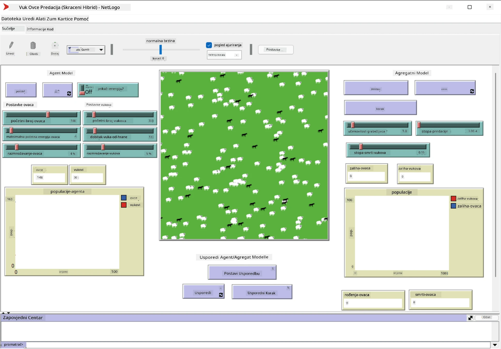

# Višeagentski sustavi

Jedan od mogućih načina postizanja inteligencije je takozvani **emergentni** (ili **sinergijski**) pristup, koji se temelji na činjenici da kombinirano ponašanje mnogih relativno jednostavnih agenata može rezultirati ukupno složenijim (ili inteligentnijim) ponašanjem sustava u cjelini. Teoretski, ovo se temelji na principima [kolektivne inteligencije](https://en.wikipedia.org/wiki/Collective_intelligence), [emergentizma](https://en.wikipedia.org/wiki/Global_brain) i [evolucijske kibernetike](https://en.wikipedia.org/wiki/Global_brain), koji tvrde da sustavi višeg nivoa dobivaju neku vrstu dodane vrijednosti kada se pravilno kombiniraju iz sustava nižeg nivoa (tzv. *princip prijelaza metasustava*).

## [Kviz prije predavanja](https://ff-quizzes.netlify.app/en/ai/quiz/45)

Smjer **višeagentskih sustava** pojavio se u AI-u 1990-ih kao odgovor na rast Interneta i distribuiranih sustava. Jedan od klasičnih udžbenika o AI-u, [Artificial Intelligence: A Modern Approach](https://en.wikipedia.org/wiki/Artificial_Intelligence:_A_Modern_Approach), fokusira se na klasični pogled na AI iz perspektive višeagentskih sustava.

Središnji pojam višeagentskog pristupa je **agent** - entitet koji živi u nekom **okruženju**, koje može opažati i na njega djelovati. Ovo je vrlo široka definicija, i može postojati mnogo različitih vrsta i klasifikacija agenata:

* Prema sposobnosti zaključivanja:
   - **Reaktivni** agenti obično imaju jednostavno ponašanje tipa zahtjev-odgovor
   - **Promišljeni** agenti koriste neku vrstu logičkog zaključivanja i/ili sposobnosti planiranja
* Prema mjestu gdje agent izvršava svoj kod:
   - **Statični** agenti rade na posvećenom mrežnom čvoru
   - **Mobilni** agenti mogu premještati svoj kod između mrežnih čvorova
* Prema ponašanju:
   - **Pasivni agenti** nemaju specifične ciljeve. Takvi agenti mogu reagirati na vanjske podražaje, ali neće sami inicirati nikakve radnje.
   - **Aktivni agenti** imaju neke ciljeve koje slijede
   - **Kognitivni agenti** uključuju složeno planiranje i zaključivanje

Višeagentski sustavi danas se koriste u brojnim aplikacijama:

* U igrama, mnogi likovi koji nisu igrači koriste neku vrstu AI-a i mogu se smatrati inteligentnim agentima
* U video produkciji, renderiranje složenih 3D scena koje uključuju gužve obično se radi pomoću simulacije više agenata
* U modeliranju sustava, višeagentski pristup koristi se za simulaciju ponašanja složenog modela. Na primjer, višeagentski pristup uspješno se koristio za predviđanje širenja bolesti COVID-19 diljem svijeta. Sličan pristup može se koristiti za modeliranje prometa u gradu i promatranje kako reagira na promjene prometnih pravila.
* U složenim automatizacijskim sustavima, svaki uređaj može djelovati kao neovisni agent, što čini cijeli sustav manje monolitnim i robusnijim.

Nećemo trošiti puno vremena na duboko proučavanje višeagentskih sustava, ali razmotrit ćemo jedan primjer **modeliranja više agenata**.

## NetLogo

[NetLogo](https://ccl.northwestern.edu/netlogo/) je okruženje za modeliranje više agenata temeljeno na modificiranoj verziji programskog jezika [Logo](https://en.wikipedia.org/wiki/Logo_(programming_language)). Ovaj jezik razvijen je za podučavanje programskih koncepata djeci, i omogućuje vam kontrolu agenta zvanog **kornjača**, koji se može kretati ostavljajući trag iza sebe. To omogućuje stvaranje složenih geometrijskih figura, što je vrlo vizualan način za razumijevanje ponašanja agenta.

U NetLogu možemo stvoriti mnogo kornjača pomoću naredbe `create-turtles`. Zatim možemo zapovjediti svim kornjačama da izvrše neke radnje (u primjeru ispod - pomaknu se 10 točaka naprijed):

```
create-turtles 10
ask turtles [
  forward 10
]
```

Naravno, nije zanimljivo kada sve kornjače rade istu stvar, pa možemo `ask` grupama kornjača, npr. onima koje su u blizini određene točke. Također možemo stvoriti kornjače različitih *vrsta* pomoću naredbe `breed [cats cat]`. Ovdje je `cat` naziv vrste, a moramo navesti i jedninu i množinu riječi, jer različite naredbe koriste različite oblike radi jasnoće.

> ✅ Nećemo ulaziti u učenje samog jezika NetLogo - možete posjetiti izvrsni [Interaktivni rječnik za početnike NetLogo](https://ccl.northwestern.edu/netlogo/bind/) ako ste zainteresirani za detaljnije učenje.

Možete [preuzeti](https://ccl.northwestern.edu/netlogo/download.shtml) i instalirati NetLogo kako biste ga isprobali.

### Biblioteka modela

Sjajna stvar kod NetLoga je da sadrži biblioteku radnih modela koje možete isprobati. Idite na **File &rightarrow; Models Library**, i imate mnogo kategorija modela za odabir.



> Snimka zaslona biblioteke modela Dmitryja Soshnikova

Možete otvoriti jedan od modela, na primjer **Biology &rightarrow; Flocking**.

### Glavni principi

Nakon otvaranja modela, dolazite na glavni ekran NetLoga. Evo uzorka modela koji opisuje populaciju vukova i ovaca, s obzirom na ograničene resurse (trava).



> Snimka zaslona Dmitryja Soshnikova

Na ovom ekranu možete vidjeti:

* Sekciju **Interface** koja sadrži:
  - Glavno polje, gdje svi agenti žive
  - Različite kontrole: gumbe, klizače itd.
  - Grafove koje možete koristiti za prikaz parametara simulacije
* Karticu **Code** koja sadrži editor, gdje možete pisati NetLogo program

U većini slučajeva sučelje bi imalo gumb **Setup**, koji inicijalizira stanje simulacije, i gumb **Go** koji pokreće izvršenje. Njima upravljaju odgovarajući rukovatelji u kodu koji izgledaju ovako:

```
to go [
...
]
```

NetLogo svijet sastoji se od sljedećih objekata:

* **Agenti** (kornjače) koji se mogu kretati po polju i nešto raditi. Agentima zapovijedate pomoću sintakse `ask turtles [...]`, a kod u zagradama izvršavaju svi agenti u *načinu rada kornjače*.
* **Patches** su kvadratna područja polja na kojima agenti žive. Možete se referirati na sve agente na istom patchu, ili možete mijenjati boje patcha i neka druga svojstva. Također možete `ask patches` da nešto učine.
* **Promatrač** je jedinstveni agent koji kontrolira svijet. Svi rukovatelji gumba izvršavaju se u *načinu rada promatrača*.

> ✅ Ljepota okruženja više agenata je u tome što se kod koji se izvršava u načinu rada kornjače ili patcha istovremeno izvršava od strane svih agenata paralelno. Dakle, pisanjem malo koda i programiranjem ponašanja pojedinog agenta, možete stvoriti složeno ponašanje simulacijskog sustava u cjelini.

### Flocking

Kao primjer ponašanja više agenata, razmotrimo **[Flocking](https://en.wikipedia.org/wiki/Flocking_(behavior))**. Flocking je složen uzorak koji je vrlo sličan načinu na koji jata ptica lete. Promatrajući njihov let, možete pomisliti da slijede neku vrstu kolektivnog algoritma ili da posjeduju neku formu *kolektivne inteligencije*. Međutim, ovo složeno ponašanje nastaje kada svaki pojedini agent (u ovom slučaju, *ptica*) promatra samo neke druge agente na kratkoj udaljenosti od sebe i slijedi tri jednostavna pravila:

* **Poravnanje** - usmjerava se prema prosječnom smjeru susjednih agenata
* **Kohezija** - pokušava se usmjeriti prema prosječnom položaju susjeda (*dugoročna privlačnost*)
* **Razdvajanje** - kada se previše približi drugim pticama, pokušava se udaljiti (*kratkoročno odbijanje*)

Možete pokrenuti primjer flockinga i promatrati ponašanje. Također možete prilagoditi parametre, poput *stupnja razdvajanja* ili *raspona vidljivosti*, koji definira koliko daleko svaka ptica može vidjeti. Primijetite da ako smanjite raspon vidljivosti na 0, sve ptice postaju slijepe i flocking prestaje. Ako smanjite razdvajanje na 0, sve ptice se okupljaju u ravnu liniju.

> ✅ Prebacite se na karticu **Code** i pogledajte gdje su tri pravila flockinga (poravnanje, kohezija i razdvajanje) implementirana u kodu. Primijetite kako se referiramo samo na one agente koji su u vidokrugu.

### Ostali modeli za istraživanje

Postoji još nekoliko zanimljivih modela koje možete eksperimentirati:

* **Art &rightarrow; Fireworks** prikazuje kako se vatromet može smatrati kolektivnim ponašanjem pojedinih struja vatre
* **Social Science &rightarrow; Traffic Basic** i **Social Science &rightarrow; Traffic Grid** prikazuju model gradskog prometa u 1D i 2D mreži s ili bez semafora. Svaki automobil u simulaciji slijedi sljedeća pravila:
   - Ako je prostor ispred njega prazan - ubrzaj (do određenog maksimalnog brzine)
   - Ako vidi prepreku ispred - koči (i možete prilagoditi koliko daleko vozač može vidjeti)
* **Social Science &rightarrow; Party** prikazuje kako se ljudi grupiraju tijekom koktel zabave. Možete pronaći kombinaciju parametara koja dovodi do najbržeg povećanja sreće grupe.

Kao što možete vidjeti iz ovih primjera, simulacije više agenata mogu biti vrlo koristan način za razumijevanje ponašanja složenog sustava koji se sastoji od pojedinaca koji slijede istu ili sličnu logiku. Također se može koristiti za kontrolu virtualnih agenata, poput [NPC-a](https://en.wikipedia.org/wiki/NPC) u računalnim igrama ili agenata u 3D animiranim svjetovima.

## Promišljeni agenti

Agenti opisani gore su vrlo jednostavni, reagirajući na promjene u okruženju koristeći neku vrstu algoritma. Kao takvi, oni su **reaktivni agenti**. Međutim, ponekad agenti mogu zaključivati i planirati svoje radnje, u kojem slučaju se nazivaju **promišljenim**.

Tipičan primjer bio bi osobni agent koji prima instrukciju od čovjeka da rezervira turistički aranžman. Pretpostavimo da na internetu postoji mnogo agenata koji mu mogu pomoći. Trebao bi kontaktirati druge agente kako bi vidio koji su letovi dostupni, koje su cijene hotela za različite datume i pokušati pregovarati o najboljoj cijeni. Kada je plan putovanja dovršen i potvrđen od strane vlasnika, može nastaviti s rezervacijom.

Da bi to učinili, agenti moraju **komunicirati**. Za uspješnu komunikaciju potrebni su im:

* Neki **standardni jezici za razmjenu znanja**, poput [Knowledge Interchange Format](https://en.wikipedia.org/wiki/Knowledge_Interchange_Format) (KIF) i [Knowledge Query and Manipulation Language](https://en.wikipedia.org/wiki/Knowledge_Query_and_Manipulation_Language) (KQML). Ti jezici su dizajnirani na temelju [teorije govornog čina](https://en.wikipedia.org/wiki/Speech_act).
* Ti jezici također trebaju uključivati neke **protokole za pregovore**, temeljene na različitim **vrstama aukcija**.
* **Zajednička ontologija** koju koriste, kako bi se referirali na iste pojmove poznajući njihovu semantiku
* Način za **otkrivanje** što različiti agenti mogu učiniti, također temeljen na nekoj vrsti ontologije

Promišljeni agenti su mnogo složeniji od reaktivnih, jer ne samo da reagiraju na promjene u okruženju, već također moraju biti sposobni *inicirati* radnje. Jedna od predloženih arhitektura za promišljene agente je tzv. agent vjerovanja-želje-namjere (BDI):

* **Vjerovanja** čine skup znanja o okruženju agenta. To može biti strukturirano kao baza znanja ili skup pravila koje agent može primijeniti na određenu situaciju u okruženju.
* **Želje** definiraju što agent želi učiniti, tj. njegove ciljeve. Na primjer, cilj osobnog asistenta gore je rezervirati aranžman, a cilj agenta hotela je maksimizirati profit.
* **Namjere** su specifične radnje koje agent planira poduzeti kako bi postigao svoje ciljeve. Radnje obično mijenjaju okruženje i uzrokuju komunikaciju s drugim agentima.

Postoje neke platforme dostupne za izgradnju višeagentskih sustava, poput [JADE](https://jade.tilab.com/). [Ovaj rad](https://arxiv.org/ftp/arxiv/papers/2007/2007.08961.pdf) sadrži pregled platformi za višeagentske sustave, zajedno s kratkom poviješću višeagentskih sustava i njihovim različitim scenarijima uporabe.

## Zaključak

Višeagentski sustavi mogu poprimiti vrlo različite oblike i koristiti se u mnogim različitim aplikacijama. 
Svi oni teže fokusiranju na jednostavnije ponašanje pojedinog agenta i postizanju složenijeg ponašanja cijelog sustava zbog **sinergijskog učinka**.

## 🚀 Izazov

Primijenite ovu lekciju u stvarnom svijetu i pokušajte konceptualizirati višeagentski sustav koji može riješiti problem. Što bi, na primjer, višeagentski sustav trebao učiniti kako bi optimizirao rutu školskog autobusa? Kako bi mogao funkcionirati u pekarnici?

## [Kviz nakon predavanja](https://ff-quizzes.netlify.app/en/ai/quiz/46)

## Pregled i samostalno učenje

Pregledajte uporabu ove vrste sustava u industriji. Odaberite područje poput proizvodnje ili industrije videoigara i otkrijte kako se višeagentski sustavi mogu koristiti za rješavanje jedinstvenih problema.

## [Zadatak NetLogo](assignment.md)

---

