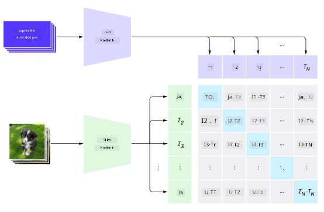
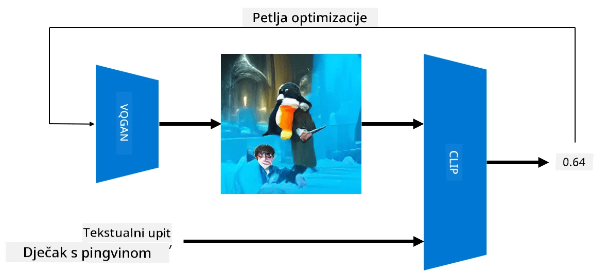

# Multi-modalne mreže

Nakon uspjeha transformera u rješavanju zadataka obrade prirodnog jezika (NLP), iste ili slične arhitekture primijenjene su na zadatke računalnog vida. Sve je veći interes za izgradnju modela koji bi *kombinirali* sposobnosti vida i prirodnog jezika. Jedan od takvih pokušaja napravio je OpenAI, a naziva se CLIP i DALL.E.

## Kontrastivno učenje slika (CLIP)

Glavna ideja CLIP-a je usporediti tekstualne upite sa slikom i odrediti koliko dobro slika odgovara upitu.

> *Slika iz [ovog blog posta](https://openai.com/blog/clip/)*

Model je treniran na slikama preuzetim s interneta i njihovim opisima. Za svaki batch uzimamo N parova (slika, tekst) i pretvaramo ih u vektorske reprezentacije I, ..., T. Te se reprezentacije zatim međusobno uparuju. Funkcija gubitka definirana je tako da maksimizira kosinusnu sličnost između vektora koji odgovaraju jednom paru (npr. I i T) i minimizira kosinusnu sličnost između svih ostalih parova. Zbog toga se ovaj pristup naziva **kontrastivnim**.

CLIP model/biblioteka dostupna je na [OpenAI GitHubu](https://github.com/openai/CLIP). Pristup je opisan u [ovom blog postu](https://openai.com/blog/clip/), a detaljnije u [ovom radu](https://arxiv.org/pdf/2103.00020.pdf).

Nakon što je ovaj model prethodno treniran, možemo mu dati batch slika i batch tekstualnih upita, a on će vratiti tensor s vjerojatnostima. CLIP se može koristiti za nekoliko zadataka:

**Klasifikacija slika**

Pretpostavimo da trebamo klasificirati slike, primjerice, između mačaka, pasa i ljudi. U tom slučaju možemo modelu dati sliku i niz tekstualnih upita: "*slika mačke*", "*slika psa*", "*slika čovjeka*". U rezultirajućem vektoru s 3 vjerojatnosti samo trebamo odabrati indeks s najvećom vrijednošću.

> *Slika iz [ovog blog posta](https://openai.com/blog/clip/)*

**Pretraživanje slika na temelju teksta**

Možemo učiniti i suprotno. Ako imamo kolekciju slika, možemo tu kolekciju proslijediti modelu zajedno s tekstualnim upitom - to će nam dati sliku koja je najviše slična zadanom upitu.

## ✍️ Primjer: [Korištenje CLIP-a za klasifikaciju slika i pretraživanje slika](../../../../../lessons/X-Extras/X1-MultiModal/Clip.ipynb)

Otvorite bilježnicu [Clip.ipynb](../../../../../lessons/X-Extras/X1-MultiModal/Clip.ipynb) kako biste vidjeli CLIP u akciji.

## Generiranje slika s VQGAN+CLIP

CLIP se također može koristiti za **generiranje slika** iz tekstualnog upita. Da bismo to učinili, potreban nam je **generatorski model** koji će moći generirati slike na temelju nekog vektorskog ulaza. Jedan od takvih modela naziva se [VQGAN](https://compvis.github.io/taming-transformers/) (Vector-Quantized GAN).

Glavne ideje VQGAN-a koje ga razlikuju od običnog [GAN-a](../../4-ComputerVision/10-GANs/README.md) su sljedeće:
* Korištenje autoregresivne arhitekture transformera za generiranje sekvence vizualnih dijelova bogatih kontekstom koji čine sliku. Ti vizualni dijelovi se uče pomoću [CNN-a](../../4-ComputerVision/07-ConvNets/README.md).
* Korištenje diskriminatora podslika koji detektira jesu li dijelovi slike "stvarni" ili "lažni" (za razliku od pristupa "sve ili ništa" u tradicionalnim GAN-ovima).

Više o VQGAN-u saznajte na web stranici [Taming Transformers](https://compvis.github.io/taming-transformers/).

Jedna od važnih razlika između VQGAN-a i tradicionalnog GAN-a je ta što potonji može proizvesti pristojnu sliku iz bilo kojeg ulaznog vektora, dok VQGAN vjerojatno neće proizvesti koherentnu sliku. Stoga je potrebno dodatno usmjeriti proces stvaranja slike, a to se može učiniti pomoću CLIP-a.

Za generiranje slike koja odgovara tekstualnom upitu, počinjemo s nekim nasumičnim vektorskim kodiranjem koje se prosljeđuje kroz VQGAN kako bi se proizvela slika. Zatim se CLIP koristi za stvaranje funkcije gubitka koja pokazuje koliko dobro slika odgovara tekstualnom upitu. Cilj je minimizirati taj gubitak koristeći backpropagation za prilagodbu parametara ulaznog vektora.

Odlična biblioteka koja implementira VQGAN+CLIP je [Pixray](http://github.com/pixray/pixray).

 |   | 
----|----|----
Slika generirana iz upita *bliski akvarelni portret mladog učitelja književnosti s knjigom* | Slika generirana iz upita *bliski uljani portret mlade učiteljice računalnih znanosti s računalom* | Slika generirana iz upita *bliski uljani portret starijeg učitelja matematike ispred ploče*

> Slike iz kolekcije **Umjetni učitelji** autora [Dmitry Soshnikov](http://soshnikov.com)

## DALL-E
### [DALL-E 1](https://openai.com/research/dall-e)
DALL-E je verzija GPT-3 trenirana za generiranje slika iz tekstualnih upita. Trenirana je s 12 milijardi parametara.

Za razliku od CLIP-a, DALL-E prima tekst i sliku kao jedinstveni niz tokena za slike i tekst. Stoga, iz više upita možete generirati slike na temelju teksta.

### [DALL-E 2](https://openai.com/dall-e-2)
Glavna razlika između DALL-E 1 i 2 je ta što DALL-E 2 generira realističnije slike i umjetnička djela.

Primjeri generiranja slika s DALL-E:
 |   | 
----|----|----
Slika generirana iz upita *bliski akvarelni portret mladog učitelja književnosti s knjigom* | Slika generirana iz upita *bliski uljani portret mlade učiteljice računalnih znanosti s računalom* | Slika generirana iz upita *bliski uljani portret starijeg učitelja matematike ispred ploče*

## Reference

* VQGAN rad: [Taming Transformers for High-Resolution Image Synthesis](https://compvis.github.io/taming-transformers/paper/paper.pdf)
* CLIP rad: [Learning Transferable Visual Models From Natural Language Supervision](https://arxiv.org/pdf/2103.00020.pdf)

**Odricanje od odgovornosti**:  
Ovaj dokument je preveden pomoću AI usluge za prevođenje [Co-op Translator](https://github.com/Azure/co-op-translator). Iako nastojimo osigurati točnost, imajte na umu da automatski prijevodi mogu sadržavati pogreške ili netočnosti. Izvorni dokument na izvornom jeziku treba smatrati autoritativnim izvorom. Za ključne informacije preporučuje se profesionalni prijevod od strane čovjeka. Ne preuzimamo odgovornost za nesporazume ili pogrešna tumačenja koja mogu proizaći iz korištenja ovog prijevoda.